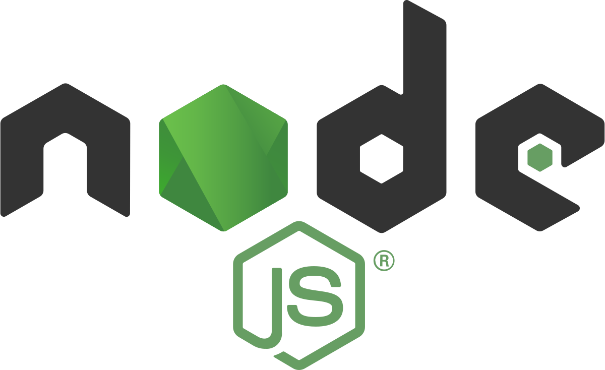

Back in version 20.6 of EventStoreDB, we added support for connecting to the database via gRPC. This widely adopted standard allows us to provide a unified dev experience across many platforms and environments, enabling first class support for Event Sourcing and Event-Driven Architecture with EventStoreDB. Since then, we've been working hard on writing first party clients for multiple languages and runtimes.

Today we are proud to announce the release of v1.0.0 of our NodeJS client.

If you've been following along with the preview version of the client, you'll have seen that over the last few months, we've put a lot of effort into ensuring consistency between gRPC clients. Our goal is to have a consistent naming and feature set across all clients while following the conventions of each environment.

We wrote the NodeJS client in TypeScript. Thanks to that, you can use it both in the JavaScript project and have proper typing for TypeScript.

### Installation

To use the gRPC client package, you need to install it either with NPM

```bash
npm install --save @eventstore/db-client
```

or Yarn

```bash
yarn add @eventstore/db-client
```

### Connecting to the DB server

You also need to have the EventStoreDB running. The easiest way is to run it via docker:

```bash
docker run --name esdb-node -it -p 2113:2113 -p 1113:1113 \
  eventstore/eventstore:latest --insecure --run-projections=All
```

Note that we're using insecure mode here to speed up the setup. EventStoreDB is secure-by-default. For detailed instructions check the [installation guide](https://developers.eventstore.com/server/v20/server/installation/) and [security recommendations](https://developers.eventstore.com/server/v20/server/security/#protocol-security).

Having the EventStoreDB running, you can connect:

```typescript
import { EventStoreDBClient } from "@eventstore/db-client";

const client = EventStoreDBClient.connectionString("esdb://localhost:2113?tls=false");
```

### Working with Events

EventStoreDB is a database designed for [Event Sourcing](https://eventstore.com/blog/what-is-event-sourcing/). Event Sourcing is an alternative way to persist data. In contrast with state-oriented persistence that only keeps the latest version of the entity state, Event Sourcing stores each state change as a separate event.

Events are logically grouped into streams. In Event Sourcing, streams are the representation of the entities. All the entity state mutation ends up as the persisted event. Entity state is retrieved by reading all the events and applying them one by one in the order of appearance.

Let's append some events! We'll use the cinema ticket reservation as an example.

```typescript
const userId = "ms_smith";
const movieId = "homealone";
const seatId = "seat1";

const reservationId = `res_${movieId}_${seatId}`;

const event = jsonEvent({
  type: "SeatReserved",
  data: {
    reservationId,
    movieId,
    seatId,
    userId 
  },
});

await client.appendToStream(reservationId, event);
```

EventStoreDB supports both JSON and binary format.

To read stream events, use:

```typescript
const events = await client.readStream(reservationId);
```

The centrepiece of EventStoreDB is the append-only log (read more in the [Turning the database inside out with Event Store](https://www.eventstore.com/blog/turning-the-database-inside-out). That allows maintaining global events ordering and performance improvements.

You can also read events across the streams from the `$all` log. Reading happens in the global order of appearance.

```typescript
const events = await client.readAll({
  direction: FORWARDS,
  fromPosition: START,
  maxCount: 10,
});
```

### Subscribing to the streams

One of the most significant advantages of Event-Driven Architecture is the inversion of services' responsibility. The services are decoupled from each other, thanks to the publish/subscribe approach. E.g. reservation service doesn't have to call the invoice service directly. It publishes an event about reservation confirmation. The invoice service subscribes to the reservation event stream and can issue an invoice right after the notification.

You can subscribe to the specific stream:

```typescript
client
  .subscribeToStream(reservationId, { fromRevision: START })
  .on("data", function (resolvedEvent) {
    handleEvent(resolvedEvent);
  });
```

Or to all events, e.g. filtering all reservations events (by the stream type prefix):

```typescript
const reservationStreamPrefix = "res";
const filter = streamNameFilter({ prefixes: [reservationStreamPrefix ] });

const subscription = client.subscribeToAll({ filter });
```

Subscriptions are readable streams, allowing you to listen to emitted events:

```typescript
subscription.on("data", handleEvent);
```

Pipe to a writable or transform stream:

```typescript
subscription.pipe(yourWritableStream)
```

or iterate over events asynchronously:

```typescript
for await (const event of subscription) {
  handle(event);
}
```

### TypeScript

Being written in Typescript, the client provides improved IntelliSense for javascript users, but If you're using TypeScript in your project, you can take advantage of the baked in typing, as well as the provided utility types to allow you to strongly type your events.

You can benefit from that with easier event types management. e.g.

```typescript
type SeatReserved= JSONEventType< 
  "SeatReserved",
  {  
    reservationId: string,
    movieId:string,
    seatId: string,
    userId : string 
  }>; 	 

type SeatChanged= JSONEventType< 
  "SeatChanged",
  {  
    reservationId: string,
    newSeatId: string,
  }>; 	 

type ReservationEvents = SeatReserved | SeatChanged;
```

You can use such defined types in the EventStoreDB methods:

```typescript
const seatReserved = jsonEvent({
  type: "SeatReserved", 
  data: { 
    reservationId,
    movieId,
    seatId,
    userId
  },
}); 	 

const seatChanged = jsonEvent({
  type: "SeatChanged", 
  data: { 
    reservationId,
    newSeatId,
  },
});

await client.appendToStream(reservationId, [seatReserved, seatChanged]); 	 

const events = await client.readStream(reservationId);

for (const { event } of events) {
  // Events types can be narrowed on type, 
  // so we can type check on the contained data.
  switch (event?.type) {
    case "SeatReserved":
      reserveSeat(event.data);
      break;
    case "SeatChanged":
      updateSeatForReservation(
        event.data.reservationId,
        event.data.newSeatId
      );
    break;
  }
}
```

### NodeJS Version support

We are officially supporting the Active LTS version. At the moment I write this post, it's v14\. It should also work at least with v12, but we recommend that you always use the Active LTS.

### Source code and documentation

NodeJS gRPC client is Open Sourced and available under Apache 2.0 License in the [GitHub Repository](https://github.com/EventStore/EventStore-Client-NodeJS). You can find [detailed documentation and samples at here.](https://developers.eventstore.com/clients/grpc/getting-started?codeLanguage=NodeJS) We value the Open Source community. Feel free to send us Pull Requests, Issues or other forms of contribution.

If you have more questions, [we're available and happy to help on our Discuss forum](https://discuss.eventstore.com).