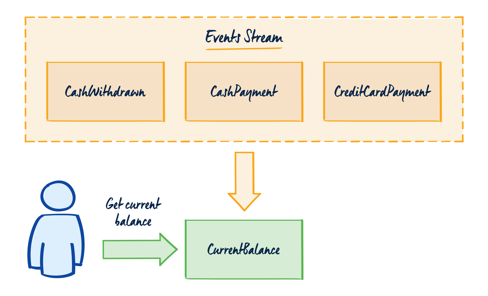
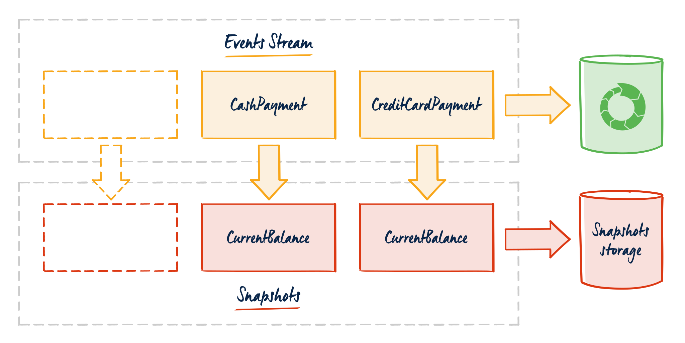
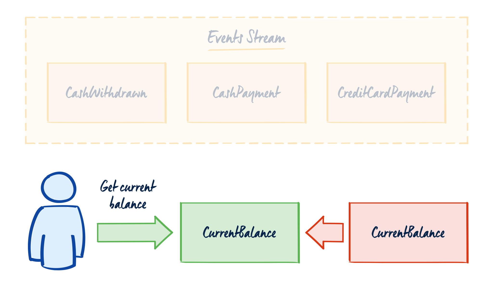

One of the great benefits of Event Sourcing is that you don't lose any business data. Each business operation ends with a new event appended to the event store. The business object is represented by the sequence of events called a _stream_. When we want to execute business logic, we're reading all events from a specific stream. We're recreating the current state by applying all the events one by one in order of appearance. Based on the current state, we verify and execute the business logic.

Isn't loading more than one event a performance issue? Frankly, it's not. Downloading even a dozen, or several dozens of small events is not a significant overhead. Events are concise, containing only the information needed. EventStoreDB is optimised for such operations, and the reads scale well. Still, you can't disagree that loading a few events will take longer than loading a single one. In the article ["Why a bank account is not the best example of Event Sourcing?"](Https://event-driven.io/en/bank_account_event_sourcing/) I presented the following calculation:

Suppose I opened a bank account at the age of 18. Let's assume that I was making three transactions a day. If we multiply these numbers (3 x 17 x 365), we get 18,615 transactions.

If we follow the Event Sourcing pattern literally, we'd need to get all these transactions to calculate the current account's balance. This won't be efficient. Your first thought to make this more efficient may be caching the latest state somewhere.

Instead of retrieving all these events, we could retrieve one record and use it for our business logic. This is a Snapshot. Like any [premature optimisation, it can be the root of all evil](http://wiki.c2.com/?PrematureOptimization). Why? More on this later.

In my articles and speeches, I have one favourite example: the cash register. Is the balance in the cash register calculated based on all transactions since the shop was created? No, usually cashiers create summaries at the end of their shift. They verify whether the state in the POS system is consistent with the actual amount of money in the cash register. The following employee starts a new shift, at the end of which a separate summary is made. It is the same in a bank account. The billing data is opened and closed in a regular cycle. Old data is archived, and we start again with the summarised balance.

**Each data storage model has its specifics.** Relational databases have normalisation. Document databases are denormalised. Key-value stores have strategies for keys definition. Event stores also have their specifics.

Traditionally, we do not pay much attention to the number of operations made on a business object. All of them will be condensed to a single record. In Event Sourcing, thanks to the history of events, we gain audibility and diagnostics. We also have an additional modelling aspect to consider explicitely: lifecycle over time.

Let's get back to our shopping example. Instead of modelling our stream as all the events happened for the specific cash register (e.g. transactions), we could break it down into smaller, shorter-lived entities. For example:
* billing day (i.e. from opening to closing the shopping day),
* cashier's shift,
* each receipt separately.

If we ask "business", it may turn out that such a break-down reflects the reality. "Closing the books/end of business day" is a typical pattern for many industries. Very often, our technical assumptions are an oversimplification. That is why it is worth digging down and asking business [to bring problems, not solutions](https://event-driven.io/en/bring_me_problems_not_solutions/).

**By modelling the stream as the events on a given cashier's shift, we can simplify the solution.** Streams will contain fewer events. The stream's lifecycle affects not only the performance, but most of all, it is easier to maintain. I wrote about it in ["How to (not) do event versioning"](https://event-driven.io/en/how_to_do_event_versioning/). If our stream is short-lived, schema versioning will be easier. We rarely care about records that are deleted or archived. Therefore, when we deploy new changes and have events with the old schema, we will have to support them as long as their streams exist. Thanks to this, we can break our deployment into "two steps". First, we deploy a version that supports both schemas and mark the old one as obsolete. Then when all streams with old schema are not active,  we can remove the old code and create a new version.

**What are the disadvantages of breaking streams into smaller ones?** It can be artificial sometimes. If we were to break our stream to reflect each work hour, but it may turn out that it does not reflect the actual business flow. Streams that are too small also cause a more significant management overhead. If we add tight performance requirements, we may need to cut each potential overhead.

**In this situation, Snapshots can help. However, I would suggest that you treat it as a last resort when nothing else helps.** The need to use them may hint to the model's design flaw. Snapshots can be used as a tactical hotfix or optimisation. Adding them should not stop us from evaluating the design correctness. We should plan it, not just satisfy ourselves with the quick win.

We must also remember that we will run into a versioning problem when using snapshots. Our object will live long (as we have not shortened its lifecycle), so the risk of changing the schema is greater. When we change our business object structure, we'll need to perform a data migration. As you probably know, it's always complicated, and can go even worse if we use snapshots as the read models. It's pretty tempting to do that when we have the latest entity version stored. Write and read models tend to evolve as the time flow becomes more distant. **Snapshots are an optimisation technique for the write model. It's purely technical.** If we conflate that with other aspects like read models, we're introducing coupling that may be hard to untangle.

**What's the alternative?** As mentioned before, you can use the "closing the books" process. But how should you approach it?
1. Talk with business to find out if such a pattern exists in the workflow. Search for the keywords like the end of the day, day of work, summary, shift, etc.
2. Define the start and end of the business workflow. It can be, for example, the beginning and end of the cashier shift, opening and closing the shop, first and the final whistle of a game. Map them to events.
3. When the lifecycle is finished, store the _"summary event"_, e.g. _CashierShiftEnded_. The event should contain all the needed business summaries. It can be triggered by the business operation or a cron-based scheduler (See more in ["Passage of time pattern"](https://verraes.net/2019/05/patterns-for-decoupling-distsys-passage-of-time-event/)). The selected strategy depends on the specific use case.
4. If ending closing the books has an immediate follow-up, publish the new event to the new stream. E.g. closing the month for the financial account should open a new period. This event may look similar to a snapshot, but it's not the same. It represents the specific business operation context. It does not require having all data from the previous period. It only needs a minimum set to operate (e.g. the account balance at the end of the month, cash in the cash register after the last shift).
5. Depending on the archivisation strategy, events from the old stream can be marked as to be archived. If we don't have any business logic for the old data, we can safely schedule a task to move them to _"cold storage"_ and delete them from the event store. Thanks to this, we still keep them for auditing purposes and maintain our storage size.

**Okay, but what if you really need to use snapshots?** In this case, assessing when to take a Snapshot is essential. Popular tactics are:
1. **Snapshot after each event.** With this, you don't need to get events. Always base your business logic on the latest snapshot. It's crucial in selecting whether storing the snapshot happens in the same process as storing an event or as asynchronously in the background process. The latter may provide stale data, the former impact writes performance. It's also worth noting that if we're doing snapshots as the performance optimisation, then additional write each time can degrade it even more.
2. **Snapshot every _N_ number of events.** You may not need to do a snapshot after each operation, but only doing it after a set number of events. If this is the case, then besides reading the snapshot, you need to also read the events that happened after the snapshot was created (maximum _N_ number).
3. **Snapshot when the event of a specified type was stored.** This would be similar to the "closing the books", or the first step to migrating long-living stream to that process. The snapshot cold be stored when, e.g. _CashierShiftEnded_ was registered.
4. **Every selected period.** Storing the sbnapshot can be scheduled, for example, once a day, every 1 hour, etc. The risk of doing that is that spikes in the event processing may occur between the snapshots storing periods. That may reduce the benefit of doing it.

**Where and how to store Snapshots?** That is only limited by your imagination and the technologies used in your project. You can save them, for example, as:
* events in the same or separate stream,
* in a separate database,
* in-memory (popular in actor-based systems,
* in cache such as Redis.

Using cache or in-memory storage provides the option of setting the maximum lifetime (TTL). We can easily define that the snapshot will live only one day. Then cache will be invalidated. It helps in reducing the need for migration. However, after the snapshot was removed from a cache, we need to rebuild it again. Also, my running joke is: If you solved your problem by using a cache, you usually have two issues afterwards.

My advice, then, is to avoid Snapshots whenever you can. If you need to use them, it very often means that you have already made a modelling mistake. If that happens, it is worth going back to the drawing board and analyse your solution. If you have no choice, use it. However, it will not be painless. It brings a lot of accidental complexity. Treat it as a tactical optimisation, not a long term strategy. And remember: _"We should forget about small efficiencies, say about 97% of the time: premature optimization is the root of all evil. Yet we should not pass up our opportunities in that critical 3%."_.
