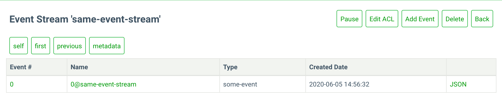

# Appending events

When you start working with EventStoreDB, the database is empty. So, the first meaningful operation in this case would be to add one or more events to the database using one of the available client SDKs.

::: tip
Check [connecting to EventStoreDB instructions](./README.md#required-packages) to learn how to configure and use the client SDK.
:::

## Append your first event

The simplest way to append an event to EventStoreDB is to create an `EventData` object and call `AppendToStream` method.

:::: code-group
::: code-group-item C#
@[code{append-to-stream}](../dotnet/21.2/samples/appending-events/Program.cs)
:::
::: code-group-item Java
@[code{append-to-stream}](../java/1.0.0/samples/appending_events/AppendingEvents.java)
:::
::: code-group-item JavaScript
@[code{append-to-stream}](../node/2.0.0/samples/appending-events.js)
:::
::: code-group-item Rust
@[code{append-to-stream}](../rust/1.0.0/samples/appending_events.rs)
:::
::: code-group-item TypeScript
@[code{append-to-stream}](../node/2.0.0/samples/appending-events.ts)
:::
::::

As you can see, `AppendToStream` takes a collection of `EventData`, which makes possible saving more than one event in a single batch.
 
As well as the example above there is also a number of other options for dealing with different scenarios. 

::: tip
If you are new to Event Sourcing, please study the [Handling concurrency](#handling-concurrency) section below.
:::

## Working with EventData

When appending events to EventStoreDB they must first all be wrapped in an `EventData` object. This allows you to specify the content of the event, the type of event and whether its in Json format. In its simplest form you need to the three following arguments:

### eventId

This takes the format of a `Uuid` and is used to uniquely identify the event you are trying to append. If two events with the same `Uuid` are appended to the same stream in quick succession EventStoreDB will only append one copy of the event to the stream. 

For example, the following code will only append a single event:

:::: code-group
::: code-group-item C#
@[code{append-duplicate-event}](../dotnet/21.2/samples/appending-events/Program.cs)
:::
::: code-group-item Java
@[code{append-duplicate-event}](../java/1.0.0/samples/appending_events/AppendingEvents.java)
:::
::: code-group-item JavaScript
@[code{append-duplicate-event}](../node/2.0.0/samples/appending-events.js)
:::
::: code-group-item Rust
@[code{append-duplicate-event}](../rust/1.0.0/samples/appending_events.rs)
:::
::: code-group-item TypeScript
@[code{append-duplicate-event}](../node/2.0.0/samples/appending-events.ts)
:::
::::

::: card

:::

### type

An event type should be supplied for each event. This is a unique string used to identify the type of event you are saving. 

It is common to see the explicit event code type name used as the type as it makes serialising and de-serialising of the event easy. However, we recommend against this as it couples the storage to the type and will make it more difficult if you need to version the event at a later date.

### data

Representation of your event data. It is recommended that you store your events as JSON objects as this will allow you to make use of all of EventStoreDB's functionality such as projections. Ultimately though, you can save it using whatever format you like as eventually, it will be stored as encoded bytes.

### metadata

It is common to need to store additional information along side your event that is part of the event it's self. This can be correlation Id's, timestamps, access information etc. EventStoreDB allows you to store a separate byte array containing this information to keep it separate.

### isJson

Simple boolean field to tell EventStoreDB if the event is stored as json, true by default.

## Handling concurrency

When appending events to a stream you can supply a *stream state* or *stream revision*. Your client can use this to tell EventStoreDB what state or version you expect the stream to be in when you append. If the stream isn't in that state then an exception will be thrown. 

For example if we try and append the same record twice expecting both times that the stream doesn't exist we will get an exception on the second:

:::: code-group
::: code-group-item C#
@[code{append-with-no-stream}](../dotnet/21.2/samples/appending-events/Program.cs)
:::
::: code-group-item Java
@[code{append-with-no-stream}](../java/1.0.0/samples/appending_events/AppendingEvents.java)
:::
::: code-group-item JavaScript
@[code{append-with-no-stream}](../node/2.0.0/samples/appending-events.js)
:::
::: code-group-item Rust
@[code{append-with-no-stream}](../rust/1.0.0/samples/appending_events.rs)
:::
::: code-group-item TypeScript
@[code{append-with-no-stream}](../node/2.0.0/samples/appending-events.ts)
:::
::::

There are three available stream states: 
- `Any`
- `NoStream`
- `StreamExists`

This check can be used to implement optimistic concurrency. When you retrieve a stream from EventStoreDB, you take note of the current version number, then when you save it back you can determine if somebody else has modified the record in the meantime.

:::: code-group
::: code-group-item C#
@[code{append-with-concurrency-check}](../dotnet/21.2/samples/appending-events/Program.cs)
:::
::: code-group-item Java
@[code{append-with-concurrency-check}](../java/1.0.0/samples/appending_events/AppendingEvents.java)
:::
::: code-group-item JavaScript
@[code{append-with-concurrency-check}](../node/2.0.0/samples/appending-events.js)
:::
::: code-group-item Rust
@[code{append-with-concurrency-check}](../rust/1.0.0/samples/appending_events.rs)
:::
::: code-group-item TypeScript
@[code{append-with-concurrency-check}](../node/2.0.0/samples/appending-events.ts)
:::
::::

<!-- ## Options TODO -->

## User credentials

You can provide user credentials to be used to append the data as follows. This will override the default credentials set on the connection.

:::: code-group
::: code-group-item C#
@[code{overriding-user-credentials}](../dotnet/21.2/samples/appending-events/Program.cs)
:::
::: code-group-item Java
@[code{overriding-user-credentials}](../java/1.0.0/samples/appending_events/AppendingEvents.java)
:::
::: code-group-item JavaScript
@[code{overriding-user-credentials}](../node/2.0.0/samples/appending-events.js)
:::
::: code-group-item Rust
@[code{overriding-user-credentials}](../rust/1.0.0/samples/appending_events.rs)
:::
::: code-group-item TypeScript
@[code{overriding-user-credentials}](../node/2.0.0/samples/appending-events.ts)
:::
::::
