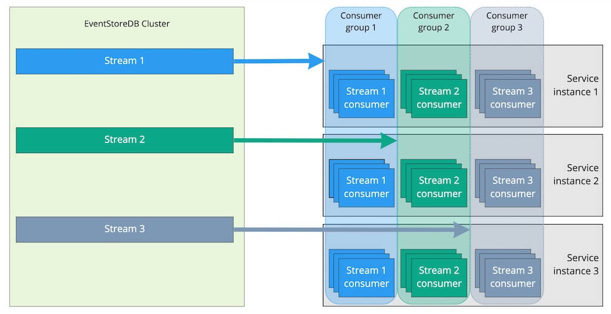

# Subscribe to changes

A common operation is to subscribe to a stream and receive notifications for changes. As new events arrive, you continue following them.

You can only subscribe to one stream. You can use server-side projections for linking events to new aggregated streams. System projections create pre-defined streams that aggregate events by type or by category and are available out-of-the box. Check the server documentation to learn more about system and user-defined projections.

There are three types of subscription patterns, useful in different situations.

## Volatile subscriptions

This subscription calls a given function for events appended after establishing the subscription. They are useful when you need notification of new events with minimal latency, but where it's not necessary to process every event.

For example, if a stream has 100 events in it when a subscriber connects, the subscriber can expect to see event number 101 onwards until the time the subscription is closed or dropped.

You can set up a volatile subscription the same way as a catch-up subscription (below) without specifying the start position.

## Catch-up Subscriptions

Catch-up subscriptions serve the purpose of receiving events from a stream for a single subscriber. Subscribers for catch-up subscriptions get events in order and, therefore, are able to process events sequentially. There is nothing on the server that gets stored for such a subscriber.

You can have multiple subscribers for the same stream and all those subscribers will get all the events from that stream. Subscriptions have no influence on each other and can run at their own pace.

When creating a catch-up subscription on the client side, you can supply the starting position in the stream you are subscribing for. The subscriber will then get events from that position onwards. If the subscriber keeps the last known position in its own storage, it will be able to go down and resubscribe from the stored position in order to only get unprocessed events.

When the subscription starts for the first time and the stream it subscribes to already has events, the subscription will get into a catch-up state and receive historical events. When the subscriber eventually catches up and processes all the historical events, it will switch to real-time mode and will get events as they are appended to the stream. If the stream gets more events that the subscriber can process in real time, the subscriber will lag behind and switch to the catch-up mode again until it manages to process all the pending events and then switches to real-time mode again.

It is, therefore, a sole responsibility of the subscriber to keep the last processed event position, also known as the _checkpoint_ in its own storage. If the subscriber doesn't know the last checkpoint, it will have to subscribe to the beginning of the stream. It is also possible to tell the subscriber to start processing events from the end of the stream, so all the historical events will be ignored. It is useful when you don't care about the history and want to start processing events from now on only.

For regular streams, the checkpoint is a sequence number of the event, which is currently being processed by the subscription. For the `$all` stream, the checkpoint consists of two positions in the global event storage - prepare position and commit position.

### Use-case for catch-up subscription

Catch-up subscriptions are typically used for producing _read models_ in event-sourced systems that use the CQRS pattern. Subscribers that update read models are often called _projections_ because they project the event payload to a piece of state in another database. Client-side projections use the same concept as KurrentDB server-side projections but have a different purpose.

::: tip Storing checkpoints
The best practice for subscriptions that project events to another storage, is to store checkpoints in the same storage. Projecting an event and storing the checkpoint in one transaction allows you t achieve the _exactly once_ event processing.
:::

### Subscribing to a stream

You can subscribe to any individual event stream in KurrentDB. It could be a normal stream, where your software append events, or a stream produced by the server-side projection, either a system projection (like `$et-SomethingHappened`) or a custom projection.

Use the `IEventStoreConnection.SubscribeToStreamFrom` method to initiate the subscription. The connection must be open by the time you call this method.

You need to specify the stream which you want to subscribe to, the last known checkpoint, subscription settings, and the event handling function. Optionally, you can specify a function which gets called when the subscription switches from processing historical events to real-time processing, and another function for handling subscription drops.

::: tip Dropping subscription
There are multiple reasons for a subscription to drop. The connection might close due to network issues, the subscription might get overloaded with events, or your event handler might throw an unhandled exception. It is usually a good idea to handle subscription drops and resubscribe when needed, to overcome transient issues. When a subscription drops, the application would keep working but will not process any events.
:::

@[code{SubscribeToStream}](./sample-code/Subscriptions/CatchUp.cs)

In this code, we create an instance of `CatchUpSubscriptionSettings`. You can also use `CatchUpSubscriptionSettings.Default` with default settings instead.

### Subscribing to `$all`

Subscribing to the global event stream enables you to create read models from many different event streams. It is a powerful method to create, for example, reporting models with aggregated and denormalized data without using common database operations like `JOIN`. You must, however, carefully evaluate your subscription performance, as when you subscribe to `$all`, you'll get absolutely everything what gets appended to the KurrentDB cluster. You might also need to filter out system events by checking if the event type starts with `$`. In normal applications, you won't need to process system events.

As mentioned before, the checkpoint for `$all` is not a single numeric value, like it is for a single stream. You need to handle the checkpoint with two positions instead: commit and prepare position.

For the rest, the code for subscribing to `$all` is very similar to the previous snippet:

@[code{SubscribeToAll}](./sample-code/Subscriptions/CatchUp.cs)

The differences here are:
- You don't need to specify the stream name, as we know it's the `$all` stream.
- The checkpoint argument type is `Position?`, not `long?`

### Unsubscribing

Normally, you won't need to explicitly close the subscription as you want it to run as long as your application runs. When the application stops, it is a good practice to stop the connection (`IEventStoreConnection.Close`) and when the connection closes, it also stops all the subscriptions gracefully.

If you need to stop the subscription without closing the connection, you can use the returned value of `ConnectToStreamFrom` or `ConnectToAllFrom`. Those methods return an instance of `EventStoreCatchUpSubscription` and `EventStoreAllCatchUpSubscription` respectively. You can use it also for something like processing gap metric, as it gives you access to the current checkpoint. When you need to stop the subscription, you can call its `Stop` method.

## Persistent subscriptions

In contrast to volatile and catch-up types, persistent subscriptions are not dropped when the connection is closed. Moreover, this subscription type supports the "[competing consumers](https://www.enterpriseintegrationpatterns.com/patterns/messaging/CompetingConsumers.html)" messaging pattern and is useful when you need to distribute messages to many workers. KurrentDB saves the subscription state server-side and allows for at-least-once delivery guarantees across multiple consumers on the same stream. It is possible to have many groups of consumers compete on the same stream, with each group getting an at-least-once guarantee.

::: tip
The Administration UI includes a _Persistent Subscriptions_ section where a user can create, update, delete and view subscriptions and their statuses.
:::

### Concept

Persistent subscriptions serve the same purpose as catch-up or volatile subscriptions, but in a different way. All subscriptions aim to deliver events in real-time to connected subscribers. But, unlike other subscription types, persistent subscriptions are maintained by the server. In a way, catch-up and persistent subscriptions are similar. Both have a last known position from where the subscription starts getting events. However, catch-up subscriptions must take care about keeping the last known position on the subscriber side while persistent subscriptions keep the position on the server.

Since it is the server who decides from where the subscription should start receiving events and knows where events are delivered, subscribers that use a persistent subscription can be load-balanced and process events in parallel. In contrast, catch-up subscriptions, which are client-driven, always receive and process events sequentially and can only be load-balanced on the client side. Therefore, persistent subscriptions allow using the competing consumers pattern that is common in the world of message brokers.

In order for the server to load-balance subscribers, it uses the concept of consumer groups. All clients that belong to a single consumer group will get a portion of events and that's how load balancing works inside a group. It is possible to create multiple consumer groups for the same stream, and they will be completely independent of each other, receiving and processing events at their own pace and having their own last known position handled by the server.



::: note
Just as in the world of message brokers, processing events in a group of consumers running in parallel processes will most likely get events out of order within a certain window. For example, if a consumer group has ten consumers, ten messages will be distributed among the available consumers, based on the [strategy](#consumer-strategies) of the group. Even though some strategies make an attempt to consistently deliver ordered events to a single consumer, it's done on a best effort basis and there is no guarantee of events coming in order with any strategy.
:::

### Creating a subscription group

The first step of dealing with a subscription group is to create one. You will receive an error if you attempt to create a subscription group multiple times. You must have admin permissions to create a persistent subscription group.

::: tip
Normally you wouldn't create the subscription group in your general executable code. Maintaining subscription groups can be seen as a _migration_ task, similar to RDBMS schema migrations and therefore needs to run only after it gets changed for some reason.
:::

```csharp
var userCredentials = new UserCredentials("admin", "changeit");

var settings = PersistentSubscriptionSettings
    .Create()
    .StartFromCurrent();

var result = await connection.CreatePersistentSubscriptionAsync(
    "myStream", 
    "agroup", 
    settings, 
    userCredentials
);
```

| Parameter                                 | Description                                                     |
|:------------------------------------------|:----------------------------------------------------------------|
| `string stream`                           | The name of the stream which the persistent subscription is on. |
| `string groupName`                        | The name of the subscription group to create.                   |
| `PersistentSubscriptionSettings settings` | The settings to use when creating this subscription.            |
| `UserCredentials credentials`             | The user credentials to use for this operation.                 |

### Connecting to an existing group

Once you have created a subscription group, clients can connect to that subscription group. A subscription in your application should only have the connection in your code, and you should assume that the subscription was created via the client API, the restful API, or manually in the UI.

The most important parameter to pass when connecting is the buffer size. This parameter represents how many outstanding messages the server should allow this client. If this number is too small, your subscription will spend much of its time idle as it waits for an acknowledgment to come back from the client. If it's too big, you waste resources and can start causing time out messages depending on the speed of your processing.

::: warning Slow consumers
If you define a large buffer and your consumer is slow, the subscription might time out on the server and send the same buffer again. Such a situation leads to severe performance degradation of the persistent subscription and the cluster node.
:::

```csharp
var subscription = await connection.ConnectToPersistentSubscriptionAsync(
    "myStream", 
    "agroup", 
    (_, evt) 
        => Console.Out.WriteLineAsync("event appeared"),
    (sub, reason, exception) 
        => Console.WriteLine($"Subscription dropped: {reason}")
);
```

| Parameter                     | Description                                                                  |
|:------------------------------|:-----------------------------------------------------------------------------|
| `string stream`               | The name of the stream which the persistent subscription is on.              |
| `string groupName`            | The name of the subscription group to connect to.                            |
| `Action eventAppeared`        | The action to call when an event arrives over the subscription.              |
| `Action subscriptionDropped`  | The action to call if the subscription is dropped.                           |
| `UserCredentials credentials` | The user credentials to use for this operation.                              |
| `int bufferSize`              | The number of in-flight messages this client is allowed.                     |
| `bool autoAck`                | Whether to automatically acknowledge messages after `eventAppeared` returns. |

### Acknowledging events

Clients must acknowledge (or not acknowledge) messages in the competing consumer model. If you enable auto-ack, the subscription will automatically acknowledge messages once your handler completes them. If you throw an exception, it will shut down your subscription with a message and the uncaught exception.

You can choose to not auto-ack messages. This can be useful when you have multi-threaded processing of messages in your subscriber and need to pass control to something else. There are methods on the subscription object that you can call: `Acknowledge` and `NotAcknowledge`. Both take a `ResolvedEvent` (the one you processed) and both also have overloads for passing an `IEnumerable<ResolvedEvent>`.

### Consumer strategies

When creating a persistent subscription, the settings allow for different consumer strategies via the `WithNamedConsumerStrategy` method. Built-in strategies are defined in the enum `SystemConsumerStrategies`.

#### RoundRobin (default)

Distributes events to all clients evenly. If the client `bufferSize` is reached, the client is ignored until events are acknowledged/not acknowledged.

This strategy provides equal load balancing between all consumers in the group.

#### DispatchToSingle

Distributes events to a single client until the `bufferSize` is reached. After that, the next client is selected in a round robin style, and the process is repeated.

This option can be seen as a fall-back scenario for high availability, when a single consumer processes all the events until it reaches its maximum capacity. When that happens, another consumer takes the load to free up the main consumer resources.

#### Pinned

For use with an indexing projection such as the system `$by_category` projection.

KurrentDB inspects the event for its source stream id, hashing the id to one of 1024 buckets assigned to individual clients. When a client disconnects its buckets are assigned to other clients. When a client connects, it is assigned some of the existing buckets. This naively attempts to maintain a balanced workload.

The main aim of this strategy is to decrease the likelihood of concurrency and ordering issues while maintaining load balancing. _This is not a guarantee_, and you should handle the usual ordering and concurrency issues.

### Replay parked messages

Replays all parked messages for a particular persistent subscription `subscriptionName` on a `stream` that were parked by a negative acknowledgement action.

```csharp
public Task ReplayParkedMessages(
    string stream, 
    string subscriptionName, 
    UserCredentials userCredentials = null
)
```

### Updating a subscription group

You can edit the settings of an existing subscription group while it is running instead of deleting the subscription group and recreating it to change its settings. When you update a subscription group, it resets itself internally, dropping the connections and having them reconnect. You must have admin permissions to update a persistent subscription group.

```csharp
var settings = PersistentSubscriptionSettings
    .Create()
    .ResolveLinkTos()
    .StartFromCurrent();

var result = await connection.UpdatePersistentSubscriptionAsync(
    stream, "agroup", settings, MyCredentials
);
```

::: tip
If you change settings such as `startFromBeginning`, this doesn't reset the group's checkpoint. If you want to change the current position in an update, you must delete and recreate the subscription group.
:::

| Parameter                                 | Description                                                     |
|:------------------------------------------|:----------------------------------------------------------------|
| `string stream`                           | The name of the stream which the persistent subscription is on. |
| `string groupName`                        | The name of the subscription group to update.                   |
| `PersistentSubscriptionSettings settings` | The settings to use when updating this subscription.            |
| `UserCredentials credentials`             | The user credentials to use for this operation.                 |

### Persistent subscription settings

Both the `Create` and `Update` methods take a `PersistentSubscriptionSettings` object as a parameter. The methods use this object to provide the settings for the persistent subscription. A fluent builder is available for these options that you can locate using the `Create()` method. For example:

```csharp
var settings = PersistentSubscriptionSettings
    .Create()
    .ResolveLinkTos()
    .StartFromCurrent();
```

The following table shows the options you can set on a persistent subscription.

| Member                                   | Description                                                                                                          |
|:-----------------------------------------|:---------------------------------------------------------------------------------------------------------------------|
| `ResolveLinkTos`                         | Tells the subscription to resolve link events.                                                                       |
| `DoNotResolveLinkTos`                    | Tells the subscription to not resolve link events.                                                                   |
| `PreferRoundRobin`                       | If possible, prefers a round robin between the connections with messages (Will use next available if not possible).  |
| `PreferDispatchToSingle`                 | If possible, prefers dispatching to a single connection (Will use next available if not possible).                   |
| `StartFromBeginning`                     | Starts the subscription from the first event in the stream.                                                          |
| `StartFrom(int position)`                | Starts the subscription from the position-th event in the stream.                                                    |
| `StartFromCurrent`                       | Starts the subscription from the current position.                                                                   |
| `WithMessageTimeoutOf(TimeSpan timeout)` | Sets the timeout for a client before retrying the message.                                                           |
| `CheckPointAfter(TimeSpan time)`         | The amount of time the system should try to checkpoint after.                                                        |
| `MinimumCheckPointCountOf(int count)`    | The minimum number of messages to write a checkpoint for.                                                            |
| `MaximumCheckPointCountOf(int count)`    | The maximum number of messages not checkpointed before forcing a checkpoint.                                         |
| `WithMaxRetriesOf(int count)`            | Sets the number of times to retry a message should before considering it a bad message.                              |
| `WithLiveBufferSizeOf(int count)`        | The size of the live buffer (in memory) before resorting to paging.                                                  |
| `WithReadBatchOf(int count)`             | The size of the read batch when in paging mode.                                                                      |
| `WithBufferSizeOf(int count)`            | The number of messages to buffer when in paging mode.                                                                |
| `WithExtraStatistics`                    | Tells the backend to measure timings on the clients so statistics contain histograms of them.                        |

### Deleting a subscription group

The delete operation can be used to remove a subscription group. Like the creation of groups, you rarely do this in your runtime code and is undertaken by an administrator running a script.

```csharp
var result = await connection.DeletePersistentSubscriptionAsync(
    stream, "groupname", AdminCredentials
);
```

| Parameter                     | Description                                                     |
|:------------------------------|:----------------------------------------------------------------|
| `string stream`               | The name of the stream which the persistent subscription is on. |
| `string groupName`            | The name of the subscription group to update.                   |
| `UserCredentials credentials` | The user credentials to use for this operation.                 |

### Monitoring persistent subscriptions

The client API includes helper methods that wrap the HTTP API to allow you to monitor persistent subscriptions. This page describes the methods found in the `PersistentSubscriptionsManager` class. All methods in this class are asynchronous.

#### Create the manager instance

Before accessing any of the methods described below, you need to create an instance of the `PersistentSubscriptionsManager` class. It needs a logger instance and one of the variations of the `EndPoint` abstract class. You would normally use either the `IpEndPoint` or `DnsEndPoint`. Since all HTTP calls would be redirected to the cluster leader, you can use the IP address of any cluster node. When using the `DnsEndPoint`, you can specify the DNS name of the cluster.

For example:

```csharp
var subscriptionManager = new PersistentSubscriptionsManager(
    new ConsoleLogger(),
    new DnsEndPoint("esdb.acme.org", 2113),
    TimeSpan.FromSeconds(1)
);
```

Notice that you need to specify the HTTP port that your application can reach. Most probably you'd need to use the external HTTP port, which is `2113` by default.

#### Get persistent subscriptions from all streams

Returns information about all persistent subscriptions from all streams.

```csharp
Task List(UserCredentials userCredentials = null);
```

#### Get persistent subscriptions for a stream

Returns information about the persistent subscription for a stream you specify with `stream`. You must have access to the stream.

```csharp
Task List(string stream, UserCredentials userCredentials = null);
```

#### Get persistent subscription for a stream

Gets the details of the persistent subscription `subscriptionName` on `stream`. You must have access to the persistent subscription and the stream.

```csharp
Task Describe(string stream, string subscriptionName, UserCredentials userCredentials = null);
```


