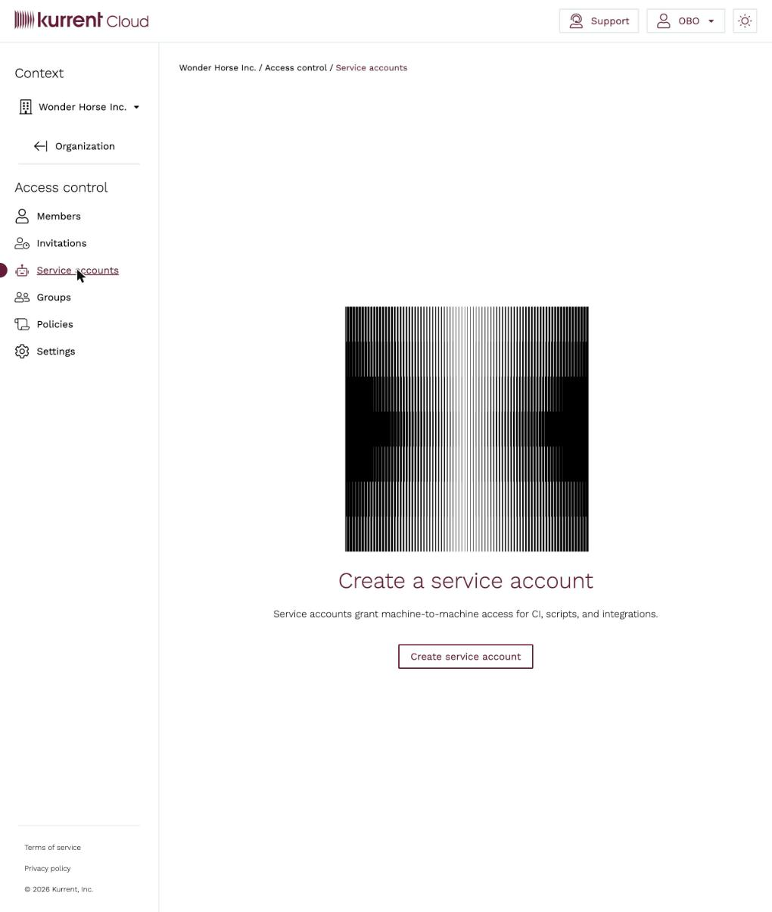
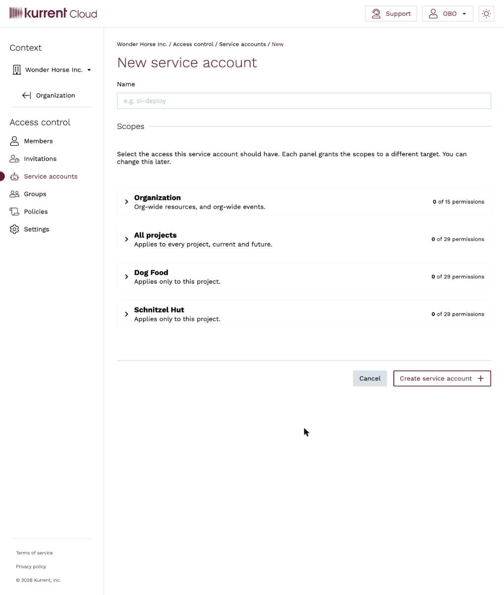
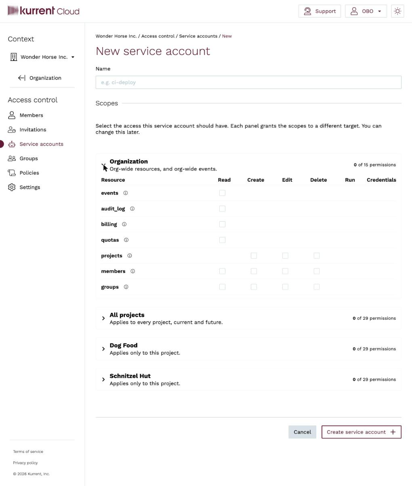
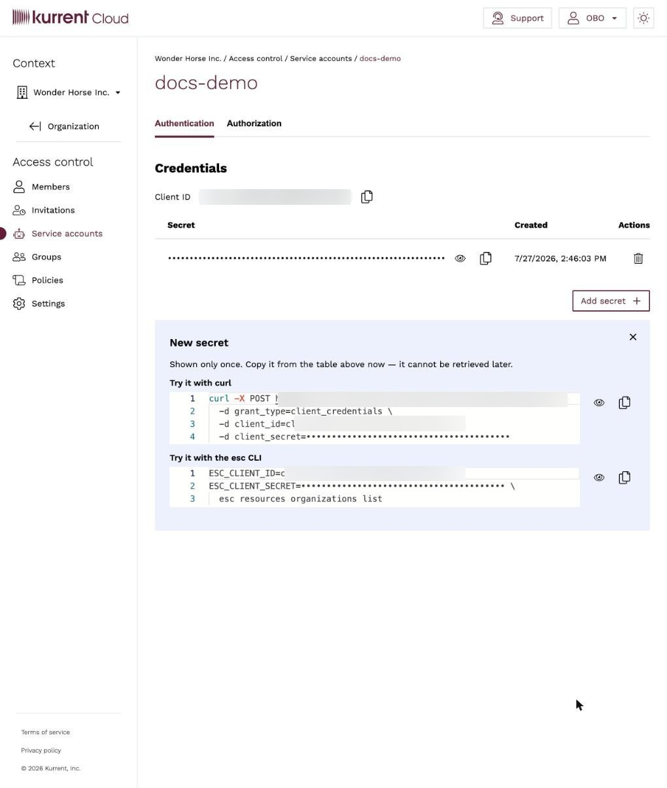
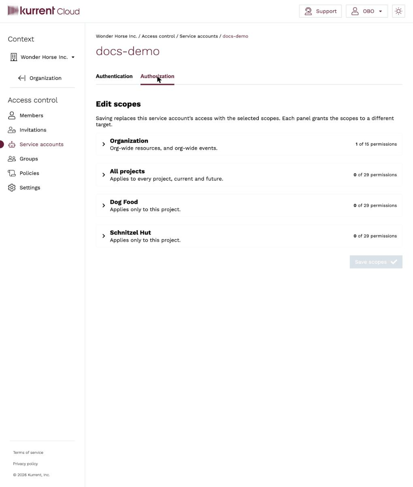

# Service Accounts

A service account is a non-human identity that belongs to an organization. Use
service accounts for machine-to-machine access — CI/CD pipelines,
infrastructure-as-code such as [Terraform](../automation/terraform.md) and
[Pulumi](../automation/pulumi.md), and scripts driven by the
[`esc` CLI](https://github.com/kurrent-io/esc) — so that automation
authenticates with its own credentials instead of a person's account.

Compared with tokens tied to an individual user, service accounts:

* keep automation working when people join or leave the organization;
* have their own scoped permissions, granted per target; and
* can have their secrets rotated or revoked independently, without affecting any
  user.

Manage service accounts from **Access control → Service accounts**.

## Create a service account

1. Open the **Access control** menu for your organization and select **Service
   accounts**.

   

2. Click **Create service account**.
3. Give it a descriptive **Name** that identifies where it is used, for example
   `ci-deploy` or `terraform-production`.
4. Under **Scopes**, select the access the service account should have (see
   [Scopes](#scopes) below). You can change this later.

   

5. Click **Create service account**.

## Scopes

A service account's permissions are granted as **scopes**, not through group
membership. Scopes are organized into panels, one per target:

* **Organization** — org-wide resources and org-wide events.
* **All projects** — applies to every project, current and future.
* **One panel per project** — applies only to that project.

Expand a panel to grant permissions as a matrix of **resources** (such as
`events`, `audit_log`, `billing`, `quotas`, `projects`, `members`, and
`groups`) against **actions** (`Read`, `Create`, `Edit`, `Delete`, `Run`, and
`Credentials`). A checkbox appears only for the actions that apply to a given
resource.



::: tip
Follow least privilege — grant only the scopes the automation needs. Prefer a
project panel over **All projects**, and grant `Read` unless the automation
must create or change resources.
:::

## Authentication

After creation, the service account opens on its **Authentication** tab, which
holds its credentials.



* **Client ID** — a stable, non-secret identifier for the service account.
* **Secret** — created alongside the client ID. A service account can hold more
  than one secret; use **Add secret** to create another.

::: warning
A secret's value is **shown only once**, when it is created. Copy it and store
it in a secrets manager immediately — it cannot be retrieved later. If you lose
it, add a new secret and delete the old one.
:::

The Authentication tab also shows ready-to-run snippets for the client ID and
new secret, using the OAuth 2.0 **client credentials** grant for the API and
environment variables for the `esc` CLI.

### Authenticate the `esc` CLI

The `esc` CLI reads service account credentials from the `ESC_CLIENT_ID` and
`ESC_CLIENT_SECRET` environment variables. Export them, then run `esc` commands
as usual — they execute with the service account's scopes:

```bash
export ESC_CLIENT_ID=<client-id>
export ESC_CLIENT_SECRET=<client-secret>

esc resources organizations list
```

::: warning
Provide service account credentials through the `ESC_CLIENT_ID` and
`ESC_CLIENT_SECRET` environment variables. Do not pass them as global
command-line flags — `esc` reserves credential handling for these environment
variables.
:::

In CI/CD, store the client ID and secret as masked/secret variables in your
pipeline and export them into the job environment before invoking `esc`.

### Authenticate the API directly

For direct API access, exchange the client ID and secret for an access token
using the OAuth 2.0 client credentials grant, then call the API with the
returned bearer token. The exact token endpoint is shown in the **curl** snippet
on the Authentication tab.

## Authorization

The **Authorization** tab lets you change a service account's scopes after
creation. It shows the same per-target panels used at creation; adjust the
selected permissions and click **Save scopes**.



::: warning
Saving on the Authorization tab **replaces** the service account's access with
the scopes currently selected across all panels. Review every panel before
saving, not just the one you changed.
:::

## Rotate and revoke

* **Rotate a secret** — on the **Authentication** tab, click **Add secret** to
  create a new one, update your automation with the new value, then delete the
  old secret. Because a service account can hold multiple secrets at once, you
  can roll over without downtime. Rotate on a regular schedule and whenever a
  secret may have been exposed.
* **Revoke access** — delete a secret to invalidate it, or delete the service
  account to remove it entirely. Any automation using a deleted credential stops
  working immediately.

::: tip
Give each automation its own service account. Separate credentials make it easy
to rotate or revoke one integration without disrupting the others, and make
audit logs clearer about which automation performed an action.
:::

## Use with Terraform and Pulumi

Service accounts are the recommended identity for infrastructure automation,
so that plans and applies run under an identity that is not tied to a single
person. The [Terraform](../automation/terraform.md) provider supports service
account credentials from version 3.1.0: set the `client_id` and
`client_secret` provider options (or the `ESC_CLIENT_ID` and
`ESC_CLIENT_SECRET` environment variables) to the values from the service
account's [Authentication](#authentication) tab.

The [Pulumi](../automation/pulumi.md) provider does not yet accept service
account credentials and is still configured with a token. See the
[Automations](../automation/README.md) section for each provider's setup.
