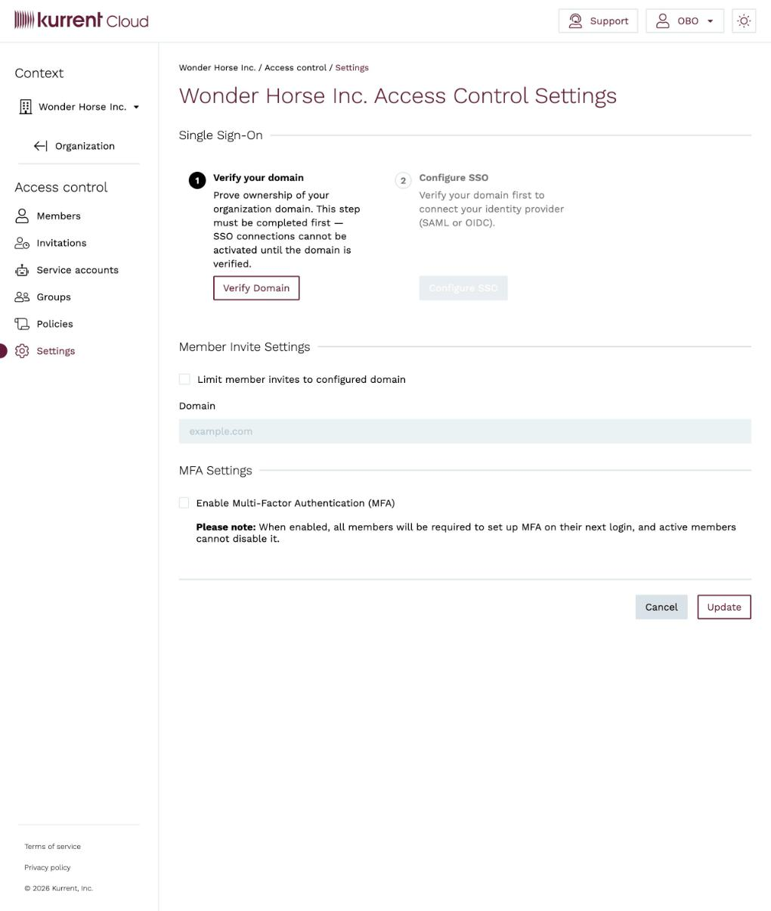
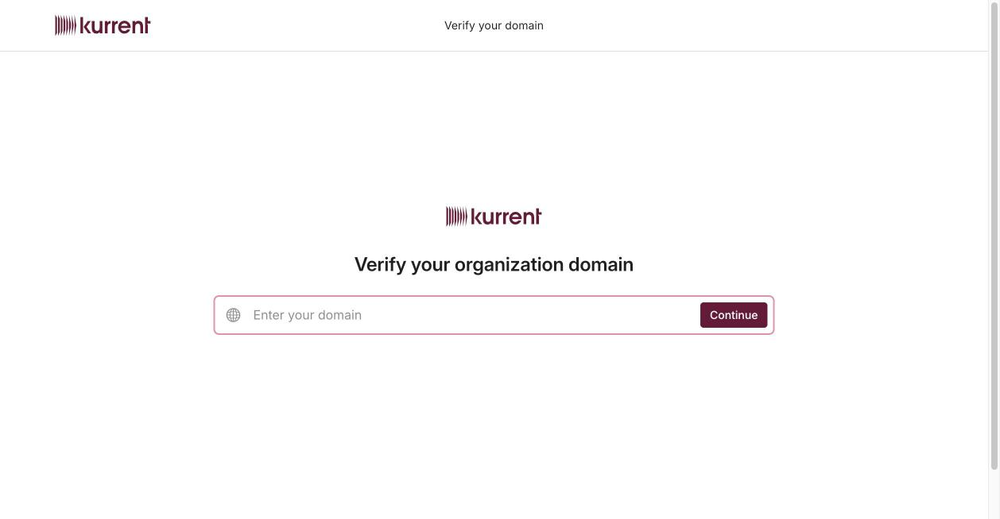

# Single Sign-On (SSO)

Single sign-on lets the members of your organization sign in to Kurrent Cloud
with the credentials they already use at work, managed by your own identity
provider (IdP). Instead of maintaining a separate Kurrent Cloud password, users
authenticate against your IdP, and your IdP decides who is allowed in.

Kurrent Cloud supports the **SAML 2.0** and **OpenID Connect (OIDC)** protocols,
so you can connect identity providers such as Okta, Microsoft Entra ID (Azure
AD), Google Workspace, OneLogin, JumpCloud, and any other SAML- or
OIDC-compliant provider.

::: tip
SSO is configured per organization, from **Access control → Settings**. Each
organization has its own connection, and its members sign in through it.
:::

## How it works

Setting up SSO is a two-step process, shown under **Single Sign-On** on the
**Access control → Settings** page:

1. **Verify your domain** — prove ownership of the email domain your members
   sign in with. This must be completed first; an SSO connection cannot be
   activated until the domain is verified.
2. **Configure SSO** — connect your identity provider over SAML or OIDC.

Once SSO is active, a member who signs in with an address on the verified domain
is redirected to your identity provider to authenticate. On their first
successful sign-in, a member account is provisioned automatically and added to
the organization.

## Prerequisites

Before you start, make sure you have:

* **Organization admin access** in Kurrent Cloud (membership of the
  `Organization admins` group).
* **Administrator access to your identity provider**, so you can create an
  application/connection and exchange configuration with Kurrent Cloud.
* **A domain you can verify** — the email domain your members will sign in with,
  and the ability to add a DNS record for it.

## Step 1 — Verify your domain

1. Open the **Access control** menu for your organization and select
   **Settings**.
2. Under **Single Sign-On**, click **Verify Domain**. A guided setup portal
   opens in a new tab.
3. Enter your organization domain (for example `your-company.com`) and click
   **Continue**.

   

4. Add the DNS record the portal provides to your domain's DNS zone, then return
   to the portal to complete verification.

Once the domain is verified, the **Configure SSO** step is enabled.

## Step 2 — Configure SSO

1. Back on **Access control → Settings**, under **Single Sign-On**, click
   **Configure SSO**. The guided setup portal opens.
2. Choose your identity provider (or a generic **SAML** or **OIDC**
   connection).
3. Follow the wizard to exchange configuration between Kurrent Cloud and your
   IdP:
   * Create the corresponding application/connection in your identity provider.
   * Provide Kurrent Cloud's **ACS URL** / **redirect URI** and **entity ID** /
     **client credentials** to your IdP, and provide your IdP's **metadata URL**
     (or certificate and sign-in URL) back to Kurrent Cloud.
   * Map the identity attributes your IdP sends (email, first name, last name)
     to the fields Kurrent Cloud expects.
4. Complete the wizard. When the exchange succeeds, the connection becomes
   active and members on the verified domain are routed to your IdP at sign-in.

<!-- TODO(screenshot): Configure SSO — provider selection and metadata exchange steps (requires a verified domain) -->

## Related settings on this page

The same **Access control → Settings** page has two related controls:

* **Member Invite Settings** — enable **Limit member invites to configured
  domain** to require that invited members use an address on your domain.
* **MFA Settings** — enable
  [multi-factor authentication](../ops/account-security.md#require-mfa-for-all-organization-users)
  for all members of the organization.

## Sign-in experience

After SSO is active, members sign in from the
[Cloud console](https://console.kurrent.cloud) with their work email address.
Kurrent Cloud recognizes the verified domain and redirects them to your identity
provider. New members are provisioned on their first successful sign-in and
added to the organization.

::: tip
Newly provisioned members start with the default access of the organization.
Add them to the appropriate [groups](README.md#groups) so they receive the
permissions they need.
:::

## Manage or remove a connection

From **Access control → Settings** you can re-open the guided setup to update
identity provider metadata or attribute mappings — for example after rotating a
signing certificate in your IdP — or remove the connection to disable SSO.

::: warning
Removing the SSO connection stops members from signing in through your identity
provider. Make sure at least one organization admin can still sign in with
another method before you remove a connection, so you don't lock yourself out.
:::

## Troubleshooting

* **`Configure SSO` is disabled** — verify your domain first. The connection
  cannot be configured until domain ownership is confirmed.
* **Members are not routed to your IdP** — check that their email domain matches
  the verified domain and that verification completed.
* **Sign-in fails immediately** — confirm the **ACS URL** / **redirect URI** and
  **entity ID** / **client ID** in your identity provider exactly match the
  values shown in the setup wizard.
* **"Attribute missing" or empty profile** — verify that your identity provider
  sends the email, first name, and last name attributes and that they are mapped
  in the wizard.
* **Certificate errors after a while** — SAML signing certificates expire.
  Re-open the setup and update the connection with the new certificate or
  metadata URL from your IdP.
