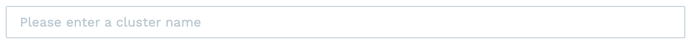
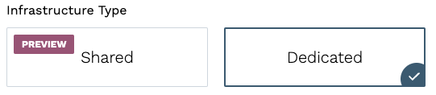
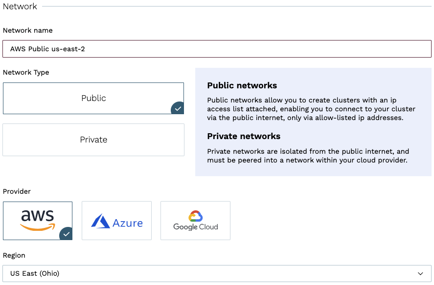
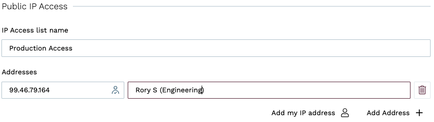

With Kurrent Cloud, provisioning KurrentDB clusters with public access on dedicated infrastructure is simple.

Pre-requisites:
- You have an organization registered in Cloud console
- You can log in to the Cloud console as admin
- Your organization has at least one project
- You are the admin of the project

Note, see the [Quick Start](../../introduction.md#cloud-quick-start) section for more details on how to configure these  items.

## Create a cluster

In the Kurrent Cloud console, go to the [project context](../../introduction.md#projects) and switch to **Clusters**. Then, click on the **New cluster** button to begin the cluster creation process.

### Cluster name

Provide a descriptive name for the cluster in the **Cluster name** field.

### Infrastructure type

Select the `Dedicated` infrastructure type.

### Network

In the **Network** section, if you have not created a network yet, you will see fields for creating a new network. If you have any existing Networks, you will see those listed, as well as the option to create a new Network.

When creating a new network for a public access cluster, you will need to provide the following information:

- **Network name** is a descriptor to allow you to identify the network in the list of networks.
- **Type** should be set to `Public`.
- **Cloud provider** should be set to AWS.
- **Region** is the AWS region where the cluster will be created.

### IP Access List

If you have not created an IP Access List yet, you will see fields for creating a new IP Access List. All clusters with public access enabled are protected by an IP Access List. This list is used to control access to the cluster from the public Internet.

**IP Access List name** is a descriptor to allow you to identify the IP Access List in the list of IP Access Lists.

**Addresses** are where you can specify the IP addresses or IP ranges in CIDR notation that are allowed to access the cluster from the public Internet. You can optionally add a comment for each address to help you keep track of what the address is for. You can use the **Add my IP address** button to add your current IP address to the list. If you are not sure about your IP address, you can update the IP Access List later.

::: tip Add my IP address
Depending on your network configuration, the **Add my IP address** button may not get the correct IP address. If you are on a public network or a network that you don't use regularly, it would be best to wait and add your IP address later once you are on a network that you will use to connect to the cluster.
:::

### Database

The Database section is where you can specify the database settings for the cluster.

You will need to select the **Server Version**, and choose whether to start server-side projections by default.

::: warning Projections impact on performance
Both system projections and user-defined projections produce new events. Carefully consider the impact of enabled projections on database performance. Please refer to the [Performance impact](@server/features/projections/README.md#performance-impact) section of the projections documentation to learn more.
:::

### Instance size

The next section of the form allows choosing the instance size for cluster nodes. Use the provided [instance size guidelines](../ops/sizing.md) to choose the right size for your cluster. Note that the `F1` size is using burstable VMs, which is not suitable for production use.

::: tip Vertical scaling
If you find that your cluster is not performing as expected, you can always resize the cluster instances later. If you create a three-node cluster, a resize is done in a rolling fashion that should take only a few minutes and not impact the availability of the cluster.
:::

You will also need to specify the topology of the cluster. We recommend three-node clusters to ensure high availability, but you can also create a single-node cluster for testing or development purposes.

### Storage

Further, you need to configure the storage for the cluster. For all three providers, only one disk type is available at the moment via the Cloud console. The storage capacity is gigabytes, with 8GiB being the minimum for AWS, and 10GiB for Azure and GCP. Since we allow customers to expand the storage size online without service interruptions, you can start with smaller storage and expand it when you need more capacity.

If you are creating an AWS cluster, you will see the option to specify IOPS and throughput. The default values are the defaults for GP3 volumes, so unless you need extra IOPS or throughput, you can leave the defaults. These values can be changed later.

::: note
The cloud console only allows for the creation of GP3 clusters, but for backwards compatibility purposes it is still possible to create a cluster with GP2 storage using tools such as the Terraform provider or Kurrent Cloud CLI. GP3 disks are recommended for all new clusters because they offer better performance, more flexibility because IOPS and throughput can be adjusted, and are less expensive than GP2 disks.
:::

### Pricing

Finally, you will see the estimated monthly price for the selected cluster size, topology, and storage capacity.

::: note Network usage
Since the network usage is billed based on actual usage, the estimated price will not reflect the full cost of the cluster.
:::

## Provisioning Begins

When you click on **Create cluster**, the provisioning process starts. The cluster will immediately be visible in the list of clusters. If you have opted to create a Network and/or IP Access List, those resources will be created, followed by the cluster itself. After a few minutes, your new cluster will be ready to use.

## Next steps

You are now ready to start using the new Managed KurrentDB cluster in the cloud. Head over to the [Operations](../../dedicated-infrastructure/ops/README.md#connecting-to-a-cluster) page to learn how to connect to your cluster.