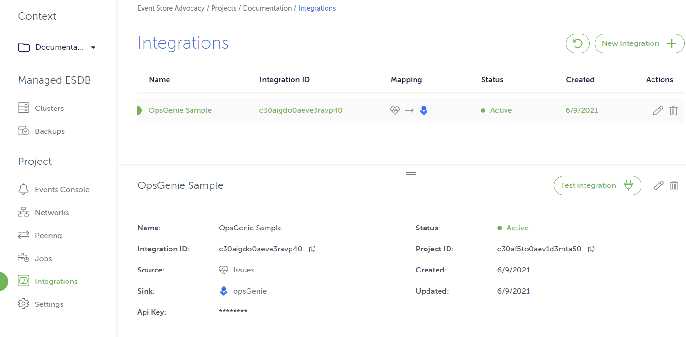

# Opsgenie

Kurrent Cloud platform is using [Opsgenie] for its alerting system. Our minimal configuration requires an API key. For simplicity’ sake, we recommend the API key to belong to a responder team.

These instructions assume you are starting from scratch and don't have a team set up yet. We also assume that you are currently on the landing page after logging in [Opsgenie].

## Create a team in Opsgenie

Log in to your Opsgenie instance, then complete the following steps to set up a new team. Skip this step if you already have a team.

1. Click on the `Teams` tab up top.
2. Click on the `Add team` top left.
3. A popup should show up. Enter your team info like its name and members. Keep in mind that the team will be considered as the responder team in Kurrent Cloud.
4. Once you confirm your new team creation, you should be redirected to your new team dashboard page.

## Generate the team API key

Follow these steps to generate an API key for the team, which should be alerted when issues happen in Kurrent Cloud.

1. Click on the `Teams` tab up top.
2. Select your team in the team table.
3. By selecting your team, you should be redirected to your team dashboard.
4. Click on `Integrations`, located in the left sidebar.
5. Click on the `Add integration` button.
6. In the integration list, click on `API` then the `Add` button.
7. By default, the form should be already pre-filled. Make sure that `Read Access`, `Create and Update Access`, `Delete Access` and `Enabled` are checked.
8. Click on `Save Integration` at the bottom.
9. You can get your API key that should be located just below the `Name` property.

## Complete the integration

1. In the Kurrent Cloud console, select an organization and then a project.
2. Once viewing a project, you should see `Integrations` under the heading `Project` in the sidebar to the left. Click it.
3. Click `New Integration`. Enter a name that will make it easier to find later, and then select Issues or Notifications.
4. Select the Opsgenie sink and put the API Key in the form, then click on the `Create integration` button.

If all the details were entered correctly, the new integration should be set up. See the example on the screen below.

[Opsgenie]: https://www.atlassian.com/software/opsgenie
