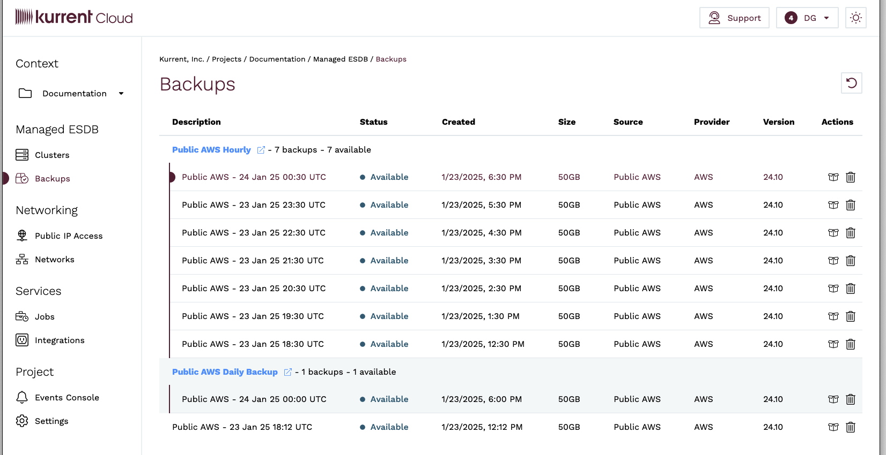
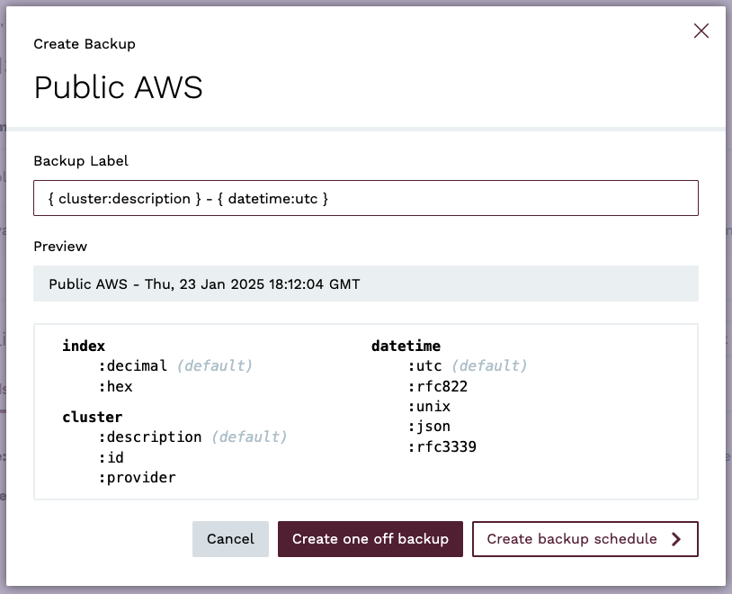
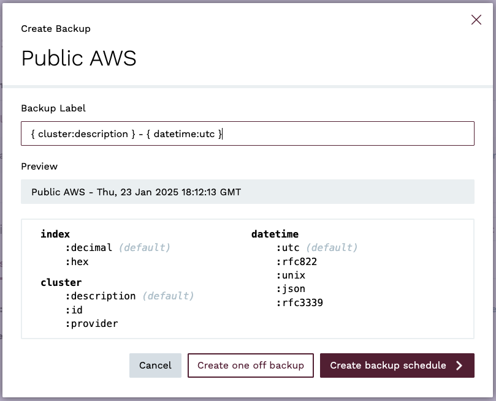
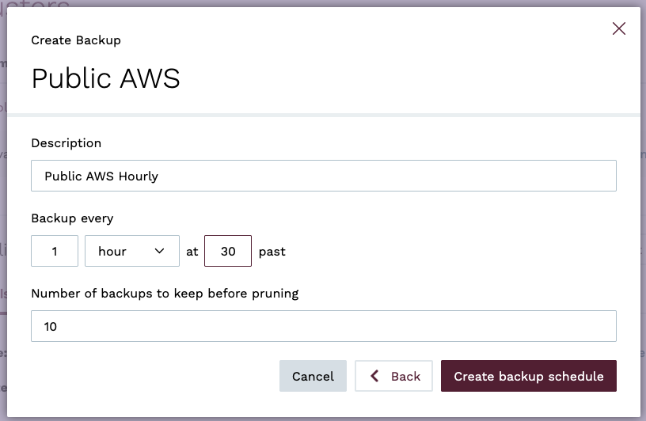
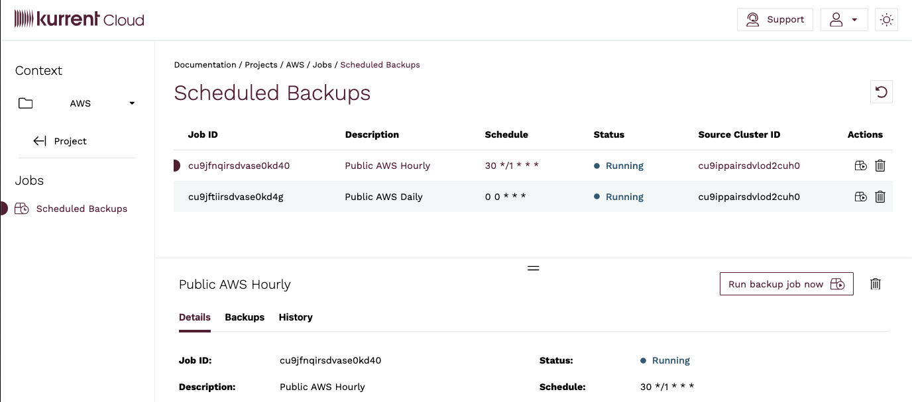
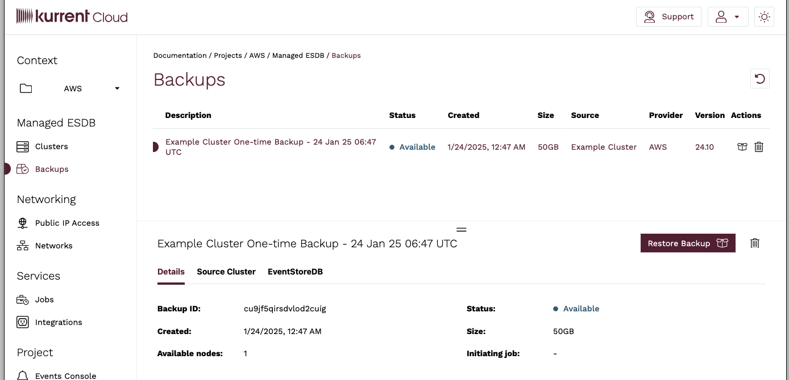
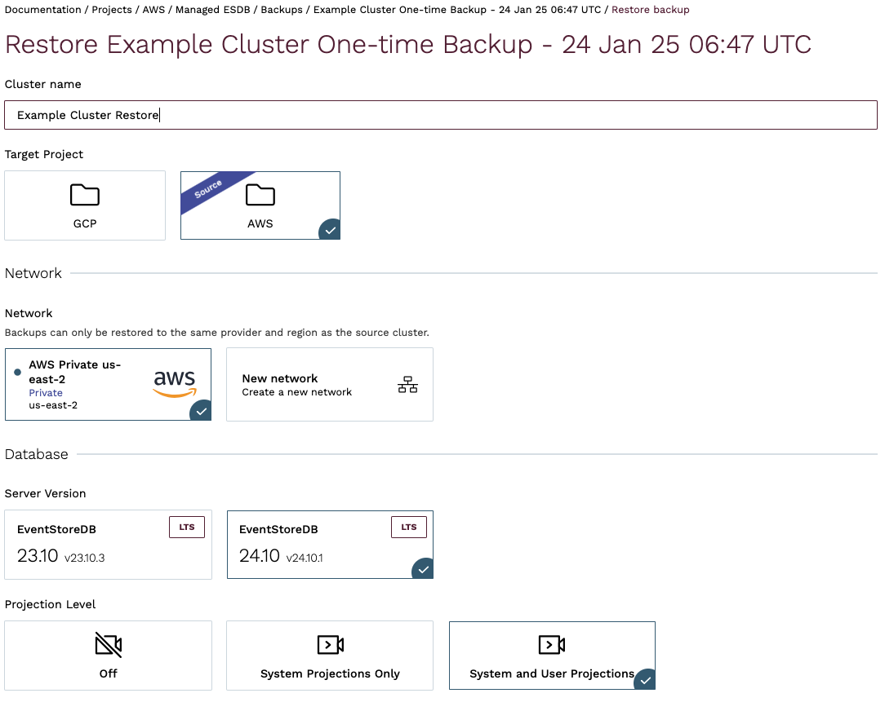

It is important to take regular backups of your clusters. Besides providing a safety net in case of data corruption, backups can also used for various operations, such as creating copies of your data for testing, moving data from one Kurrent Cloud Project to another, or changing from one type of access from Public to Private, or vice versa.

There are two types of backups:

- **Manual Backups**: These are backups that you create on demand using the [Cloud Console](https://console.kurrent.cloud/) and the [Kurrent Cloud CLI](https://github.com/EventStore/esc).
- **Scheduled Backups**: These are backups that are created automatically by a [Scheduled Job](./jobs.md) that defines the frequency and number of backups to keep at a time.

Both types of backups can be viewed in the **Backups** view of the console. All backups created by the same job will be grouped together in one row, which can be expanded by clicking the down arrow icon on the right side of the row.



## Manual Backup

Backups can be created on demand using the [Cloud Console](https://console.kurrent.cloud/) and the [Kurrent Cloud CLI](https://github.com/EventStore/esc).

You can customise the backup label using a combination of free-text and predefined variables:
- **index—**: the auto-incremented value with the number of backups. You can format it as:
  - decimal: `index:decimal` (*default*),
  - hexadecimal: `index:hex`.
- **cluster**: value from the cluster information:
  - description: `cluster:description` (*default*),
  - id: `cluster:id`,
  - cloud provider: `cluster:provider`
- **datetime**: timestamp of when backup was made. You can format it as:
  - UTC time: `datetime:utc` (*default*),
  - [RFC 822](https://www.w3.org/Protocols/rfc822/#z28): `datetime:rfc822`,
  - [Unix](https://en.wikipedia.org/wiki/Unix_time): `datetime:unix`,
  - [JSON](https://en.m.wikipedia.org/wiki/ISO_8601): `datetime:json`,
  - [RFC3339](https://tools.ietf.org/html/rfc3339): `datetime:rfc3339`,

::: tabs#way
@tab Cloud Console

To create a backup in the console, navigate to the clusters view and click on the **Create backup** icon, or . In the popup, click the **Create one-off backup** button.



@tab esc

To create a backup, use the `backups create` command:

```bash
esc mesdb backups create --description "on demand backup" \
    --source-cluster-id c1eut65o0aeu6ojco7a0 \
    --project-id btfjev2rh41scaatc1k0

BackupId("c1ev3l5o0aeu6ojco7b0")
```

To see the status of the backup use the `backups get` command:

```bash
esc mesdb backups get --project-id btfjev2rh41scaatc1k0 \
    --id c1ev3l5o0aeu6ojco7b0

Backup { id: BackupId("c1ev3l5o0aeu6ojco7b0"),
project_id: ProjectId("btfjev2rh41scaatc1k0"),
source_cluster_id: ClusterId("c1eut65o0aeu6ojco7a0"),
source_cluster_description: "Demo-Backup",
description: "on demand backup", size_gb: 8,
provider: Aws, region: "eu-central-1",
status: "available", created: "2021-03-26T14:38:12Z",
linked_resource: None }
```
:::

## Scheduled Backups

Scheduled backups can be created through the [Cloud Console](https://console.kurrent.cloud/) and the [Kurrent Cloud CLI](https://github.com/EventStore/esc)

Scheduled backup jobs can be run as frequently as once an hour. After each successful backup, older backups created by the same job will be automatically deleted based on the provided configuration.

::: note
Limitation:
Only one backup can be created for a cluster at a time.
:::

When a backup begins, a resource lock is placed on that cluster from other operations, such as modifying, deleting, and creating additional backups for the duration of that backup creation operation.

Multiple scheduled backups can target the same cluster. However, if schedules overlap or a manual backup is in progress, any jobs that are attempting to start after the first backup job has started will fail as the first backup job to start will have locked the cluster.

For example, you could create one scheduled backup that executes every hour, along with a second scheduled backup that executes once a week. Backups from these scheduled jobs are pruned independently regardless of their age, so if both saved a maximum of four backups, the oldest backup from the weekly job might be close to a month old, while the hourly job's backups would never be older than a fraction of a day.

::: tip
To avoid this issue, you can offset scheduled backup jobs that might overlap by 15 to 30 minutes. Some providers can take longer to create backups, particularly for larger disks. You may need to adjust the offset if you encounter backup failures for this reason.
:::

### Backup Failures

While backups failures are not common, there are several scenarios that can cause the creation of a backup to fail. The most likely causes are:

- The cluster is locked by another operation, such as another backup is in progress, disk expansion, cluster resize, database upgrade, etc.
- The cluster is not in a healthy state, such as if there is a node that is not responding or behind on replication.
- The cloud provider is taking longer than expected to create a volume snapshot.

If a backup fails, the cluster will be unlocked and the backup will be marked as `Defunct` in the console. If the backup was created by a schedule job, the defunct backup will be it deleted when it is scheduled to be pruned. One-off backups must be deleted manually.

::: warning
If a backup becomes defunct due to a timeout waiting for the cloud provider, the snapshot may still have been created, and you will be charged for the snapshot storage.
:::

::: tip
You can receive notifications of backup failures by setting up an [Integration](../integrations/README.md) to have an alert generated, notification sent to a chat channel or via email.
:::

:::: tabs#way
@tab Cloud Console

To create a scheduled backup in the console, navigate to the **Clusters** view and click on the `create backup` icon and then on `Create backup schedule`.



Choose a description, the frequency as well as the number of backups to keep before pruning. Finally, click the **Create backup schedule** button.



Backups created this way appear in the console alongside backups created manually.

To see the status on the scheduled backup jobs, navigate to the **Jobs** view of the console.



There you can see all backups created by a job, as well as their history and any backup jobs that may have failed.


::: note
A backup might fail, for instance, if a cluster is locked by another operation when the backup tries to run. Such a locking operation could be the disk expand or manual backup.
:::

@tab esc

A scheduled backup can be created using the Kurrent Cloud CLI by using the `orchestrate` subcommand.

The following call will create a new scheduled backup of the cluster with ID `c196ogto0aeqohe3ommq`:

```bash
esc orchestrate jobs create \
    --description 'My Hourly Backup' \
    --schedule '0 */1 * * *' scheduled-backup \
    --description '{cluster} Hourly Backup {datetime:RFC3339}' \
    --max-backup-count 2 \
    --cluster-id c196ogto0aeqohe3ommq
```

For details on the scheduled field, see [Job Schedules](./README.md).

To list current jobs, run:

```bash
esc orchestrate jobs list
```

To view the history of a job, run:

```bash
esc orchestrate history list --job-id <job-id>
```
::::

## Restore from backup

Restores can be done on demand using the [Cloud Console](https://console.kurrent.cloud/) and the [Kurrent Cloud CLI](https://github.com/EventStore/esc).

The topology of the new cluster does not need to be the same as the source of the backup: you can restore a 3 nodes cluster backup to a single node one. Additionally, you can restore a backup to a different network in the same cloud provider and region in the same project or another

::: note
Limitations:
- Restoring a backup will create a new cluster
- You cannot restore a backup in place, a restored cluster will have a different ID than the source cluster
- You cannot restore a backup to a different cloud provider or different region within the same cloud provider
- You can only restore a backup to a disk size that is the same size or greater than the source cluster
:::

::: tabs#way
@tab Cloud Console

To restore a backup, navigate to the `Backups` view of the [Cloud Console](https://console.kurrent.cloud/) and click on the `Restore` icon of the backup you want to restore.



Backups are restored as new clusters. You will be then redirected to the **Restore Backup** page, which is nearly identical to the **Cluster Create** page, where you can choose your cluster parameters. Note that you are not limited to restoring the backup to exactly the same cluster configuration as the cluster for which the backup was taken. You can change the cluster topology, the database software version, and the instance size. You cannot restore between different cloud providers, regions, or to another organization.



@tab esc

As you cannot restore to the existing cluster, you should use the `source-backup-id` option of the `mesdb clusters create` command. When the backup id is provided, the CLI tool will create a new cluster using the provided backup.

Example: restoring the backup with ID `c10dvoarh41lb9otkdrg` to an C4 single node instance.

```bash
$ esc mesdb clusters create \
    --description "restore" \
    --source-backup-id c10dvoarh41lb9otkdrg \
    --instance-type C4 --disk-size-in-gb 10 \
    --disk-type gp3 --network-id c10dr5qrh41lbabqa2j0 \
    --projection-level off --server-version 24.10 \
    --topology single-node  --project-id c10d0h2rh41lba1v92k0
```

The output will display the new cluster ID:

```bash:no-line-numbers
ClusterId("c1mnqjdo0aembuk4ljo0")
```

You can then get the new cluster status with the following command:

```bash
$ esc mesdb clusters get --id c1mnqjdo0aembuk4ljo0 \
    --project-id c10d0h2rh41lba1v92k0 --json
```

The output will be similar to:

```json
{
    "id": "c1mnqjdo0aembuk4ljo0",
    "organizationId": "bt77lfqrh41scaatc180",
    "projectId": "c10d0h2rh41lba1v92k0",
    "networkId": "c10dr5qrh41lbabqa2j0",
    "description": "restore",
    "provider": "aws",
    "region": "eu-west-2",
    "topology": "single-node",
    "instanceType": "f1",
    "diskSizeGb": 10,
    "diskType": "gp3",
    "serverVersion": "24.10",
    "projectionLevel": "off",
    "status": "available",
    "created": "2021-03-26T09:37:17Z",
    "addresses": {
        "tcp": [
            "c1mnqjdo0aembuk4ljo0.mesdb.eventstore.cloud:1113"
        ],
    "grpc": "esdb://c1mnqjdo0aembuk4ljo0.mesdb.eventstore.cloud:2113",
    "ui": "https://c1mnqjdo0aembuk4ljo0.mesdb.eventstore.cloud:2113"
    }
}
```
:::
