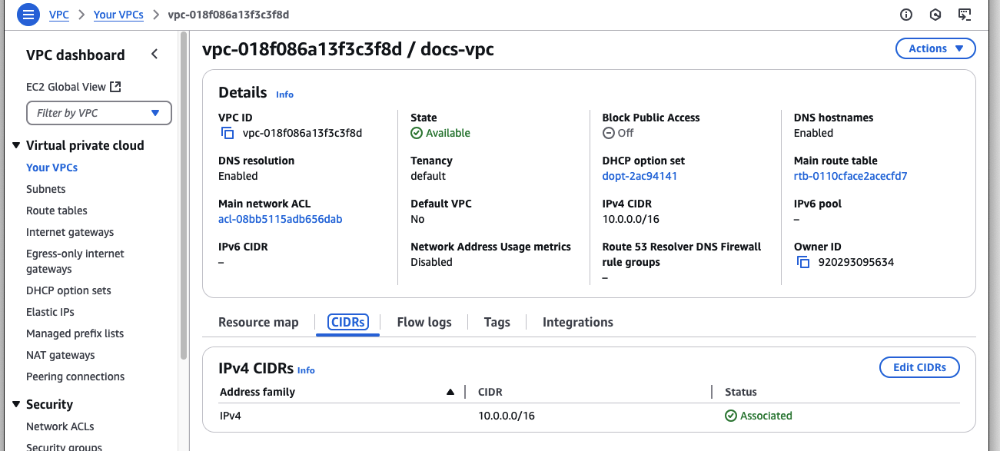

# Amazon Web Services

For AWS customers, Kurrent Cloud allows provisioning an KurrentDB cluster in the same cloud. You can create a cluster in the same region to ensure the lowest latency.

Pre-requisites:
- You have an organization registered in Cloud console
- You can log in to the Cloud console as admin
- Your organization has at least one project
- You are the admin of the project
- A Virtual Private Cloud (VPC) in the AWS account from which the KurrentDB cluster will be accessed
- You have access to AWS resources
    - Read access to VPC details
    - Write access to accept VPC Peering Connection requests for the VPC that will be peered with the Kurrent Cloud network
    - Write access to Route Tables for the subnets that will be used to access the KurrentDB cluster

The provisioning process consists of three steps:
1. Create a network in Kurrent Cloud
2. Provision the KurrentDB instance or cluster
3. Peer the new network with your own AWS network

## Create a cluster

In the Kurrent Cloud console, go to the [project context](../introduction.md#projects) under which you want to create the cluster and switch to **Clusters** view.

Click on the **New cluster** button to begin the cluster creation process.

### Cluster name

Provide a descriptive name for the cluster in the **Cluster name** field.

### Network

In the **Network** section, if you have not created a network yet, you will see fields for creating a new network. If you have any existing Networks, you will see those listed, as well as the option to create a new Network.

When creating a new network, you will need to provide the following information:

- **Network name** is a descriptor to allow you to identify the network in the list of networks.
- **Type** should be set to `Private`.
- **Cloud provider** should be set to AWS.
- **Region** is the AWS region where the cluster will be created.
- **CIDR block** is the new network address range.

As any other cloud network, the CIDR block must be within a range specified by RFC1918, e.g. `10.0.0.0/8`, `172.16.0.0/12`, `192.168.0.0/16`. The minimum size of the CIDR block allowed is `/25`.

::: warning CIDR block overlap
The network address range should not overlap with the address range of any other networks which you will be peering with. Once a network is created, you will not be able to change the CIDR block. To change the CIDR block, you will need to delete the network and create a new one.
:::

### Database

The **Database** section is where you can specify the database settings for the cluster.

You will need to select the **Server Version**, and choose if [server-side projections](@server/features/projections/README.md) should be enabled and what level of projections should be enabled.

::: warning Projections impact on performance
Both system projections and user-defined projections produce new events. Carefully consider the impact of enabled projections on database performance. Please refer to the [Performance impact](@server/features/projections/README.md#performance-impact) section of the projections documentation to learn more.
:::

### Instance size

The next section of the form allows choosing the instance size for cluster nodes. Use the provided [instance size guidelines](../ops/sizing.md) to choose the right size for your cluster. Note that the `F1` size is using burstable VMs, which is not suitable for production use.

::: tip Vertical scaling
If you find that your cluster is not performing as expected, you can always resize the cluster instances later. If you create a three-node cluster, a resize is done in a rolling fashion that should take only a few minutes and not impact the availability of the cluster.
:::

You will also need to specify the topology of the cluster. We recommend three-node clusters to ensure high availability, but you can also create a single-node cluster for testing or development purposes.

### Storage

Now you need to configure the storage for the cluster. For all three providers, only one disk type is available at the moment via the Cloud console. The storage capacity is gigabytes, with 8GiB being the minimum for AWS, and 10GiB for Azure and GCP. Since we allow customers to expand the storage size online without service interruptions, you can start with smaller storage and expand it when you need more capacity.

If you are creating an AWS cluster, you will see the option to specify IOPS and throughput. The default values are the defaults for GP3 volumes, so unless you need extra IOPS or throughput, you can leave the defaults. These values can be changed later.

::: note
The cloud console only allows for the creation of GP3 clusters, but for backwards compatibility purposes it is still possible to create a cluster with GP2 storage using tools such as the Terraform provider or Kurrent Cloud CLI.
:::

### Pricing

Finally, you will see the estimated monthly price for the selected cluster size and storage capacity.

::: note Network usage
Since the network usage is billed based on actual usage, the estimated price will not reflect the full cost of the cluster.
:::

## Provisioning begins

When you click on **Create cluster**, the provisioning process starts. You will be redirected to the cluster details page, where you can follow the progress of the provisioning process. As the creation process progresses, you will see the status of the cluster change.

If you created a new network, it will be created first. You can see the status of the network creation in the **Networks** view.

Once you see the new cluster's status change to `Ok`, your cluster is ready to use, but you still need to setup a peering connection between your AWS VPC and the Kurrent Cloud network.

## Network peering

When the cluster provisioning process finishes, you get a new cluster (or single instance), which is connected to the network selected or created in the first step. You won't be able to connect to the cluster since the network is not exposed to the Internet. In order to get access to the network and consequently to all the clusters in that network, you'd need to peer the Kurrent Cloud network to your own AWS network. Normally, your AWS network would be also accessible by applications, which you want to connect to the new cloud KurrentDB cluster.

For this example, we'll use a VPC in AWS in the same region (`us-east-2`).

If you navigate to the VPC section of the AWS console, then select the VPC you want to setup the peering connection with, you will see a **CIDRs** tab. The information provided in this tab along with the VPC details is enough to start the peering process.

In Kurrent Cloud console, while in the same project context as the new network and cluster, click on **Networks** under the **Networking** section. Select the network you want to peer with the AWS VPC, and click on the **Peerings** tab in the network details. You should see there are no peerings yet. To begin the peering process, click on the **Initiate peering** button.

You will be taken to the peering creation form. Here you can give the new peering a name and provide some details about the AWS VPC with which you would like to initiate the peering connection. The following table will help you identify the values from the AWS console to fill out the form in the Kurrent Cloud Console.

| Peering form        | AWS terminology                             |
|:--------------------|:--------------------------------------------|
| Peer AWS Account ID | Owner ID                                    |
| Peer VPC ID         | VPC ID                                      |
| Peer routes         | One or more IPv4 CIDRs for the selected VPC |
| AWS region          | VPC region (not shown in the VPC details)   |

You can specify more than one route if, for example, you want to peer a VPC with multiple subnets.

### Initiate peering

When you click on the **Initiate peering** button, you'll be redirected back to the **Networks** screen, which should now show the new peering resource being provisioned.

After a few minutes, the Network's status will change to `Peering initiated`.

When the Network's status changes to `Peering initiated`, you can click on the **Peering Connection ID** link to be taken to the **Peering connections** section of the AWS console, where you should see the incoming peering request.

Select the pending peering and click on **Actions** - **Accept request**.

Validate the request details and ensure that all the details match the peering, which you can see in Kurrent Cloud console. If everything is correct, click the **Accept request** button.

After you get a confirmation, you will see the peering in AWS console to become `Active`.

Back in the Kurrent Cloud console, within a few moments the Network status will change to `Available` and the Peering status, under the Network details, will change to `Active`.

Now, although both networks are now connected, AWS does not create the necessary routes for the VPC to reach the Kurrent Cloud network automatically. You will need to add a route for the peering connection to each the route table(s) associated to the subnets that you want to be able to reach the Kurrent Cloud clusters.

To finish the setup, open the AWS VPC details and then click on the **Resource map** tab. There you will see a list of **Subnets** and **Route tables**.

From the Resource map, click on the link to the Route table for the subnet(s) you want to be able to reach the Kurrent Cloud clusters.

Click on **Edit routes** and then **Add route**. In the **Destination** field, enter the CIDR of the Kurrent Cloud network. For the **Target**, choose the **Peering Connection** option. The list of available peering connections will pop up. Select the recently created peering from the list and click on **Save changes**.

Once saved, the route table should look similar to this:

If you are using one or more subnets associated to this VPC, make sure you update the routing table for all of them, not only on the main route table of the VPC.

::: tip Peering issues
You might see the peering request getting stuck. There are several reasons for this to happen, like your cloud account quota or overlapping CIDR blocks. Check the Event Console in the Cloud console for diagnostic details, and contact support if you need assistance.
:::

At this point, you should be able to connect to the KurrentDB cluster in the cloud from any VM or application connected to your AWS VPC network.

Depending on your setup, you might already have a connection available from your local machine to the AWS VPC using a site-to-site VPN. If not, ask your AWS administrator about the connection details, which could be a Virtual Private Gateway or Client VPN Endpoint.

## Next steps

You are now ready to start using the new KurrentDB cluster in the cloud. Head over to the [Operations](../ops/README.md#connecting-to-a-cluster) page to learn how to connect to your cluster.
