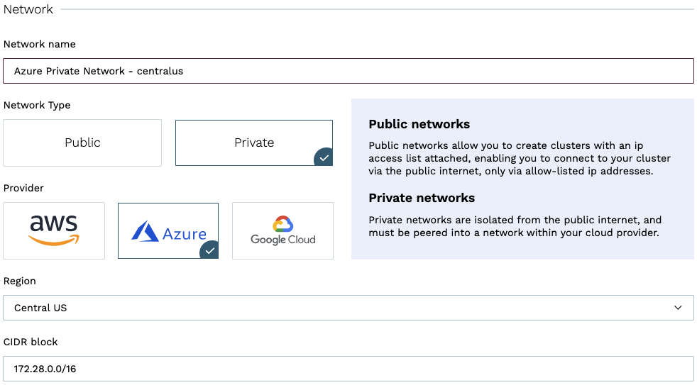
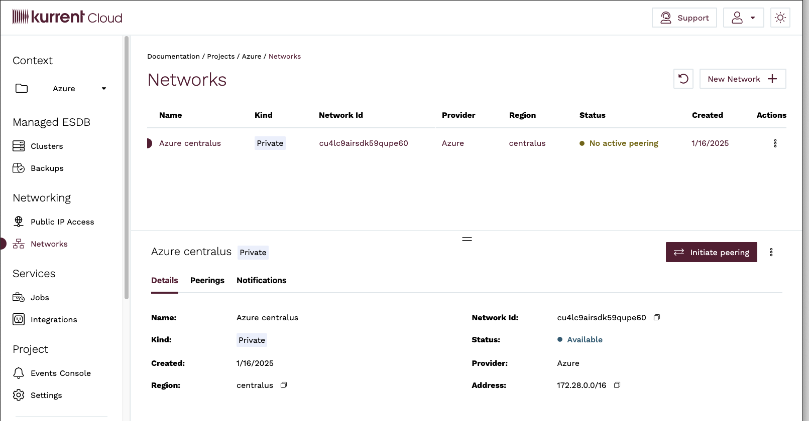
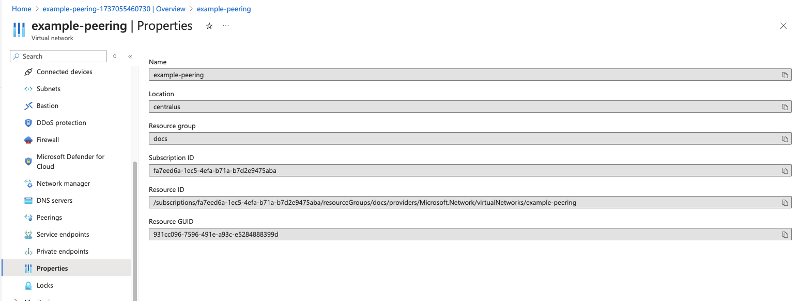
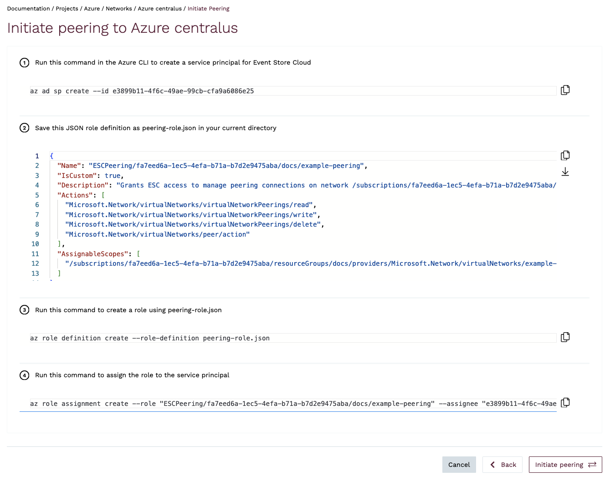
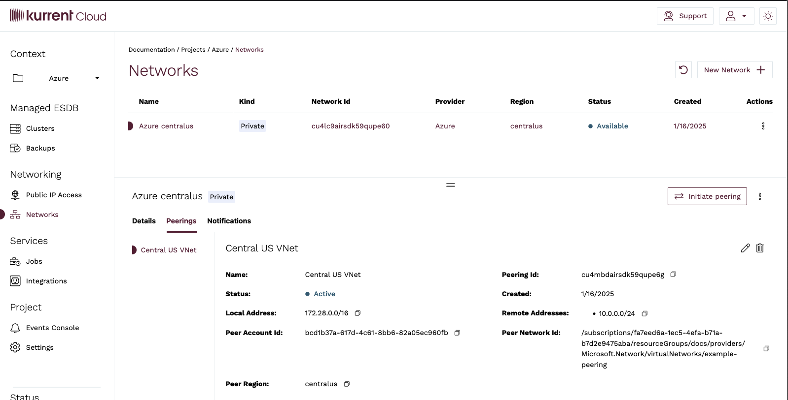

# Microsoft Azure

For Microsoft Azure customers, Kurrent Cloud allows provisioning an KurrentDB cluster in the same cloud. You can create a cluster in the same region to ensure the lowest latency.

::: warning Azure considerations
Microsoft Azure has a few nuances that must be considered when using Kurrent Cloud with Azure. We listed all currently known limitations [below on this page](#considerations-for-microsoft-azure). Please ensure you are aware of them before starting to use KurrentDB in Azure.
:::

Pre-requisites:
- You have an organization registered in Cloud console
- You can log in to the Cloud console as admin
- Your organization has at least one project
- You are the admin of the project
- A Virtual Network in the Azure subscription from which the KurrentDB cluster will be accessed
- You have the Azure CLI installed and logged in to your Azure subscription
- You have access to create resources in the Azure subscription that will be used to access the KurrentDB cluster
    - Service principal for the Kurrent Cloud application
    - Role assignments for the service principal to grant access to create a Virtual Network Peering for the Virtual Network that will be peered with the Kurrent Cloud network

The provisioning process consists of three steps:
1. Create a network in Kurrent Cloud
2. Provision the KurrentDB instance or cluster
3. Peer the new network with your own Azure network

## Create a cluster

In the Kurrent Cloud console, go to the [project context](../../introduction.md#projects) under which you want to create the cluster and switch to **Clusters** view.

Click on the **New cluster** button to begin the cluster creation process.

### Cluster name

Provide a descriptive name for the cluster in the **Cluster name** field.

### Network

In the **Network** section, if you have not created a network yet, you will see fields for creating a new network. If you have any existing Networks, you will see those listed, as well as the option to create a new Network.

When creating a new network, you will need to provide the following information:

- **Network name** is a descriptor to allow you to identify the network in the list of networks.
- **Type** should be set to `Private`.
- **Cloud provider** should be set to Azure.
- **Region** is the AWS region where the cluster will be created.
- **CIDR block** is the new network address range.

As any other cloud network, the CIDR block must be within a range specified by RFC1918, e.g. `10.0.0.0/8`, `172.16.0.0/12`, `192.168.0.0/16`. The minimum size of the CIDR block allowed is `/25`.

::: warning CIDR block overlap
The network address range should not overlap with the address range of any other networks which you will be peering with. Once a network is created, you will not be able to change the CIDR block. To change the CIDR block, you will need to delete the network and create a new one.
:::

### Database

The **Database** section is where you can specify the database settings for the cluster.

You will need to select the **Server Version**, and choose if [server-side projections](@server/features/projections/README.md) should be enabled and what level of projections should be enabled.

::: warning Projections impact on performance
Both system projections and user-defined projections produce new events. Carefully consider the impact of enabled projections on database performance. Please refer to the [Performance impact](@server/features/projections/README.md#performance-impact) section of the projections documentation to learn more.
:::

### Instance size

The next section of the form allows choosing the instance size for cluster nodes. Use the provided [instance size guidelines](../../ops/sizing.md) to choose the right size for your cluster. Note that the `F1` size is using burstable VMs, which is not suitable for production use.

::: tip Vertical scaling
If you find that your cluster is not performing as expected, you can always resize the cluster instances later. If you create a three-node cluster, a resize is done in a rolling fashion that should take only a few minutes and not impact the availability of the cluster.
:::

You will also need to specify the topology of the cluster. We recommend three-node clusters to ensure high availability, but you can also create a single-node cluster for testing or development purposes.

### Storage

Now you need to configure the storage for the cluster. For all three providers, only one disk type is available at the moment via the Cloud console. The storage capacity is gigabytes, with 8GiB being the minimum for AWS, and 10GiB for Azure and GCP. Since we allow customers to expand the storage size online without service interruptions, you can start with smaller storage and expand it when you need more capacity.

### Pricing

Finally, you will see the estimated monthly price for the selected cluster size and storage capacity.

::: note Network usage
Since the network usage is billed based on actual usage, the estimated price will not reflect the full cost of the cluster.
:::

## Provisioning begins

When you click on **Create cluster**, the provisioning process starts. You will be redirected to the cluster details page, where you can follow the progress of the provisioning process. As the creation process progresses, you will see the status of the cluster change.

If you created a new network, it will be created first. You can see the status of the network creation in the **Networks** view.

Once you see the new cluster's status change to `Ok`, your cluster is ready to use, but you still need to setup a peering link between your Azure Virtual Network and the Kurrent Cloud network.

## Network peering

When the cluster provisioning process finishes, you get a new cluster (or single node), which is connected to the network created in the first step. You won't be able to connect to the cluster since the network is not exposed to the Internet. In order to get access to the network and consequently to all the clusters in that network, you'd need to peer the Kurrent Cloud Network to your own Azure Virtual Network where your applications are running.

For this example, we'll use an Azure network the same region (Central US).

In Kurrent Cloud console, navigate to the **Networks** view and click on the Private Network you want to setup a peering link for and click on the **Initiate peering** button.

### Azure Virtual Network details

You will need to gather the following information about your Azure Virtual Network:

| Field           | Description                                                                       |
|:----------------|:----------------------------------------------------------------------------------|
| Peer Tenant ID  | Tenant ID from Azure AD                                                           |
| Peer Network ID | Network resource ID (can be found on the network Properties page or in JSON view) |
| Azure region    | Network region, cannot be changed                                                 |
| Peer routes     | One or more IP ranges for the selected VPC                                        |

You also need to find your tenant ID, which is only visible on the [Microsoft Entra admin center page](https://entra.microsoft.com/#view/Microsoft_AAD_IAM/TenantOverview.ReactView). Alternatively, you can use the `Get-AzureADTenantDetails` [PowerShell command](https://docs.microsoft.com/en-us/powershell/module/azuread/Get-AzureADTenantDetail?view=azureadps-2.0).

Peer Network ID is the one that requires the most attention, because it's not very obvious how to find it. You can find it in the Azure portal, in the Virtual Network's properties page or in the JSON view of the network.

For our example, here is the complete form:

### Initiate peering

When you click on the `Next` button, Kurrent Cloud will check if it has permissions to create the peering (see [Azure Considerations](#network-peering-in-azure)). The Cloud console will display a set of pre-populated Azure CLI commands, which you need to execute in order for Kurrent Cloud to be able to create the peering.

::: tip Service principal
Kurrent Cloud uses one service principal. It means that once you created it, the principal will be used for all the peerings you create. Therefore, you only need to execute the command `az ad sp create` once.
:::

After completing all those commands, click on the `Initiate peering` button. You'll be redirected to the Networks view.

If you select the Private Network, in the Network Details section, click on "Peerings". You will see a list of peerings that have been created for that Network. You should see the peering you just created in the list. After a little while, the status will change to `Intiated`.

::: tip Peering issues
If the status doesn't change after 10 minutes, delete the peering and try again, ensuring the details were entered correctly. Mismatching network region and address range are the most common reasons for the peering to not being provisioned properly.
:::

In a short while, the peering status in the Kurrent Cloud console should change to `Active`.

If you want to check the status of the peering in Azure, go back to Virtual Network in the Azure Portal and navigate to the `Peering` blade. There, you will see the newly provisioned peering, which should have `Connected` in the `Peering status` column.

::: tip Peering issues
You might see the peering request getting stuck. There are several reasons for this to happen, such as entering the incorrect region, overlapping CIDR blocks, or provider quota issues. You can find all the necessary diagnostics in the Event Console in Kurrent Cloud.
:::

You should now be able to connect to the KurrentDB cluster in the cloud from systems and applications that are connected to your Azure network.

## Next steps

You are now ready to start using the new KurrentDB cluster in the cloud. Head over to the [Operations](../../ops/README.md#connecting-to-a-cluster) page to learn how to connect to your cluster.

## Considerations for Microsoft Azure

Due to differences between Microsoft Azure and other cloud providers, the provisioning process in Kurrent Cloud is different from AWS and GCP. We've made a list of these differences here in order to help you make an informed decision about Cloud providers.

### Network peering in Azure

When creating a peering link, Azure requires the user to configure a security principal, referencing the application ID of Kurrent Cloud, and also configure and apply a role allowing that principal to modify the network resource of the remote network.

### Disk

We're aware that Azure Premium SSD volumes have a strict IOPS limit and this limit depends on the volume size. Very small volumes do not provide enough throughput for most production scenarios. We suggest you consider using at least 246 GiB disks to get enough IOPS for the database. You can check the current throughput limits for Azure Premium SSD volumes in [Azure documentation](https://docs.microsoft.com/en-us/azure/virtual-machines/disks-types#premium-ssd).
