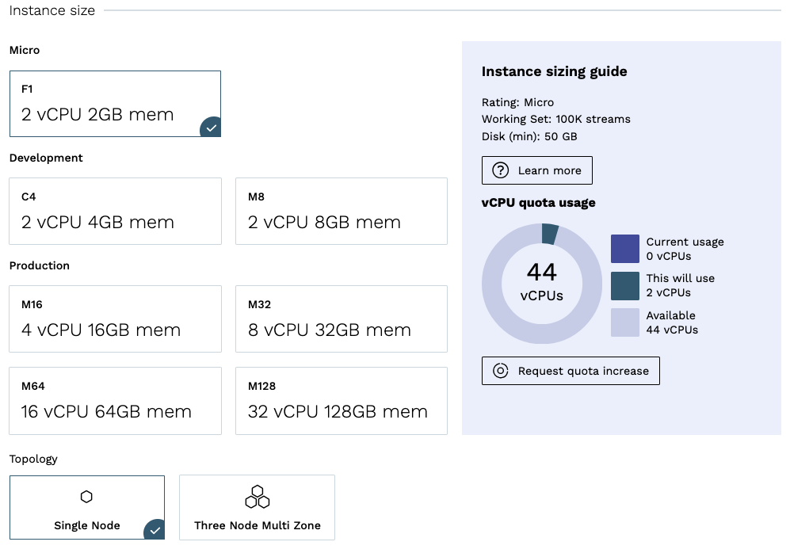
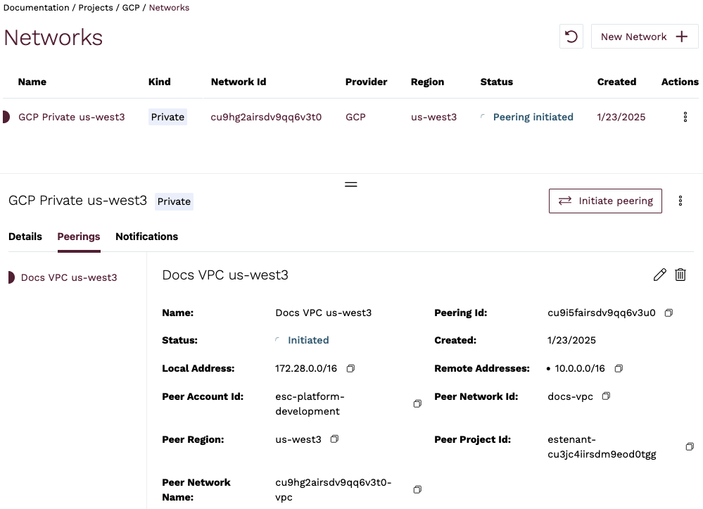

# Google Cloud Platform

For Google Cloud customers, Kurrent Cloud allows provisioning an KurrentDB cluster in the same cloud. You can create a cluster in the same region to ensure the lowest latency.

Pre-requisites:
- You have an organization registered in Cloud console
- You can log in to the Cloud console as admin
- Your organization has at least one project
- You are the admin of the project
- You have access to create Google Cloud resources in the GCP project of your organization

The provisioning process consists of three steps:
1. Create a network in Kurrent Cloud
2. Provision the KurrentDB instance or cluster
3. Peer the new network with your own network in GCP

## Create a cluster

In the Kurrent Cloud console, go to the [project context](../../introduction.md#projects) under which you want to create the cluster and switch to **Clusters** view.

Click on the **New cluster** button to begin the cluster creation process.

### Cluster name

Provide a descriptive name for the cluster in the **Cluster name** field.

### Network

In the **Network** section, if you have not created a network yet, you will see fields for creating a new network. If you have any existing Networks, you will see those listed, as well as the option to create a new Network.

When creating a new network, you will need to provide the following information:

- **Network name** is a descriptor to allow you to identify the network in the list of networks.
- **Type** should be set to `Private`.
- **Cloud provider** should be set to `Google Cloud`.
- **Region** is the GCP region where the cluster will be created.
- **CIDR block** is the new network address range.

As any other cloud network, the CIDR block must be within a range specified by RFC1918, e.g. `10.0.0.0/8`, `172.16.0.0/12`, `192.168.0.0/16`. The minimum size of the CIDR block allowed is `/25`.

::: warning CIDR block overlap
The network address range should not overlap with the address range of any other networks which you will be peering with. Once a network is created, you will not be able to change the CIDR block. To change the CIDR block, you will need to delete the network and create a new one.
:::

### Database

The **Database** section is where you can specify the database settings for the cluster.

You will need to select the **Server Version**, and choose if [server-side projections](@server/features/projections/README.md) should be enabled and what level of projections should be enabled.

::: warning Projections impact on performance
Both system projections and user-defined projections produce new events. Carefully consider the impact of enabled projections on database performance. Please refer to the [Performance impact](@server/features/projections/README.md#performance-impact) section of the projections documentation to learn more.
:::

### Instance size

The next section of the form allows choosing the instance size for cluster nodes. Use the provided [instance size guidelines](../ops/sizing.md) to choose the right size for your cluster. Note that the `F1` size is using burstable VMs, which is not suitable for production use.

::: tip Vertical scaling
If you find that your cluster is not performing as expected, you can always resize the cluster instances later. If you create a three-node cluster, a resize is done in a rolling fashion that should take only a few minutes and not impact the availability of the cluster.
:::

You will also need to specify the topology of the cluster. We recommend three-node clusters to ensure high availability, but you can also create a single-node cluster for testing or development purposes.

### Storage

Now you need to configure the storage for the cluster. For all three providers, only one disk type is available at the moment via the Cloud console. The storage capacity is gigabytes, with 8GiB being the minimum for AWS, and 10GiB for Azure and GCP. Since we allow customers to expand the storage size online without service interruptions, you can start with smaller storage and expand it when you need more capacity.

### Pricing

Finally, you will see the estimated monthly price for the selected cluster size and storage capacity.

::: note Network usage
Since the network usage is billed based on actual usage, the estimated price will not reflect the full cost of the cluster.
:::

## Provisioning begins

When you click on **Create cluster**, the provisioning process starts. You will be redirected to the cluster details page, where you can follow the progress of the provisioning process. As the creation process progresses, you will see the status of the cluster change.

If you created a new network, it will be created first. You can see the status of the network creation in the **Networks** view.

Once you see the new cluster's status change to `Ok`, your cluster is ready to use, but you still need to setup a peering link between your GCP Virtual Network and the Kurrent Cloud network.

## Network peering

When the cluster provisioning process finishes, you get a new cluster (or single instance), which is connected to the network created in the first step. You won't be able to connect to the cluster since the network is not exposed to the Internet. In order to get access to the clusters in the new Network, you must configure a peering link between your GCP VPC network and the Kurrent Cloud network. Besides services running on compute instances, your GCP VPC network would also be accessible by applications that you may want to connect to the new cloud KurrentDB cluster.

For this example, we'll use a VPC network in GCP in the same region (`us-west3`).

In Kurrent Cloud console, while in the same project context as the new network and cluster, click on **Networks** under the **Networking** section. Select the network you want to peer with the GCP VPC, and click on the **Peerings** tab in the network details. You should see there are no peerings yet. To begin the peering process, click on the **Initiate peering** button.

### GCP VPC details

You will need to gather the following information about your GCP VPC network:

| Field               | Description                           |
|:--------------------|:--------------------------------------|
| Peer GCP Project ID | GCP project ID                        |
| Peer Network Name   | The VPC name                          |
| GCP region          | VPC subnet region, cannot be changed  |
| Peer routes         | One or more VPC subnet address ranges |

To find the GCP project ID, in the [Google Cloud Console](https://console.cloud.google.com/), click on the project selector in the top left corner, and select the project that contains the VPC you want to peer with.

For our example, here is the complete form:

::: note
Multiple peer routes are useful in case you want to peer with a subnet that has multiple IP ranges (aliases). A typical example would be if you have a VPC-native GKE cluster, and you need pods in that cluster to work with Kurrent Cloud. Then, you need to add the pod IP range to the peer route in addition to the subnet's primary IP range.
:::

::: warning
After you create a peering, you can't change the peer routes. If you would need to modify the routes, delete the peering and create it again with the updated set of peer routes. The limitation applies even in cases where a cloud provider supports dynamic route updates, e.g. in GCP. The reason is that the EventStore automation creates firewall rules for the peer routes when the peering is created. The firewall rules are not updated dynamically to prevent security breaches.
:::

### Initiate peering

When you click on the **Initiate peering** button, you'll be redirected back to the **Networks** screen, which should now show the new peering resource being provisioned.

After a few minutes, the Network's status will change to `Peering initiated`.

The information on the **Peerings** tab of the **Network details** section provides some essential information to complete the peering process from GCP side.

Go back to Google Cloud console and navigate to **VPC network peering** tab of the VPC network you want to peer with, then click **Add Peering**.

Give the new peering a name and fill out the values using the initiated peering details from the Kurrent Cloud console:

| Kurrent Cloud     | GCP connection peering |
|:------------------|:-----------------------|
| Peer Project ID   | Project ID             |
| Peer Network Name | VPC network name       |

**Important**: under the **Exchange custom routes** section, enable both **Import** and **Export custom routes** options. This will instruct GCP to create routes automatically.

Here is what our example GCP peering form would look like:

Click the **Create** button, which will return you to the **VPC network peering** list. Shortly after, the peering status should change to `Active`.

The peering status in Kurrent Cloud console should also change to `Active`.

::: tip Peering issues
You might see the peering request getting stuck. There are several reasons this happen, such as cloud account quota or overlapping CIDR blocks. Check the Event Console in the Cloud console for diagnostic details, and contact support if you need assistance.
:::

At this point, you should be able to connect to the KurrentDB cluster in the cloud from any VM or application connected to your GCP VPC network.

Depending on your setup, you might already have a connection available from your local machine to the GCP VPC using a site-to-site VPN. If not, ask your operations team about the connection details.

### Next steps

You are now ready to start using the new KurrentDB cluster in the cloud. Head over to the [Operations](../ops/README.md#connecting-to-a-cluster) page to learn how to connect to your cluster.
