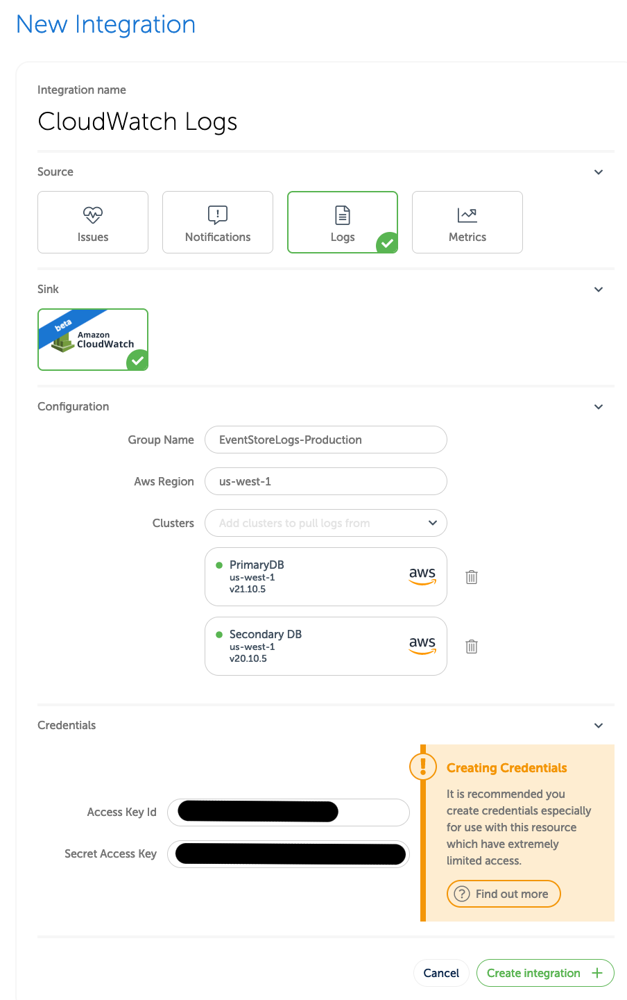
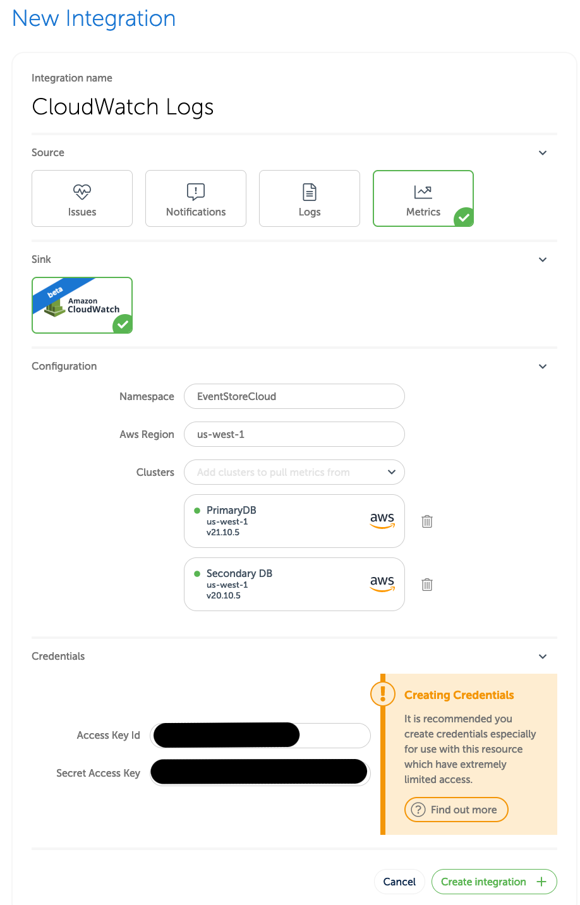
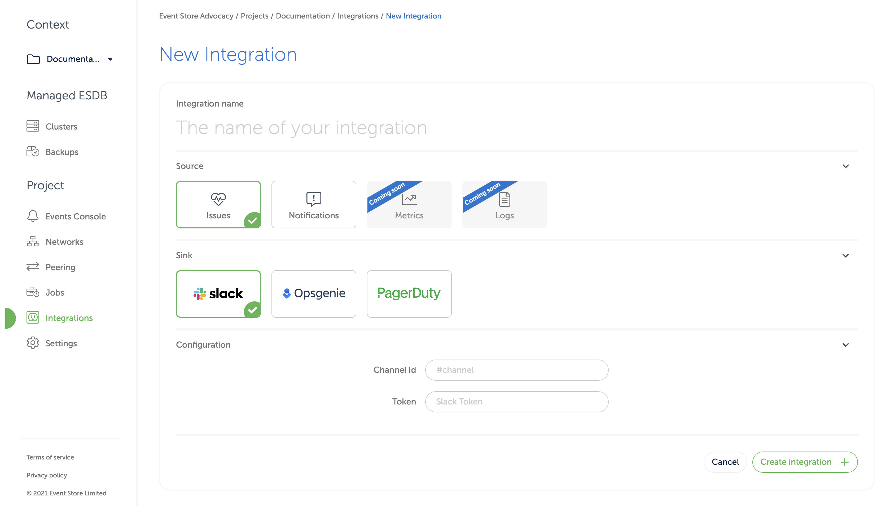
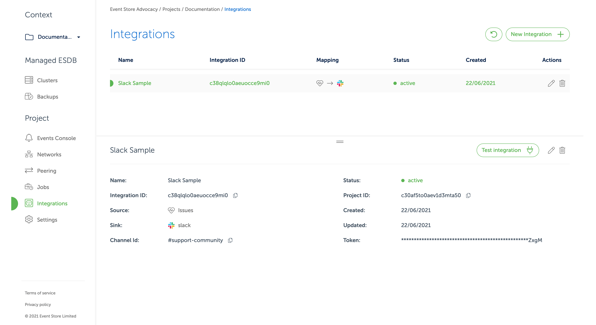
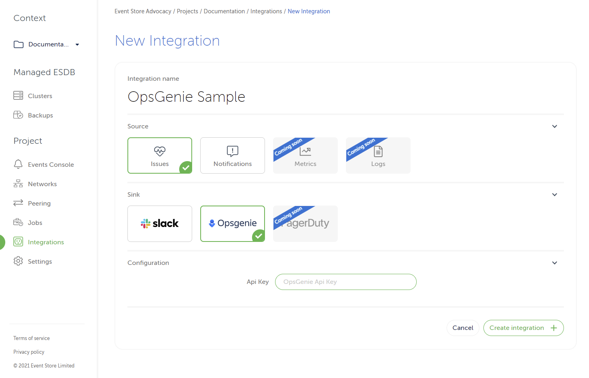
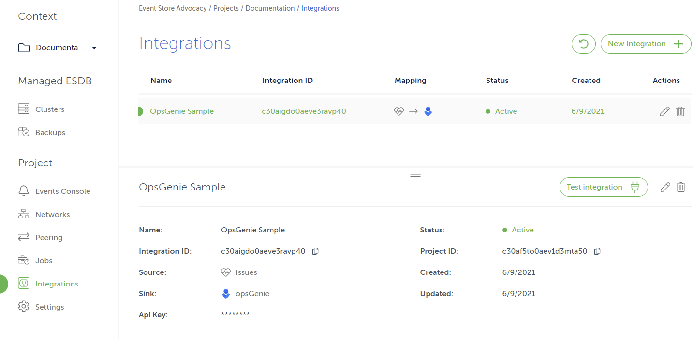

# Integrations

Event Store Cloud offers integrations between internal sources such as cluster health, [issue](#issues) detection, [notifications](#notifications) events, EventStore DB [logs](#logs), EventStore DB [metrics](#metrics) and sinks which include external services such as Slack and Amazon CloudWatch.

## Integration sources

"Sources" are driven by events or other mechanism inside the Event Store Cloud.

Currently, supported sources include:

* [Issues](#issues) - issues represent a potentially problematic condition detected inside a cluster or other Event Store Cloud resource. Issues consist of multiple "open" events and a single "closed" event and have different levels of severity.

* [Logs](#logs) - these are the logs generated by EventStore DB itself.

* [Metrics](#metrics) - these are the metrics generated by both EventStore Cloud issue detection processes running on each cluster node and EventStore DB itself.
  
* [Notifications](#notifications) - notifications are noteworthy events detected within Event Store Cloud resources or the backend. For example notifications may be emitted when a cluster fails to provision.
 
### Issues

Issues represent possibly problematic states detected within the Event Store Cloud. Below, you can find several issue examples.

::: note
These examples are a subset of issues created by the system. The exact details of why issues are created are subject to change, but the cause of the issue and steps to resolve it will be clear in the messages associated with the related events.
:::

#### Core load count

For each node of a cluster, the core load average is measured and divided by the number of physical cores on the node. If the result exceeds 2.0 an issue is opened. This issue is closed when the result consistently dips under 2.0.

If this happens consider increasing the size of the instance type for the cluster.

#### Disk usage

For each node of a cluster, the disk usage is measured several times a minute. If it starts to consistently exceed 80% an issue is opened. The issue is closed when the usage drops below 80%.

If this happens consider either removing data, running scavenge or increasing the disk size for the cluster.

#### Memory usage

For each node of a cluster, the memory usage is measured several times a minute. If it exceeds 90% an issue is opened. The issue is closed when memory usage consistently drops below 90%.

If this happens consider increasing the size of the instance type for the cluster.

#### Cluster consensus

Every node on a cluster has it's gossip status queried twice each minute. An issue is opened if either the query fails or if the reported gossip state for each node is not identical on a multi-node cluster.

The issue closes when the gossip status again returns expected values.

### Elections

For a cluster, an issue is opened if there is more than one leader change per hour. The issue closes only if there is no more
than one leader change in the hour following the first detection.

### Leader Mismatches

For a cluster, an issue is opened if the cluster disagrees on which node is the current leader in a three minutes time window.
The issue closes if the cluster agrees on which node is the leader one minute after the first detection.

### Out of Syncs

For a cluster, an issue is opened if at least one follower node hasn't caught up with the leader node progression from two seconds ago, over a three minutes time window. The issue closes if all the followers are keeping up with the leader node progression over a three minutes time window, after the first detection.

### Unreachable Nodes

For each node of the cluster, if one node is not reachable from another one over a three minutes time window. The issue closes
if all nodes are reachables after a three minutes time window, after the first detection.

### Notifications

Notifications represent noteworthy events which occur within the Event Store Cloud. Below you can find notifications examples.

::: note
The following represent a subset of events which can lead to notifications.
:::

#### Cluster provisioning failure

If, for some reason, the instances backing a cluster fail to provision the resource is marked as defunct by the API and a notification is sent with the message `Cluster instances failed to provision`.

#### Volume expansion failure

If the volume fails to expand while expanding an instances size a notification event is created with the message `Cluster volumes failed to provision`.

### Logs

::: note
Logs are currently in beta. The data coming from this source may change over time.
:::

Logs are sent in the form of JSON objects. Each object's "message" field contains the original structured event from EventStore DB itself.

### Metrics

::: note
Logs are currently in beta. The data coming from this source may change over time.
:::

Metrics are name / value pairs generated by EventStore DB itself as well as detection processes running on the host.


## Integration sinks

"Sinks" are services outside the Event Store Cloud which events from sources can be forwarded to.

* [AwsCloudWatchLogs](#aws-cloudwatch-logs-sink) - **BETA** Amazon CloudWatch allows you to track metrics, display them with create custom dashboards, and create alarms from them.

* [AwsCloudWatchMetrics](#aws-cloudwatch-metrics-sink) - **BETA** Amazon CloudWatch allows for logs to be uploaded, viewed and searched, and consumed by other AWS services.

* [OpsGenie](#opsgenie-sink) - OpsGenie is an alerting and incidence response tool. It is possible to set up integrations to create OpsGenie alerts when cluster health issues are detected.

* [Slack](#slack-sink) - Slack is a communication platform. It is possible to set up integrations which send Slack messages when issues and notifications are created or updated.

### Amazon CloudWatch Logs sink

::: note
The AwsCloudWatchLogs sink is currently in closed beta and may change over time. To access it, please contact support.
:::

Amazon CloudWatch is a monitoring service. The "logs" portion of its functionality is separated into it's own integration in EventStore Cloud for ease of use.

You can cause all of the logs generated by each EventStore DB running in your clusters by creating a custom Amazon CloudWatch log group, an IAM user, and setting up an integration as described below.

::: note
If you're using Terraform, instructions on how to perform the steps below can be found [here](https://github.com/EventStore/terraform-provider-eventstorecloud/blob/trunk/docs/resources/integration_awscloudwatch_logs.md#example-usage).
:::

#### Create new AWS resources

##### Create a CloudWatch Log group

In the AWS console, go to the `CloudWatch` page. 

Make sure the region you'd like to use is selected in the upper right corner (this will ideally be the same region used by the EventStore Cloud clusters you'll be using as the source). 

In the left sidebar, expand `Logs` and click `Log groups`. Then click on the button labeled `Create log group`.

Enter a log group. If you have multiple projects it could be a good idea to include it in the name, such as `EventStoreLogs-Production`.

Select a retention policy depending on your needs, any tags if necessary, and then click create. 

Now find the new log group in the list, and click on it. The next page will show you it's details, including the ARN. Copy it for the next step.

##### Create appropriate credentials

::: note
You should create dedicated credentials for use with the EventStore Cloud integration that only have access to the CloudWatch Log group, as shown here.
:::

In the AWS console, go to the `IAM` homepage. 

In the sidebar, click on `Users`, and then on the button labeled `Add users`.

Enter an appropriate name, select the AWS credential type `Access key`, and then click the next button.

Under set permissions, select "Attach existing policies directly". Don't click on "create policy". 

Now click the next button until you get to the page titled "Review." Give the policy an appropriate name and click "Create user".

At this point copy the access key ID and secret access key as you'll need them later. Then click "close"

You should now see the users list again. Click on the newly created user.

Under the `Permissions` table click "Add inline policy".

On the "Create Policy" screen, click the tab labeled `JSON`, and then enter the following:

```json
{
  "Version": "2012-10-17",
  "Statement": [
    {
      "Action": [
        "logs:DescribeLogGroups"        
      ],
      "Effect": "Allow",
      "Resource": "${DescribeARN}"
    },
    {
      "Action": [        
        "logs:CreateLogStream",
        "logs:DescribeLogStreams",
        "logs:PutLogEvents"
      ],
      "Effect": "Allow",
      "Resource": "${ARN}:*"
    }    
  ]
}
```

Now make two replacements:

* Replace `${ARN}` with the ARN you copied when you create the CloudWatch Log group in the previous step
* For `${DescribeARN}`, take the ARN and remove the last part before the asterisk. So for example, if the ARN is `arn:aws:logs:us-west-2:123456789012:log-group:EventStoreLogs-Production:*"` you'll want this value to be `arn:aws:logs:us-west-2:123456789012:log-group:*"`.

Click on Review policy. As you can see, the recommended policy will ultimately give the integration permission to describe the log groups in your account and write to the newly create log group.

Give the policy some appropriate name, and click on "Create policy".

#### Add a new AwsCloudWatchLogs integration in the EventStore Cloud

1. In the Event Store Cloud console, select an organization and then a project.
2. Once viewing a project, you should see `Integrations` under the heading `Project` in the sidebar to the left. Click it.
3. Click `New Integration`. Enter a name that will make it easier to find later, and then select Logs. Next select the Sink `AwsCloudWatchLogs` as in the screen below.

::: card

:::

4. Under `Configuration`, by `Group Name` enter the name of the CloudWatch group you created earlier (for example, `EventStoreLogs-Production`).
5. Under `Configuration`, by `Aws Region` enter the AWS region of the CloudWatch group you created earlier.
6. Under `Configuration`, by `Clusters` select one or more clusters whose logs you want sent to the CloudWatch group.
7. Under `Credentials` enter Access Key Id which was shown when you created the IAM user earlier.
8. Under `Credentials` enter Secret Access Key which was shown when you created the IAM user earlier.


#### Testing the integration

Log integration with EventStore Cloud will take a few minutes to be fully active

If you're making sure the integration is set up correctly it's a good idea to write a few test events to the cluster. Clusters which are seeing no activity (such as dev or test clusters) will sometimes emit no logs at all.

Additionally the EventStore Cloud lacks a way to assert if the IAM credentials are valid. If no new logs appears in your Amazon CloudWatch group, please double check that the credentials given to the integration are correct and that the IAM user has the appropriate permissions.

### Amazon CloudWatch Metrics sink

::: note
The AwsCloudWatchMetrics sink is currently in closed beta and may change over time. To access it, please contact support.
:::

Amazon CloudWatch is a monitoring service. The "metrics" portion of its functionality is separated into its own integration in EventStore Cloud for ease of use.

You can cause all of the metrics generated by each EventStore DB running in your clusters by creating a custom IAM user and setting up an integration as described below.

:::note 
If you're using Terraform, instructions on how to perform the steps below can be found [here](https://github.com/EventStore/terraform-provider-eventstorecloud/blob/trunk/docs/resources/integration_awscloudwatch_metrics.md#example-usage).
:::

#### Create new AWS IAM resources

::: note
You should create credentials especially for use with the EventStore Cloud integration which only have permission to perform the `cloudwatch:PutMetricData` action on a small set of namespaces, as shown here.
:::

First, decide what namespace you want your EventStore DB metrics to appear under. A decent choice could be simply "EventStoreCloud".

In the AWS console, go to the `IAM` homepage. 

In the sidebar, click on `Users`, and then on the button labeled `Add users`.

Enter an appropriate name, select the AWS credential type `Access key`, and then click the next button.

Under set permissions, select "Attach existing policies directly". Don't click on "create policy". 

Now click the next button until you get to the page titled "Review." Give the policy an appropriate name and click "Create user".

At this point copy the access key ID and secret access key as you'll need them later. Then click "close"

You should now see the users list again. Click on the newly created user.

Under the `Permissions` table click "Add inline policy".

On the "Create Policy" screen, click the tab labeled `JSON`, and then enter the following:

```json
{
  "Version": "2012-10-17",
  "Statement": [
    {
      "Action": [
        "cloudwatch:PutMetricData"        
      ],
      "Effect": "Allow",
      "Resource": "*",
      "Condition": {
          "ForAnyValue:StringEqualsIgnoreCase": {
                "cloudwatch:namespace": [
                    "EventStoreCloud",
                    "EventStoreCloud/eventstoredb",
                    "EventStoreCloud/host"
                ]
            }
        }
    }        
  ]
}
```

If you want to use a namespace other than `EventStoreCloud`, simply replace it in the policy above.

Click on Review policy.

Give the policy some appropriate name, and click on "Create policy".

#### Add a new AwsCloudWatchMetrics integration

1. In the Event Store Cloud console, select an organization and then a project.
2. Once viewing a project, you should see `Integrations` under the heading `Project` in the sidebar to the left. Click it.
3. Click `New Integration`. Enter a name that will make it easier to find later, and then select Logs. Next select the Sink `AwsCloudWatchMetric` as in the screen below.

::: card

:::

1. Under `Configuration`, by `Namespace` enter the namespace you decided on earlier (for example, `EventStoreLogs-Production`).
2. Under `Configuration`, by `Aws Region` enter the AWS region that matches the clusters you'll be pulling from.
3. Under `Configuration`, by `Clusters` select one or more clusters whose metrics you want sent to CloudWatch.
4. Under `Credentials` enter Access Key Id which was shown when you created the IAM user earlier.
5. Under `Credentials` enter Secret Access Key which was shown when you created the IAM user earlier.


#### Testing the integration

Metrics integration with EventStore Cloud will take a few minutes to be fully activate

Metrics will typically appear after that without any action on your part. 

Additionally the EventStore Cloud lacks a way to assert if the IAM credentials are valid. If no metrics appear under the given namespace in CloudWatch, please double check that the credentials given to the integration are correct and that the IAM user has the appropriate permissions.

### Slack sink

Slack is a business communications platform.

You can be notified of new events and notifications in your Slack workspace by creating a Slack App and setting up an integration as described below.

#### Setup Slack

Before adding a Slack integration, you need to create a Slack App and obtain a token through slack.com.

1. Go to `https://api.slack.com/apps` and click `Create New App`. Give it any name you wish and select the target workspace, then click `Create App`.
2. On the next screen, click on `OAuth & Permissions`. Under `Scopes`, `Bot Token Scopes` and add a scope of `chat:write`.
3. At the top of the page, click `Install to Workspace`.
4. After installing the app, the `OAuth & Permissions` page will have a `Bot User OAuth Token` shown at the top. Copy it for the next step.
5. Finally, you'll need to invite the Slack app user to the channel you want it to chat with. In Slack, go to the appropriate channel and write the following:

```
/invite @<name of bot>
```

#### Add a new Slack integration

1. In the Event Store Cloud console, select an organization and then a project.
2. Once viewing a project, you should see `Integrations` under the heading `Project` in the sidebar to the left. Click it.
3. Click `New Integration`. Enter a name that will make it easier to find later, and then select Issues or Notifications. Then select the Sink `Slack` as in the screen below.

::: card

:::

4. Under `Configuration`, next to `Channel ID`, enter the channel you want the slack bot to communicate with (this must be the same as the place you invited the bot earlier). Remember to start the channel ID with a hash sign if appropriate.
5. In the box next to `Token` enter the OAuth token you copied from Slack's website.
6. Finally, click "Create Integration."
7. Now back at the "Integrations" page, click on the row with recently created integration. In the bottom pane you should see a button marked `Test integration` as in the screen below. Click it.

::: card

:::

8. If your Slack App was created correctly you should see a test message in the channel you selected.
9. If you get an error message double check that you copied the OAuth token and Channel ID into the integration correctly. You may also wish to review the previous step to ensure you gave the app appropriate permissions. You can edit the integration by clicking on the pencil icon in its row.
10. If you see a Slack message, you can rest you will receive events from the configured source when they occur.

#### Details

If the source is `Notifications`, a single message will be sent to the configured slack bot for each notification.

If the source is `Issues`, a single message will be sent for each open issue and given a red bar. Open issues receive new events continuously, however the original Slack message will only be updated to reflect the latest event every five minutes.

When the issue is closed, the original message will be changed to reflect this, and the bar will be changed to green.

In order to send messages to multiple channels, create more integrations in Event Store Cloud using the same credentials.

### OpsGenie sink

EventStore Cloud platform is using [OpsGenie] for its alerting system. Our minimal configuration requires an API key. For simplicity’ sake, we recommend the API key to belong to a responder team.

Those instructions assume you are starting from scratch and don't have a team set up yet. We also assume that you are currently on the landing page after logging in [OpsGenie].

#### Create a team in OpsGenie

Log in to your OpsGenie instance, then complete the following steps to set up a new team. Skip this step if you already have a team.

1. Click on the `Teams` tab up top.
2. Click on the `Add team` top left.
3. A popup should show up. Enter your team info like its name and members. Keep in mind that the team will be considered as the responder team in EventStore Cloud.
4. Once you confirm your new team creation, you should be redirected to your new team dashboard page.

#### Generate the team API key

Follow these steps to generate an API key for the team, which should be alerted when issues happen in Event Store Cloud.

1. Click on the `Teams` tab up top.
2. Select your team in the team table.
3. By selecting your team, you should be redirected to your team dashboard.
4. Click on `Integrations`, located in the left sidebar.
5. Click on the `Add integration` button.
6. In the integration list, click on `API` then the `Add` button.
7. By default, the form should be already pre-filled. Make sure that `Read Access`, `Create and Update Access`, `Delete Access` and `Enabled` are checked.
8. Click on `Save Integration` at the bottom.
9. You can get your API key that should be located just below the `Name` property.

#### Complete the integration

1. In the Event Store Cloud console, select an organization and then a project.
2. Once viewing a project, you should see `Integrations` under the heading `Project` in the sidebar to the left. Click it.
3. Click `New Integration`. Enter a name that will make it easier to find later, and then select Issues or Notifications.
4. Select the OpsGenie sink and put the API Key as in the screen below:

::: card

:::

and click on the `Create integration` button.

If all the details were entered correctly, the new integration should be set up. See the example on the screen below.

::: card

:::

[OpsGenie]: https://www.atlassian.com/software/opsgenie
