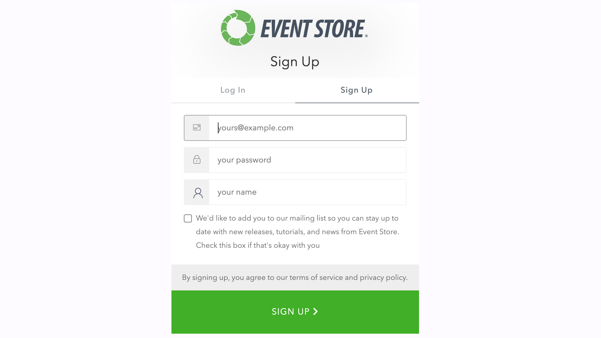
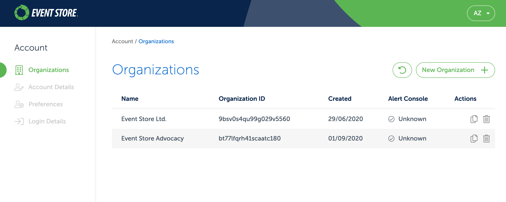
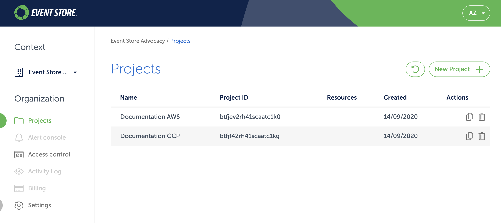
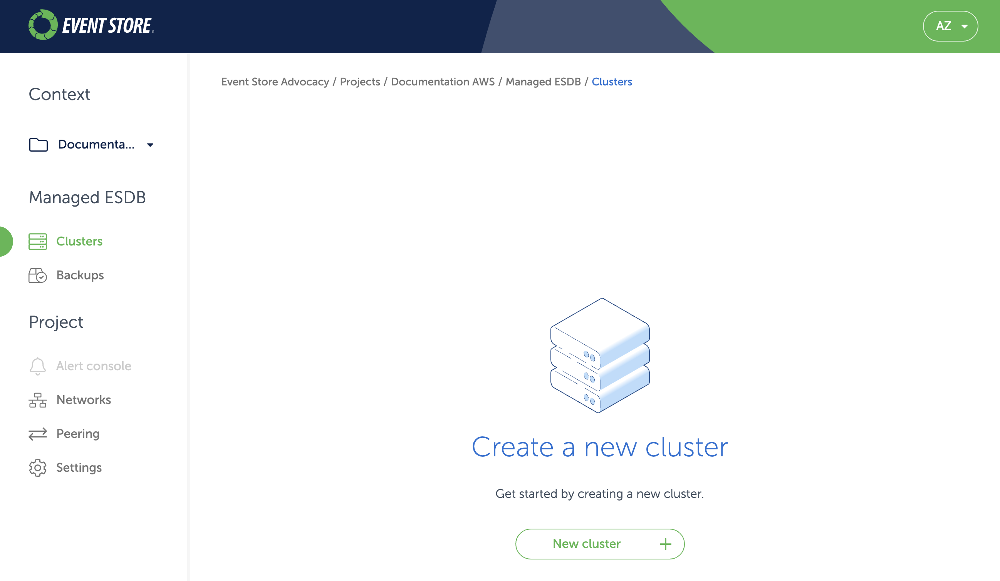
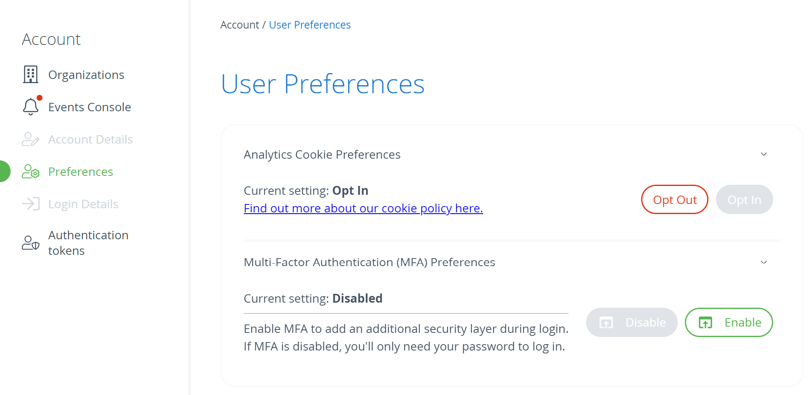
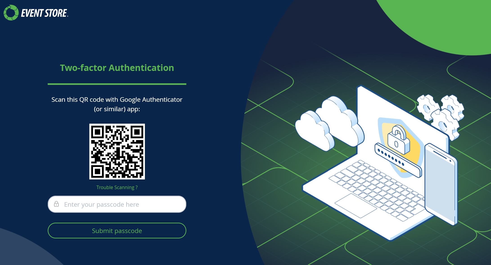
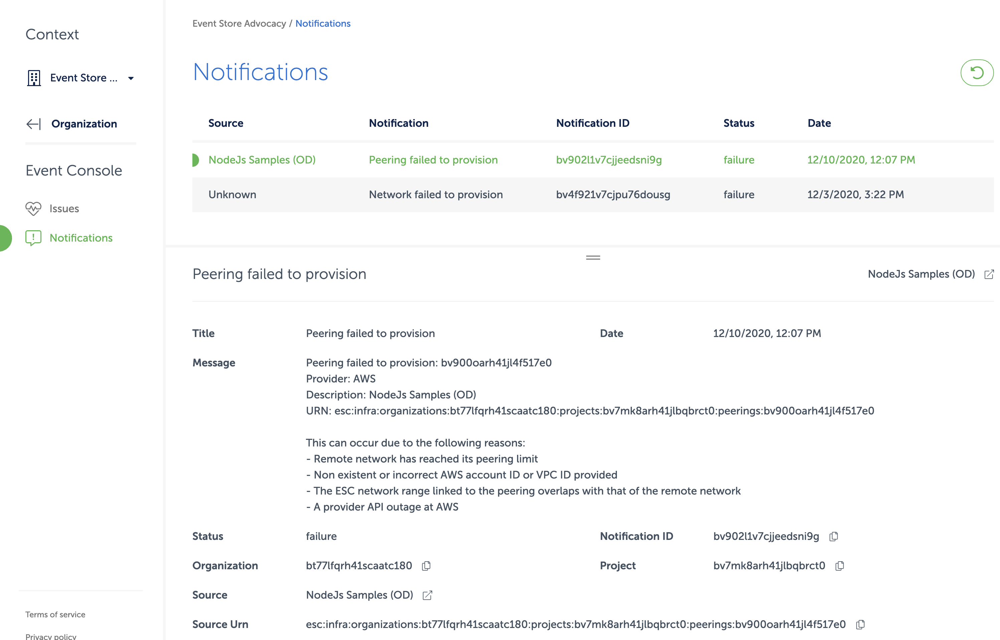

## What's Event Store Cloud?

Event Store Cloud allows you to deploy a managed EventStoreDB cluster in AWS, GCP, and Azure. The cloud cluster is optimised for the specific cloud provider and provisioned as a multi-zone VM set.

::: tip Learn more
Not using Event Store Cloud and want to learn more? Find more information and sign up links [on our website](https://www.eventstore.com/event-store-cloud).
:::

As a customer of Event Store Cloud you get access to the [Cloud console](https://console.eventstore.cloud), where you can provision and manage EventStoreDB clusters, back and up restore your data, establish the connection between Event Store Cloud networks and your own cloud infrastructure.

Event Store Cloud operations can be automated using the [Terraform provider](https://github.com/EventStore/terraform-provider-eventstorecloud) and the [CLI tool](https://github.com/EventStore/esc) which is built on top of the same API.

The roadmap can be found [here](https://www.eventstore.com/event-store-cloud).

## Cloud quick start

Follow the steps in this guide to get access to the Event Store Cloud console, provision your first cluster and connect it to your cloud infrastructure.

### Get an account

EventStoreDB offers a single sign-on (SSO) for our customers. Using a single account you get access to a variety of free and paid services.

To get an account, proceed to the [Cloud console](https://console.eventstore.cloud/)  where you'll see the login screen. There you get an option to sign up:

::: card 

:::

::: tip
If you already have an account at our community forum (Discuss), you can use it to log in to Event Store Cloud.
:::

To finalize the sign-up process, you'd need to confirm your email address by clicking the link in the confirmation email. It might happen that the confirmation email doesn't get through, please check the junk email folder in your email client as you might find it there.

### Login to Cloud console

With the new account you can login to the [Cloud console](https://console.eventstore.cloud). From the console you can manage your organisations, users, projects and EventStoreDB clusters.

::: warning Gated provisioning
You won't be able to create new cloud resources like networks and clusters. Click on the `Request to enable provisioning` link to get provisioning enabled.
:::

In the console, you first get to the list of organisations that you have access to.

::: card 

:::

You start with an empty list, so you'll need to add an organisation.

::: tip
The Cloud console has the concept of Context. You'd normally be in the organisation context or in the project context.
:::

### Organisations

With your account, you might have more than one organisation. Each organisation has its own billing account and therefore is invoiced separately for all the resources within the organisation. For example, if you have several customers and want to have a separate EventStoreDB cluster for each customer and also be able to bill the customer for the cloud resources, you can separate each customer into its own organisation.

When you click on an organisation in the list, you get to the projects screen, where you can see all the projects for the selected organisation.

::: card 

:::

Within the scope of the organisation, you also have the list of users and roles, billing information, alerts, and so on.

You can always switch to another organisation by clicking on the selected organisation name and either selecting the organisation from the list or clicking on `All organizations` to return to the list.

### Access control

Each organisation has its own access control. It includes the list of users, which have access to the organisation, groups, roles, policies and identity providers.

When you create an organisation, you will be the organisation admin by default. To invite more people, click on the `Access control` menu and then switch to `Invitations`. There, you will see the `Invite member` button, which brings the invite screen. You'd need to enter the email address for the new member and also the group, which the invited member gets added to when they accept the invite.

When you invite someone, the invitation will stay in the `Invitations` list and will be inactive until the invite gets accepted. You can always resend the invite if the invitee accidentally removes it from their inbox.

Groups allow you to fine-tune access so not each organisation member would be the admin. The `Organization admins` group gets automatically created when you create a new organisation and members of this group have full access to the organisation.

Each project also gets its own `Project admins` group.

### Projects

An organisation can have multiple projects. Projects serve as a logical grouping of cloud resources. For example, you might create separate projects per environment (test, staging, production) or per application, where each application might have one cluster per environment.

To create a new project, click on the `New project` button. Then, enter the project name and add administrators from the list of organisation users. Each project also gets its own `Project admins` group and all the users, which you add as administrators when creating the new project will become members of this group.

When you click on a project in the projects list, you get to the project context screen.

::: card 

:::

Within the project context you can manage project clusters, backups, networks, etc.

By reaching this point, you are now ready to start provisioning cloud resources with Event Store Cloud. Follow one of the available guidelines for your cloud provider:

- [Amazon Web Services (AWS)](../provision/README.md#amazon-web-services-aws)
- [Google Cloud Platform (GCP)](../provision/README.md#google-cloud-platform-gcp)
- [Microsoft Azure](../provision/README.md#microsoft-azure)

### Multi-factor Authentication (MFA)

Our MFA solution currently integrates exclusively with authenticator apps, offering a convenient and secure method for users to verify their identities.  When setting up MFA, ensure your device is prepared, as the process involves generating and entering authenticator codes.

#### User MFA

To enable Multi-factor Authentication (MFA) within the user interface, navigate to the `Preferences` section and click on the `Enable MFA`` button. 

::: card

:::

You will be logged out as part of the MFA enrollment process. Follow the guided prompts to complete the enrollment. 

::: card

:::

#### Re-generating tokens from `esc` with MFA
Once MFA is enabled, tokens generated with the CLI are invalidated. To regain access, generate new tokens using the following command :

```bash 
$ esc access tokens create
```

You will be prompted for you password and an authenticator code as part of the process.

Alternatively, if you prefer to obtain a token through the  Cloud Console, navigate to the [Authentication Tokens](https://console.eventstore.cloud/authentication-tokens) page and click on the `Request refresh token` button.


### Events and notifications

On the Event Console, you will find messages about issues with your provisioned resources in the `Issues` section, and errors that happened during provisioning in the `Notifications` section.

For example, if the network peering failed, you can discover potential causes of the failure in the `Notifications` section of the Event Console:

::: card

:::

## Operational status

You can check and subscribe to the current status of the Event Store Cloud Console at [status.eventstore.cloud](https://status.eventstore.cloud) or by using our [twitter account](https://twitter.com/esc_status).

Should there be any outage of the console it will be shown and updated here.


