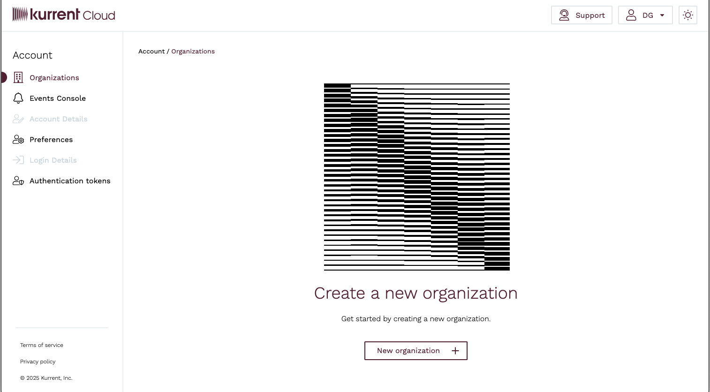
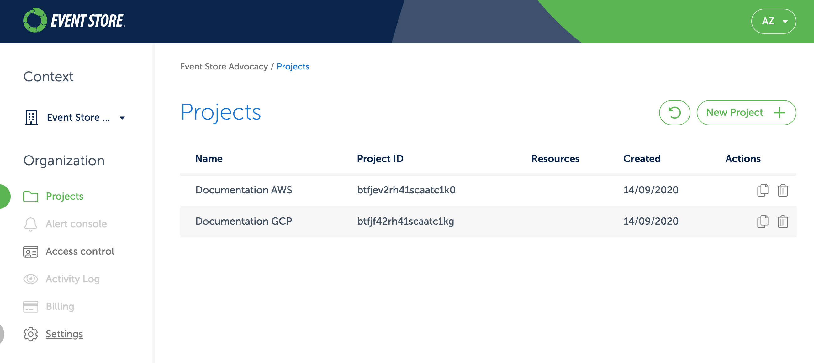
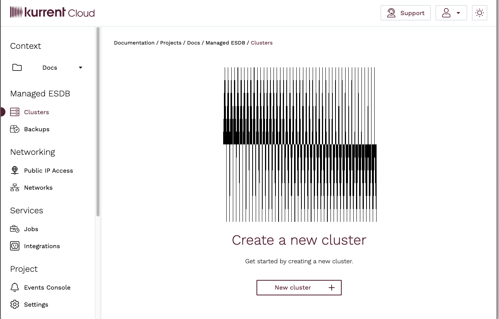
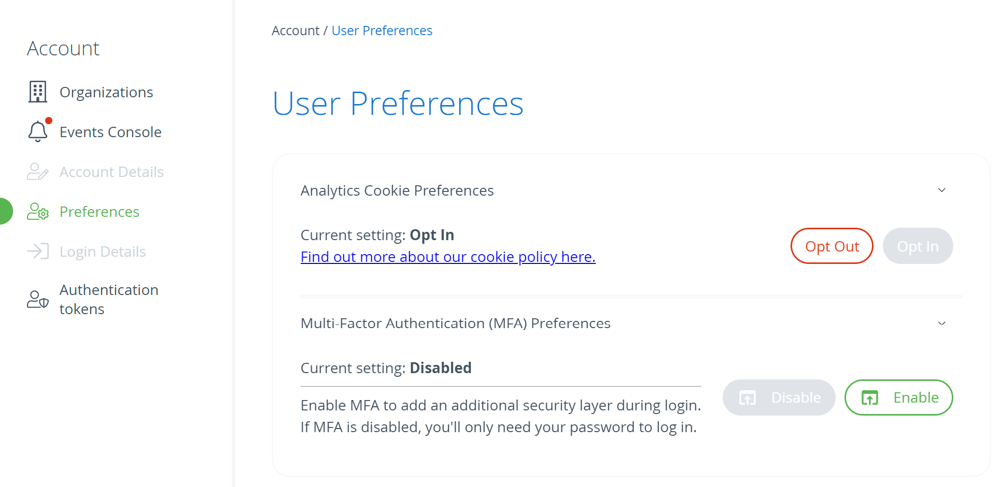
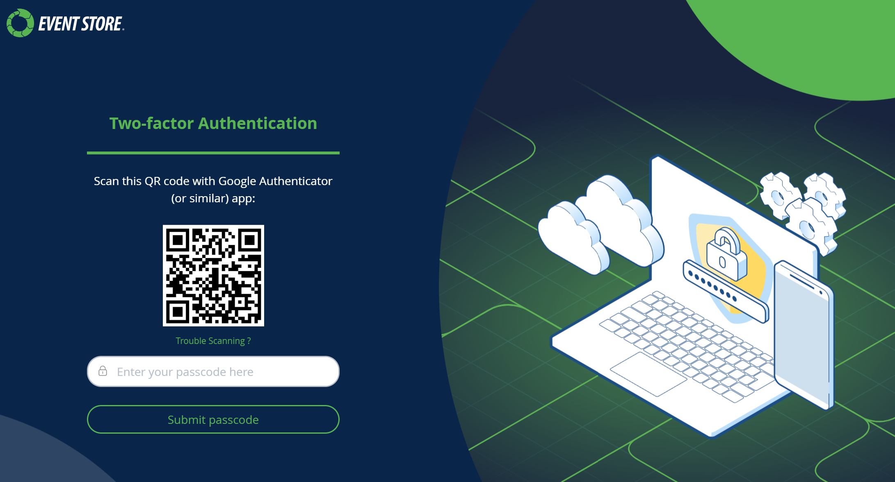
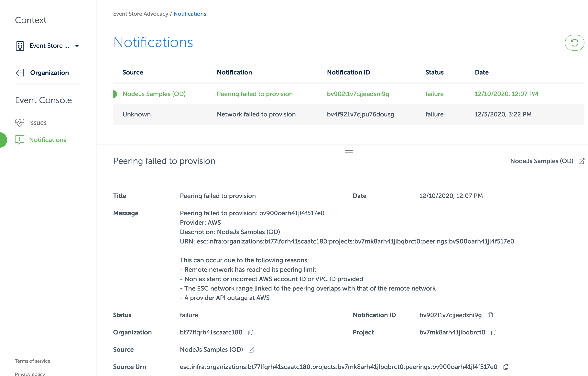

## What's Event Store Cloud?

Event Store Cloud allows you to deploy a managed EventStoreDB cluster in AWS, GCP, and Azure. The cloud cluster is optimized for the specific provider and provisioned as a multi-zone VM set.

::: tip Learn more
Not using Event Store Cloud and want to learn more? Find more information and sign up links [on our website](https://www.eventstore.com/event-store-cloud).
:::

As a customer of Event Store Cloud, you get access to the [Cloud console](https://console.eventstore.cloud), where you can provision and manage EventStoreDB clusters, backup and restore your data, and establish the connection between Event Store Cloud networks and your own cloud infrastructure.

Event Store Cloud operations can be automated using the [Terraform provider](https://github.com/EventStore/terraform-provider-eventstorecloud), [Pulumi provider](https://www.pulumi.com/registry/packages/eventstorecloud/), and the [CLI tool](https://github.com/EventStore/esc) which is built on top of the same API.

## Cloud quick start

Follow the steps in this guide to access the Event Store Cloud console, provision your first cluster, and connect it to your cloud infrastructure. Event Store offers video demonstrations for running Event Store Cloud on [AWS](https://www.youtube.com/watch?v=UeYMA28fOlE) and [Azure](https://www.youtube.com/watch?v=D42c7omFiXA) that adhere closely to the following instructions.  

### Get an account

EventStoreDB offers a single sign-on (SSO) for our customers. Using a single account, you can access various free and paid services.

To get an account, proceed to the [Cloud console](https://console.eventstore.cloud/), where you'll see the login screen. There, you'll have the option to sign up.

::: tip
If you already have an account at our community forum (Discuss), you can use it to log in to Event Store Cloud.
:::

To finalize the sign-up process, you must confirm your email address by clicking the link in the confirmation email. It might happen that the confirmation email doesn't get through, please check the junk email folder in your email client as you might find it there.

### Login to the Event Store Cloud console

With the new account, you can log in to the [Cloud console](https://console.eventstore.cloud). 

In the console, you first get to the list of organizations you have access to.



You start with an empty list, so you must add an organization.

::: tip
The Cloud console has the concept of Context. You'll typically be in the organization or project context.
:::

### Organizations

With your account, you might have more than one organization. Each organization has its own billing account and is, therefore, invoiced separately for all the resources within the organization. For example, if you have several customers and want to have a separate EventStoreDB cluster for each customer and also be able to bill the customer for the cloud resources, you can separate each customer into its own organization.

When you click on an organization in the list, you get to the projects screen, where you can see all the projects for the selected organization.



Within the organization's scope, you also have the list of users and roles, billing information, alerts, etc.

You can always switch to another organization by clicking on the selected organization name, either selecting it from the list or clicking on `All organizations` to return to the list.

### Access control

Each organization has its own access control, which includes the list of users who have access to the organization, groups, roles, policies, and identity providers.

When you create an organization, you become its admin by default. To invite more people, click on the `Access control` menu and switch to `Invitations`. You will see the `Invite member` button, which opens the invite screen. You must enter the new member's email address and the group to which the invited member will be added when they accept the invite.

When you invite someone, the invitation remains inactive in the `Invitations` list until the invite is accepted. If the invitee accidentally removes it from their inbox, it can be resent.

Groups allow you to fine-tune access so that not every organization member is the admin. The `Organization admins` group is automatically created when you create a new organization, and members of this group have full access to the organization.

Each project also gets its own `Project admins` group.

### Projects

An organization can have multiple projects. Projects serve as a logical grouping of cloud resources. For example, you might create separate projects per environment (test, staging, production) or per application, where each application might have one cluster per environment.

To create a new project, click the `New project` button. Then, enter the project name and add administrators from the list of organization users. Each project also gets its own `Project admins` group, and all the users you add as administrators when creating the new project will become members of this group.

You get to the project context screen when you click on a project in the project list.



Within the project context, you can manage project clusters, backups, networks, etc.

By reaching this point, you are now ready to start provisioning cloud resources with Event Store Cloud. Follow one of the available guidelines for your cloud provider:

- [Amazon Web Services (AWS)](./provision/aws.md)
- [Google Cloud Platform (GCP)](./provision/gcp.md)
- [Microsoft Azure](./provision/azure.md)

### Multi-factor Authentication (MFA)

Our MFA solution integrates exclusively with authenticator apps, offering a convenient and secure method for users to verify their identities.  When setting up MFA, ensure your device is ready to use, as the process involves generating and entering authenticator codes.

#### User MFA

To enable Multi-factor Authentication (MFA) within the user interface, navigate to the `Preferences` section and click on the `Enable MFA` button. 



You will be logged out as part of the MFA enrollment process. Follow the guided prompts to complete the enrollment. 



#### Re-generating tokens from `esc` with MFA

Once MFA is enabled, tokens generated with the `esc` command-line tool are invalidated. To regain access, generate new tokens using the following command:

```bash
esc access tokens create
```

You will be prompted for your password and an authenticator code as part of the process.

Alternatively, if you prefer to obtain a token through the Cloud Console, navigate to the [Authentication Tokens](https://console.eventstore.cloud/authentication-tokens) page and click the `Request refresh token` button.

### Events and notifications

On the Event Console, you will find messages about issues with your provisioned resources in the `Issues` section and errors that happened during provisioning in the `Notifications` section.

For example, if the network peering failed, you can discover potential causes of the failure in the `Notifications` section of the Event Console:



## Audit Log API
The Audit Log API displays an organization's activities as a series of events. It provides access to an audit trail of changes made by the current user or for the entire organization.

Audit logs for an organization are only accessible by organization admins. However, any user can view the changes that he/she made in the cloud.

### Get audit logs for the current user

Usage: `esc audit user get`

Optional Parameters:
* `-o, --org-id`: The organization ID for which to retrieve audit logs.
* `-a, --after`: Only get logs after this timestamp.
* `-b, --before`: Only get logs before this timestamp.
* `-l, --limit`: The maximum number of records to retrieve.

### Get audit logs for an entire organization

Usage: `esc audit organization get -o {orgId}`

Required Parameters:
* `-o, --org-id`: The organization ID for which to retrieve audit logs.

Optional Parameters:
* `-a, --after`: Only get logs after this timestamp.
* `-b, --before`: Only get logs before this timestamp.
* `-l, --limit`: The maximum number of records to retrieve.

## Operational status

You can check and subscribe to Event Store Cloud's current status at [our status page](https://status.eventstore.cloud).

Should there be any outage of the console, it will displayed here.


