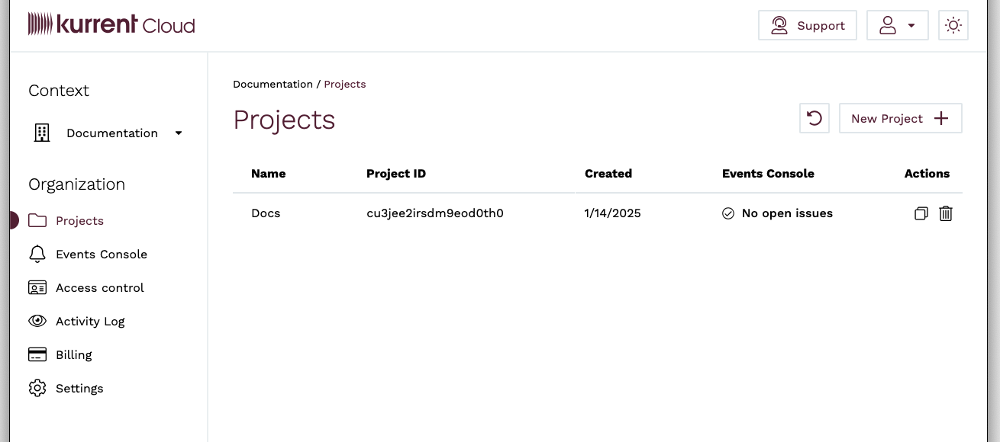

## What's Kurrent Cloud?

Kurrent Cloud allows you to deploy a managed KurrentDB cluster in AWS, GCP, and Azure. The cloud cluster is optimized for the specific provider and provisioned as a multi-zone VM set.

::: tip Learn more
Not using Kurrent Cloud and want to learn more? Find more information and sign up links [on our website](https://www.kurrent.io/kurrent-cloud).
:::

As a customer of Kurrent Cloud, you get access to the [Cloud console](https://console.kurrent.cloud), where you can provision and manage KurrentDB clusters, backup and restore your data, and establish the connection between Kurrent Cloud networks and your own cloud infrastructure.

Kurrent Cloud operations can be automated using the [Terraform provider](https://github.com/EventStore/terraform-provider-eventstorecloud), [Pulumi provider](https://www.pulumi.com/registry/packages/eventstorecloud/), and the [CLI tool](https://github.com/EventStore/esc) which is built on top of the same API.

## Cloud quick start

Follow the steps in this guide to access the Kurrent Cloud console, provision your first cluster, and connect it to your cloud infrastructure. Kurrent offers video demonstrations for running Kurrent Cloud on [AWS](https://www.youtube.com/watch?v=UeYMA28fOlE) and [Azure](https://www.youtube.com/watch?v=D42c7omFiXA) that adhere closely to the following instructions.

### Get an account

KurrentDB offers a single sign-on (SSO) for our customers. Using a single account, you can access various free and paid services.

To get an account, proceed to the [Cloud console](https://console.kurrent.cloud/), where you'll see the login screen. There, you'll have the option to sign up.

::: tip
If you already have an account at our community forum (Discuss), you can use it to log in to Kurrent Cloud.
:::

To finalize the sign-up process, you must confirm your email address by clicking the link in the confirmation email. It might happen that the confirmation email doesn't get through, please check the junk email folder in your email client as you might find it there.

### Login to the Kurrent Cloud console

With the new account, you can log in to the [Cloud console](https://console.kurrent.cloud).

In the console, you first get to the list of organizations you have access to.

You start with an empty list, so you must add an organization.

::: tip
The Cloud console has the concept of Context. You'll typically be in the organization or project context.
:::

### Organizations

With your account, you might have more than one organization. Each organization has its own billing account and is, therefore, invoiced separately for all the resources within the organization. For example, if you have several customers and want to have a separate KurrentDB cluster for each customer and also be able to bill the customer for the cloud resources, you can separate each customer into its own organization.

When you click on an organization in the list, you get to the projects screen, where you can see all the projects for the selected organization.

Within the organization's scope, you also have the list of users and roles, billing information, alerts, etc.

You can always switch to another organization by clicking on the selected organization name, either selecting it from the list or clicking on `All organizations` to return to the list.

### Access control

Each organization has its own access control, which includes the list of users who have access to the organization, groups, roles, policies, and identity providers.

When you create an organization, you become its admin by default. To invite more people, click on the `Access control` menu and switch to `Invitations`. You will see the `Invite member` button, which opens the invite screen. You must enter the new member's email address and the group to which the invited member will be added when they accept the invite.

When you invite someone, the invitation remains inactive in the `Invitations` list until the invite is accepted. If the invitee accidentally removes it from their inbox, it can be resent.

Groups allow you to fine-tune access so that not every organization member is the admin. The `Organization admins` group is automatically created when you create a new organization, and members of this group have full access to the organization.

Each project also gets its own `Project admins` group.

### Projects

An organization can have multiple projects. Projects serve as a logical grouping of cloud resources. For example, you might create separate projects per environment (test, staging, production) or per application, where each application might have one cluster per environment.

To create a new project, click the `New project` button. Then, enter the project name and add administrators from the list of organization users. Each project also gets its own `Project admins` group, and all the users you add as administrators when creating the new project will become members of this group.

You get to the project context screen when you click on a project in the project list.

Within the project context, you can manage project clusters, backups, networks, etc.

### Provision a cluster

You are now ready to start provisioning cloud resources with Kurrent Cloud. Please proceed to the [Getting Started guide](./getting-started/) to learn how to provision your first cluster.
