Public Access Clusters are provisioned on a **Public Network** and have a public IP address assigned to each cluster node, with access to the cluster restricted to the IP addresses/ranges specified in an **IP Access List** assigned to each cluster. Clusters on the same network are isolated from each other, so you can create multiple clusters on the same public network without worrying about unauthorized access from one cluster and another.

We previously discussed how to create a Public Managed Cluster in the [Public Access Getting Started](../provision/public.md) guide. So let's get into some of the details of how to manage Public Access Networks and IP Access Lists.

## Public Networks Overview

You can create a **Public Network** as part of the cluster creation process, or as a standalone resource. When you create a **Public Network**, you specify the cloud provider and region where the network will be created. It is recommended to create the network in a region that is geographically close to your location to minimize latency.

**Public Networks** are separate VPCs from **Private Networks** that require VPC peering to access **Private Clusters**.

### Creating a Public Network

::: tabs#way
@tab Cloud Console

To create a public network in the console, navigate to the Networks view and click on the `New network` button.

On the new network page:

1. Provide a descriptive name for the network in the `Network name` field.
2. Select the network type as `Public`
3. Select the Cloud Provider
4. Select a region from the dropdown list.
5. Click on the `Create network` button.

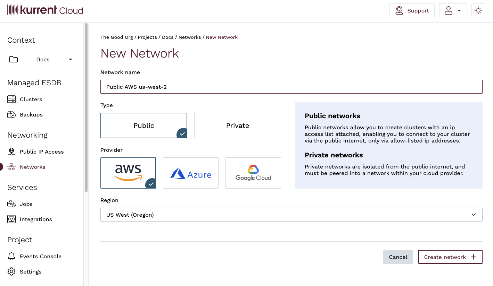

Once you have created the network, you will be taken to the network detail page, where you can see the network is in the `Provisioning` state.

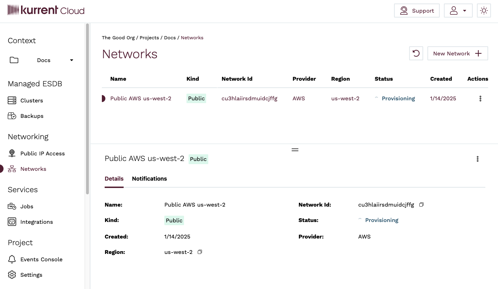

Once the network is provisioned, the network will be in the `Available` state.

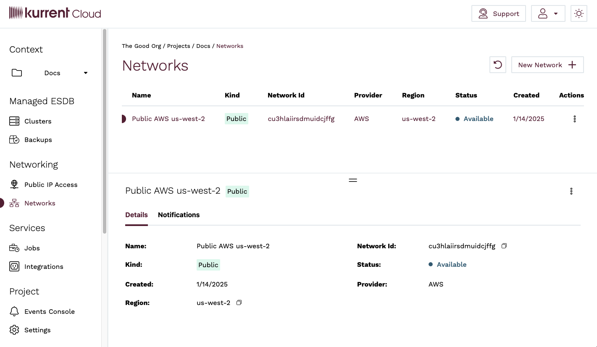

@tab esc

Networks are created using the `infra networks create` sub-command of the `esc` CLI.

To create a public network with the command line, use the `infra networks create` sub-command and specify the `--public-access` flag.

For example, the following command creates a public network named `Public AWS us-west-2` in the AWS `us-west-2` region.

```bash
esc infra networks create \
    --description "Public AWS us-west-2" \
    --provider aws \
    --region us-west-2 \
    --public-access
```
:::

### Modifying a Public Network

Once a Network resource has been created, you can only modify the name or delete the resource. First, let's see how to rename a Public Network.

::: tabs#way
@tab Cloud Console

To rename a Public Network in the console, navigate to the **Networks** view and click on the menu button for the network you want to rename, either in the Network list or in the Network detail section. Click on the `Rename <network name>` menu item.

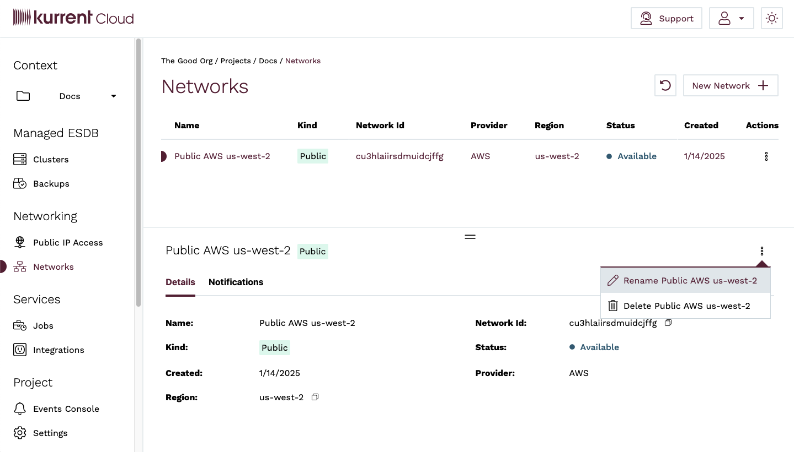

You will be taken to the **Rename Network** view, where you can enter a new name for the network. When you are done, click on the `Rename network` button.

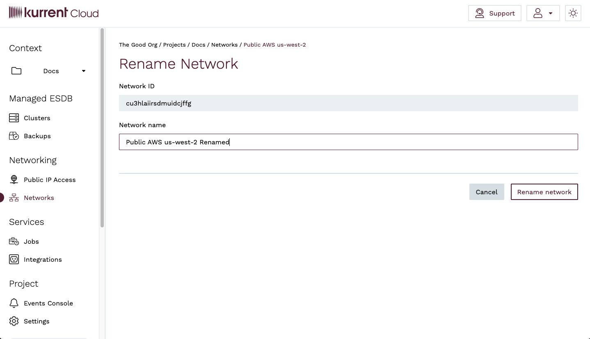

You will be taken back to the **Networks** view, where you will see a notification that the network name has been updated.

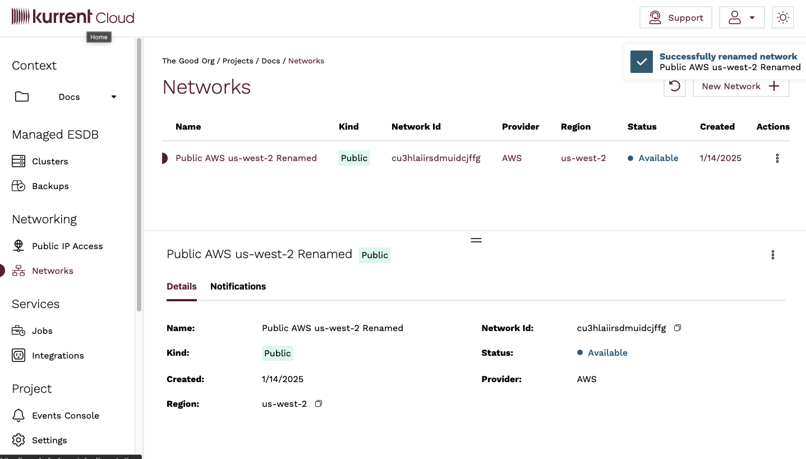

@tab esc

To rename a Public Network using the `esc` CLI, use the `infra networks update` sub-command and specify the `--name` flag.

For example, the following command renames a network named `Public AWS us-west-2` to `Public AWS us-west-2 Renamed`.

```bash
esc infra networks update \
    --id "cu3hlaiirsdmuidcjffg" \
    --name "Public AWS us-west-2 Renamed"
```
:::

### Deleting a Public Network

Deleting a Public Network is done similarly to renaming a Network.

::: warning Resource Dependencies
You will not be able to delete a network until all clusters provisioned on that network have been deleted.
:::

::: tabs#way
@tab Cloud Console

To delete a Public Network, navigate to the **Networks** view and click on the menu button for the network you want to delete, either in the Network list or in the Network detail section. Click on the `Delete <network name>` menu item.


You will be taken to the **Delete Network** view. You will be prompted to confirm the deletion by entering the name of the Network. Click on the `Delete network` button.

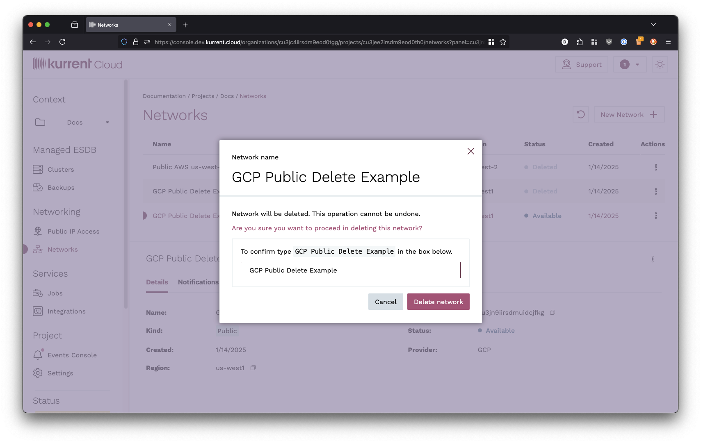

If there are no clusters provisioned on the network, you will be taken back to the **Networks** view, where you will see a notification that the network deletion has been initiated.


If there are clusters provisioned on the network, you will receive an error stating that the network cannot be deleted because there are clusters provisioned on it.

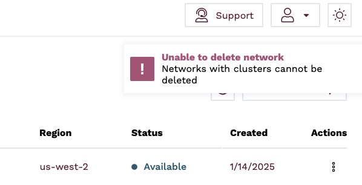

Once the network deletion has been completed, the network will show as `Deleted` in the **Networks** view. After 24 hours, the network will be removed from the **Networks** view.

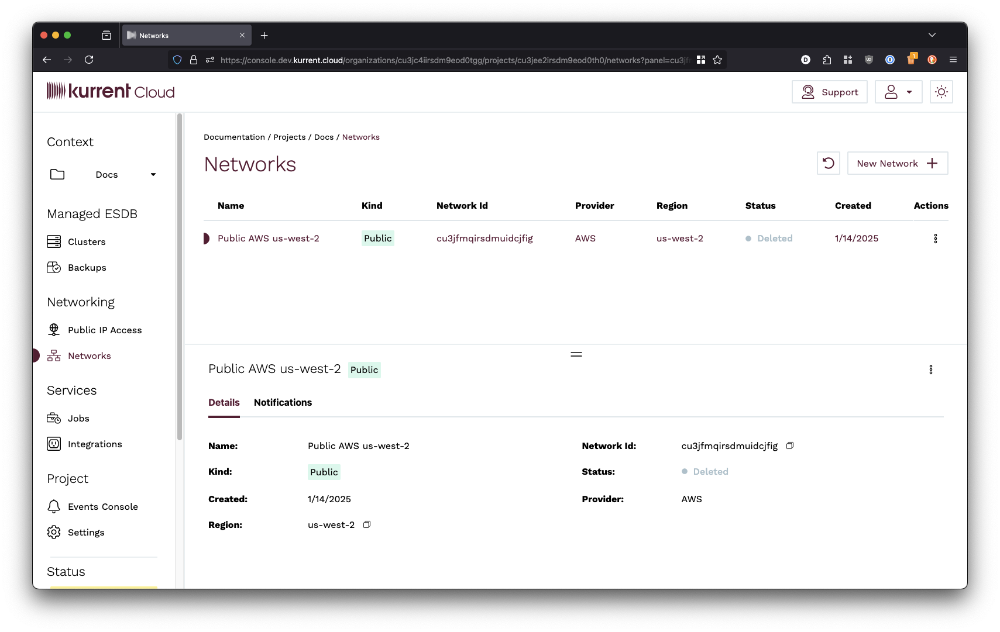

@tab esc

To delete a Public Network using the `esc` CLI, use the `infra networks delete` sub-command and specify the `--id` flag.

For example, the following command deletes a network with the ID `cu3hlaiirsdmuidcjffg`.

```bash
esc infra networks delete \
    --id "cu3hlaiirsdmuidcjffg"
```
:::

## IP Access Lists

Public Access Clusters are protected by an **IP Access List**. An IP Access List is a list of IP addresses or IP address ranges specified in CIDR notation that are allowed to access the cluster.

::: tip
It is common for corporate networks and VPNs to use a range of public IP addresses that outbound connections are translated to when connecting to the public internet. You should speak with your IT department or network administrator to get those IP address ranges. Not including all of the outbound IP addresses can result in intermittent connectivity issues that are otherwise difficult to diagnose.
:::

Some key points about IP Access Lists:

- IP Access Lists are distinct resources in Kurrent Cloud and can be created, modified, and deleted independently of Public Access Clusters
- All Public Access Clusters must be assigned an IP Access List
- Public Access Clusters can be assigned a single IP Access List
- IP Access Lists can be applied to one or more Public Access Clusters
- Updating an IP Access List will apply the changes to all clusters that are assigned that IP Access List, typically within seconds
- You can change the IP Access List assigned to a cluster at any time
- You cannot delete an IP Access List that is in use by any clusters

### Creating an IP Access List

Besides creating an IP Access List as part of the cluster creation process, you can also create an IP Access List as a standalone resource.

::: tabs#way
@tab Cloud Console

To create an IP Access List, navigate to the **IP Access Lists** view and click on the `New IP Access List` button.

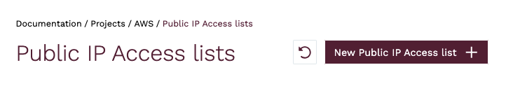

You will be taken to the **New IP Access List** view, where you can enter a name for the IP Access List, as well as the IP Addresses or CIDR blocks you want to allow access to the cluster and an optional comment for each CIDR block. When you are done, click on the `Create IP Access List` button.

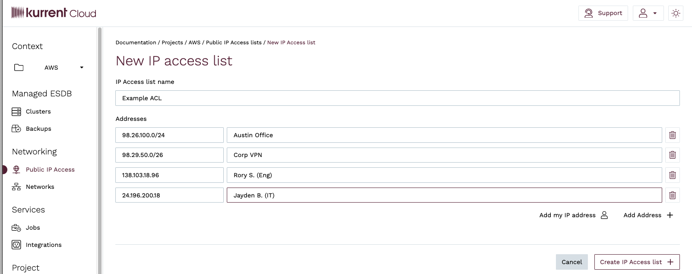

@tab esc

To create an IP Access List using the `esc` CLI, use the `infra acl create` sub-command and specify the `--cidr-blocks` flag.

For brevity, IP Access Lists are referred to as ACLs (Access Control Lists) in the `esc` CLI.

For example, the following command creates an IP Access List named `Production Access` with the CIDR blocks `12.23.56.0/24` and `12.23.57.0/24`. If you wish to add a comment to a specific CIDR block, you can do so by specifying the argument in the format `cidr-block,comment`.

```bash
esc infra acl create \
    --name "Production Access" \
    --cidr-blocks "12.23.56.0/24" \
    --cidr-blocks "12.23.57.0/24,Engineering"
```
:::

### Modifying an IP Access List

When are request to change the CIDR blocks in an IP Access List, the changes are applied asynchronously to all clusters that are assigned that IP Access List. This typically happens within seconds. If there are any issues applying the changes to any cluster, Cloud engineers are alerted to investigate.

::: tabs#way
@tab Cloud Console

To modify an IP Access List, navigate to the **IP Access Lists** view and click on the menu button for the IP Access List you want to modify, either in the IP Access List list or in the IP Access List detail section. Click the `Edit <IP Access List name>` menu item.

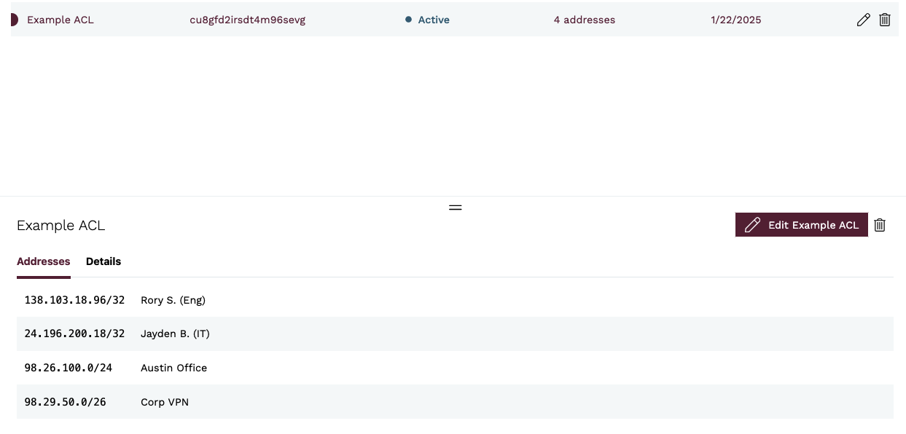

You will be taken to the **Edit IP Access List** view, where you can enter a new name for the IP Access List. When you are done, click the `Update IP Access List` button.

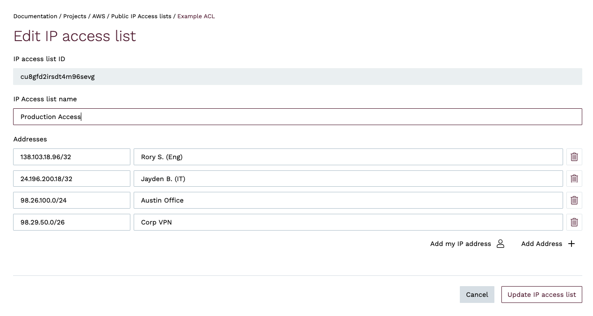

You will be taken back to the **IP Access Lists** view, where you will see a notification that the IP Access List has been updated.

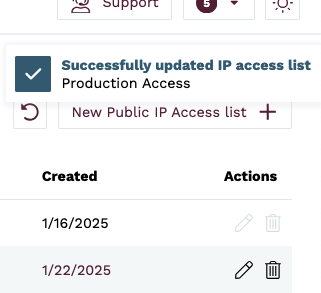

@tab esc

To modify an IP Access List using the `esc` CLI, use the `infra acl update` sub-command. You must specify the `--id` flag, and you can use the `--cidr-blocks` flags one or more times to specify the CIDR blocks you wish to include in the list, or the `--description` flag to change the name of the IP Access List.

For example, the following command updates an IP Access List with the ID `cu3hlaiirsdmuidcjffg` to include the CIDR blocks `12.23.56.0/24` and `12.23.57.0/24`. If you wish to add a comment to a specific CIDR block, you can do so by specifying the argument in the format `cidr-block,comment`. If you omit any CIDR blocks, they will be removed from the list.

**Note**: When updating an IP Access List, you must specify all CIDR blocks you wish to include in the list. If you omit any CIDR blocks, they will be removed from the list.

```bash
esc infra acl update \
    --id "cu3hlaiirsdmuidcjffg" \
    --cidr-blocks "12.23.56.0/24,Engineering" \
    --cidr-blocks "12.23.57.0/24,Operations"
```

:::
