## Resizing cluster nodes

Clusters can be expanded on-demand, to accommodate database growth, through the [Cloud Console](https://console.eventstore.cloud/) and the [Event Store Cloud CLI](https://github.com/EventStore/esc).

You can choose a larger or smaller node size, as well as a different cluster topology. See also the cloud [sizing guide](../provision/README.md#cloud-instance-sizing-guide) for general guidance.

### Using the Cloud Console

To resize a cluster in the console, navigate to the clusters view and select _Resize Cluster_.

::: card
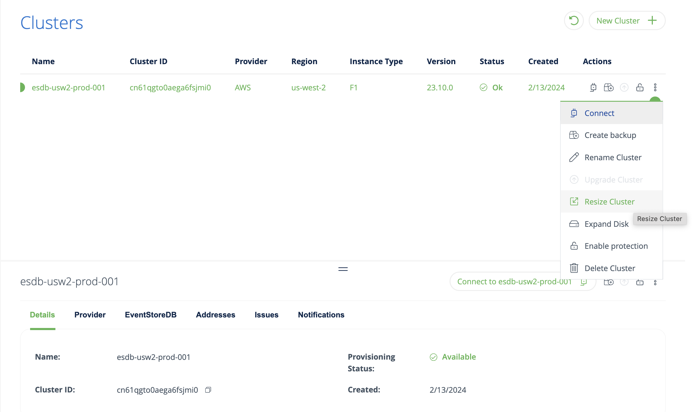
:::

On the detail page specify the new cluster size and click on _Resize Cluster_.

::: card
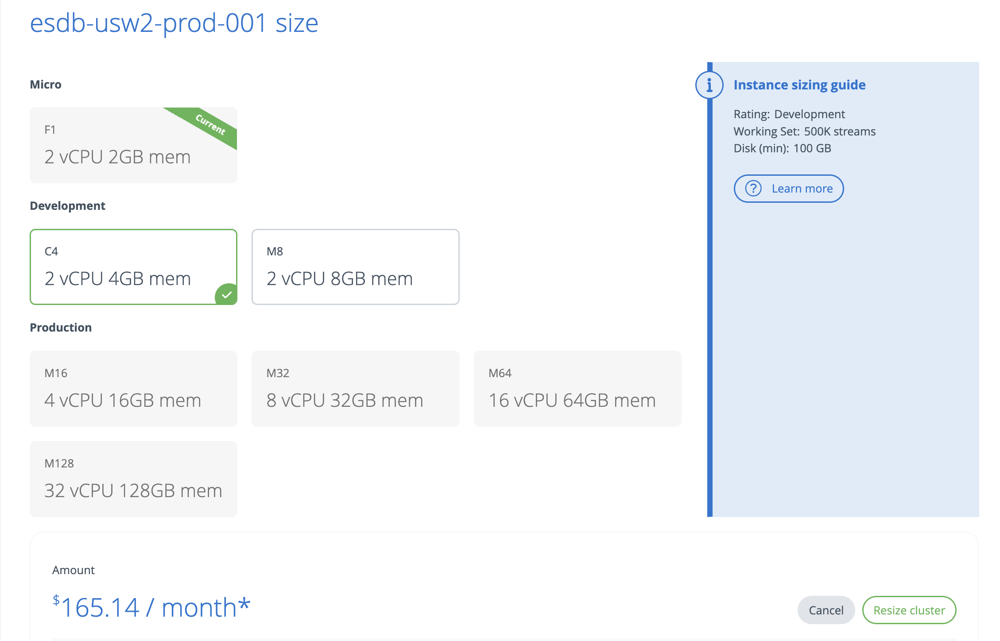
:::

You will get a prompt that this operation will require downtime. Click on _Start Operation_ to proceed.

::: card
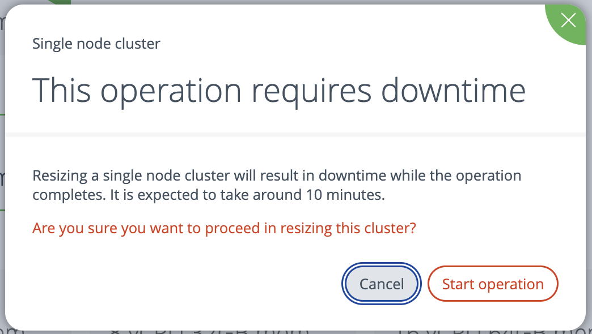
:::

This will take you back to the cluster view where you will see that the resize is in progress.

::: card
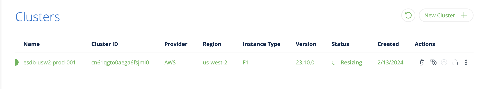
:::

Once the resize operation has completed the new cluster size will show in the cluster view.

::: card
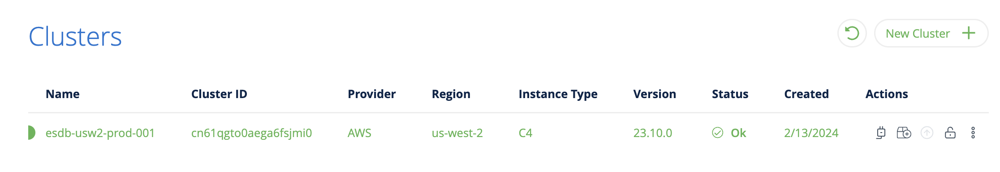
:::

### Using the command line

To resize a cluster with the command line, use the `clusters resize` command, where `--target_size` is the target instance size. For example, the size may be one of: F1, C4, M8, M16, M32, M64, M128.

```bash
esc mesdb clusters resize \
    --target_size C4 \
    --id cn7dd2do0aekgb8nbf20 \
    --project-id cn62uolo0aegb5icm0bg \
    --org-id 9bsv0s4qu99g029v5560
```

## Upgrading EventStoreDB version

Clusters can be upgraded to a later version on-demand through the [Cloud Console](https://console.eventstore.cloud/) and the [Event Store Cloud CLI](https://github.com/EventStore/esc).

::: note
Limitations:
* At this time clusters can only be updated to a minor version. Upgrading to a major version is part of a future release. Until that point, if you need to upgrade to a major servier version, you should perform a [backup](#manual-backup), and [restore](#restore-from-backup) to a new cluster. When restoring the backup, you can choose the EventStoreDB version you need. You can then switch your applications over to the connection string for the new cluster.
:::

### Using the Cloud Console

To upgrade a cluster in the console, navigate to the clusters view and select _Upgrade Cluster_.

::: card

:::

On the detail page specify the new cluster version and click on _Upgrade Cluster_.

::: card
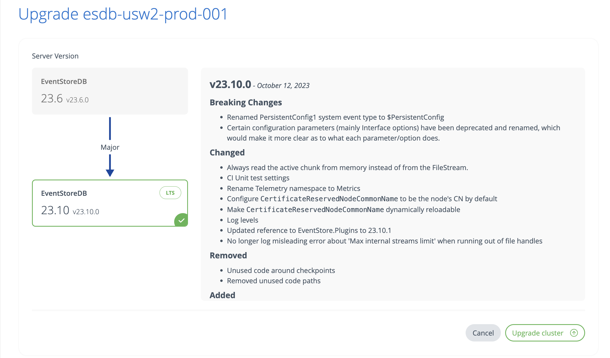
:::

You will get a prompt that this operation will require downtime. Click on _Start Operation_ to proceed.

::: card
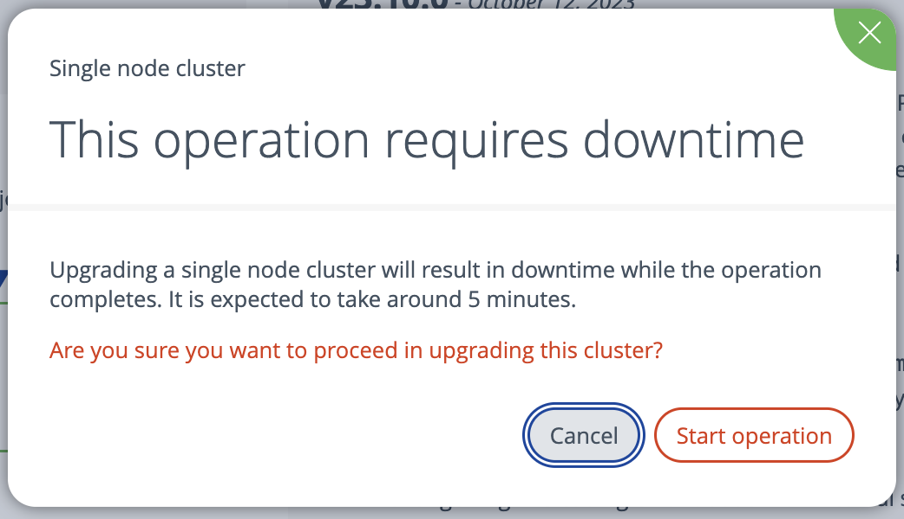
:::

This will take you back to the cluster view where you will see that the upgrade is in progress.

::: card
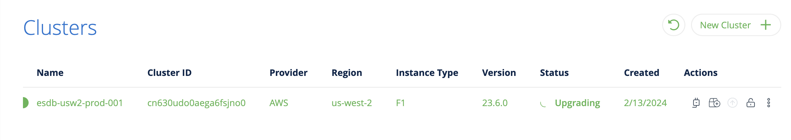
:::

Once the upgrade operation has completed the new cluster version will show in the cluster view.

::: card

:::

### Using the command line

To upgrade a cluster with the command line, use the `clusters upgrade` command, where `--target_tag` is the version you want to upgrade to. This must include the full version e.g. 23.10.0.

```bash
esc mesdb clusters upgrade \
    --target_tag 23.10.0 \
    --id cn7dd2do0aekgb8nbf20 \
    --project-id cn62uolo0aegb5icm0bg \
    --org-id 9bsv0s4qu99g029v5560
```


## Expanding disks

Disks can be expanded on-demand, to accommodate database growth, through the [Cloud Console](https://console.eventstore.cloud/) and the [Event Store Cloud CLI](https://github.com/EventStore/esc)

See also the cloud [sizing guide](../provision/README.md#cloud-instance-sizing-guide) for general guidance.

::: note
Limitations:
* on AWS expanding disks is subject to a rate limit, see [here](https://docs.aws.amazon.com/AWSEC2/latest/APIReference/API_ModifyVolume.html) for more information.
:::

### Using the Cloud Console

To expand disks in the console, navigate to the clusters view and click on the _Expand Disks_ icon.

::: card

:::

On the detail page specify the new disk size (as well as the disk iops and throughput when using the AWS GP3 disk type) and click on _Expand cluster disk_.

::: card

:::

### Using the command line

To expand disks with  the command line, use the `clusters expand` command, where `--id` is the cluster id.

```bash
$ esc mesdb clusters expand \
    --disk-size-in-gb 16 --id c3fi17to0aer9r834480 \
    --project-id c3fhvdto0aepmg0789m0 \
    --org-id bt77lfqrh41scaatc180
```

## Event Store Cloud Jobs

The Event Store Cloud runs scheduled jobs on the user's behalf. All of these jobs consist of a human-readable description and a schedule.

Currently, the following jobs are supported:
* [Scheduled backups](#scheduled-backups)

### Job Schedules

The schedule format used by the Event Store Cloud CLI tool and API is a simplified subset of [cron](https://en.wikipedia.org/wiki/Cron#Overview), in the future we may support more cron features.

The supported subset is:

* for the first field, minute:
    * a wildcard `*`
    * a number between `0` and `59` (inclusive).
    * a rate, written as a wildcard divided by a number. E.g:  `*/15`
* For the second field, hour:
    * a wildcard `*`
    * a number must be between `0` and `23` (inclusive)
    * a rate, written as a wildcard divided by a number. E.g:  `*/1`
* for the third field, day of month:
    * a wildcard `*`
* for the fourth field, month:
    * a wildcard `*`
* for the fifth field, day of the week:
    * a wildcard `*`
    * a number between `0` and `7` (inclusive), Sunday to Saturday

```
 ┌───────────── Minute: wildcard, number (0 - 59), rate
 │ ┌─────────── Hour: wildcard, number (0 - 23), rate
 │ │ ┌───────── Day of the month: wildcard
 │ │ │ ┌─────── Month: wildcard
 │ │ │ │ ┌───── Day of the week: wildcard, number (0 - 7)
 │ │ │ │ │
 * * * * *
```

::: note
Scheduled backups have a minimum frequency of 60 minutes. Currently, it is not possible to schedule backups more frequently.
:::

#### Examples:

`0 */1 * * *` runs a job once an hour, at minute 00.

`0 12 * * 1` runs a job at 12:00 PM on Monday.

`30 13 * * 0` runs a job at 13:30 PM on Sunday.

## Manual Backup

Backups can be created on demand using the [Cloud Console](https://console.eventstore.cloud/) and the [Event Store Cloud CLI](https://github.com/EventStore/esc).

Manually created backups appear in the console alongside backups created by scheduled jobs.

To see the status of the backup, navigate to the `Backups` section of the console. There you can see all backups created manually or by a scheduled job.

::: card
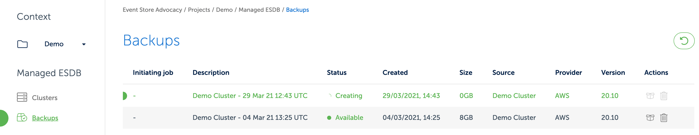
:::

You can customise the backup label using a combination of free-text and predefined variables:
- **index** - the auto-incremented value with the number of backups. You can format it as:
  - decimal: `index:decimal` (*default*),
  - hexadecimal: `index:hex`.
- **cluster** - value from the cluster information:
  - description: `cluster:description` (*default*),
  - id: `cluster:id`,
  - cloud provider: `cluster:provider`
- **datetime** - timestamp of when backup was made. You can format it as:
  - UTC time - `datetime:utc` (*default*),
  - [RFC 822](https://www.w3.org/Protocols/rfc822/#z28): `datetime:rfc822`,
  - [Unix](https://en.wikipedia.org/wiki/Unix_time): `datetime:unix`,
  - [JSON](https://en.m.wikipedia.org/wiki/ISO_8601): `datetime:json`,
  - [RFC3339](https://tools.ietf.org/html/rfc3339): `datetime:rfc3339`,

### Using the Cloud Console

To create a backup in the console, navigate to the clusters view and click on the _Create backup_ icon. In the popup, click the `Create one-off backup` button.

::: card

:::

### Using the command line

You can also take a backup of your cluster using the [Event Store Cloud CLI](https://github.com/EventStore/esc).

To create a backup, use the `backups create` command:

``` bash
$ esc mesdb backups create --description "on demand backup" \
    --source-cluster-id c1eut65o0aeu6ojco7a0 \
    --project-id btfjev2rh41scaatc1k0

BackupId("c1ev3l5o0aeu6ojco7b0")
```

To see the status of the backup use the `backups get` command:

``` bash
$ esc mesdb backups get --project-id btfjev2rh41scaatc1k0 \
    --id c1ev3l5o0aeu6ojco7b0

Backup { id: BackupId("c1ev3l5o0aeu6ojco7b0"),
project_id: ProjectId("btfjev2rh41scaatc1k0"),
source_cluster_id: ClusterId("c1eut65o0aeu6ojco7a0"),
source_cluster_description: "Demo-Backup",
description: "on demand backup", size_gb: 8,
provider: Aws, region: "eu-central-1",
status: "available", created: "2021-03-26T14:38:12Z",
linked_resource: None }
```

## Scheduled Backups

Scheduled backups can be created through the [Cloud Console](https://console.eventstore.cloud/) and the [Event Store Cloud CLI](https://github.com/EventStore/esc)

Scheduled backup jobs can be run as frequently as once an hour. After each successful backup, older backups created by the same job will be automatically deleted based on the provided configuration.

::: note
Multiple scheduled backups can target the same cluster. However, if schedules overlap, one of the jobs will fail as the first backup job will already lock the cluster.
:::

For example, you could create one scheduled backup that executes every hour, along with a second scheduled backup that executes once a week. Backups from these scheduled jobs are pruned independently regardless of their age, so if both saved a maximum of four backups, the oldest backup from the weekly job might be close to a month old, while the hourly job's backups would never be older than a fraction of a day.

### Using the Cloud Console

To create a scheduled backup in the console, navigate to the clusters view and click on the _create backup_ icon and then on `Create backup schedule`.

::: card

:::

Choose a description, the frequency as well as the number of backups to keep before pruning. Finally, click the `Create backup schedule` button.

::: card

:::

Backups created this way appear in the console alongside backups created manually. All backups created by the same job will be grouped together in one row, which can be expanded by clicking the down arrow icon on the right side of the row.

::: card

:::

To see the status on the scheduled backup jobs, navigate to the `Jobs` section of the console.

::: card

:::

There you can see all backups created by a job, as well as their history, which operations have failed (if any).

::: note
A backup might fail, for instance, if a cluster is locked by another operation when the backup tries to run. Such a locking operation could be the disk expand or manual backup.
:::

### Using the command Line

A scheduled backup can be created using the Event Store Cloud CLI by using the `orchestrate` subcommand.

The following call will create a new scheduled backup of the cluster with ID `c196ogto0aeqohe3ommq`:

``` bash
$ esc orchestrate jobs create \
    --description 'My Hourly Backup' \
    --schedule '0 */1 * * *' scheduled-backup \
    --description '{cluster} Hourly Backup {datetime:RFC3339}' \
    --max-backup-count 2 \
    --cluster-id c196ogto0aeqohe3ommq
```

For details on the scheduled field, see [Job Schedules](./README.md).

To list current jobs, run:

``` bash
$ esc orchestrate jobs list
```

To view the history of a job, run:

``` bash
$ esc orchestrate history list --job-id <job-id>
```

## Restore from backup

Restores can be done on demand using the [Cloud Console](https://console.eventstore.cloud/) and the [Event Store Cloud CLI](https://github.com/EventStore/esc).

::: note
Restoring a backup will create a new cluster
:::

The topology of the new cluster does not need to be the same as the source of the backup: you can restore a 3 nodes cluster backup to a single node one.
Do make sure that the disk size of the target cluster is large enough.

### Using the Cloud Console

To restore a backup, navigate to the `Backups` section fo the [Cloud Console](https://console.eventstore.cloud/) and click on the `Restore` icon of the backup you want to restore.

::: card

:::

Backups are restored as new clusters. You will be then redirected to the usual provisioning page, where you can choose your cluster parameters. Note that you are not limited to restoring the backup to exactly the same cluster as the cluster for which the backup was taken. You can change the cluster topology, the database software version, and the instance size. You cannot restore between different cloud providers though.

::: card

:::

### Using the command line

You can also restore a backup using the [Event Store Cloud CLI](https://github.com/EventStore/esc). As you cannot restore to the existing cluster, you should use the `source-backup-id` option of the `mesdb clusters create` command. When the backup id is provided, the CLI tool will create a new cluster using the provided backup.

Example: restoring the backup with ID `c10dvoarh41lb9otkdrg` to an F1 single node instance.

``` bash
$ esc mesdb clusters create \
    --description "restore" \
    --source-backup-id c10dvoarh41lb9otkdrg \
    --instance-type F1 --disk-size-in-gb 10 \
    --disk-type GP2 --network-id c10dr5qrh41lbabqa2j0 \
    --projection-level off --server-version 20.10 \
    --topology single-node  --project-id c10d0h2rh41lba1v92k0
```

The output will display the new cluster ID:

``` bash
ClusterId("c1mnqjdo0aembuk4ljo0")
```

You can then get the new cluster status with the following command:

``` bash
$ esc mesdb clusters get --id c1mnqjdo0aembuk4ljo0 \
    --project-id c10d0h2rh41lba1v92k0 --json
```

The output will be similar to:

``` json
{
    "id": "c1mnqjdo0aembuk4ljo0",
    "organizationId": "bt77lfqrh41scaatc180",
    "projectId": "c10d0h2rh41lba1v92k0",
    "networkId": "c10dr5qrh41lbabqa2j0",
    "description": "restore",
    "provider": "aws",
    "region": "eu-west-2",
    "topology": "single-node",
    "instanceType": "f1",
    "diskSizeGb": 10,
    "diskType": "gp2",
    "serverVersion": "20.10",
    "projectionLevel": "off",
    "status": "available",
    "created": "2021-03-26T09:37:17Z",
    "addresses": {
        "tcp": [
            "c1mnqjdo0aembuk4ljo0.mesdb.eventstore.cloud:1113"
        ],
    "grpc": "esdb://c1mnqjdo0aembuk4ljo0.mesdb.eventstore.cloud:2113",
    "ui": "https://c1mnqjdo0aembuk4ljo0.mesdb.eventstore.cloud:2113"
    }
}
```

## Protecting the cluster from removal

Cluster can be protected from accidental removal using the [Cloud Console](https://console.eventstore.cloud/) and the [Event Store Cloud CLI](https://github.com/EventStore/esc).

This feature will require an extra step to unprotect the cluster before it will be possible to remove it.

### Using the Cloud Console

To protect a cluster, navigate to the clusters view and click on the _Protect Cluster_ icon.

::: card
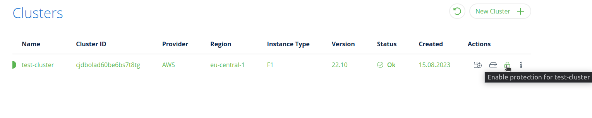
:::

On the detail page click on _Enable Protection_ button.

::: card
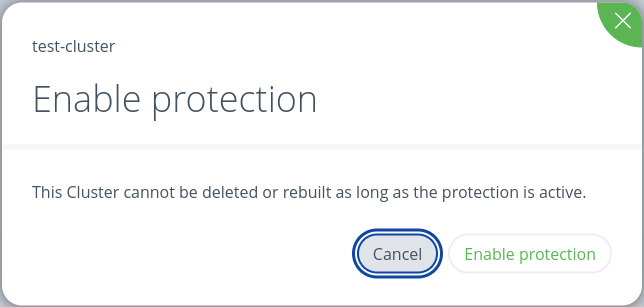
:::

Protected cluster does not have a _Delete Cluster_ active action.

::: card
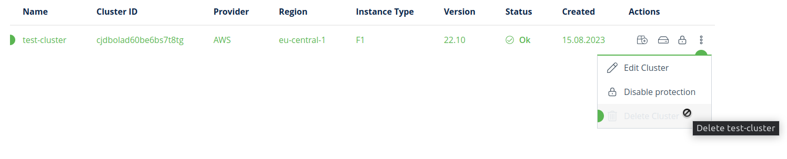
:::

To unprotect a cluster, navigate to clusters action and click on the _Unprotect Cluster_ icon.

::: card
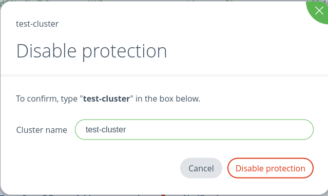
:::

### Using the command line

You can also protect a cluster using the [Event Store Cloud CLI](https://github.com/EventStore/esc).

To protect a cluster, you need to update a value of `protected` parameter to `true`.
```bash
esc mesdb clusters update --id cis4pcid60b5q96r8hm0 --protected true
```

To unprotect a cluster, you need to update it to `false`.

```bash
esc mesdb clusters update --id cis4pcid60b5q96r8hm0 --protected false
```
