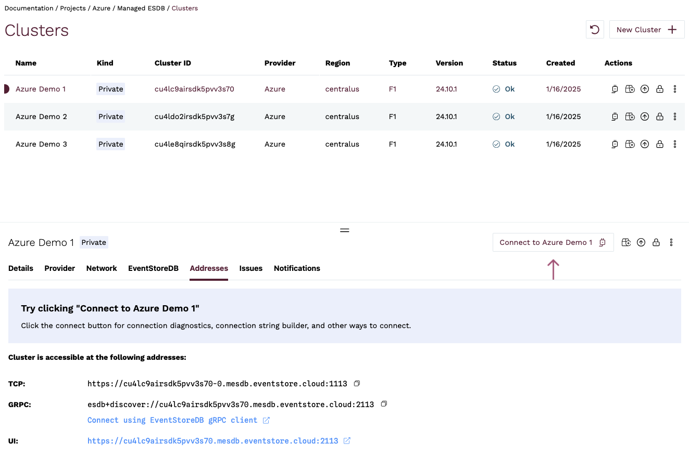

## Connecting to a cluster

After you provision the cloud cluster, you can find connection details by going to the Clusters view of the Cloud console. For each cluster, in the **Addresses** section, you will find the addresses for accessing the cluster UI, as well as URIs for gRPC and TCP clients.



### DNS names

The format for the DNS name of a cluster follows the pattern `<cluster-id>.mesdb.eventstore.cloud`.

This name resolves to IP addresses of all the cluster nodes or to the IP address of a single instance, depending on the deployment topology. For public clusters, the name resolves to the public IP addresses of the cluster nodes. For private clusters, the name resolves to the private IP addresses of the cluster nodes.

Each cluster node has its own DNS name, which can be used for accessing individual nodes for node-specific operations like stats collection or scavenging.

- **Public Clusters**: The node DNS names follow the pattern `<cluster-id>-<node-id>p.mesdb.eventstore.cloud`. The `p` suffix on the hostname is used for public cluster nodes to indicate that the node is a public node.
- **Private Clusters**: The node DNS names follow the pattern `<cluster-id>-<node-id>.mesdb.eventstore.cloud`.

::: note Additional DNS names for Public Clusters
Public cluster nodes also have a DNS name that follows the same pattern as private clusters, `<cluster-id>-<node-id>.mesdb.eventstore.cloud`. This name resolves to the private IP address of the node and is used for internal communication between the nodes. It is not accessible from the public internet.

You can always check the `/gossip` endpoint from any node to see the list of names clients can use to connect to the individual nodes.
:::

### TLS certificates

Kurrent Cloud provisions secure KurrentDB clusters with TLS enabled for HTTP and gRPC using certificates issued by Let's Encrypt. We automatically renew the certificates before they expire and replace the certificates on all cluster nodes. This is all done with zero impact to client connections or cluster availability.

We do not support using third party certificates or offer private certificate authorities, which also means that we do not support mutual TLS client authentication at this time.

## Resizing cluster nodes

Clusters can be expanded on-demand, to accommodate database growth, through the [Cloud Console](https://console.kurrent.cloud/) and the [Kurrent Cloud CLI](https://github.com/EventStore/esc). When you resize a cluster, you are changing the type of compute instances that make up the cluster. You can resize a cluster to a larger or smaller node size, but you cannot change the topology of the cluster.

See also the cloud [sizing guide](./sizing.md) for general guidance.

::: note Resizing restrictions
Single-node clusters are not intended for production use, so the maximum size you can resize a single-node cluster to via the Cloud Console is `M8`.
:::


::: tabs#way
@tab Cloud Console

To resize a cluster in the console, navigate to the clusters view and select _Resize Cluster_ for the cluster you want to resize.


On the detail page, specify the new cluster size and click on _Resize Cluster_.


Depending on your configuration, downtime may vary. Resizing a single-node ESDB instance requires downtime, while resizing a 3-node cluster uses a rolling upgrade, ensuring zero downtime.

In the cluster view, you can see that the resize is in progress.


Once the resize operation is complete, the new cluster size will show in the cluster view.


@tab esc

To resize a cluster with the command line, use the `clusters resize` sub-command, where `--target_size` is the target instance size. Possible values are: `F1`, `C4`, `M8`, `M16`, `M32`, `M64`, `M128`.

```bash
esc mesdb clusters resize \
    --target-size C4 \
    --id cn7dd2do0aekgb8nbf20 \
    --project-id cn62uolo0aegb5icm0bg \
    --org-id 9bsv0s4qu99g029v5560
```
:::

## Upgrading KurrentDB version

The KurrentDB version of a cluster can be changed on-demand to any compatible version that is in support through the [Cloud Console](https://console.kurrent.cloud/) and the [Kurrent Cloud CLI](https://github.com/EventStore/esc). You can upgrade to the latest patch release or to a new major version.

::: tip
If a cluster's current version of KurrentDB is compatible with an older version, you can use the upgrade process to downgrade to that older version.
:::

### Upgrade process overview

When upgrading a three-node cluster, the upgrade is done in a rolling fashion, meaning that the cluster is available throughout the upgrade process. Before an upgrade is started, the cluster health is verified. Nodes are upgraded one at a time. Once a node has been upgraded, before proceeding to the next node, the cluster must return to a consistent state. If any cluster node does not return to a healthy state, the upgrade process is aborted and the Cloud team is alerted.

To minimize impact to clients, the two follower nodes are upgraded one at a time, then before upgrading the leader node, the leader is resigned and a leader election is initiated to ensure the final node can be upgraded without disruption.

::: note
When a cluster's leader node resigns and a leader election occurs, clients that are connected to the leader node will be disconnected and automatically reconnect to another node. If the `nodePreference` connection parameter is set to `leader`, the client will reconnect to the new leader once one has been elected.
:::

Upgrading a single-node instance, on the other hand, does require downtime because the KurrentDB service must be restarted. Depending on the size of the database, this may take a few seconds to several minutes or more.

::: tabs#way
@tab Cloud Console

In the Clusters view, if there is a dot on the _Upgrade Cluster_ icon for a cluster, this indicates that there is an upgrade available for the current version of the database.


To upgrade the cluster, select _Upgrade Cluster_ in the cluster's menu icon in the clusters list, the _Upgrade Cluster_ icon, or from the menu in the cluster details section.


On the detail page, specify the new cluster version and click on _Upgrade Cluster_.


In the cluster view, you can see that the upgrade is in progress.


Once the upgrade operation is complete, the new cluster version will show in the cluster view.


@tab esc

To upgrade a cluster with the command line, use the `clusters upgrade` command, where `--target_tag` is the version you want to upgrade to. This must include the full version, e.g. 24.10.1.

```bash
esc mesdb clusters upgrade \
    --target-tag 24.10.1 \
    --id cn7dd2do0aekgb8nbf20 \
    --project-id cn62uolo0aegb5icm0bg \
    --org-id 9bsv0s4qu99g029v5560
```
:::

## Expanding disks

Disks can be expanded on-demand, to accommodate database growth, through the [Cloud Console](https://console.kurrent.cloud/) and the [Kurrent Cloud CLI](https://github.com/EventStore/esc)

See also the cloud [sizing guide](../provision/sizing.md) for general guidance.

::: note Limitation
After modifying a disk for a cluster in **AWS**, you must wait at least **six hours** before you can resize that volume again. See [here](https://docs.aws.amazon.com/ebs/latest/userguide/ebs-modify-volume.html#elastic-volumes-limitations) for more information.
:::

::: tabs#way
@tab Cloud Console

To expand disks in the console, navigate to the clusters view and click on the _Expand Disks_ icon.


On the detail page, specify the new disk size (as well as the disk IOPS and throughput when using the AWS GP3 disk type) and click on _Expand cluster disk_.


@tab esc

To expand disks with the command line, use the `clusters expand` command, where `--id` is the cluster id.

```bash
esc mesdb clusters expand \
    --disk-size-in-gb 16 --id c3fi17to0aer9r834480 \
    --project-id c3fhvdto0aepmg0789m0 \
    --org-id bt77lfqrh41scaatc180
```
:::

## Protecting cluster from deletion

Cluster can be protected from accidental deletion using the [Cloud Console](https://console.kurrent.cloud/) and the [Kurrent Cloud CLI](https://github.com/EventStore/esc).

This feature will require an extra step to unprotect the cluster before it will be possible to remove it.

::: tabs#way
@tab Cloud Console

To protect a cluster, navigate to the clusters view and click on the _Protect Cluster_ icon.


On the detail page click on _Enable Protection_ button.


Protected cluster does not have a _Delete Cluster_ active action.


To unprotect a cluster, navigate to Clusters action and click on the _Unprotect Cluster_ icon.


@tab esc

To protect a cluster, you need to update a value of `protected` parameter to `true`:

```bash:no-line-numbers
esc mesdb clusters update --id cis4pcid60b5q96r8hm0 --protected true
```

To unprotect a cluster, you need to update it to `false`:

```bash:no-line-numbers
esc mesdb clusters update --id cis4pcid60b5q96r8hm0 --protected false
```
:::

## Quotas

Kurrent Cloud has a quota system in place to prevent abuse of the service. Quotas are set at the organization level and currently limit the number of vCPUs that can be provisioned at any given time.

To request a quota increase, please contact our support team.
