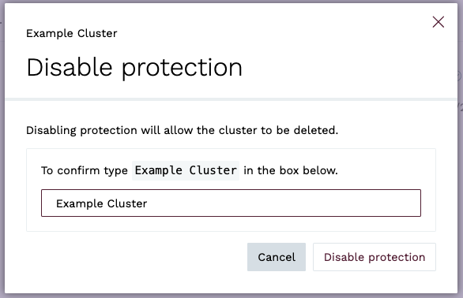

## Viewing clusters

When you create a cluster, from the Clusters view, you will see a list of all your currently provisioned clusters, as well as any clusters that have been deleted within the last 24 hours. For each cluster, you will see the cluster name, type (public or private), cluster ID, provider, region, type, KurrentDB version, status, and date of creation, as well as a set of icons for performing common actions, and a menu with additional actions.


### Details tab

When you select a cluster from the Clusters list, you will see the cluster details page, which includes the cluster Name, ID, provisioning status, and date of creation.


### Provider tab

The Provider tab contains details about the cloud provider, region, type (F1, C4, M8, etc), cluster topology (single node, three node multi zone), disk type, size, and any provider specific details.


### Network tab

The Network tab contains details about the network configuration, including the Network ID, link to the Network details page, network type (public, private).


For public clusters, the network tab also includes the IP Access List ID and a link to the IP Access List.


### Database tab

The Database tab contains details about version of KurrentDB running on the cluster and the health status of the cluster. The `Version` field shows the major release version of KurrentDB, and `Tag` shows the specific patch version.


### Addresses tab

The Addresses tab contains addresses for accessing the cluster UI, as well as URIs for gRPC and TCP clients.


### Issues tab

The Issues tab contains a list of operational issues that have been detected for the cluster, such as if cluster nodes out of sync, high system load or memory usage, low disk space, etc.


You can click on an issue to be taken to the specific issue details page. Additional information on issues can be found in the [Integrations](../integrations/README.md#issues) section.

### Notifications tab

The Notifications tab contains details about provisioning errors, or errors encountered while upgrading or resizing a cluster. Additional information on notifications can be found in the [Integrations](../integrations/README.md#notifications) section.


## Connecting to a cluster

As mentioned above, the **Addresses** tab of a cluster details section contains the addresses to use for accessing the cluster UI, as well as URIs for gRPC and TCP clients. You will also see a button labeled `Connect to <Cluster Name>`. When clicked, a modal will appear that will first check if the cluster is reachable.

If it is, you will get a list of options for connecting to the cluster, including a link to the cluster UI, as well as links to the official KurrentDB client libraries for a variety of languages.


If there are issues connecting to the cluster, you will see some diagnostic information indicating some possible reasons why the connection may be failing.

For example, if the cluster is private and no peering has been established


Another example of a public cluster that is not reachable


If you are having trouble connecting to a cluster, see the [Troubleshooting](../faq.md#troubleshooting) section of the FAQ for more information, and contact our support team if you need assistance.

### DNS names

The format for the DNS name of a cluster follows the pattern `<cluster-id>.mesdb.eventstore.cloud`.

This name resolves to IP addresses of all the cluster nodes or to the IP address of a single instance, depending on the deployment topology. For public clusters, the name resolves to the public IP addresses of the cluster nodes. For private clusters, the name resolves to the private IP addresses of the cluster nodes.

Each cluster node has its own DNS name, which can be used for accessing individual nodes for node-specific operations like stats collection or scavenging.

- **Public Clusters**: The node DNS names follow the pattern `<cluster-id>-<node-id>p.mesdb.eventstore.cloud`. The `p` suffix on the hostname is used for public cluster nodes to indicate that the node is a public node.
- **Private Clusters**: The node DNS names follow the pattern `<cluster-id>-<node-id>.mesdb.eventstore.cloud`.

::: note Additional DNS names for Public Clusters
Public cluster nodes also have a DNS name that follows the same pattern as private clusters, `<cluster-id>-<node-id>.mesdb.eventstore.cloud`. This name resolves to the private IP address of the node and is used for internal communication between the nodes. It is not accessible from the public internet.

You can always check the `/gossip` endpoint from any node to see the list of names clients can use to connect to the individual nodes.
:::

### TLS certificates

Kurrent Cloud provisions secure KurrentDB clusters with TLS enabled for HTTP and gRPC using certificates issued by Let's Encrypt. We automatically renew the certificates before they expire and replace the certificates on all cluster nodes. This is all done with zero impact to client connections or cluster availability.

We do not support using third party certificates or offer private certificate authorities.

## Changing the default passwords

Every KurrentDB cluster starts with two default users: `$admin` and `$ops`. When you create a cluster, those users have the default password `changeit`. It is **strongly recommended** that the first thing you do after creating a cluster is to change the passwords for these users, particularly for clusters that are publically accessible. See the [User Authentication](@server/security/user-authentication#basic-authentication) section of the KurrentDB documentation for details of how to .

::: note Limitation
While the enterprise version of KurrentDB supports authentications methods such as x509 certificates, LDAP, and OAuth, Kurrent Cloud Managed Clusters only support basic authentication.
:::

## Resizing cluster nodes

Clusters can be scaled up or down on-demand to optimize for cost or performance through the [Cloud Console](https://console.kurrent.cloud/) and the [Kurrent Cloud CLI](https://github.com/EventStore/esc). When you resize a cluster, the compute instances that make up the cluster are resized. You can resize a cluster to a larger or smaller node size, but you cannot change the topology of the cluster.

See also the [sizing guide](./sizing.md) for general guidance.

::: note Resizing restrictions
Single-node clusters are not intended for production use. For this reason, the maximum size you can resize a single-node cluster to via the Cloud Console is `M8`.
:::

### Resize operation overview

For multi-node clusters, resizes are done in a rolling fashion, meaning that the cluster is available throughout the resize operation.

Before a resize starts, the cluster health is verified. If there are any issues with the cluster, such as a node is down or is too far out of sync with the cluster, the resize operation will not be allowed to begin. To minimize impact to clients, the two follower nodes are resized one at a time, then before resizing the leader node, the leader is resigned and a leader election is initiated to ensure the final node can be resized without disruption.

Nodes are stopped one at a time, compute instance type is changed, and the node is started again. Once a node has been resized, before proceeding to the next node, the cluster must return to a consistent state before the next node is resized. If any cluster node does not return to a healthy state, the resize operation is aborted and the Cloud team is alerted.

::: note Client connections during resizes
When a cluster node is resized, clients that are connected to that node will be disconnected and automatically reconnect to another node. If the `nodePreference` connection parameter is set to `leader`, the client will reconnect to the new leader once one has been elected.
:::

For single-node instances, the resize operation requires downtime because the compute instance must be stopped. For larger databases, once the node is started again, KurrentDB may take several minutes or more to become available.

### How to resize a cluster

::: tabs#way
@tab Cloud Console

To resize a cluster in the console, navigate to the clusters view and select **Resize Cluster** for the cluster menu icon in the clusters list or from the menu in the cluster details section.


On the detail page, specify the new cluster size and click on **Resize Cluster**.


If there a resize will incur downtime, you will receive a warning before the resize proceeds.


In the cluster view, you can see that the resize is in progress.


Once the resize operation is complete, the new cluster status will return to `Ok` and the new cluster size will be reflected in the **Type** column in the **Clusters List**, as well as under the **Provider** tab in the **Cluster Details** section.

@tab esc

To resize a cluster with the command line, use the `clusters resize` sub-command, where `--target_size` is the target instance size. Possible values are: `F1`, `C4`, `M8`, `M16`, `M32`, `M64`, `M128`.

```bash
esc mesdb clusters resize \
    --target-size C4 \
    --id cn7dd2do0aekgb8nbf20 \
    --project-id cn62uolo0aegb5icm0bg \
    --org-id 9bsv0s4qu99g029v5560
```
:::

## Upgrading KurrentDB version

The KurrentDB version of a cluster can be changed on-demand to any compatible version that is in support through the [Cloud Console](https://console.kurrent.cloud/) and the [Kurrent Cloud CLI](https://github.com/EventStore/esc). You can upgrade to the latest patch release or to a new major version.

::: tip
If a cluster's current version of KurrentDB is compatible with an older version, you can use the upgrade process to downgrade to that older version.
:::

### Upgrade process overview

When upgrading a three-node cluster, the upgrade is done in a rolling fashion, meaning that the cluster is available throughout the upgrade process.

Before an upgrade is started, the cluster health is verified. If there are any issues with the cluster, such as a node is down or is too far out of sync with the cluster, the upgrade operation will not be allowed to begin. To minimize impact to clients, the two follower nodes are upgraded one at a time, then before upgrading the leader node, the leader is resigned and a leader election is initiated to ensure the final node can be upgraded without disruption.

Nodes are stopped one at a time, compute instance type is changed, and the node is started again. Once a node has been upgraded, before proceeding to the next node, the cluster must return to a consistent state before the next node is upgraded. If any cluster node does not return to a healthy state, the upgrade operation is aborted and the Cloud team is alerted.

::: note Client connections during upgrades
When a cluster node is upgraded, clients that are connected to that node will be disconnected and automatically reconnect to another node. If the `nodePreference` connection parameter is set to `leader`, the client will reconnect to the new leader once one has been elected.
:::

Upgrading a single-node instance, on the other hand, does require downtime because the KurrentDB service must be restarted. For larger databases, KurrentDB may take several minutes or more to become available.

::: tabs#way
@tab Cloud Console

In the Clusters view, if there is a dot on the _Upgrade Cluster_ icon for a cluster, this indicates that there is an upgrade available for the current version of the database.


To upgrade the cluster, select **Upgrade Cluster** in the cluster's menu icon in the clusters list, the **Upgrade Cluster** icon, or from the menu in the cluster details section.


On the detail page, specify the new cluster version and click on **Upgrade Cluster**.


In the cluster view, you can see that the upgrade is in progress.


Once the upgrade operation is complete, the new cluster version will show in the cluster view.

If the upgrade cannot be done online, a warning will be displayed and must be confirmed before the upgrade will be started.


@tab esc

To upgrade a cluster with the command line, use the `clusters upgrade` command, where `--target_tag` is the version you want to upgrade to. This must include the full version, e.g. 24.10.1.

```bash
esc mesdb clusters upgrade \
    --target-tag 24.10.1 \
    --id cn7dd2do0aekgb8nbf20 \
    --project-id cn62uolo0aegb5icm0bg \
    --org-id 9bsv0s4qu99g029v5560
```
:::

## Expanding disks

Disks can be expanded on-demand, to accommodate database growth, through the [Cloud Console](https://console.kurrent.cloud/) and the [Kurrent Cloud CLI](https://github.com/EventStore/esc)

See also the cloud [sizing guide](./sizing.md) for general guidance.

::: note Limitation
After modifying a disk for a cluster in **AWS**, you must wait at least **six hours** before you can resize that volume again. See [here](https://docs.aws.amazon.com/ebs/latest/userguide/ebs-modify-volume.html#elastic-volumes-limitations) for more information.
:::

::: tabs#way
@tab Cloud Console

To expand disks in the console, navigate to the clusters view and click on **Expand Disk** in the cluster's menu icon in the clusters list or from the menu in the cluster details section.


On the **Expand Disk** page, specify the new disk size (as well as the disk IOPS and throughput when using the AWS GP3 disk type) and click on **Expand cluster disk**.


You will be redirected to the Clusters view, where you can see that the disk expansion is in progress.


Once the disk expansion operation is complete, the new disk size will show under the **Provider** tab in the **Cluster Details** section.

@tab esc

To expand disks with the command line, use the `clusters expand` command, where `--id` is the cluster id.

```bash
esc mesdb clusters expand \
    --disk-size-in-gb 16 --id c3fi17to0aer9r834480 \
    --project-id c3fhvdto0aepmg0789m0 \
    --org-id bt77lfqrh41scaatc180
```
:::

## Protecting cluster from deletion

Cluster can be protected from accidental deletion using the [Cloud Console](https://console.kurrent.cloud/) and the [Kurrent Cloud CLI](https://github.com/EventStore/esc).


### Enable Protection

::: tabs#way
@tab Cloud Console

To protect a cluster, navigate to the **Clusters view** and click on the **Protect Cluster** icon, the **Enable Protection** the cluster menu icon in the **Clusters list**, or from the menu in the **Cluster details** section.


A confirmation dialog will appear. Click on **Enable Protection**.


You will then see a notification that Protection has been enabled.


Now the option to delete the cluster is disabled.


@tab esc

To protect a cluster, you need to update a value of `protected` parameter to `true`:

```bash:no-line-numbers
esc mesdb clusters update --id cis4pcid60b5q96r8hm0 --protected true
```

:::

### Disable Protection

To delete a protected cluster, you must first disable protection

::: tabs#way
@tab Cloud Console

To disable protection, navigate to the **Clusters view** and click on the **Disable Protection** icon, the **Disable Protection** the cluster menu icon in the **Clusters list**, or from the menu in the **Cluster details** section.


A confirmation dialog will appear. Click on **Disable Protection**.



You will then see a notification that Protection has been disabled.


Now the option to delete the cluster is available again.


@tab esc

```bash:no-line-numbers
esc mesdb clusters update --id cis4pcid60b5q96r8hm0 --protected false
```
:::

## Quotas

Kurrent Cloud has a quota system in place to prevent abuse of the service. Quotas are set at the organization level and currently limit the number of vCPUs that can be provisioned at any given time.

To request a quota increase, please contact our support team.
