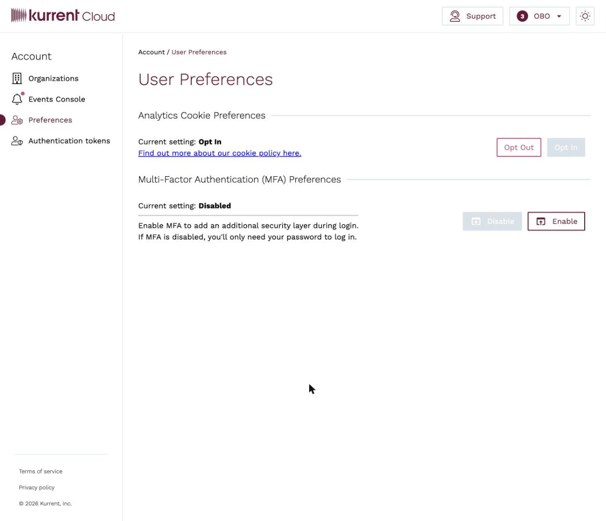
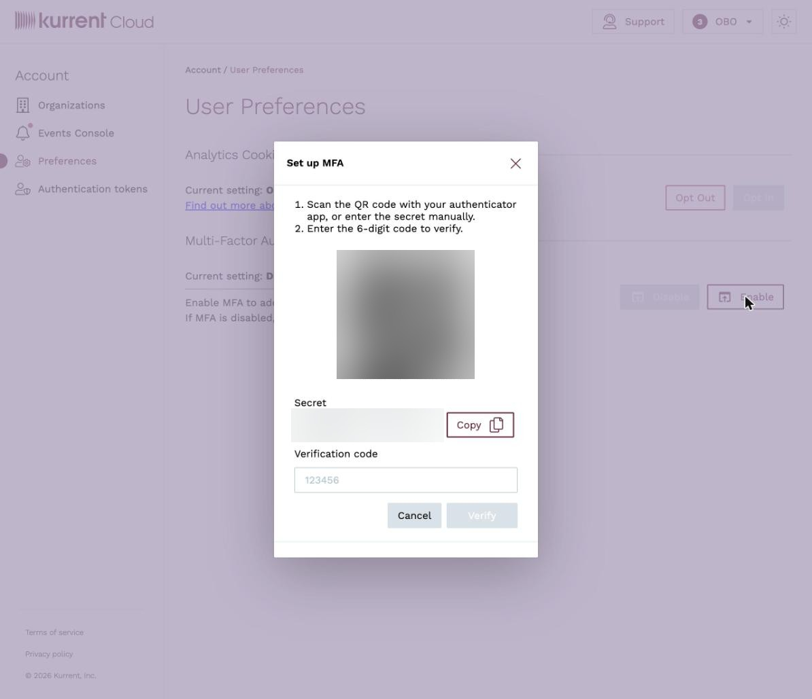
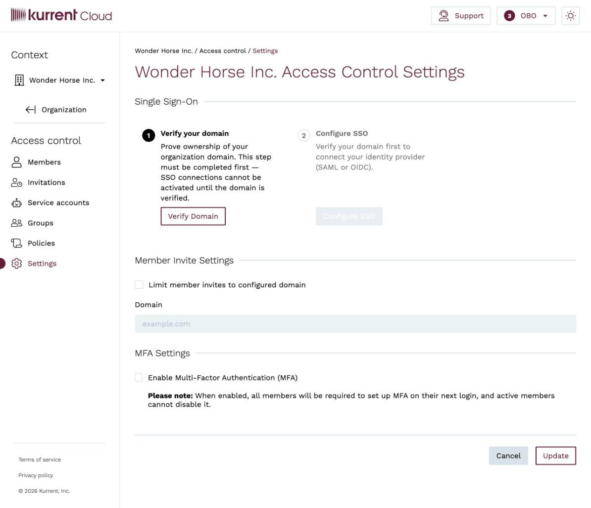

## Multi-factor Authentication (MFA)

Our MFA solution integrates exclusively with authenticator apps, offering a convenient and secure method for users to verify their identities.  When setting up MFA, ensure your device is ready to use, as the process involves generating and entering authenticator codes.

### User MFA

To manage Multi-factor Authentication (MFA) for your account, navigate to [Account Preferences](https://console.kurrent.cloud/preferences). The **Multi-Factor Authentication (MFA) Preferences** section shows whether MFA is currently enabled or disabled.

To turn it on, click **Enable**. A **Set up MFA** dialog appears:

1. Scan the QR code with your authenticator app, or copy the **Secret** and enter it into the app manually.
2. Enter the 6-digit **verification code** generated by the app and click **Verify**.

Once the code is verified, MFA is enabled, and you will be asked for an authenticator code the next time you sign in. To turn MFA off again, return to this page and click **Disable**.

### Require MFA for all organization users

To require MFA for every member of an organization, open the [**Access Control**](../access-control/README.md) menu and select **Settings**.

Under **MFA Settings**, check **Enable Multi-Factor Authentication (MFA)** and click **Update**. To stop requiring it, uncheck the box and click **Update**.

::: warning
When enabled, all members are required to set up MFA on their next login, and members who already have MFA enabled cannot disable it.
:::

## Audit Log API
The Audit Log API displays an organization's activities as a series of events. It provides access to an audit trail of changes made by the current user or for the entire organization.

Audit logs for an organization are only accessible by organization admins. However, any user can view the changes that he/she made in the cloud.

### Get audit logs for the current user

Usage: `esc audit user get`

Optional Parameters:
* `-o, --org-id`: The organization ID for which to retrieve audit logs.
* `-a, --after`: Only get logs after this timestamp.
* `-b, --before`: Only get logs before this timestamp.
* `-l, --limit`: The maximum number of records to retrieve.

### Get audit logs for an entire organization

Usage: `esc audit organization get -o {orgId}`

Required Parameters:
* `-o, --org-id`: The organization ID for which to retrieve audit logs.

Optional Parameters:
* `-a, --after`: Only get logs after this timestamp.
* `-b, --before`: Only get logs before this timestamp.
* `-l, --limit`: The maximum number of records to retrieve.
