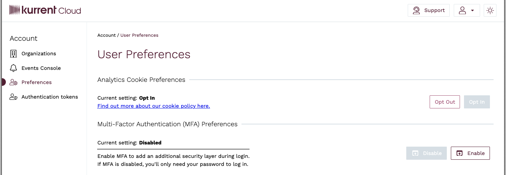
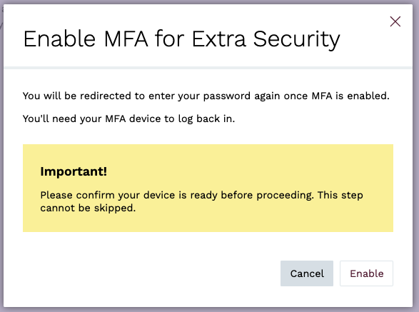
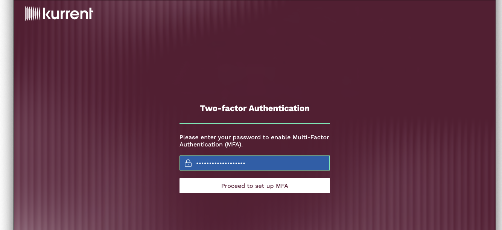
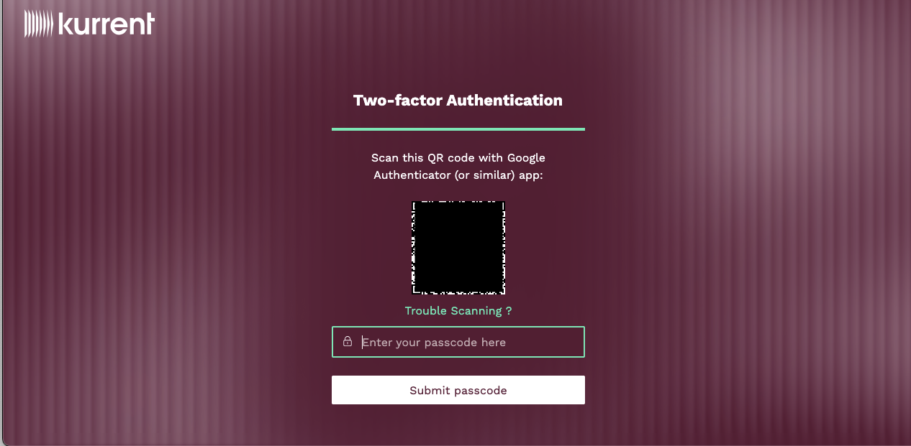
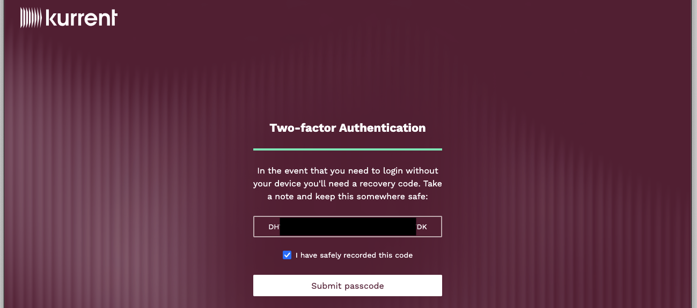
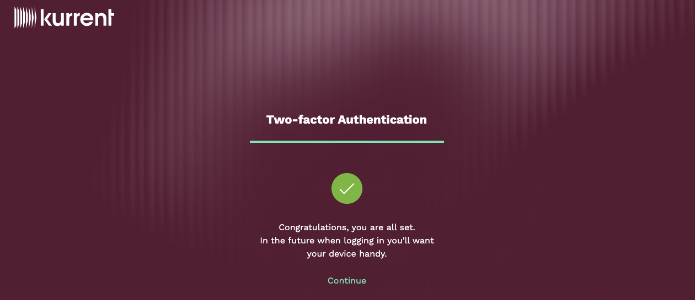
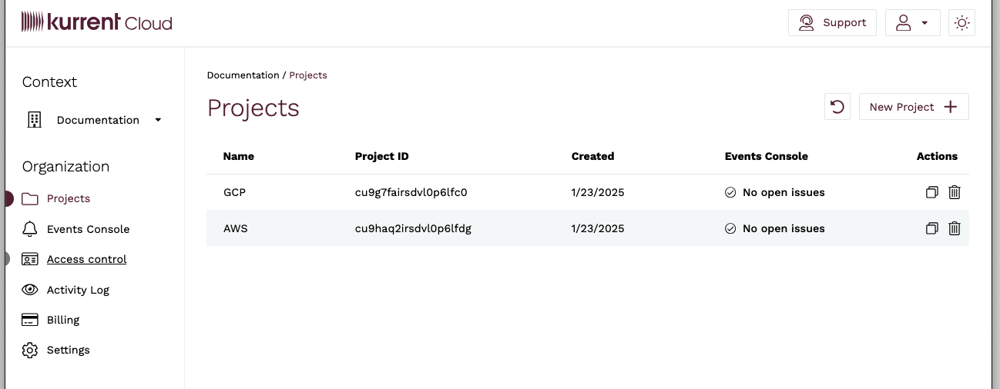
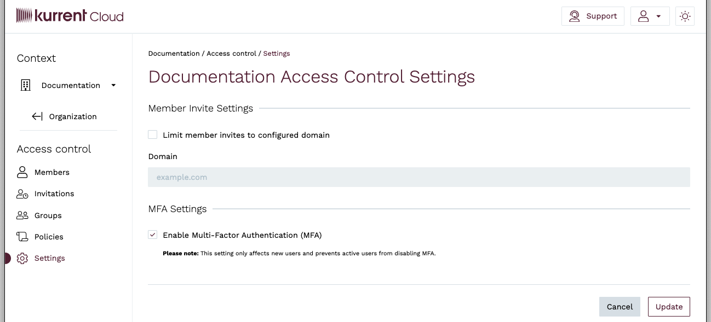

## Multi-factor Authentication (MFA)

Our MFA solution integrates exclusively with authenticator apps, offering a convenient and secure method for users to verify their identities.  When setting up MFA, ensure your device is ready to use, as the process involves generating and entering authenticator codes.

### User MFA

To enable Multi-factor Authentication (MFA) within the user interface, navigate to [Account Preferences](https://console.kurrent.cloud/preferences). Under the **Multi-Factor Authentication (MFA) Preferences** section you will see if your account has MFA enabled or disabled. To enable, click the **Enable** button. If it is currently enabled, you can click the **Disable** button to disable MFA.



When prompted to confirm the MFA setup, click on the **Enable** button.



You will then be taken to the MFA setup page, where you must first enter your password



Next, you will be presented with a QR code. Scan the QR code with your authenticator app. If you are unable to scan the QR code, you can click on **Trouble Scanning?**, which will provide you with the secret key in text format, which you can enter into your authenticator app.



Once you have scanned the QR code and entered the one-time password (OTP) generated by the authenticator, you will be given a recovery code.

::: warning Recovery Code
It is vital you save the recovery code somewhere secure. If you lose access to the authenticator app that is setup to generate the OTP code for your account, your recovery code will be your only way to regain access to your account.
:::



Once you have saved your recovery code, you should see a confirmation message that your MFA setup is complete.



### Re-generating tokens from `esc` with MFA

Once MFA is enabled, tokens generated with the `esc` command-line tool are invalidated. To regain access, generate new tokens using the following command:

```bash
esc access tokens create
```

You will be prompted for your password and an authenticator code as part of the process.

Alternatively, if you prefer to obtain a token through the Cloud Console, navigate to the [Authentication Tokens](https://console.kurrent.cloud/authentication-tokens) page and click the **Request refresh token** button.

### Require MFA for all organization users

To enable MFA for all organization users, navigate to the **Access Control** section for the organization.



Click on **Settings** to get to the Organization Access Control Settings. To enable MFA for the organization, check the _Enable Multi-Factor Authentication (MFA)_ checkbox and click the **Update** button. To disable, uncheck the same checkbox and click **Update**.



::: warning
Enabling MFA for an organization only affects new users and prevents current users who have MFA enabled from disabling it for their account. It does not affect existing users who have MFA disabled.
:::

## Audit Log API
The Audit Log API displays an organization's activities as a series of events. It provides access to an audit trail of changes made by the current user or for the entire organization.

Audit logs for an organization are only accessible by organization admins. However, any user can view the changes that he/she made in the cloud.

### Get audit logs for the current user

Usage: `esc audit user get`

Optional Parameters:
* `-o, --org-id`: The organization ID for which to retrieve audit logs.
* `-a, --after`: Only get logs after this timestamp.
* `-b, --before`: Only get logs before this timestamp.
* `-l, --limit`: The maximum number of records to retrieve.

### Get audit logs for an entire organization

Usage: `esc audit organization get -o {orgId}`

Required Parameters:
* `-o, --org-id`: The organization ID for which to retrieve audit logs.

Optional Parameters:
* `-a, --after`: Only get logs after this timestamp.
* `-b, --before`: Only get logs before this timestamp.
* `-l, --limit`: The maximum number of records to retrieve.
