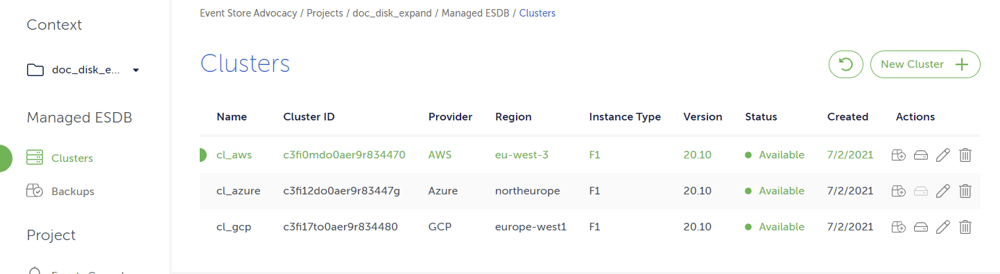
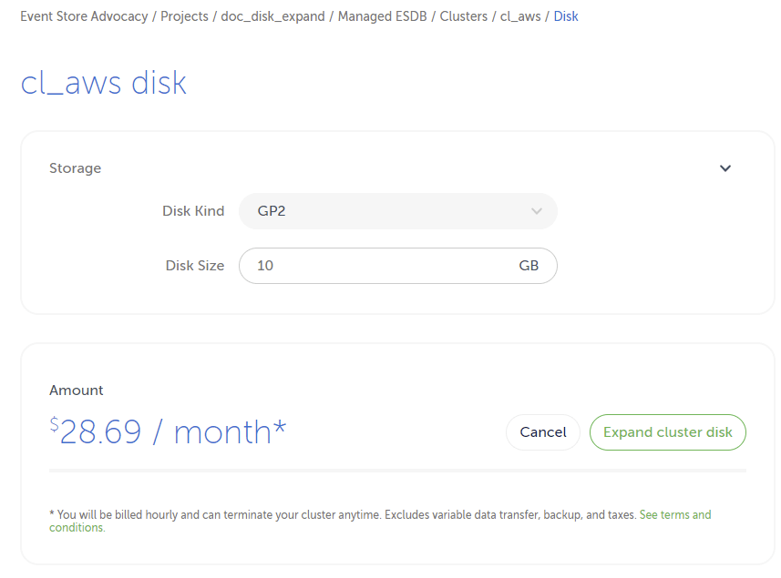

# Expanding disks

Disk can be extended, to accomodate database growth,through the [Cloud Console](https://console.eventstore.cloud/) and the [Event Store Cloud CLI](https://github.com/EventStore/esc)

See also the cloud [sizing guide](/cloud/provision/cloud-instance-guidance/#sizes) for general guidance. 


::: note 
Limitations:  
* on AWS expanding disks is subject to a rate limit, see [here](https://docs.aws.amazon.com/AWSEC2/latest/APIReference/API_ModifyVolume.html) for more information.  
* on Azure, it is currently not possible to expand disks. To increase disk size you need to perform a backup and restore or replicate to a cluster with larger disks.
:::


## Using the Cloud Console

To expand disks in the console, navigate to the clusters view and click on the _Expand Disks_ icon.
::: card

:::
On the detail page specify the new disk size and click on _Expand cluster disk_.
::: card

:::

## Using the command line

To expand disks with  the command line, use the `cluster expand` command, where `--id` is the cluster id. 

``` bash
$ esc mesdb clusters expand --disk-size-in-gb 16 --id c3fi17to0aer9r834480 --project-id c3fhvdto0aepmg0789m0 --org-id bt77lfqrh41scaatc180
```