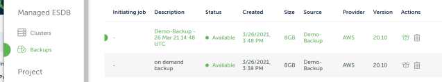
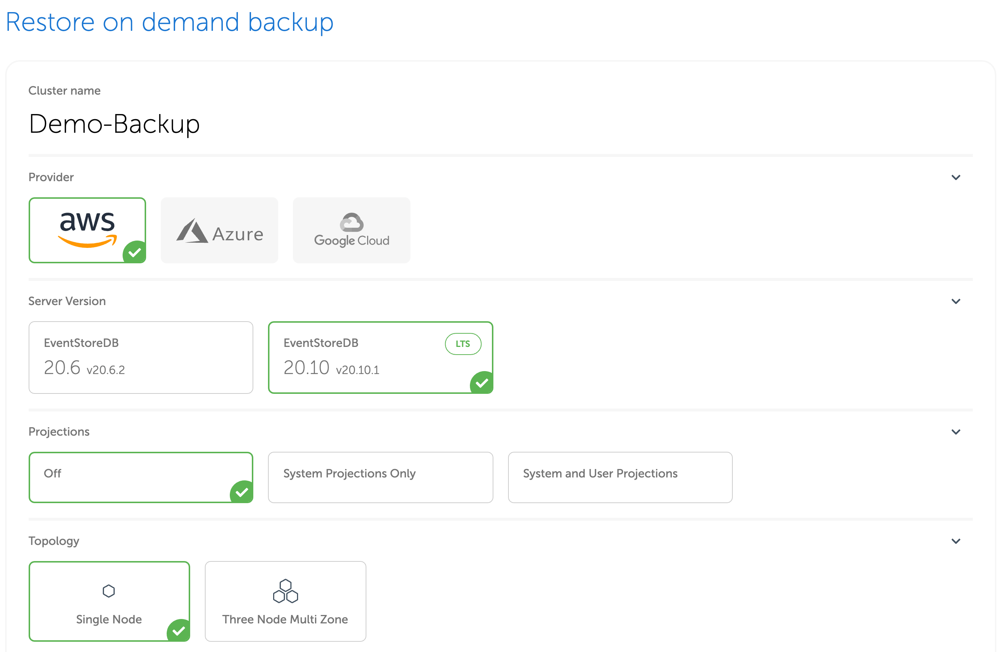

# Restore

To restore a backup, navigate to the `Backups` section fo the [Cloud Console](https://console.eventstore.cloud/) and click on the `Restore` icon of the backup you want to restore.

::: card

:::

Backups are restored as new clusters. You will be then redirected to the usual provisioning page, where you can choose your cluster topology:

::: card

:::