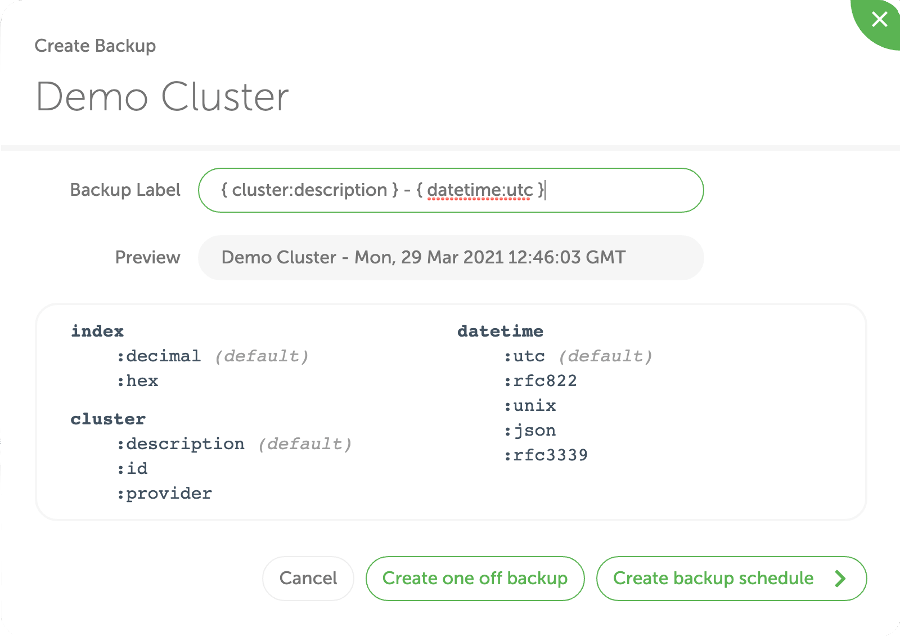
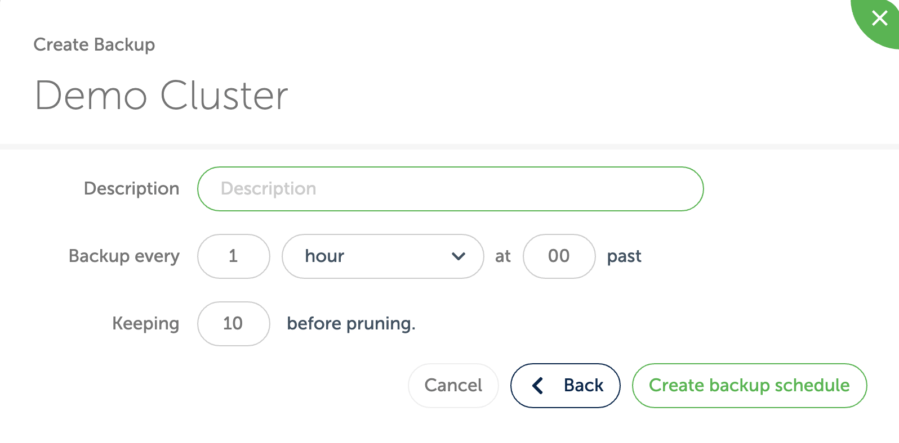
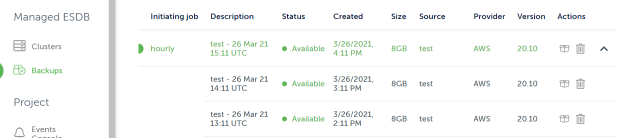
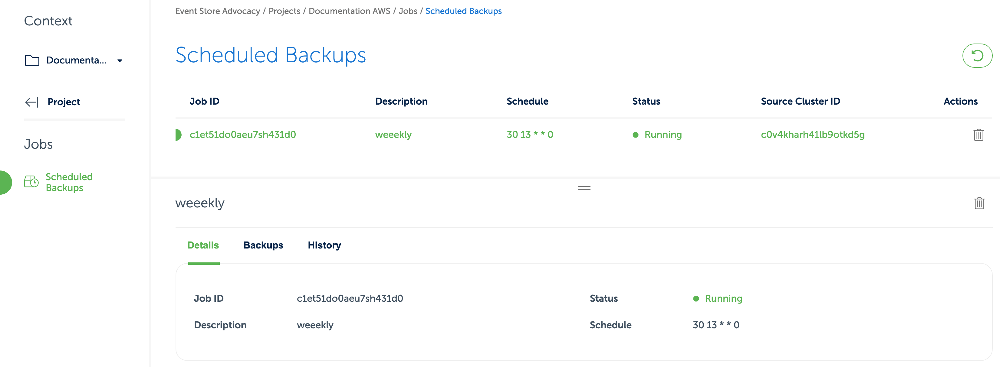

# Scheduled Backups

Scheduled backups can be created through the [Cloud Console](https://console.eventstore.cloud/) and the [Event Store Cloud CLI](https://github.com/EventStore/esc)

Scheduled backup jobs can be run as frequently as once an hour. After each successful backup, older backups created by the same job will be automatically deleted based on the provided configuration.

::: note
Multiple scheduled backups can target the same cluster, though if schedules overlap one of the jobs will fail as the cluster will already be locked.
:::
For example, you could create one scheduled backup that executes every hour, along with a second scheduled backup that executes once a week. Backups from these scheduled jobs are pruned independently regardless of their age, so if both saved a maximum of four backups, the oldest backup from the weekly job might be close to a month old, while the hourly job's backups would never be older than a fraction of a day.


## Console

To create a scheduled backup in the console, navigate to the clusters view and click on the create backup icon and then on `Create backup schedule`.

::: card

:::

Choose a description, the frequency as well as the number of backups to keep before pruning. Finally click the `Create backup schedule` button.

::: card

:::

Backups created this way appear in the console alongside backups created manually. All backups created by the same job will be grouped together in one row, which can be expanded by clicking the down arrow icon on the right side of the row.

::: card

:::

To see the status on the scheduled backup jobs, navigate to the `Jobs` section of the console.

::: card

:::

There you can see all backups created by a job, as well as their history, which operations have failed (if any).
::: note
A backup might fail, for instance, if a cluster is locked by another operation when the backup tries to run.
For instance if the cluster is undergoing an expand disk operation or being backed up manually.
:::
## ESC

A scheduled backup can be created using the Event Store Cloud CLI by using the `orchestrate` subcommand.

The following call will create a new scheduled backup of the cluster with ID `c196ogto0aeqohe3ommq`:

``` bash
esc orchestrate jobs create  --description 'My Hourly Backup' --schedule '0 */1 * * *' scheduled-backup --description '{cluster} Hourly Backup {datetime:RFC3339}' --max-backup-count 2 --cluster-id c196ogto0aeqohe3ommq
```

For details on the scheduled field, see [Job Schedules](./README.md).

To list current jobs, run:

``` bash
esc orchestrate jobs list
```

To view the history of a job, run:

``` bash
esc orchestrate history list --job-id <job-id>
```
