# Event Store Cloud provisioning

Event Store Cloud allows you to provision EventStoreDB clusters in AWS, GCP, and Azure.

The provisioning process consists of the following steps:

1. Create a network in Event Store Cloud.
2. Peer the new network with your own network at the same cloud.
3. Deploy the EventStoreDB cluster.

Find the detailed guideline for your cloud provider:
- [Amazon Web Services (AWS)](#amazon-web-services-aws)
- [Google Cloud Platform (GCP)](#google-cloud-platform-gcp)
- [Microsoft Azure](#microsoft-azure)

This is how networking will look like when all provisioning steps are performed:

::: card
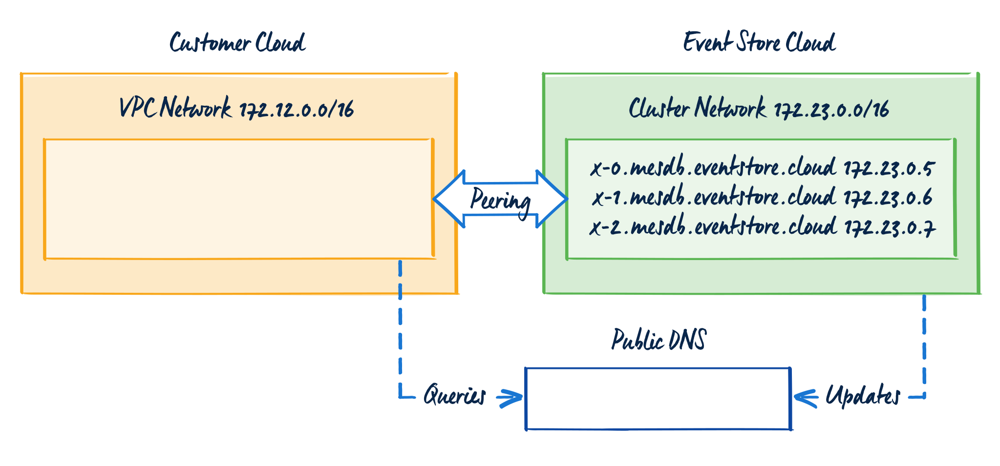
:::

## Amazon Web Services (AWS)

For AWS customers, Event Store Cloud allows provisioning an EventStoreDB cluster in the same cloud. You can create a cluster in the same region to ensure the lowest latency.

Pre-requisites:
- You have an organization registered in Cloud console
- You can log in to the Cloud console as admin
- Your organization has at least one project
- You are the admin of the project
- You have access to create AWS resources in the AWS account of your organization

The provisioning process consists of three steps:
1. Create a network in Event Store Cloud
2. Provision the EventStoreDB instance or cluster
3. Peer the new network with your own AWS network

### Create a network

In the Event Store Cloud console, go to the [project context](../intro/README.md#projects) and switch to `Networks`. Then, click on the `New network` button.

Make sure to fill out the required information:
- Network name
- Cloud provider - AWS
- Region - choose the AWS region
- CIDR block - the new network address range

::: card

:::

In order to establish a connection between the cluster network and your own cloud network, you'd need to peer them. Currently, Event Store Cloud only supports peering within the same region. Therefore, ensure that you choose the same region as your own cloud network.

The network address range should not overlap with the address range of other networks in the same region and with your own AWS network, which you will be peering with. As any other cloud network, the CIDR block needs to be within the range specified by RFC1918.

After specifying all the details, click on the `Create network` button. You will be brought back to the networks list where the new network will appear as being provisioned. The provisioning process in AWS might take up to five minutes. You'd need to click on the refresh button from time to time as the view won't update automatically.

::: card
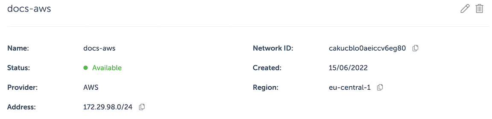
:::

By clicking on the network in the list you can inspect the details like its name, status, region and address range.

Wait until the network becomes `Active` in the list before moving to the next step.

### Deploy a managed instance

Within the project scope you can view EventStoreDB clusters for the project if you click on the `Clusters` menu. Initially, the cluster list is empty and you will only see the `New cluster` button.

When you click on the button, you get to the cluster creation form.

On the first part of the form you need to specify the new cluster name, the cloud provider (AWS) and the EventStoreDB version. Further, you need to choose whether to start server-side projections by default.

::: card
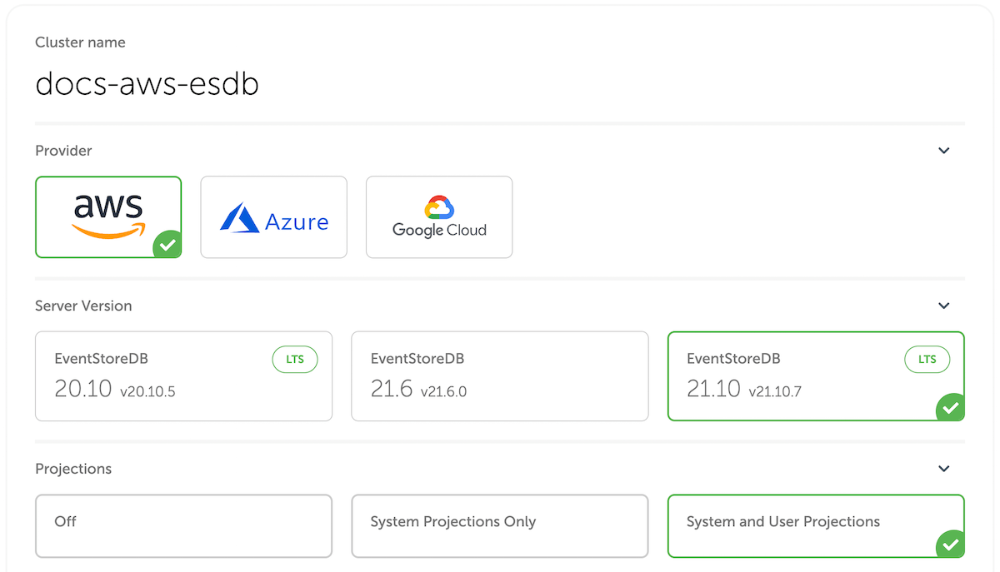
:::

::: warning Projections impact on performance
Both system projections and user-defined projections produce new events. Carefully consider the impact of enabled projections on database performance. Please refer to the [Performance impact](@server/projections.md#performance-impact) section of the projections documentation to learn more.
:::

The next section of the form allows choosing the instance size for cluster nodes. Use the provided instance size guidelines to choose the right size for your cluster. Note that the `F1` size is using burstable VMs, which is not suitable for production use.

::: tip Vertical scaling
At this moment, it is not possible to change the cluster node instance size. You can still resize cluster instances by taking a backup and restoring it to a different cluster with larger or smaller instances.
:::

Further, you need to specify the storage capacity. One disk kind is available at the moment, but you can change the disk size, IOPS and throughput. Since we allow customers to expand the storage size online without service interruptions, you can start with smaller storage and expand it when you need more capacity.

::: note
The cloud console only allows for the creation of GP3 clusters, but for backwards compatibility purposes it is still possible to create a cluster with GP2 storage using tools such as the Terraform provider or Event Store Cloud CLI.
:::

::: card
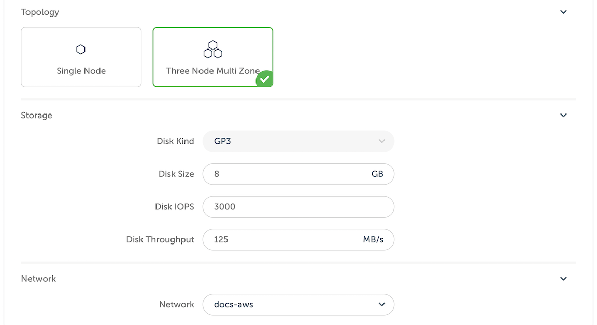
:::

Next, choose the network provisioned previously from the list. All cluster nodes will be attached to that network.

You will get the monthly price for the selected cluster size down below in the form.

Finally, when you click on `Create cluster`, the provisioning process starts, and you will get a new cluster available after a few minutes.

### Network peering

When the cluster provisioning process finishes, you get a new cluster (or single instance), which is connected to the network created in the first step. You won't be able to connect to the cluster since the network is not exposed to the Internet. In order to get access to the network and consequently to all the clusters in that network, you'd need to peer the Event Store Cloud network to your own AWS network. Normally, your AWS network would be also accessible by applications, which you want to connect to the new cloud EventStoreDB cluster.

::: warning Peering limitations
Currently, you can peer one Event Store Cloud network with only one AWS VPC on your account. We expect to lift this limitation in the future.
:::

For this example, we'll use a VPC in AWS in the same region (`eu-central-1`).

::: card
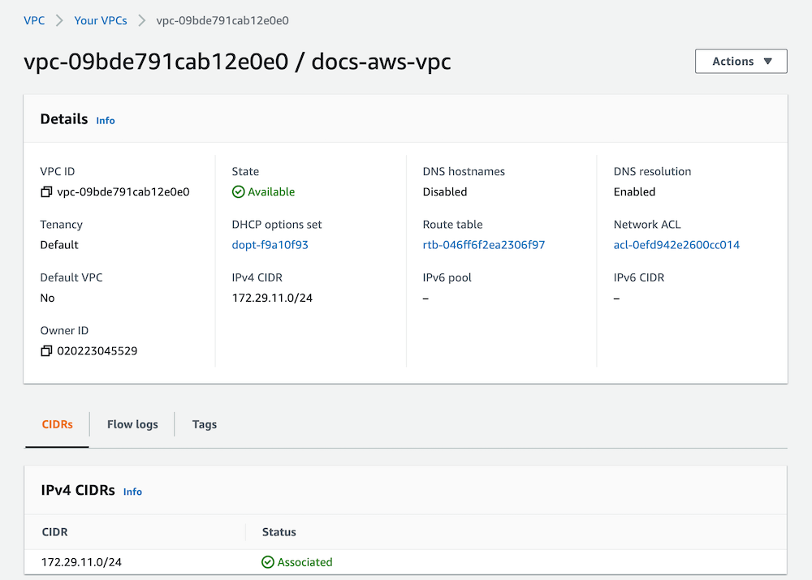
:::

The network page provide us enough details to start the peering process. In Event Store Cloud console, while in the same project context as the new network and cluster, click on `Peering` under the `Project` menu, then click on `New peering`.

Then, give the new peering a name and select the network created earlier.

::: card
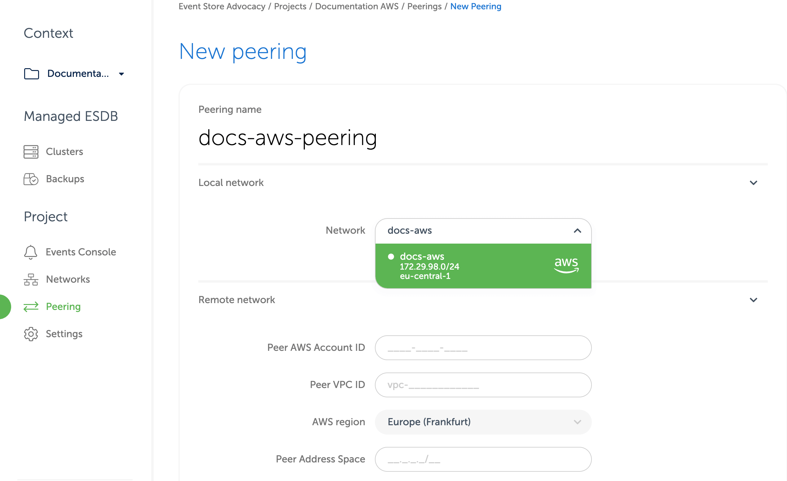
:::

Then, you'd need to fill out the remaining fields, using the information from AWS VPC screen.

| Peering form        | AWS terminology                            |
|:--------------------|:-------------------------------------------|
| Peer AWS Account ID | Owner ID                                   |
| Peer VPC ID         | VPC ID                                     |
| AWS region          | VPC region, cannot be changed              |
| Peer routes         | One or more IP ranges for the selected VPC |

You can specify more than one route if you, for example, want to peer a VPC with multiple subnets. However, the routed IP ranges must belong to subnets in the same region as the Event Store Cloud network.

::: card
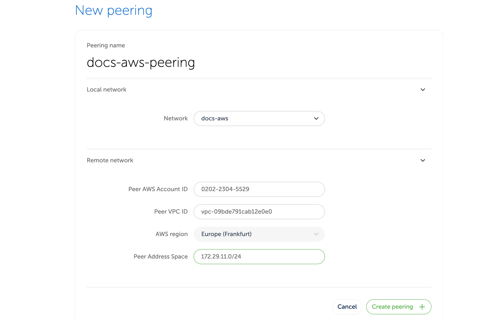
:::

When you click on the `Create peering` button, you'll be redirected to the peering list screen with the new peering resource being provisioned. After a little while, the status will change to `Intiated`. If the status doesn't change after 10 minutes, delete the peering and try again, ensuring the details were entered correctly. Mismatching network region and address range are most common reasons for the peering to not being provisioned properly.

When the peering is initiated, get back to AWS console and navigate to `Virtual Private Cloud` - `Peering Connections list`. There, you will see the incoming peering request.

::: card
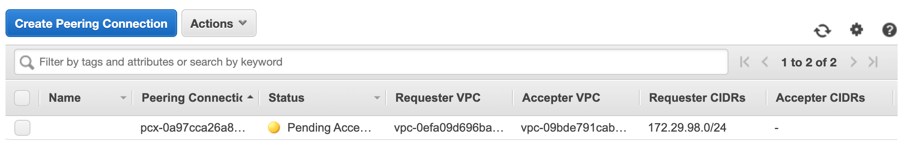
:::

Select the pending peering and click on `Actions` - `Accept request`. Validate the request details and ensure that all the details match the peering, which you can see in Event Store Cloud console. If everything is correct, click on the `Yes, Accept` button. After you get a confirmation, you will see the peering in AWS console to become `Active`. Now, you can get back to Event Store Cloud console, refresh the peering list to ensure that the pending record also changed its status to `Active`.

Now, although both networks are now connected, AWS doesn't create proper routes automatically. To finish the setup, open the AWS VPC details and click on the route table link, then on the `Routes` tab. There you'll see that the network has no route to the Event Store Cloud network, so you need to create one.

Click on `Edit routes` and then `Add route`. In the `Destination`, enter the CIDR of the Event Store Cloud network. For the `Target`, choose the `Peering Connection` option.

::: card
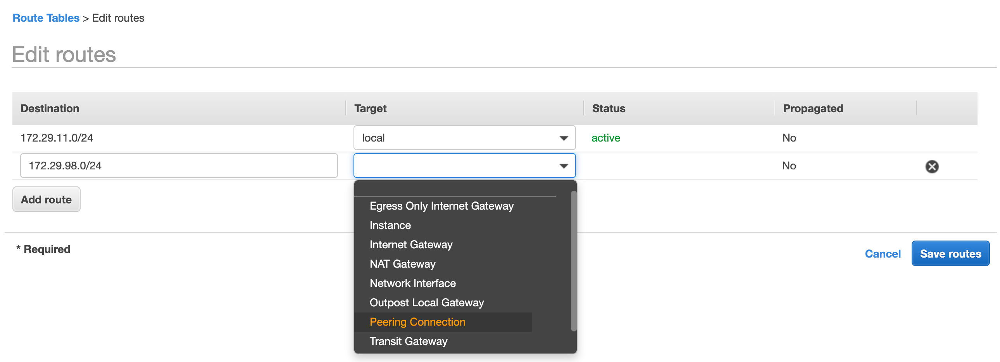
:::

The list of available peering connections will pop up. Select the recently created peering from the list and click on `Save routes`. The route table would then look like shown on the screenshot below.

::: card
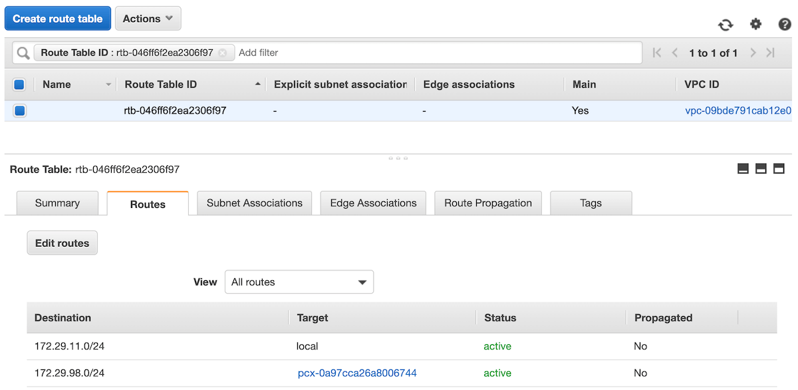
:::

::: tip Peering issues
You might see the peering request getting stuck. There are several reasons for this to happen, like your cloud account quota or overlapping CIDR blocks. You can find all the necessary diagnostics in the [Event Console](../intro/README.md#events-and-notifications) in Event Store Cloud.
:::

At this moment, you should be able to connect to the EventStoreDB cluster in the cloud from any VM, which is connected to your AWS VPC network.

If you are using one or more subnets associated to this VPC, make sure you update the routing table for all of them, not only on the main route table of the VPC.

Depending on your setup, you might already have a connection available from your local machine to the AWS VPC using a site-to-site VPN. If not, ask your AWS administrator about the connection details, which could be a Virtual Private Gateway or Client VPN Endpoint.

### Available regions

As at April 2022 these are the available regions. See this [FAQ](../faq/README.md#what-regions-do-you-support-on-aws-gcp-and-azure) if the region of your choice is missing.

| Code           | Name                      |
|:---------------|:--------------------------|
| ap-northeast-1 | Asia Pacific (Tokyo)      |
| ap-northeast-2 | Asia Pacific (Seoul)      |
| ap-south-1     | Asia Pacific (Mumbai)     |
| ap-southeast-1 | Asia Pacific (Singapore)  |
| ap-southeast-2 | Asia Pacific (Sydney)     |
| ca-central-1   | Canada (Central)          |
| eu-central-1   | Europe (Frankfurt)        |
| eu-north-1     | Europe (Stockholm)        |
| eu-west-1      | Europe (Ireland)          |
| eu-west-2      | Europe (London)           |
| eu-west-3      | Europe (Paris)            |
| sa-east-1      | South America (São Paulo) |
| us-east-1      | US East (N. Virginia)     |
| us-east-2      | US East (Ohio)            |
| us-west-1      | US West (N. California)   |
| us-west-2      | US West (Oregon)          |

### Next step

You are now ready to start using the new EventStoreDB cluster in the cloud. Follow to the [Using the cloud cluster](../use/README.md) section to learn more.

## Microsoft Azure

For Microsoft Azure customers, Event Store Cloud allows provisioning an EventStoreDB cluster in the same cloud. You can create a cluster in the same region to ensure the lowest latency.

::: warning Azure considerations
Microsoft Azure has a few differences that you need to consider when using Event Store Cloud with Azure. We listed all currently known limitations [below on this page](#considerations-for-microsoft-azure). Please ensure you are aware of it before starting to use EventStoreDB in Azure.
:::

Pre-requisites:
- You have an organization registered in Cloud console
- You can log in to the Cloud console as admin
- Your organization has at least one project
- You are the admin of the project
- You have access to create Azure resources in the Azure account of your organization

The provisioning process consists of three steps:
1. Create a network in Event Store Cloud
2. Provision the EventStoreDB instance or cluster
3. Peer the new network with your own Azure network

### Create a network

In the Event Store Cloud console, go to the [project context](../intro/README.md#projects) and switch to `Networks`. Then, click on the `New network` button.

Make sure to fill out the required information:
- Network name
- Cloud provider - Azure
- Region - choose the Azure region
- CIDR block - the new network address range

::: card

:::

In order to establish a connection between the cluster network and your own cloud network, you'd need to peer them. Currently, Event Store Cloud only supports peering within the same region. Therefore, ensure that you choose the same region as your own cloud network.

The network address range should not overlap with the address range of other networks in the same region and with your own Azure network, which you will be peering with. As any other cloud network, the CIDR block needs to be within the range specified by RFC1918.

After specifying all the details, click on the `Create network` button. You will be brought back to the networks list where the new network will appear as being provisioned. The provisioning process in Azure might take several minutes. You'd need to click on the refresh button from time to time as the view won't update automatically.

::: card
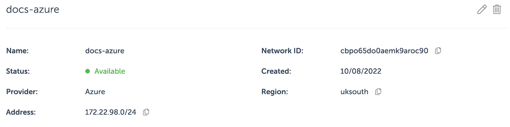
:::

By clicking on the network in the list you can inspect the details like its name, status, region and address range.

Wait until the network becomes `Active` in the list before moving to the next step.

### Deploy a managed instance

Within the project scope you can view EventStoreDB clusters for the project if you click on the `Clusters` menu. Initially, the cluster list is empty and you will only see the `New cluster` button.

When you click on the button, you get to the cluster creation form.

On the first part of the form you need to specify the new cluster name, the cloud provider (Azure) and the EventStoreDB version. Further, you need to choose whether to start server-side projections by default.

::: card
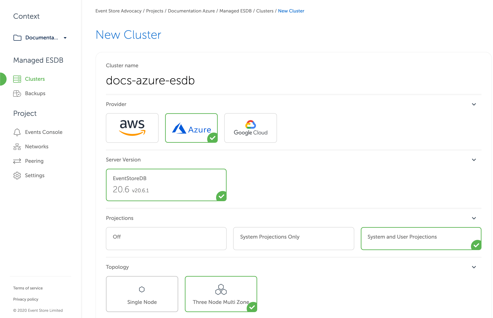
:::

::: warning Projections impact on performance
Both system projections and user-defined projections produce new events. Carefully consider the impact of enabled projections on database performance. Please refer to the [Performance impact](@server/projections.md#performance-impact) section of the projections documentation to learn more.
:::

The next section of the form allows choosing the instance size for cluster nodes. Use the provided instance size guidelines to choose the right size for your cluster. Note that the `F1` size is using burstable VMs, which is not suitable for production use.

::: tip Vertical scaling
At this moment, it is not possible to change the cluster node instance size. You can still resize cluster instances by taking a backup and restoring it to a different cluster with larger or smaller instances.
:::

Further, you need to specify the deployment topology (single node or a three-node HA cluster), and the storage capacity. One disk kind is available at the moment (Premium SSD LRS). **As we currently do not support online disk resize for Azure, you need to ensure that the disk size you choose will support your estimated data volume**.

Next, choose the network provisioned previously from the list. All cluster nodes will be attached to that network.

::: card
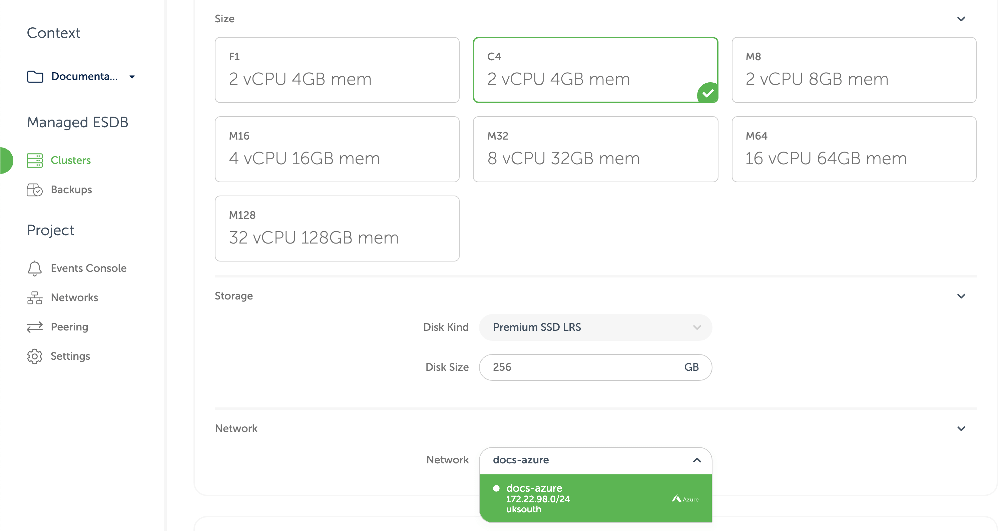
:::

You will get the monthly price for the selected cluster size down below in the form.

Finally, when you click on `Create cluster`, the provisioning process starts and you will get a new cluster available after a few minutes.

### Network peering

When the cluster provisioning process finishes, you get a new cluster (or single node), which is connected to the network created in the first step. You won't be able to connect to the cluster since the network is not exposed to the Internet. In order to get access to the network and consequently to all the clusters in that network, you'd need to peer the Event Store Cloud network to your own Azure network. Normally, your Azure network would be also accessible by applications, which you want to connect to the new cloud EventStoreDB cluster.

::: warning Peering limitations
Currently, you can peer one Event Store Cloud network with only one Azure network on your account. We expect to lift this limitation in the future.
:::

For this example, we'll use an Azure network the same region (UK South).

In Event Store Cloud console, while in the same project context as the new network and cluster, click on `Peering` under the `Project` menu, then click on `New peering`.

Then, give the new peering a name and select the network created earlier.

You also need to find your tenant ID, which is only visible on the Azure AD [properties page](https://aad.portal.azure.com/#blade/Microsoft_AAD_IAM/ActiveDirectoryMenuBlade/Properties). Alternatively, you can use the `Get-AzureADTenantDetails` [PowerShell command](https://docs.microsoft.com/en-us/powershell/module/azuread/Get-AzureADTenantDetail?view=azureadps-2.0).

Finally, you'd need to fill out all the fields:

| Peering form    | Azure network details                                                             |
|:----------------|:----------------------------------------------------------------------------------|
| Peer Tenant ID  | Tenant ID from Azure AD                                                           |
| Peer Network ID | Network resource ID (can be found on the network Properties page or in JSON view) |
| Azure region    | Network region, cannot be changed                                                 |
| Peer routes     | One or more IP ranges for the selected VPC                                        |

For our example, here is the complete form:

::: card
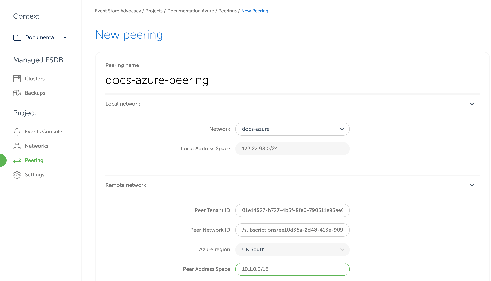
:::

When you click on the `Create peering` button, Event Store Cloud will check if it has permissions to create the peering (see [Azure Considerations](#network-peering-in-azure)). The Cloud console will display a set of pre-populated Azure CLI commands, which you need to execute in order for Event Store Cloud to be able to create the peering.

::: card
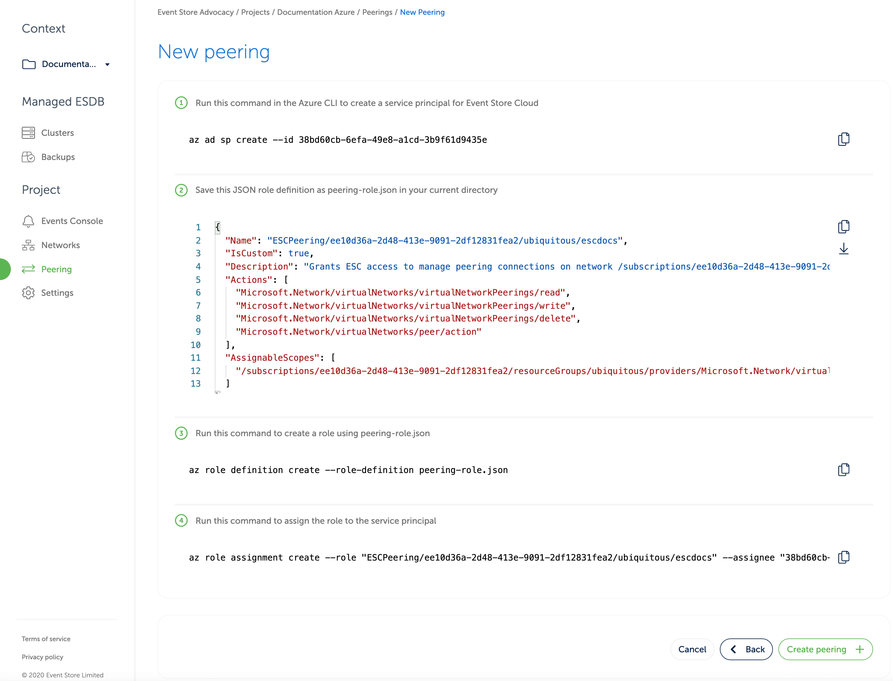
:::

::: tip Service principal
Event Store Cloud uses one service principal. It means that once you created it, the principal will be used for all the peerings you create. Therefore, you only need to execute the command `az ad sp create` once.
:::

After completing all those commands, click on the `Create peering` button. You'll be redirected to the peering list screen with the new peering resource being provisioned. After a little while, the status will change to `Intiated`. If the status doesn't change after 10 minutes, delete the peering and try again, ensuring the details were entered correctly. Mismatching network region and address range are the most common reasons for the peering to not being provisioned properly.

When the peering is initiated, get back to Azure Portal and navigate to the `Peering` page of your Azure network. There, you will see the newly provisioned peering, which should have `Connected` in the `Peering status` column.

In a short while, the initiated peering in Event Store Cloud console should change its status to `Active`. You might need to refresh the list from time to time as it doesn't update automatically.

::: tip Peering issues
You might see the peering request getting stuck. There are several reasons for this to happen, like your cloud account quota or overlapping CIDR blocks. You can find all the necessary diagnostics in the `Event Console` in Event Store Cloud.
:::

At this moment, you should be able to connect to the EventStoreDB cluster in the cloud from any VM, which is connected to your Azure network.

Depending on your setup, you might already have a connection available from your local machine to the Azure network using a site-to-site or point-to-site VPN. If not, ask your Azure administrator about the connection details.

### Available regions

As at July 2022 these are the available regions. See this [FAQ](../faq/README.md#what-regions-do-you-support-on-aws-gcp-and-azure) if the region of your choice is missing.

| Code               | Name                 |
|:-------------------|:---------------------|
| australiaeast      | Australia East       |
| brazilsouth        | Brazil South         |
| canadacentral      | Canada Central       |
| centralus          | Central US           |
| eastasia           | East Asia            |
| eastus             | East US              |
| eastus2            | East US 2            |
| francecentral      | France Central       |
| germanywestcentral | Germany West Central |
| japaneast          | Japan East           |
| koreacentral       | Korea Central        |
| northeurope        | North Europe         |
| norwayeast         | Norway East          |
| southafricanorth   | South Africa North   |
| southcentralus     | South Central US     |
| southeastasia      | Southeast Asia       |
| swedencentral      | Central Sweden       |
| switzerlandnorth   | Switzerland North    |
| uksouth            | UK South             |
| westeurope         | West Europe          |
| westus2            | West US 2            |
| westus3            | West US 3            |

### Next step

You are now ready to start using the new EventStoreDB cluster in the cloud. Follow to the [Using the cloud cluster](../use/README.md) section to learn more.

### Considerations for Microsoft Azure

Due to differences between Microsoft Azure and other cloud providers, the provisioning process in Event Store Cloud is different from AWS and GCP. We've made a list of these differences here in order to help you make an informed decision about Cloud providers.

#### Network peering in Azure

When creating a peering link, Azure requires the user to configure a security principal, referencing the application ID of Event Store Cloud, and also configure and apply a role allowing that principal to modify the network resource of the remote network.

#### Disk resize

Currently, it is impossible to expand disks on Event Store Cloud nodes provisioned to Azure. We plan to provide this feature at a later date, but as there is no native support within Azure, implementing this requires more planning and thought on our part.

There are positive ways around this, and we advise you to choose the disk size accordingly from the start, so the volume size will accommodate the growth of your data over time. You can also backup an existing cluster and restore the data to a new cluster with larger disks.

We're aware that Azure Premium SSD volumes have a strict IOPS limit and this limit depends on the volume size. Very small volumes do not provide enough throughput for most production scenarios. We suggest you consider using at least 246 GiB disks to get enough IOPS for the database. You can check the current throughput limits for Azure Premium SSD volumes in [Azure documentation](https://docs.microsoft.com/en-us/azure/virtual-machines/disks-types#premium-ssd).

#### Resource provisioning

Azure resource provisioning speed will almost always be slower and more highly variable than other providers. Please account for this when interacting with provisioned resources on Azure.

#### Pricing

Prices for computing resources (virtual machines) in Azure are generally higher, compared with AWS and GCP, and this is reflected in the costs for managed EventStoreDB deployments. As EventStoreDB requires at least two CPU cores, and the smallest instance size in Azure is more expensive, the `F1` instance size in Azure is the most expensive of the three cloud providers we offer.

## Google Cloud Platform (GCP)

For Google Cloud customers, Event Store Cloud allows provisioning an EventStoreDB cluster in the same cloud. You can create a cluster in the same region to ensure the lowest latency.

Pre-requisites:
- You have an organization registered in Cloud console
- You can log in to the Cloud console as admin
- Your organization has at least one project
- You are the admin of the project
- You have access to create Google Cloud resources in the GCP project of your organization

The provisioning process consists of three steps:
1. Create a network in Event Store Cloud
2. Provision the EventStoreDB instance or cluster
3. Peer the new network with your own network in GCP

### Create a network

In the Event Store Cloud console, go to the [project context](../intro/README.md#projects) and switch to `Networks`. Then, click on the `New network` button.

Make sure to fill out the required information:
- Network name
- Cloud provider - GCP
- Region - choose the GCP region
- CIDR block - the new network address range

::: card
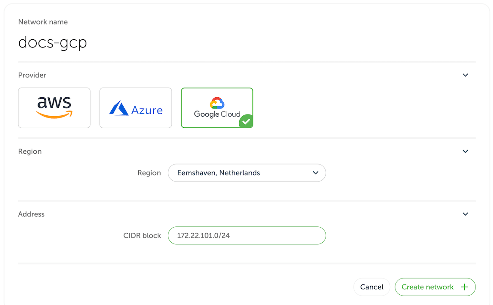
:::

In order to establish a connection between the cluster network and your own cloud network, you'd need to peer them. Currently, Event Store Cloud only supports peering within the same region. Therefore, ensure that you choose the same region as your own cloud network.

The network address range should not overlap with the address range of other networks in the same region and with your own GCP network, which you will be peering with. As any other cloud network, the CIDR block needs to be within the range specified by RFC1918.

After specifying all the details, click on the `Create network` button. You will be brought back to the networks list where the new network will appear as being provisioned. The provisioning process in GCP might take a little while. You'd need to click on the refresh button from time to time as the view won't update automatically.

::: card
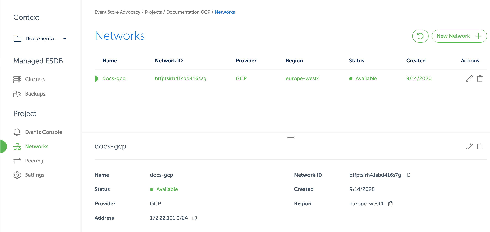
:::

By clicking on the network in the list you can inspect the details like its name, status, region and address range.

Wait until the network becomes `Active` in the list before moving to the next step.

### Deploy a managed instance

Within the project scope you can view EventStoreDB clusters for the project if you click on the `Clusters` menu. Initially, the cluster list is empty and you will only see the `New cluster` button.

When you click on the button, you get to the cluster creation form.

On the first part of the form you need to specify the new cluster name, the cloud provider (GCP) and the EventStoreDB version. Further, you need to choose whether to start server-side projections by default.

::: card
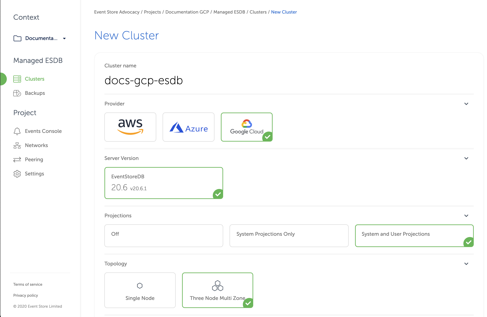
:::

::: warning Projections impact on performance
Both system projections and user-defined projections produce new events. Carefully consider the impact of enabled projections on database performance. Please refer to the [Performance impact](@server/projections.md#performance-impact) section of the projections documentation to learn more.
:::

The next section of the form allows choosing the instance size for cluster nodes. Use the provided instance size guidelines to choose the right size for your cluster. Note that the `F1` size is using burstable VMs, which is not suitable for production use.

::: tip Vertical scaling
At this moment, it is not possible to change the cluster node instance size. You can still resize cluster instances by taking a backup and restoring it to a different cluster with larger or smaller instances.
:::

Further, you need to specify the storage capacity. One disk kind is available at the moment, but you can change the disk size. Since we allow customers to expand the storage size online without service interruptions, you can start with smaller storage and expand it when you need more capacity.

Next, choose the network provisioned previously from the list. All cluster nodes will be attached to that network.

::: card
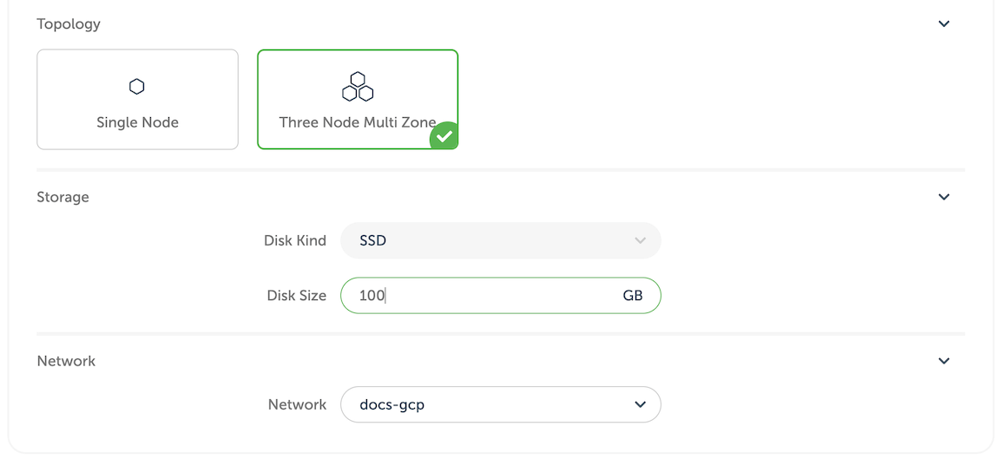
:::

You will get the monthly price for the selected cluster size down below in the form.

Finally, when you click on `Create cluster`, the provisioning process starts, and you will get a new cluster available after a few minutes.

### Network peering

When the cluster provisioning process finishes, you get a new cluster (or single instance), which is connected to the network created in the first step. You won't be able to connect to the cluster since the network is not exposed to the Internet. In order to get access to the network and consequently to all the clusters in that network, you'd need to peer the Event Store Cloud network to your own GCP VPC network. Normally, your GCP VPC network would be also accessible by applications, which you want to connect to the new cloud EventStoreDB cluster.

::: warning Peering limitations
Currently, you can peer one Event Store Cloud network with only one GCP network on your account. We expect to lift this limitation in the future.
:::

For this example, we'll use a VPC network in GCP in the same region (`europe-west-4`).

::: card
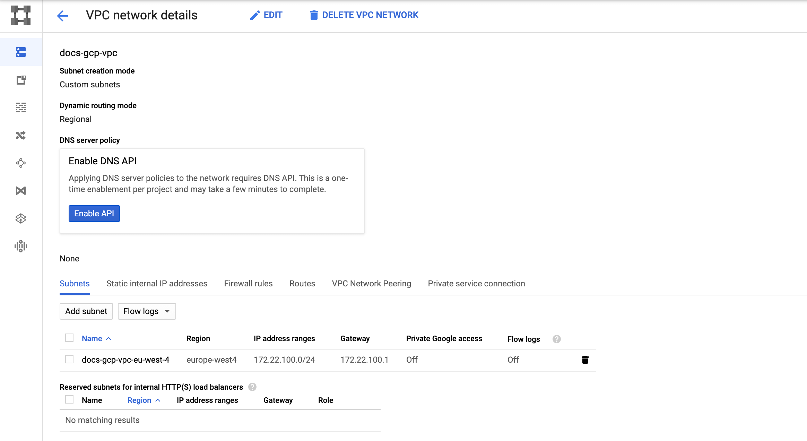
:::

Notice that the VPC has one subnet in the same region as the Event Store Cloud network provisioned earlier.

The network page provide us enough details to start the peering process. In Event Store Cloud console, while in the same project context as the new network and cluster, click on `Peering` under the `Project` menu, then click on `New peering`.

Then, give the new peering a name and select the network created earlier. You'd need to fill out the remaining fields, using the information from GCP VPC. As you are peering with the whole VPC, you can specify multiple IP ranges for different subnets, or multiple IP ranges for the same subnet (GKE aliases, for example) as separate peer routes. However, the routed IP ranges must belong to subnets in the same region as the Event Store Cloud network.

| Peering form        | GCP VPC screen                                       |
|:--------------------|:-----------------------------------------------------|
| Peer GCP Project ID | GCP project ID, found in the project selection popup |
| Peer Network Name   | The VPC name                                         |
| GCP region          | VPC subnet region, cannot be changed                 |
| Peer routes         | One or more VPC subnet address ranges                |

For our example, here is the complete form:

::: card
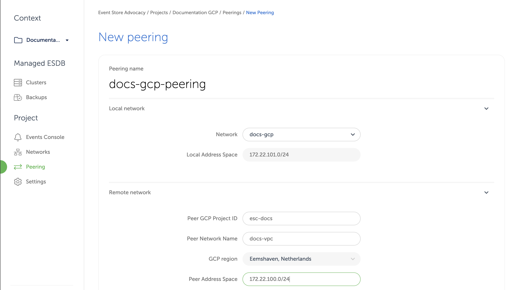
:::

::: note
Multiple peer routes are useful in case you want to peer with a subnet that has multiple IP ranges (aliases). A typical example would be aif you have a VPC-native GKE cluster, and you need pods in that cluster to work with Event Store Cloud. Then, you need to add the pod IP range to the peer route in addition to the subnet's primary IP range.

After a peering is created, the peer routes cannot be changed. If there is a need to modify them, the peering should be deleted and created again with the updated set of peer routes. This is true even in the cases, where a cloud provider supports dynamic route updates, e.g. in GCP. The reason is that the EventStore automation creates firewall rules for the peer routes at the moment the peering is created. The firewall rules are not updated dynamically to prevent security breaches.
:::

When you click on the `Create peering` button, you'll be redirected to the peering list screen with the new peering resource being provisioned. After a little while, the status will change to `Intiated`.

::: card
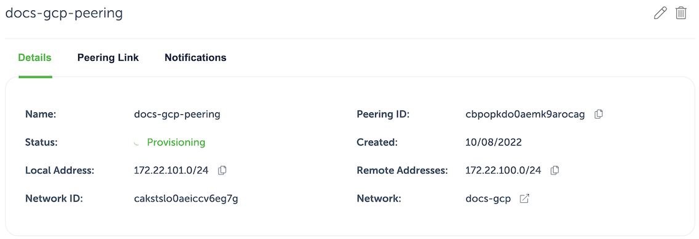
:::

The information on the peering details screen provides some essential information to complete the peering process from GCP side.

When the peering is initiated, get back to Google Cloud console and navigate to `VPC network peering`. There, click `Create connection` and then `Continue`. Give new peering a name and choose the network on GCP side. Next, fill out the remaining values using the initiated peering details:

| Event Store Cloud | GCP connection peering |
|:------------------|:-----------------------|
| Peer Project ID   | Project ID             |
| Peer Network Name | VPC network name       |

**Important**: expand the `Exchange custom routes` section and enable both `Import` and `Export` options for custom routes. It will instruct GCP to create routes automatically.

Here is how our example GCP peering form would look like:

::: card
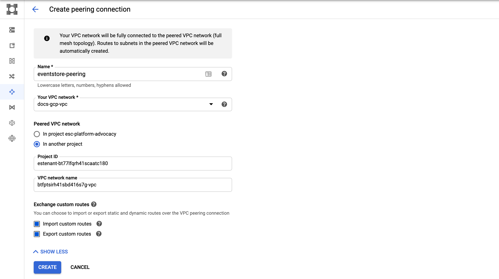
:::

Click the `Create` button and when in the `VPC network peering` list, click `Refresh` until the peering status changes to `Active`. The peering status in Event Store Cloud console should also change to `Active`.

::: tip Peering issues
You might see the peering request getting stuck. There are several reasons for this to happen, like your cloud account quota or overlapping CIDR blocks. You can find all the necessary diagnostics in the `Event Console` in Event Store Cloud.
:::

At this moment, you should be able to connect to the EventStoreDB cluster in the cloud from any VM, which is connected to your GCP VPC network.

Depending on your setup, you might already have a connection available from your local machine to the GCP VPC using a site-to-site VPN. If not, ask your operations about the connection details.

### Available regions

As at June 2022 these are the available regions. See this [FAQ](../faq/README.md#what-regions-do-you-support-on-aws-gcp-and-azure) if the region of your choice is missing.

| Code                    | Name                               |
|:------------------------|:-----------------------------------|
| asia-east1              | Changhua County, Taiwan            |
| asia-east2              | Hong Kong                          |
| asia-northeast1         | Tokyo, Japan                       |
| asia-northeast2         | Osaka, Japan                       |
| asia-northeast3         | Seoul, South Korea                 |
| asia-south1             | Mumbai, India                      |
| asia-southeast1         | Jurong West, Singapore             |
| asia-southeast2         | Jakarta, Indonesia                 |
| australia-southeast1    | Sydney, Australia                  |
| europe-north1           | Hamina, Finland                    |
| europe-west1            | St. Ghislain, Belgium              |
| europe-west2            | London, England, UK                |
| europe-west3            | Frankfurt, Germany                 |
| europe-west4            | Eemshaven, Netherlands             |
| europe-west6            | Zürich, Switzerland                |
| northamerica-northeast1 | Montréal, Québec, Canada           |
| southamerica-east1      | Osasco (São Paulo), Brazil         |
| us-central1             | Council Bluffs, Iowa, USA          |
| us-east1                | Moncks Corner, South Carolina, USA |
| us-east4                | Ashburn, Northern Virginia, USA    |
| us-west1                | The Dalles,Oregon, USA             |
| us-west2                | Los Angeles, California, USA       |
| us-west3                | Salt Lake City, Utah , USA         |
| us-west4                | Las Vegas, Nevada, USA             |

### Next step

You are now ready to start using the new EventStoreDB cluster in the cloud. Follow to the [Using the cloud cluster](../use/README.md) section to learn more.

## Cloud instance sizing guide

Use this guide to assess the needs of your application performance, compared with the capability of a given EventStoreDB instance in Event Store Cloud.

### Instance performance

Performance of the managed EventStoreDB cluster in ES Cloud depends primarily on the instance size for cluster members. In addition, the disk size could affect the instance IOPS limit when it comes to reading and writing events to the database.
We rate instances based on the desired usage. Our current rating include:

* Micro
* Development
* Production

#### Throughput

A wide variety of factors impact total Event throughput on a cluster, including Events per batch and Event size and the active number of streams in the working set.

We have profiled using single event transactions for the production rated clusters and confirmed they can operate at 20k tx/sec throughput (concurrent read and write) given the correct configuration for concurrent clients, a given disk size, and Working Set. It's possible to increase the throughput by using batched write operations, but the impact of batching heavily depends on the batch size in bytes. Before placing any application into production, it is vital to perform a performance test on the planned instance to assess how these factors apply to your application.

::: note
The **Working Set** is the number of streams being read from and written to **concurrently**. It's essential to recognise that writing one million events into one million streams is a very different scenario than writing one million events into a single stream.
:::

#### Cloud vs self-hosted and development setups

When load testing an application against Event Store Cloud EventStoreDB clusters, performance may differ from a self-hosted solution when utilizing a similar instance size.

Event Store Cloud utilizes [ZFS](https://en.wikipedia.org/wiki/ZFS) to ensure filesystem integrity/safety as well as block level compression, to ensure the minimization of IOPs and a lower storage cost for data hosted.

ZFS requires additional CPU and memory to provide these capabilities. As such a self-hosted comparison should utilize a similar configuration in order to provide a relevant comparison.

EventStoreDB requires CPU cycles to maintain indexes, and for other maintenance processes. Underpopulated or underloaded databases (such as demo or development setups) require little CPU time and overperform compared to fully populated systems with consistent throughput. Expect performance to level off as workloads increase.

#### Micro (F1) instance sizes

F1 instance size is designed for a low-cost development environment. We recommend using it for the experiments like Proof of Concept or extremely low workload like 10-100 events a day per database (cluster). F1 instances are using a burstable CPU class to enable this goal across all supported public clouds.

Due to the burstable CPU class, CPU shares are limited, this results in the following implications:
- If CPU shares are not available and allocations are increasing this may result in client timeouts to the cluster or an out of memory condition.
- CPU shares are required to maintain the cluster state topology via constant gossip message propagation. It means that the cluster needs CPU shares to maintain cluster state even when it's is not under load.
- If a continuous load is applied it may be possible to exhaust the allowed CPU shares per time cycle, resulting in client timeouts or out of memory conditions.
- When ESC exited Preview and went into GA we increased the size of the backing instance type as the original F1 instance size was too small to provide enough memory and CPU shares to maintain cluster state adequately even at extremely low volumes. A backup and restore is required to move to the new backing size.

### Sizes

| Size     | Rating                         | Working Set (streams) | Disk size (min) | Concurrent clients (max) |
|:---------|:-------------------------------|:----------------------|:----------------|:-------------------------|
| **F1**   | Micro                          | 100k                  | 50 GB           |                          |
| **C4**   | Development                    | 500k                  | 100 GB          |                          |
| **M8**   | Development                    | 1M                    | 250 GB          |                          |
| **M16**  | Development / Light Production | 6M                    | 500 GB          | 20                       |
| **M32**  | Production                     | 12M                   | 1 TB            | 250                      |
| **M64**  | Production                     | 30M                   | 2 TB            | 500                      |
| **M128** | Production                     | 62M                   | 4 TB            | 500                      |

### Disk Types

#### GP2 to GP3 Migration

GP3 disk type provides better base performance for disks smaller 1TB, GP2 provides minimum 100 IOPS with [burst balance](https://docs.aws.amazon.com/AWSEC2/latest/UserGuide/ebs-volume-types.html#EBSVolumeTypes_gp2), IOPS and throughput depends on a disk size. GP3 gives 3000 IOPS / 125MB/s throughput by default and provides an ability to configure it. There is no downtime or performance degradation during the migration.
