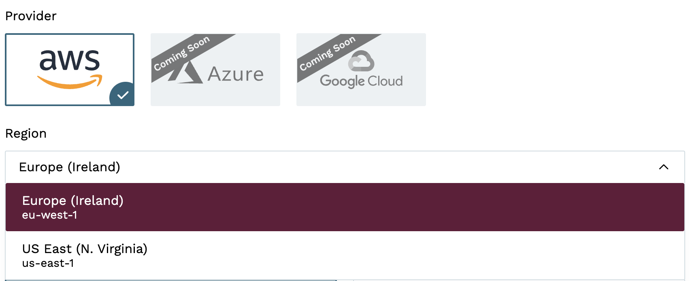
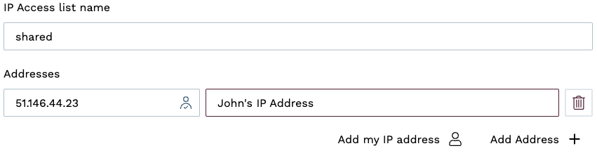
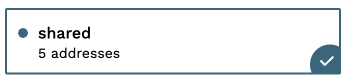
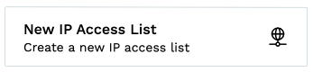
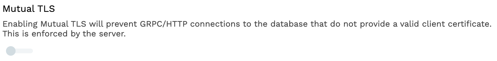
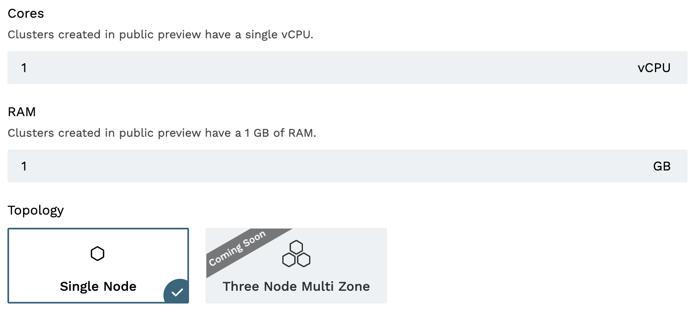
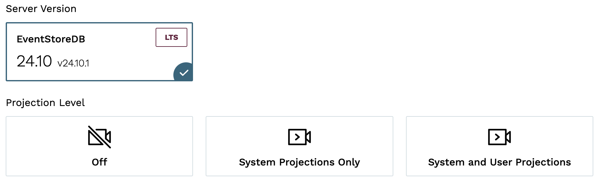

The fastest way to deploy and start using a KurrentDB cluster is on shared infrastructure.

Pre-requisites:
- You have an organization registered in Cloud console
- You can log in to the Cloud console as admin
- Your organization has at least one project
- You are the admin of the project

Note, see the [Quick Start](../../introduction.md#cloud-quick-start) section for more details on how to configure these  items.

## Create a cluster

In the Kurrent Cloud console, go to the [project context](../../introduction.md#projects) and switch to **Clusters**. Then, click on the **New cluster** button to begin the cluster creation process.

### Cluster name

Provide a descriptive name for the cluster in the **Cluster name** field.

### Infrastructure type

Select the `Shared` infrastructure type.

### Cloud Provider

This section allows you to select the Cloud provider and where to host the database cluster. Note, AWS is the default choice (more providers will be added soon). Two regions are currently available:
- us-east-1
- eu-west-1

### Security

#### IP Access List

Every database cluster created will leverage an `IP Access List` that governs who may connect, this is based on IP address filtering.

If you have not created an `IP Access List` yet, you will see fields for defining a new list.

**IP Access List name** a unique name for the list.

**Addresses** allow you to specify the IP addresses or IP ranges in CIDR notation. These are used to allow access to the cluster from the public Internet. You can optionally add a comment for each address to help keep track of what the address is for. For convenience, you can use the **Add my IP address** button to add your current IP address to the list. Note, if you are not sure about your IP address, you can update the list later.

::: tip Add my IP address
Depending on your network configuration, the **Add my IP address** button may not get the correct IP address. If you are on a public network or a network that you don't use regularly, it would be best to wait and add your IP address later once you are on a network that you will use to connect to the cluster.
:::

If you have an existing `IP Access List`, then select it from the available options. For example:

When an existing set of `IP Access List`'s exist, you will see the button shown below to create a new one:

#### Mutual TLS

Enabling Mutual TLS (mTLS) requires a client to present a certificate signed by a private authority for authentication. These certificates will be automatically generated and available to download once the database is deployed. Note, this affects all GRPC (client -> database) and HTTP (UI) connections.

Use this option when an additional layer of security is required on top of `IP Access List`'s. Note that clients and users of the database will need to perform extra steps to configure certificates locally within their keychains (see the [security](../ops/security.md) section for more details).

### Instance size

During the preview, the instance size is fixed to a single node that uses:

- 1 vCPU
- 1GB RAM

### Database

The Database section is where you can specify the database settings for the cluster.

You will need to select the **Server Version**, and choose whether to start server-side projections by default.

::: warning Projections impact on performance
Both system projections and user-defined projections produce new events. Carefully consider the impact of enabled projections on database performance. Please refer to the [Performance impact](@server/features/projections/README.md#performance-impact) section of the projections documentation to learn more.
:::

### Storage

During the preview, the storage size is fixed to 512mb which is backed by a GP3 volume in AWS.

### Pricing

Finally, you will see the estimated monthly price for the selected cluster. **During the preview, each organization can create up to two database instances at no cost.**

## Provisioning

Clicking the `Create cluster` button will start the provisioning process. The cluster will immediately be visible in the list of clusters. If you have opted to create an `IP Access List`, it will be created followed by the cluster itself. After a few minutes, your new cluster will be ready to use.

## Next steps

You are now ready to start using the new Managed KurrentDB cluster in the cloud. Head over to the [Operations](../../shared-infrastructure/ops/README.md) page to learn how to connect to your cluster.