## Viewing clusters

When you create a cluster, from the Clusters view, you will see a list of all your currently provisioned clusters, as well as any clusters that have been deleted within the last 24 hours. For each cluster, you will see the cluster name, type (shared, public or private), cluster ID, provider, region, type, KurrentDB version, status, and date of creation, as well as a set of icons for performing common actions, and a menu with additional actions.

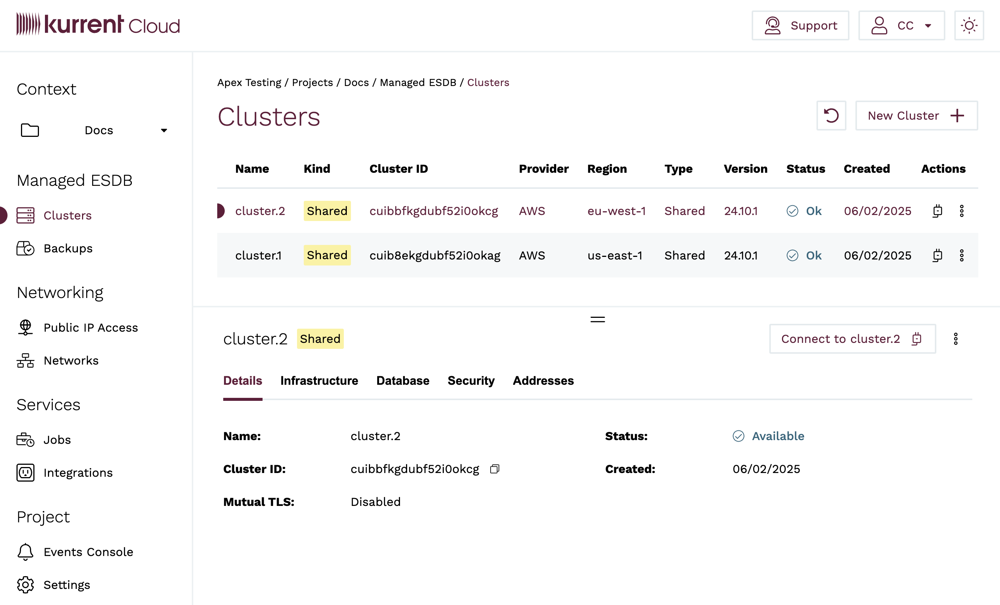

### Details tab

When you select a cluster from the Clusters list, you will see the cluster details page, which includes the cluster Name, ID, provisioning status, mutual TLS status, and date of creation.

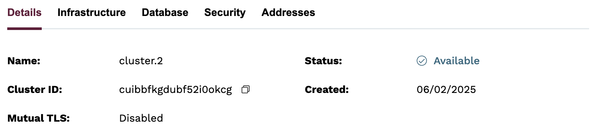
### Infrastructure tab

The Infrastructure tab contains details about the cloud provider, region, type (F1, C4, M8, etc), cluster topology (single node, three node multi zone), disk type, size, and any provider specific details.

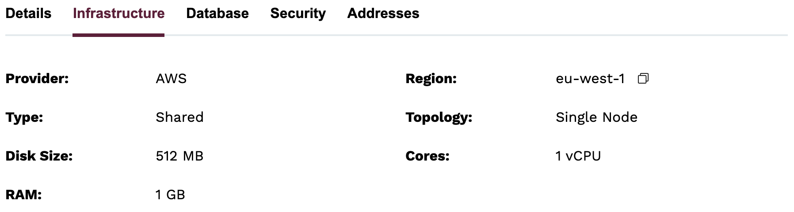

### Database tab

The Database tab contains details about version of KurrentDB running on the cluster and the health status of the cluster. The `Version` field shows the major release version of KurrentDB, and `Tag` shows the specific patch version.

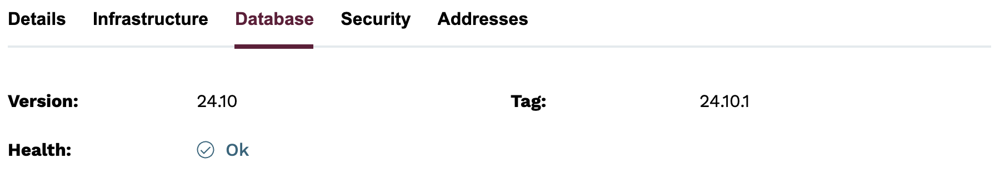

### Security tab

The Security tab contains important information related to connecting to your cluster securely.

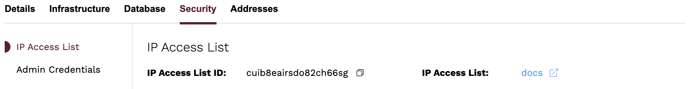

#### IP Access List

Contains information related to the `IP Access List` that is attached to the cluster. A link is present that allows you to edit the list entries.

#### Admin Credentials

During the deployment process, Kurrent Cloud will automatically generate an initial password for the `admin` user. This password can be unmasked by click the button that looks like an eye. The password may also be copied using the button next the to field.

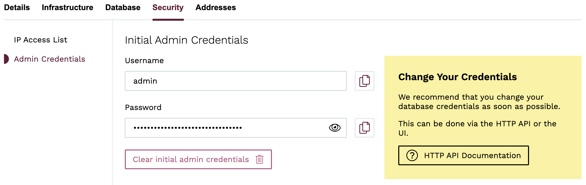

#### Certificate Bundle (visible when Mutual TLS is enabled)

During the deployment process, Kurrent Cloud will automatically generate a certificate bundle when Mutual TLS is enabled. The bundle can be downloaded by clicking the `Download Certificate Bundle`, which start to download a file named `certificate_bundle.tar.gz`.

Once downloaded the files should be extracted and installed to the local system. Pick the tab relevant to your situation, for example, Windows users will want to pick the `Windows` tab. Note that the bundle contains a file called `bundle.p12` which allows the private certificate authority, TLS client certificate and key to be easily imported to the local keychain. The password will be required during the import process and can be copied from the masked field. The eye button can also be clicked to reveal it. 

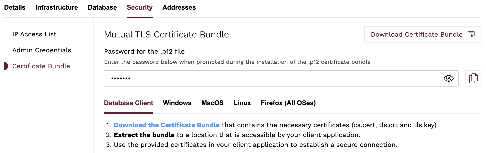

### Addresses tab

The Addresses tab contains addresses for accessing the cluster UI, as well as URIs for GRPC clients.

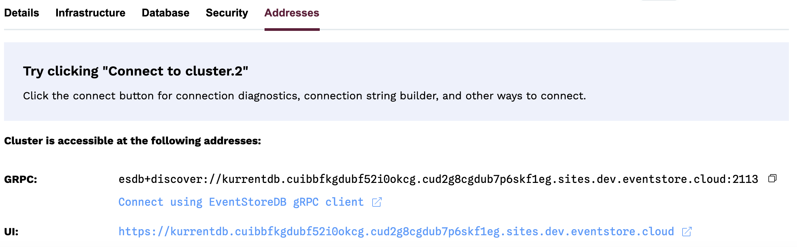

## Connecting to a cluster

As mentioned above, the **Addresses** tab of a cluster details section contains the addresses to use for accessing the cluster UI, as well as URIs for GRPC clients. You will also see a button labeled `Connect to <Cluster Name>`. When clicked, a modal will appear that will first check if the cluster is reachable.

If it is, you will get a list of options for connecting to the cluster, including a link to the cluster UI, as well as links to the official KurrentDB client libraries for a variety of languages.

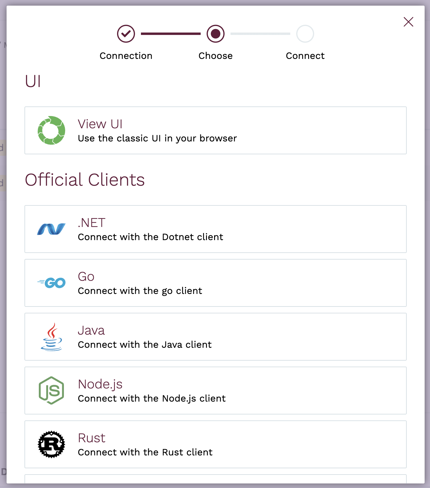

If there are issues connecting to the cluster, you will see some diagnostic information indicating some possible reasons why the connection may be failing.

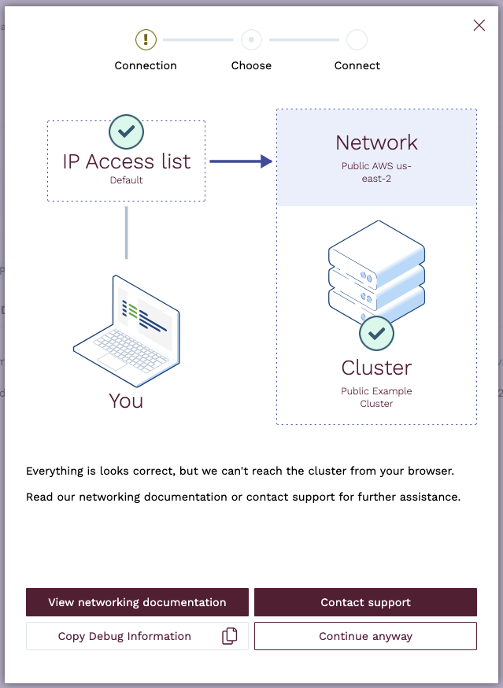

If Mutual TLS is enabled, you will see a notice about installing client certificates:

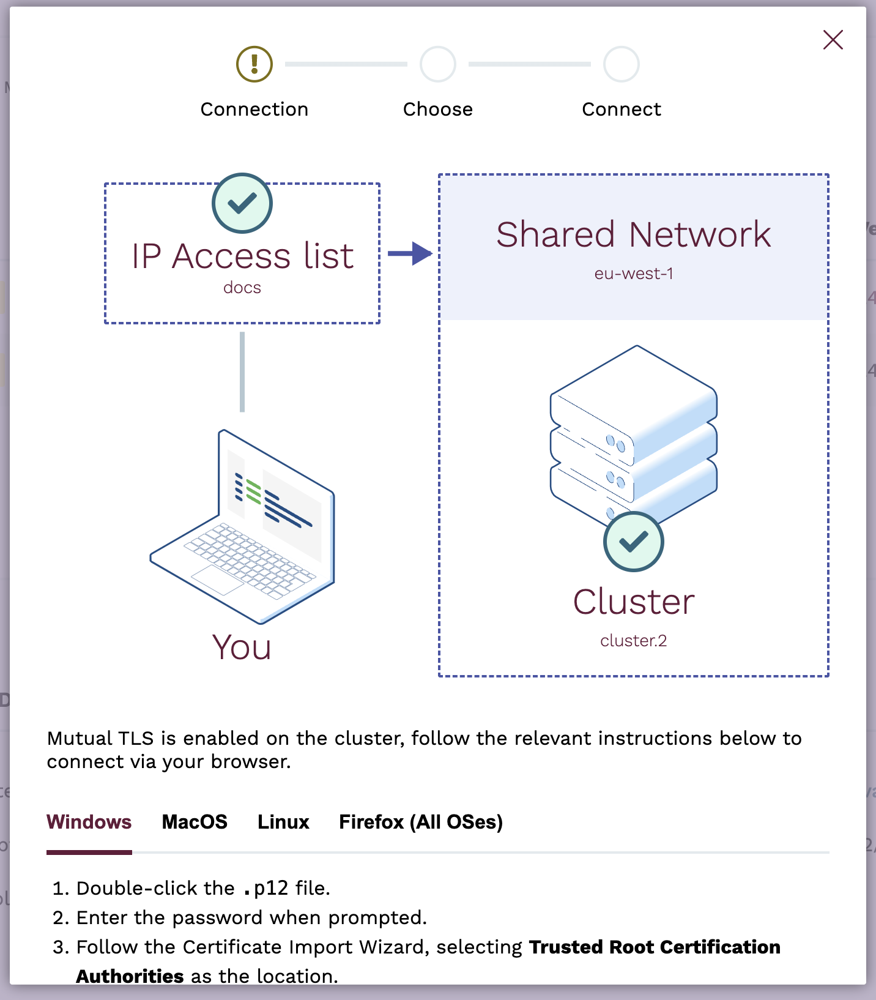

In this case, follow the instructions to verify that your certificates have been installed correctly.

If you are having trouble connecting to a cluster, see the [Troubleshooting](../faq.md#troubleshooting) section of the FAQ for more information, and contact our support team if you need assistance.

### DNS names

The format for the DNS name of a cluster follows the pattern `<database node>.<cluster-id>.<load-balancer-id>.sites.eventstore.cloud`.

This name resolves to the load balancer IP address that the database cluster is attached to.

Each cluster node has its own DNS name, which can be used for accessing individual nodes for node-specific operations like stats collection or scavenging. For example:
`kurrentdb-0.kurrentdb.<cluster-id>.<load-balancer-id>.sites.eventstore.cloud`.

### TLS certificates

Kurrent Cloud provisions secure KurrentDB clusters with TLS enabled for HTTP and GRPC using certificates issued by Let's Encrypt, or when Mutual TLS is enabled, a private certificate authority that is unique to each deployment. We automatically renew the certificates before they expire and replace the certificates on all cluster nodes. This is all done with zero impact to client connections or cluster availability.

Third party certificates are not supported.

## Changing the initial password

During the deployment process, Kurrent Cloud will automatically generate an initial password for the `admin` user. This password can be changed via the database UI or API, for more information refer to the [User Authentication](@server/security/user-authentication#basic-authentication) section of the KurrentDB documentation. Once reset, the `Clear initial admin credentials` button should be clicked on the `Security -> Initial Credentials` tab.

## Enabling Mutual TLS

If a cluster does not have Mutual TLS enabled, it can be activated on demand. Clicking the elipses button (three vertical bubbles) found in either the cluster details or listing view, reveals the following actions:

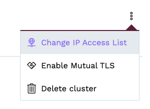

Click the `Enable Mutual TLS` option. The following confirmation modal will be shown:

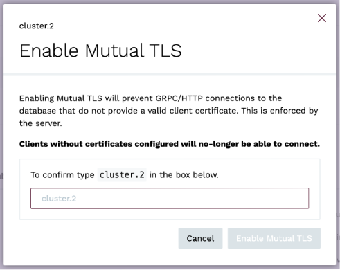

After entering the name of the cluster (clicking the cluster name will automatically copy the name), click the `Enable Mutual TLS` button. The cluster listing is then refreshed to show an `Updating` status for the cluster, an example is shown below:

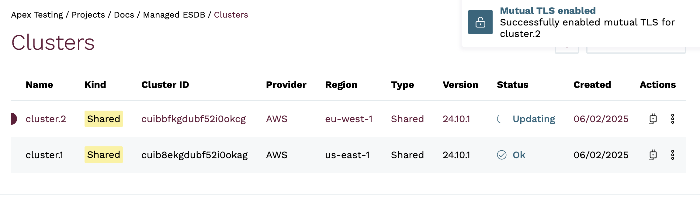

Once enabled, a new certificate icon will be visible along with the status showing as `Ok`:

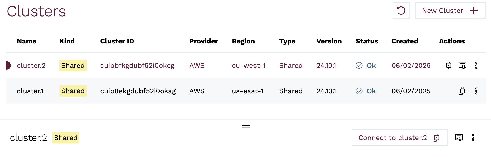

The cluster will leverage a unique private certificate authority. The next step is to download and install the generated certificate bundle.

## Disabling Mutual TLS

If a cluster has Mutual TLS enabled, it can be deactivated on demand. Clicking the elipses button (three vertical bubbles) found in either the cluster details or listing view, reveals the following actions:

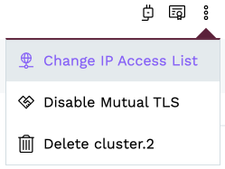

Click the `Disable Mutual TLS` option. The following confirmation modal will be shown:

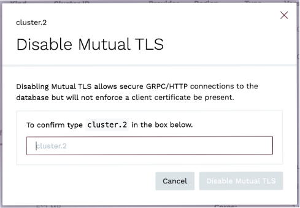

After entering the name of the cluster (clicking the cluster name will automatically copy the name), click the `Disable Mutual TLS` button. The cluster listing is then refreshed to show an `Updating` status for the cluster, an example is shown below:

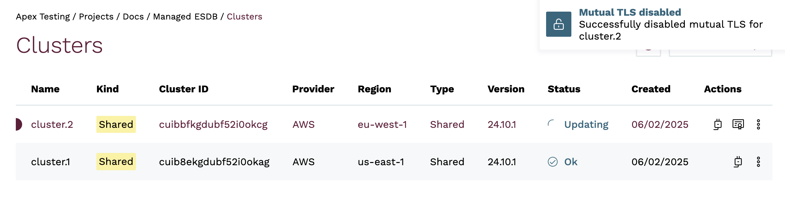

Once disabled, the certificate icon will no longer visible. The cluster status will show `Ok`:

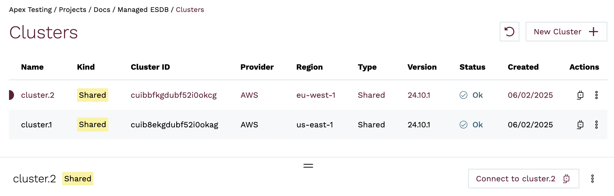

Once disabled, the cluster will leverage a trusted certificate provided by Lets Encrypt.

## Download Certificate Bundle (when Mutual TLS is enabled)

The certificate bundle can be downloaded when Mutual TLS is enabled (refer to the [Enabling Mutual TLS](README.md#enabling-mutual-tls) section). Several places allow downloads, for example:

- Click the certificate icon next to the cluster in the **Cluster view**
- Click the certificate icon next to the `Connect to <cluster name>` button
- Navigate to the tab `Security -> Certificate Bundle` in the **Cluster details view** and click the `Download Certificate Bundle`

Once the bundle has downloaded, it can be extracted to reveal the following files:

| Name | Description |
|------|-------------|
|ca.crt| The private certificate authority|
|tls.crt| The client certificate|
|tls.key|The private key associated with the client certificate|
|bundle.p12|Bundle that contains the files described above (to permit easy installation in to a local keychain)|

## Install Certificate Bundle (when Mutual TLS is enabled)

After following the steps in the [Download Certificate Bundle](README.md#download-certificate-bundle-when-mutual-tls-is-enabled) section.