## Viewing clusters

When you create a cluster, from the Clusters view, you will see a list of all your currently provisioned clusters, as well as any clusters that have been deleted within the last four hours. 

For each cluster, you will see the cluster name, type (shared, public or private), cluster ID, provider, region, type, KurrentDB version, status, and date of creation, as well as a set of icons for performing common actions, and a menu with additional actions.

### Details tab

When you select a cluster from the Clusters list, you will see the cluster details page, which includes the cluster name, ID, provisioning status, mutual TLS status, and date of creation.

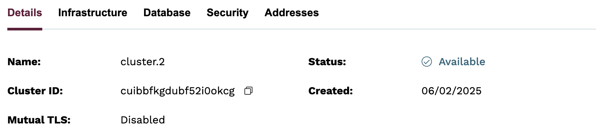
### Infrastructure tab

The Infrastructure tab contains details about the cloud provider, region, type (shared), cluster topology (single node), disk size, and any provider specific details.

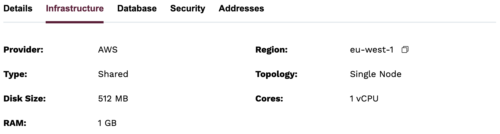

### Database tab

The Database tab contains details about version of KurrentDB running on the cluster and the health status. The `Version` field shows the major release version of KurrentDB, and `Tag` shows the specific patch version.

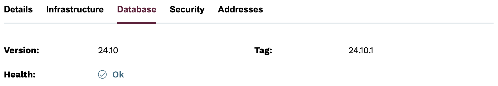

### Security tab

The Security tab contains important information related to connecting to your cluster securely.

#### IP Access List

Contains information related to the `IP Access List` that is attached to the cluster. A link is present that allows you to edit the list entries.

#### Admin Credentials

During the deployment process, Kurrent Cloud will automatically generate an initial password for the `admin` user. This password can be unmasked by clicking the button that looks like an eye. The password may also be copied using the button next the to field.

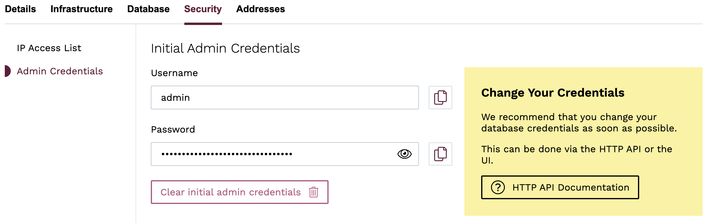

#### Certificate Bundle (visible when Mutual TLS is enabled)

During the deployment process, Kurrent Cloud will automatically generate a certificate bundle when Mutual TLS is enabled. The bundle can be downloaded by clicking the `Download Certificate Bundle`, which starts to transfer a file named `certificate_bundle.tar.gz`.

Once downloaded, the files should be extracted and installed to the local system. Pick the tab relevant to your situation, for example, Windows users will want to pick the `Windows` tab. Note that the bundle contains a file called `bundle.p12` which allows the private certificate authority, TLS client certificate and key to be easily imported to the local keychain. The password will be required during the import process and can be copied from the masked field. The eye button can also be clicked to reveal it. 

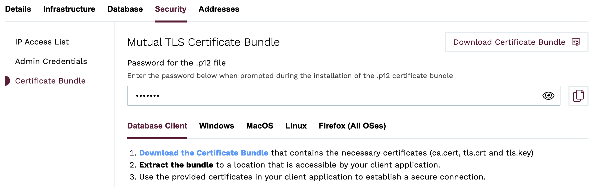

For detailed instructions refer to the [Security](security.md) section.

### Addresses tab

The Addresses tab contains addresses for accessing the cluster UI, as well as URIs for GRPC clients.

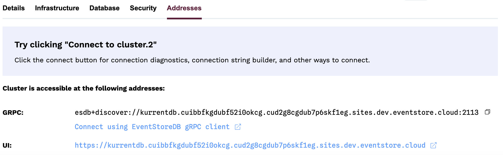

## Connecting to a cluster

You will see a button labeled `Connect to <Cluster Name>` to the right of the `Addresses` tab. When clicked, a modal view will appear that will first check if the cluster is reachable.

If reachable, you will get a list of options for connecting to the cluster, including a link to the cluster UI, as well as links to the official KurrentDB client libraries for a variety of languages.

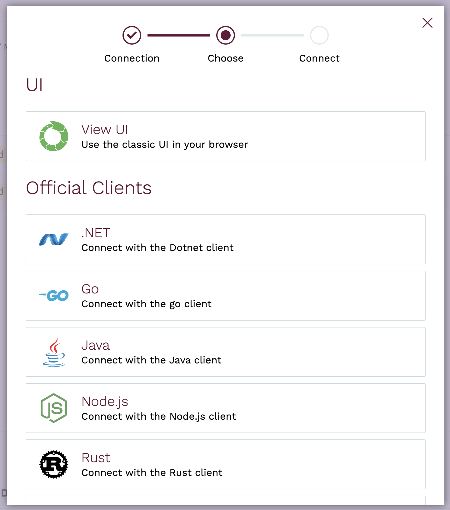

For example, clicking `Java` results in the following screen when Mutual TLS is disabled:

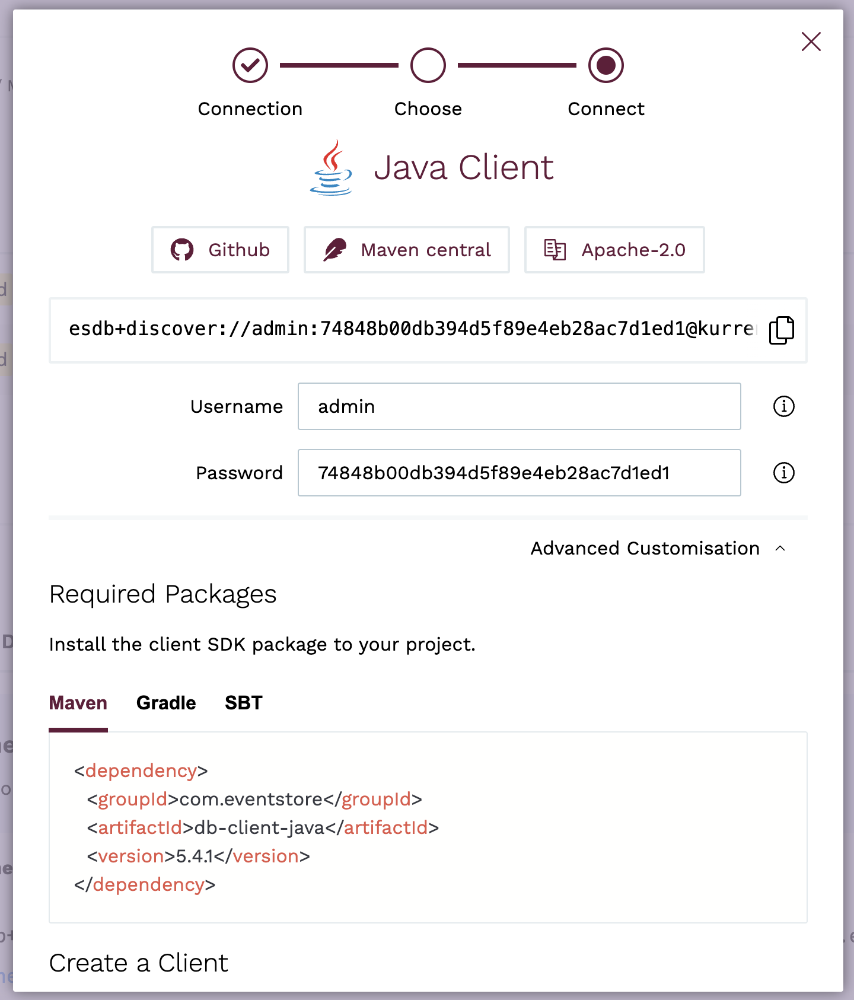

Note that the connection URL is automatically generated and can be copied using the button next to the field.

If Mutual TLS is enabled, additional properties will be included in the connection URL, for example:

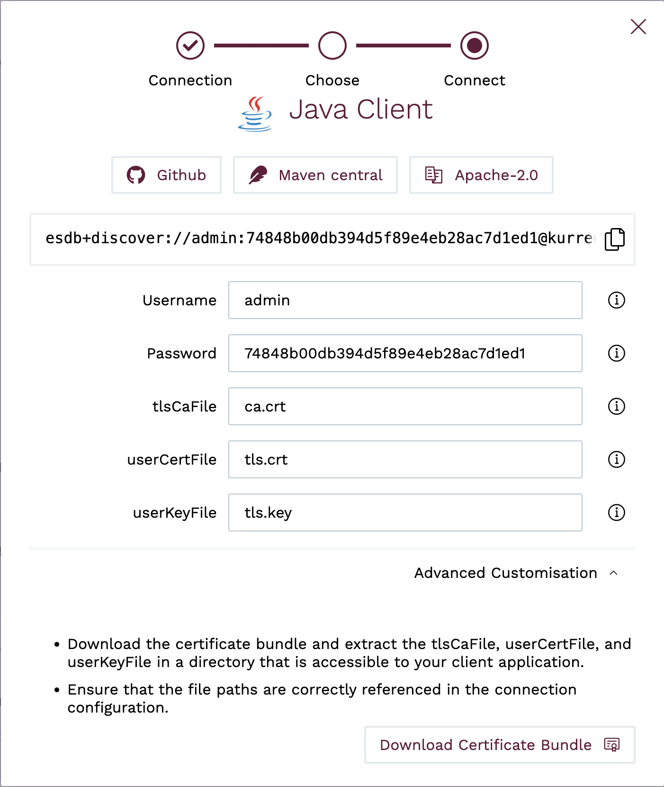

The client SDK selected requires access to the files in the extracted [certificate bundle](security.md#download-certificate-bundle-when-mutual-tls-is-enabled). The fields in the modal view can be expanded to include the path to the extracted files, aiding in generating the connection URL.

### Issues

If there are issues connecting to the cluster, you will see some diagnostic information indicating some possible reasons why the connection may be failing.

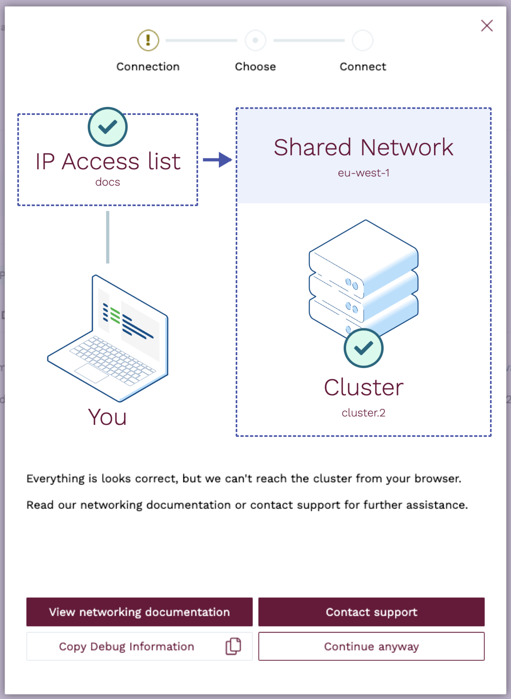

If Mutual TLS is enabled, you will see a notice about installing client certificates:

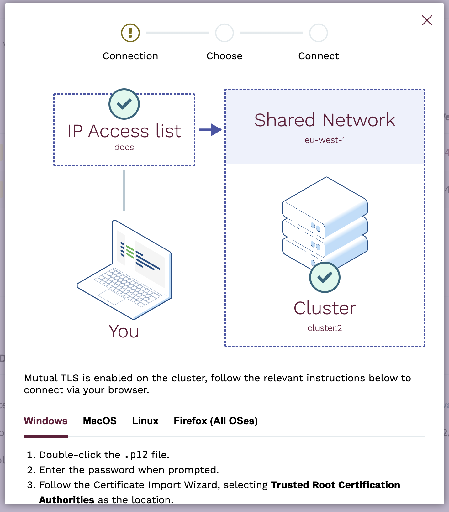

In this case, follow the instructions to verify that your certificates have been installed correctly (refer to the [Security](security.md) section).

If you are having trouble connecting to a cluster, see the [Troubleshooting](../faq.md#troubleshooting) section of the FAQ for more information, and contact our support team if you need assistance.

### DNS names

The format for the DNS name of a cluster follows the pattern `<database node>.<cluster-id>.<load-balancer-id>.sites.eventstore.cloud`.

This name resolves to the load balancer IP address that the database cluster is attached to.

Each cluster node has its own DNS name, which can be used for accessing individual nodes for node-specific operations like stats collection or scavenging. For example:
`kurrentdb-0.kurrentdb.<cluster-id>.<load-balancer-id>.sites.eventstore.cloud`.
