### TLS certificates

Kurrent Cloud provisions secure KurrentDB clusters with TLS enabled for HTTP and GRPC using certificates issued by Let's Encrypt, or when Mutual TLS is enabled, a private certificate authority that is unique to each deployment. We automatically renew the certificates before they expire and replace the certificates on all cluster nodes. This is all done with zero impact to client connections or cluster availability.

Third party certificates are not supported.

## Changing the initial password

During the deployment process, Kurrent Cloud will automatically generate an initial password for the `admin` user. This password can be changed via the database UI or API. For more information refer to the [User Authentication](/server/v24.10/security/user-authentication.md#basic-authentication) section of the KurrentDB documentation. Once reset, the `Clear initial admin credentials` button should be clicked on the `Security -> Initial Credentials` tab for the given cluster (refer to the [Admin Credentials](README.md#admin-credentials) section).

## Enabling Mutual TLS

If a cluster does not have Mutual TLS enabled, it can be activated on demand. Clicking the elipses button (three vertical bubbles) found in either the cluster details or listing view, reveals the following actions:

Click the `Enable Mutual TLS` option. The following confirmation modal will be shown:

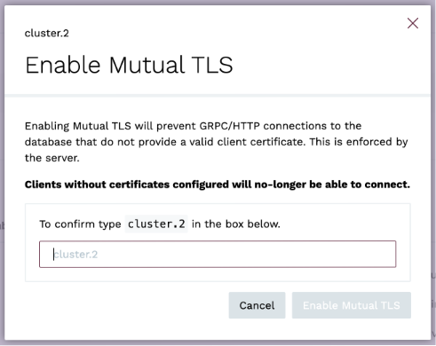

After entering the name of the cluster (clicking the cluster name will automatically copy the name), click the `Enable Mutual TLS` button. The cluster listing is then refreshed to show an `Updating` status for the cluster, an example is shown below:

Once enabled, a new certificate icon will be visible along with the status showing as `Ok`:

The cluster will leverage a unique private certificate authority. The next step is to [download](security.md#download-certificate-bundle-when-mutual-tls-is-enabled) and install the generated certificate bundle.

## Download Certificate Bundle (when Mutual TLS is enabled)

The certificate bundle can be downloaded when Mutual TLS is enabled (refer to the [Enabling Mutual TLS](security.md#enabling-mutual-tls) section). Several places allow downloads, for example:

- Click the certificate icon next to the cluster in the **Cluster view**
- Click the certificate icon next to the `Connect to <cluster name>` button
- Navigate to the tab `Security -> Certificate Bundle` in the **Cluster details view** and click the `Download Certificate Bundle` button

Once the bundle has downloaded, it can be extracted to reveal the following files:

| Name | Description |
|------|-------------|
|ca.crt| The private certificate authority|
|tls.crt| The client certificate|
|tls.key|The private key associated with the client certificate|
|bundle.p12|Bundle that contains the files described above (to permit easy installation in to a local keychain)|

## Install Certificate Bundle (Windows)

After following the steps in the [Enabling Mutual TLS](security.md#enabling-mutual-tls) and [Download Certificate Bundle](security.md#download-certificate-bundle-when-mutual-tls-is-enabled) sections, the certificate bundle can be installed as follows:

1. Extract the `certificate_bundle.tar.gz`, the contents will look as follows:

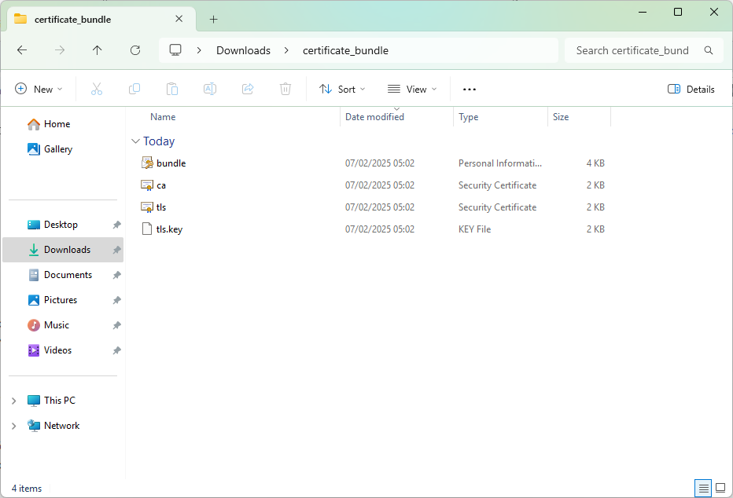

2. Double-click the `bundle` file.

3. The certificate import wizard will be displayed:

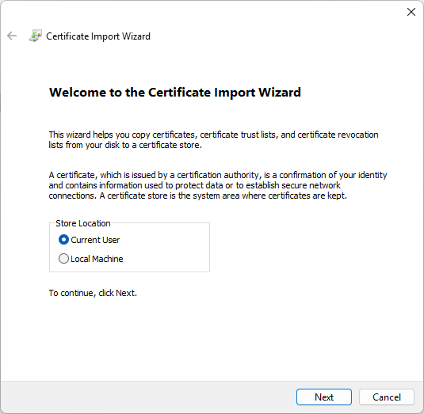

Make sure `Current User` is selected and press the `Next` button.

4. Confirm that the bundle path is correct and click the `Next` button.

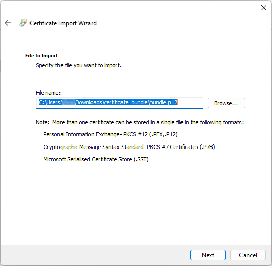

5. Enter the password for the certificate bundle: `kurrent`.

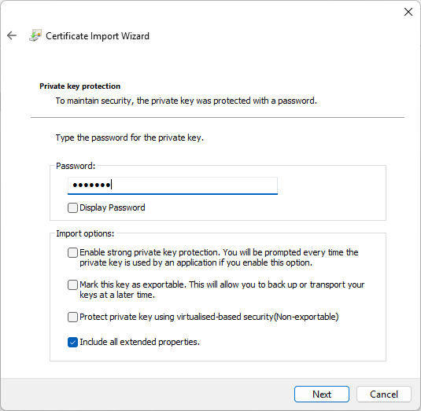

6. Select the option `Automatically select the certificate store based on the type of certificate` and click `Next`.

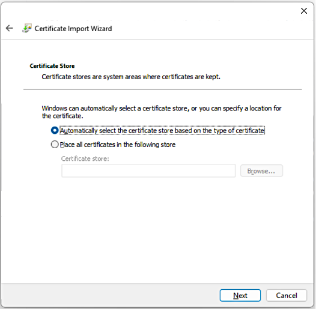

7. Click the `Finish` button.

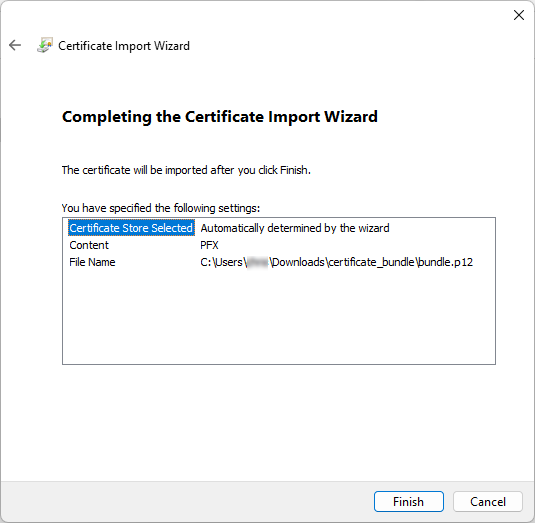

8. The certificate import process will then begin and prompt you for confirmation. Click the `Yes` button.

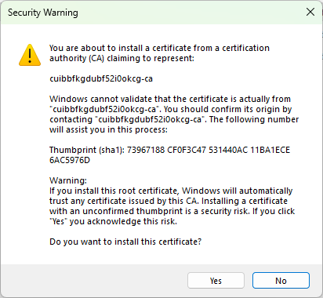

9. The import process will then complete and display the following:

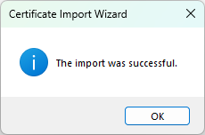

10. Verify that the KurrentDB UI is now accessible by navigating to the URL shown in the **Cluster details** pane under the `Addresses` tab. Note that some browsers require restarting to pick up certificate changes. If you're using Chrome, try an Incognito tab. Note you may be prompted to add the certificate to the browser keystore, follow the onscreen instructions.

The browser should show the following:

Click the `Ok` button and the KurrentDB UI should be shown as follows:

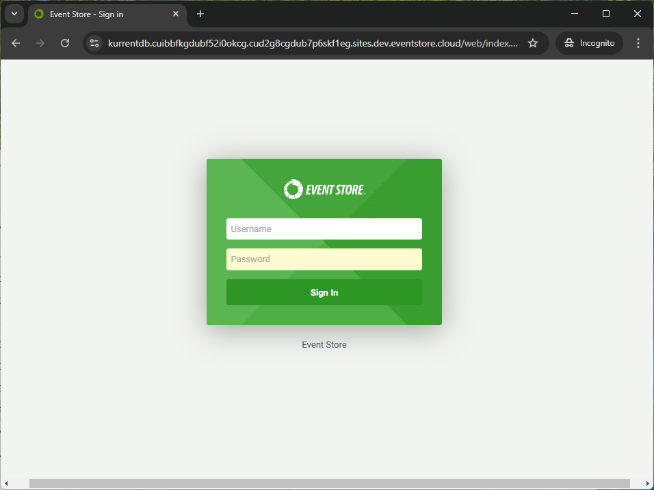

## Install Certificate Bundle (Mac)

After following the steps in the [Enabling Mutual TLS](security.md#enabling-mutual-tls) and [Download Certificate Bundle](security.md#download-certificate-bundle-when-mutual-tls-is-enabled) sections, the certificate bundle can be installed as follows:

1. Extract the `certificate_bundle.tar.gz`, the contents will look as follows:

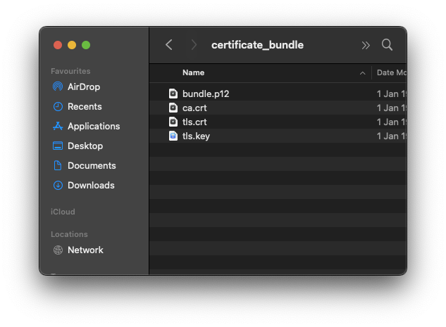

2. Double-click the `bundle.p12` file.

3. Enter the password for the certificate bundle: `kurrent`.

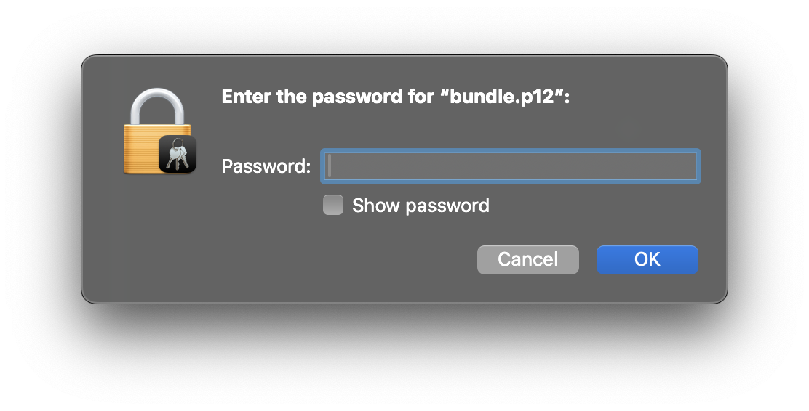

4. Open the keychain utility and navigate to the `Certificates` tab. The following screen should display two new certificates:

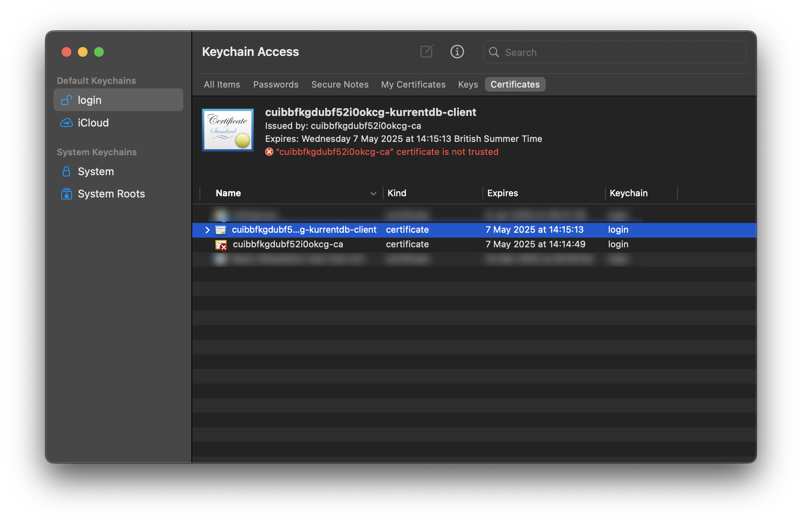

5. Double-click the `*-ca` certificate, in the example shown above it would be `cuibbfkgdubf52i0okcg-ca`. The following screen will be displayed:

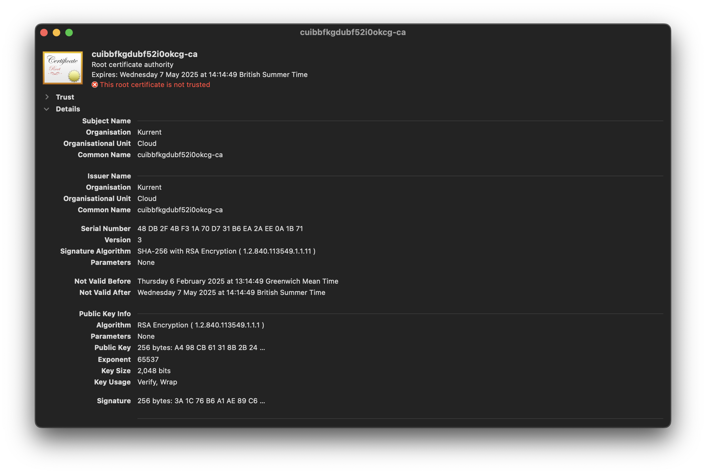

6. Expand the `Trust` section to display:

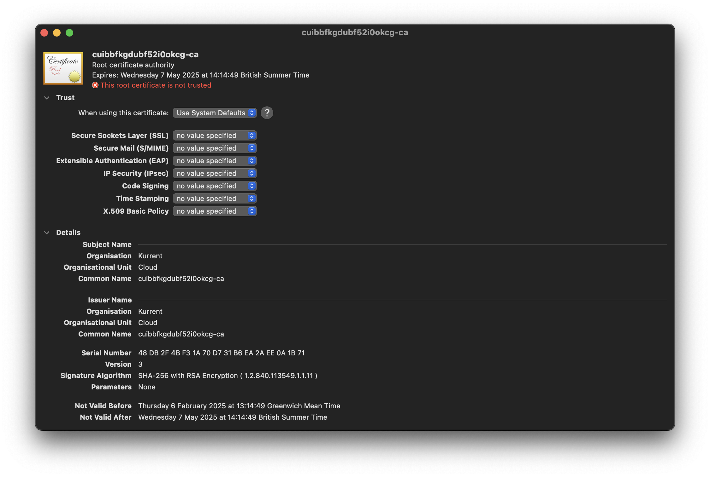

7. Click the drop-down box next to the field `When using this certificate` and select `Always Trust`. The screen should resemble:

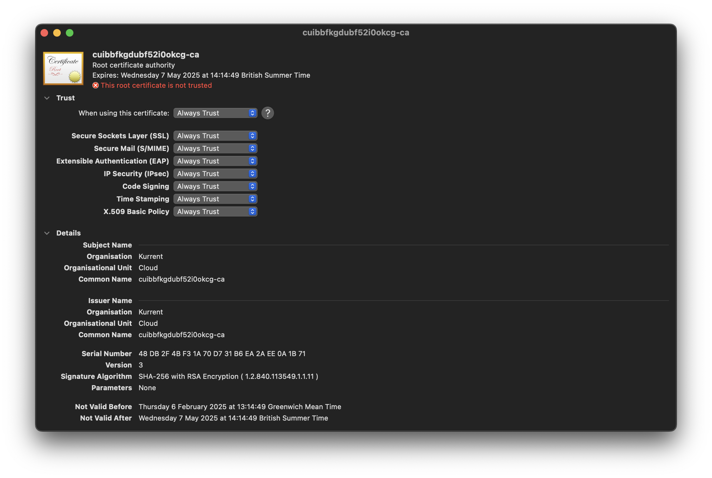

Click the close button (top left), you will be prompted to enter you password to make the changes.

8. The private certificate authority should now be trusted, and the certificate listing should look as follows:

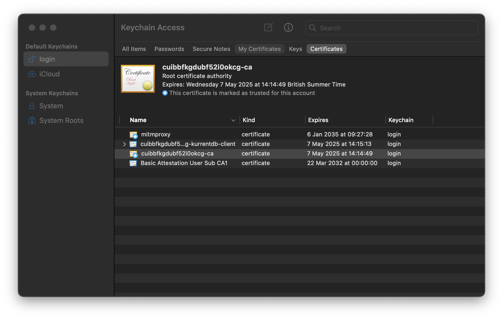

9. Verify that the KurrentDB UI is now accessible by navigating to the URL shown in the **Cluster details** pane under the `Addresses` tab. Note that some browsers require restarting to pick up certificate changes. If you're using Chrome, try an Incognito tab. Note you may be prompted to add the certificate to the browser keystore, follow the onscreen instructions.

The browser should show the following:

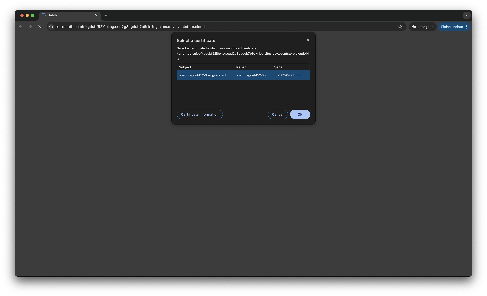

Click the `Ok` button and the KurrentDB UI should be shown as follows:

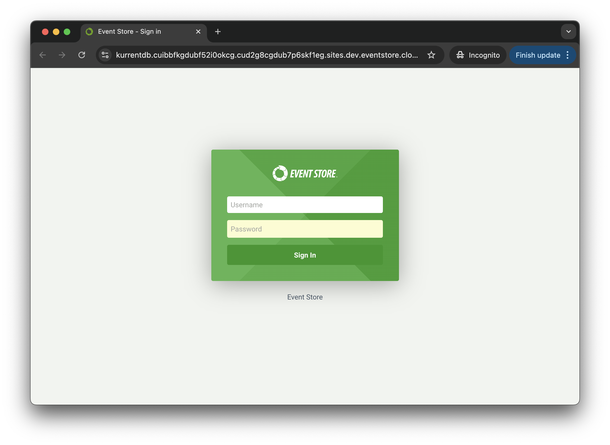

## Install Certificate Bundle (Linux)

After following the steps in the [Enabling Mutual TLS](security.md#enabling-mutual-tls) and [Download Certificate Bundle](security.md#download-certificate-bundle-when-mutual-tls-is-enabled) sections, the certificate bundle can be installed according to the distribution being used. Please review your vendor specific instructions for installing a certificate authority.

## Disabling Mutual TLS

If a cluster has Mutual TLS enabled, it can be deactivated on demand. Clicking the elipses button (three vertical bubbles) found in either the cluster details or listing view, reveals the following actions:

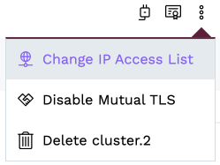

Click the `Disable Mutual TLS` option. The following confirmation modal will be shown:

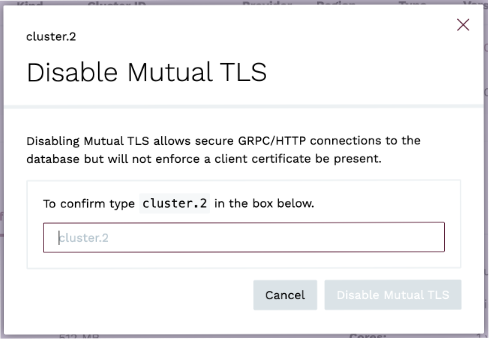

After entering the name of the cluster (clicking the cluster name will automatically copy the name), click the `Disable Mutual TLS` button. The cluster listing is then refreshed to show an `Updating` status for the cluster, an example is shown below:

Once disabled, the certificate icon will no longer visible. The cluster status will show `Ok`:

Once disabled, the cluster will leverage a trusted certificate provided by Lets Encrypt.
