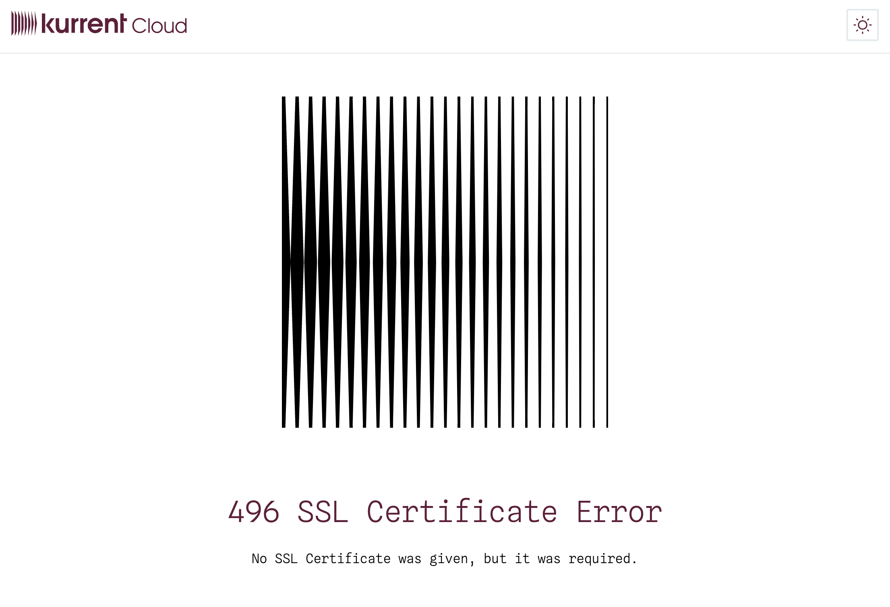

## Cluster provisioning

#### Is it possible to change the cluster instance size or topology?

Not yet, but it's on the roadmap for 2025.

#### Are there plans to support manual resizing of cluster nodes?

Yes, this is on the roadmap for 2025.

#### Are there plans to support automatic resizing of cluster nodes?

Yes, the goal is to support elastic scaling of the database cluster. This is on the roadmap for 2025.

## Providers

### Do you plan to support other Cloud providers?

Absolutely! Both GCP and Azure are on the roadmap for 2025.

## Managed KurrentDB

#### Does the admin UI run on the provisioned cluster?

Yes. Please refer to the [Cluster Addresses](ops/README.md#addresses-tab) section.

## Backup and restore

#### Is this possible?

Not yet, but it's on the roadmap for 2025.

## Support

Support is provided for AWS based shared clusters.

## Security

#### Does Kurrent have a security policy?

Kurrent, Inc. has security policies in place.

If you have specific questions please [contact us](https://www.kurrent.io/contact)

## Troubleshooting

### Connectivity

#### Unable to connect to a public cluster

If you are trying to connect to a public cluster and you are not able to, please check the following:

- You are able to resolve the cluster DNS name
- Your IP address has been added to the IP Access List assigned to the cluster
- Your local network policies permit outbound connections to TCP port 2113

It is possible that your local network may be using a transparent web proxy which could cause the common methods of determining your source IP address to be incorrect. If you are on a corporate network or VPN, you may be able to get your network administrator to assist you.

If you have enabled Mutual TLS please verify that you have followed the necessary steps listed in the [Security](ops/security.md) section.

#### SSL Certificate Error

If Mutual TLS is enabled for your database cluster and you attempt to access the database UI without the required certificate bundle installed, you will encounter the following error:

Please follow the instructions in [security](ops/security.md) section to install the certificate bundle.

::: important 
Some browsers require restarting to pick up certificate changes. If you're using Chrome, try an Incognito tab.
:::