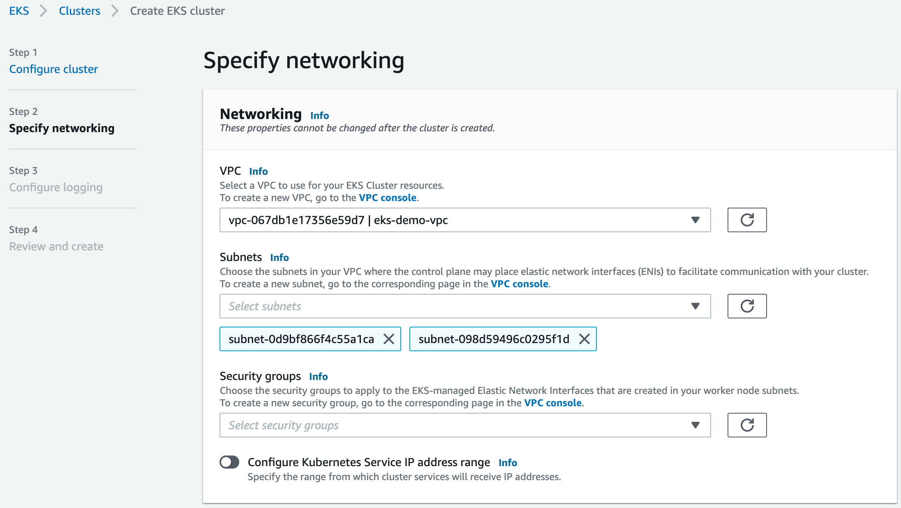

# Connect to Elastic Kubernetes Services

On this page, you find instructions how to set up an AWS Elastic Kubernetes Services (EKS) cluster, so it can connect to an EventStoreDB cluster in Event Store Cloud. As a prerequisite, you have experience with Kubernetes, AWS and networking in Kubernetes, as well as in AWS cloud platform.

EKS clusters require at least two subnets, which are connected to internet using an Internet Gateway. Both subnets must have the auto-assign public IP setting enabled, otherwise the node group won't get properly provisioned.

Before you provision a cluster in Event Store Cloud, you need to have a network, to which the cluster nodes will connect. Nodes in the cluster will get IP addresses from the specified network CIDR block.

You can find more information about the steps needed for provisioning Event Store Cloud resources and connecting them to your own Azure account in the [provisioning](../../provision/aws) section.

In this example, we'll use the following network configuration:

- Event Store Cloud AWS network with IP range `172.29.98.0/24` (same as we used in the provisioning guidelines)
- VPC in the same region (`eu-central-1`) with IP range `172.16.0.0/16`
- Two subnets in the VPC with ranges `172.16.0.0/18` and `172.16.64.0/18`, which are both part of the VPC IP range

The AWS VPC has a peering connection established with the Event Store Cloud network, as described in the provisioning guide. For the peering link, we used the whole VPC IP range `172.16.0.0/16`:

::: card

:::

Now we can provision the EKS cluster. In the networking configuration section of the new cluster, we need to choose the VPC, which is peered with Event Store Cloud:

::: card

:::

After creating the cluster, you need to add the node group, as usual. Each node will get a network interface per subnet of the EKS cluster, so in our case nodes will be attached to two subnets.

When all the deployments are completed, and you added the EKS cluster to your local config, you can try deploying an ephemeral workload using the `busybox` container image, so you can test the connectivity:

```bash
$ kubectl run -i --tty --rm debug --image=busybox --restart=Never -- sh
```

If you run `ifconfig` in the pod, you will see that the pod got an IP address from one of the subnets:

```bash
/ # ifconfig
eth0      Link encap:Ethernet  HWaddr 66:93:89:8F:D7:CF
          inet addr:172.16.101.19  Bcast:0.0.0.0  Mask:255.255.255.255
          UP BROADCAST RUNNING MULTICAST  MTU:9001  Metric:1
          RX packets:12 errors:0 dropped:0 overruns:0 frame:0
          TX packets:7 errors:0 dropped:0 overruns:0 carrier:0
          collisions:0 txqueuelen:0
          RX bytes:1252 (1.2 KiB)  TX bytes:640 (640.0 B)
```

Then, it should be possible to ping the managed EventStoreDB cluster node from the pod, ensuring that everything works as expected:

```bash
/ # ping c1ut3oto0aembuk4mi6g.mesdb.eventstore.cloud
PING c1ut3oto0aembuk4mi6g.mesdb.eventstore.cloud (172.29.98.112): 56 data bytes
64 bytes from 172.29.98.112: seq=0 ttl=63 time=1.049 ms
64 bytes from 172.29.98.112: seq=1 ttl=63 time=0.716 ms
64 bytes from 172.29.98.112: seq=2 ttl=63 time=0.713 ms
```

At this moment, any workload deployed to the EKS cluster should be able to connect to the Event Store Cloud managed EventStoreDB cluster.
