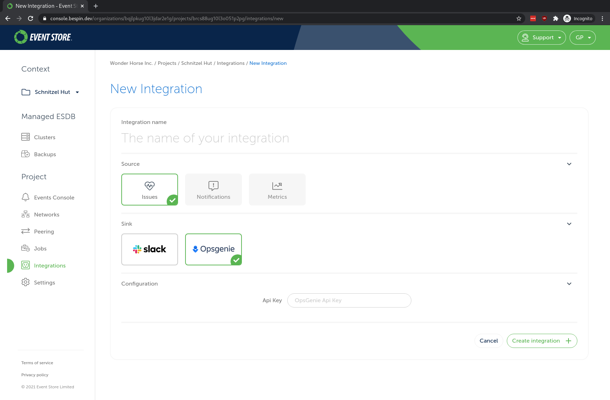

EventStore Cloud platform is using [OpsGenie] for its alerting system. Our minimal configuration requires an API key. For simplicity sake,
we recommend the API key to belong to a responder team.

# How to create an API key?

Those instructions assume you are starting from scratch and don't have a team set up yet. We also assume that
you are currently on the landing page after log in [OpsGenie].

## Create a team

1. Click on the `Teams` tab uptop.
2. Click on the `Add team` top left.
3. A popup should show up, enter your team info like its name and members. Keep in mind that team will be considered as the responder team in EventStore Cloud.
4. Once you confirm your new team creation, you should be redirected to your new team dashboard page.

## Generate your team API key

1. Click on the `Teams` tab uptop.
2. Select your team in the team table.
3. By selecting your team, you should be redirected in your team dashboard.
4. Click on `Integrations`, located in the left sidebar.
5. Click on the `Add integration` button.
6. In the integration list, click on `API` then the `Add` button.
7. By default, the form should be already pre-filled. Make sure that `Read Access`, `Create and Update Access`, `Delete Access` and `Enabled` are checked.
8. Click on `Save Integration` on the bottom.
9. You can get your API key that should be located just below the `Name` property.

## Use your API Key in EventStore Cloud.
::: card

:::

[OpsGenie]: https://www.atlassian.com/software/opsgenie
