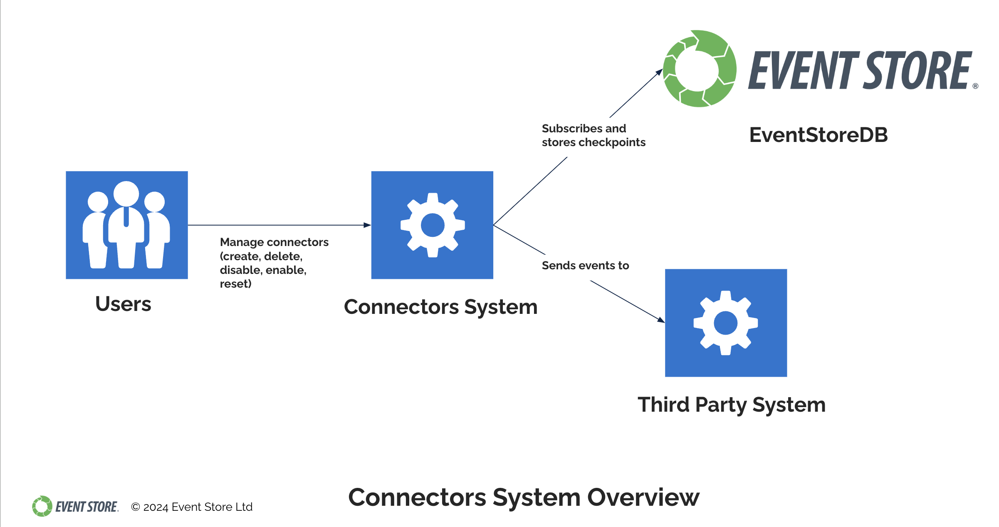
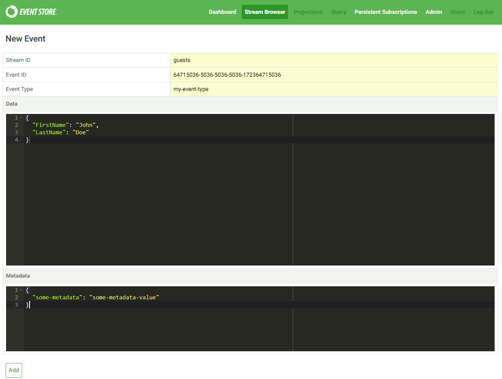
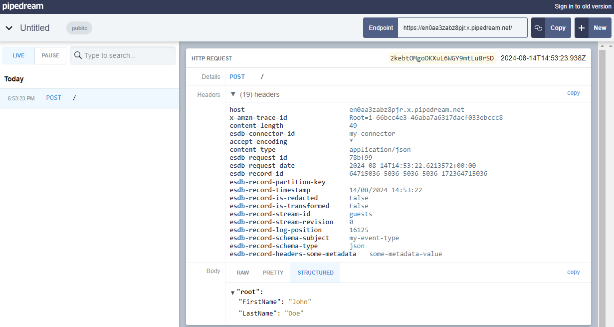

# Set up Connectors

Connectors are pre-installed in the commercial edition. You [manage connectors](./manage.md) by creating and enabling them.

Here is an overview of how connectors wok.

::: card

:::


Let's create a connector and send events to it.

## 1. Set up a an external system

For example, create a `public bin` by visiting
<https://public.requestbin.com/r>. This is only suitable for test data.
It will present you with a unique endpoint such as:
<https://enkb1keveb5r.x.pipedream.net>

## 2. Set up a connector to connect to your new endpoint.

Use curl or a similar utility to issue a `POST` request as follows. This will create a
connector called `my-connector`, configure it to send events to our
external system, and enable the connector.

``` powershell
$JSON = @'
{
  "Sink": "https://enkb1keveb5r.x.pipedream.net"
}
'@ -replace '"', '\"'

curl.exe -i                           `
  -H "Content-Type: application/json" `
  -u "admin:changeit"                 `
  -d $JSON                            `
  https://localhost:2113/connectors/my-connector
```

- Pass admin credentials

- The sink URL is where the sink will POST to. Adjust it to be your own
  URL created in the first step.

## 3. Create an event in the EventStoreDB UI

::: card

:::

## 4. View the event in a web browser


::: card

:::
