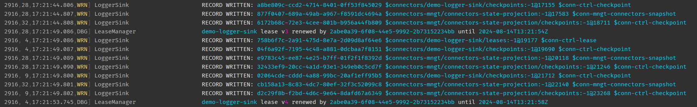

# Logger Sink Connector

The logger sink logs a message about the connector and record details and can be used for testing purposes.

## Quickstart

Create a connector by sending a `POST` request to `connectors/create/{connector_id}` where `{connector_id}` is the unique identifier for the connector.

:::: code-group
::: code-group-item Powershell

```powershell
$JSON = @"
{
  "settings": {
    "InstanceTypeName": "EventStore.Connectors.Testing.LoggerSink",
    "Subscription:Filter:Scope": "Stream",
    "Subscription:Filter:Expression": "^\\$connectors\\/[^\\/]+\\/leases",
    "Subscription:InitialPosition": "Earliest"
  }
}
"@

curl.exe -X POST `
  -H "Content-Type: application/json" `
  -d $JSON `
  http://localhost:2113/connectors/create/demo-logger-sink
```

:::
::: code-group-item Bash

```bash
JSON='{
  "settings": {
    "InstanceTypeName": "EventStore.Connectors.Testing.LoggerSink",
    "Subscription:Filter:Scope": "Stream",
    "Subscription:Filter:Expression": "^\\$connectors\\/[^\\/]+\\/leases",
    "Subscription:InitialPosition": "Earliest"
  }
}'

curl -X POST \
  -H "Content-Type: application/json" \
  -d "$JSON" \
  http://localhost:2113/connectors/create/demo-logger-sink
```

:::
::::

**Result**

