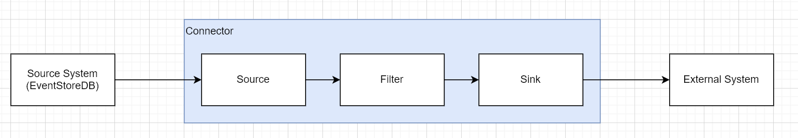
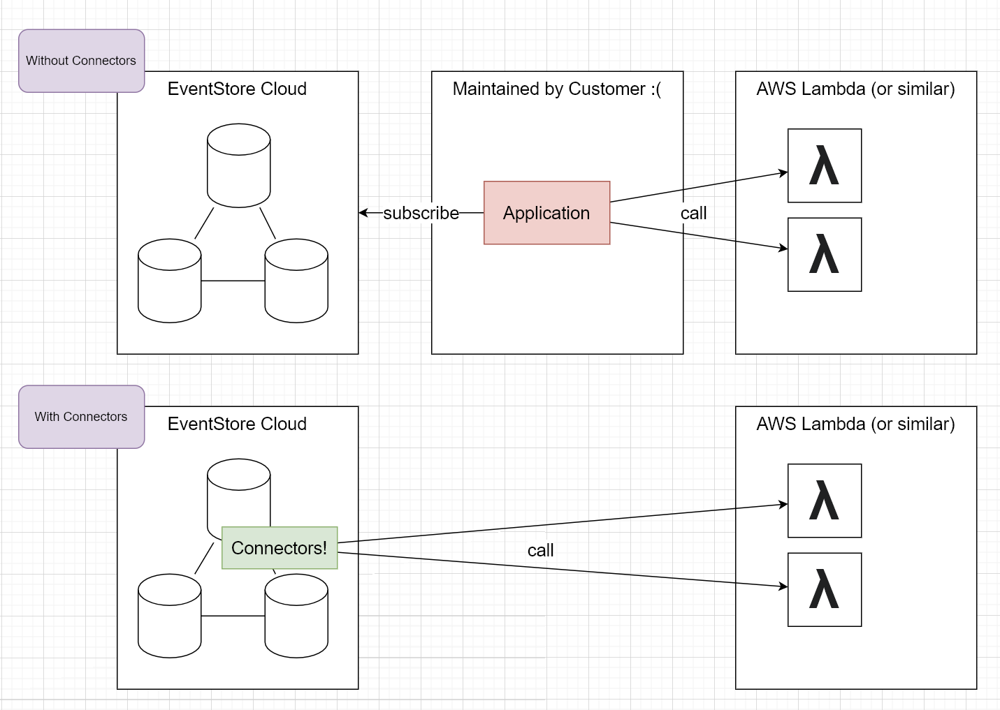
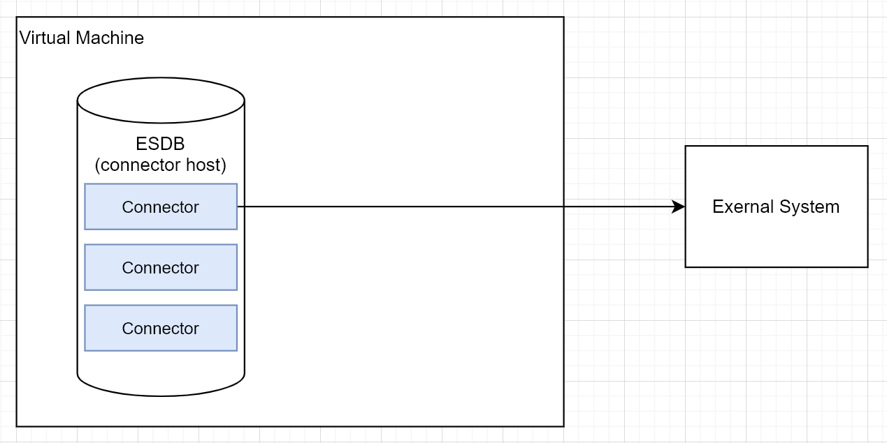
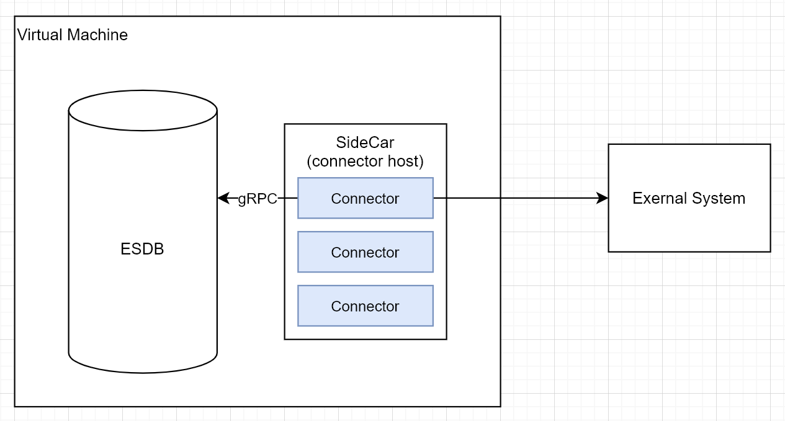
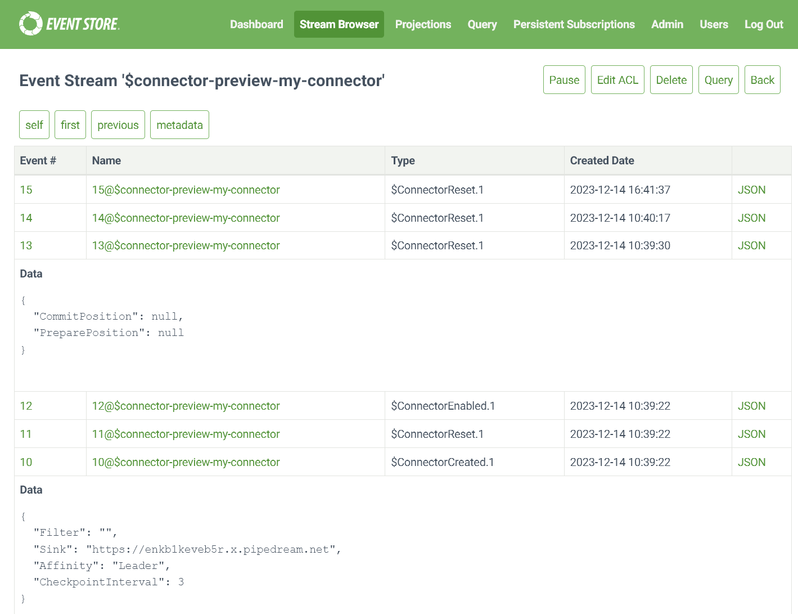

# Technical Overview Of Connectors

Connectors make it easy to feed data from EventStoreDB into other
systems.

Each connector runs on the server-side (in process or out of process)
and uses a catch-up subscription to receive events, filter or transform
them, and push them to an external system via a sink.

::: card

:::

In this preview, there are two sinks:

- [Console Sink](./sinks.md#console_sink) for experimentation

- [HTTP Sink](./sinks.md#http_sink) for POSTing to an HTTP endpoint of
  an external system.

# Motivation

Currently one pain point that users experience is that, on one hand
they have a convenient EventStoreDB cloud service, on the other hand
they have a convenient downstream database or processing engine cloud
service, but in the middle they need to host and maintain their own
solution in their own infrastructure for subscribing to EventStoreDB and
sending the events to the downstream service. This solution in the middle needs to be highly
available and needs to manage its own checkpoints: this quickly becomes
cumbersome.

EventStore Connectors remove the need for the user to develop, host and
maintain such a solution.

::: card

:::

# Delivery Guarantees

Events are delivered *at least once* to the sink. They are delivered *in
order* meaning that event `x` is not delivered until all the events
before `x` have been delivered.

Often, the system that is receiving the events will want to keep track
of the address of the last event that it has received so that it can
easily spot and discard duplicate deliveries.

# Checkpointing

Connectors periodically (according to their configuration) store the
position of the last event that they have successfully processed. Then
if the connector host is restarted, the connectors can continue from
close to where they got up to. The checkpoints are stored in
EventStoreDB.

# Internal/External hosting

Connectors can run internally (i.e. in-process) in the EventStoreDB
nodes, or they can run externally in a side-car process that
communicates with an EventStoreDB via gRPC.

::: card

:::

It is expected that in the short term the internal hosting model shown
above will be more popular because it requires less infrastructure

::: card

:::

In the long term the external hosting model may be more popular because
of the isolation it provides.

For multi-node deployments each node would have its own side car.

The connectors are agnostic to the way that they are being hosted.

# Management and Activation

Users *manage* connectors by sending HTTP requests to the connectors
host (server or the side car, according to the deployment). Connectors
can be created, enabled, disabled, reset, and deleted.

The system will *activate* (that is, run) the enabled connectors on the
appropriate hosts. In multi-node deployments the system will share the
connectors out among the nodes according to the available nodes and the
`Affinity` of the connectors.

# Connector Persistence

Connectors are EventSourced

::: card

:::

The checkpoints are stored in a stream per connector

::: card

:::

