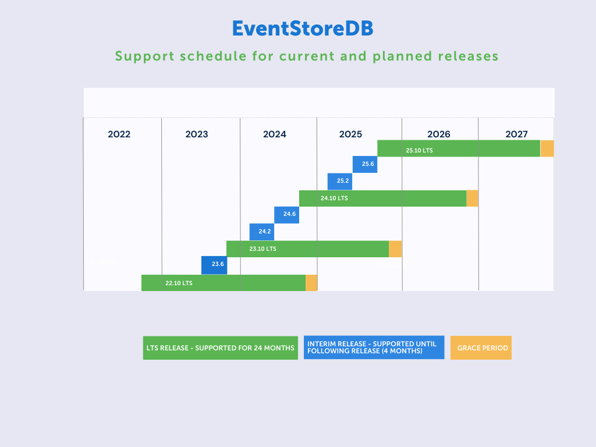

# Working with EventStoreDB

Learn about key event sourcing concepts, get started on your application, find tutorials and reference material.

## Run EventStoreDB

### Installation

- [Installation Guide](@server/quick-start/installation.md)
  - [Linux](@server/quick-start/installation.md#linux)
  - [Docker](@server/quick-start/installation.md#docker)
  - [Windows](@server/quick-start/installation.md#windows)
- See our [Windows how-to guide](https://www.eventstore.com/blog/getting-started-with-eventstoredb-our-how-to-guide) or watch directly on our [YouTube channel](https://youtu.be/TLnYOQRJdig).
- Want to run Event Store in the Cloud? Head to the [Cloud introduction](cloud/README.md) or the [YouTube Cloud playlist](https://youtube.com/playlist?list=PLWG5TK2D4U_P2G6s2N4LdhTkmv5My96l_). 

### Configuration
- [Configuration guide](@server/configuration/README.md)

### Operations
- [Upgrade](@server/quick-start/upgrade-guide.md)
- [Maintenance](@server/operations/README.md)
- [Diagnostics](@server/diagnostics/README.md)
- [Metrics](@server/diagnostics/metrics.md)

### Features
- [Event streams](@server/features/streams.md)
- [Indexes](@server/features/indexes.md)
- [Persistent Subscriptions](@server/features/persistent-subscriptions.md)
- [Projections](@server/features/projections.md)

## Start developing your application
- Set up [a client to connect](./clients/grpc/README.md#connecting-to-eventstoredb) to EventStoreDB
- [Appending events](./clients/grpc/appending-events.md)
- [Reading events](./clients/grpc/reading-events.md)
- [Catch-up subscriptions](./clients/grpc/subscriptions.md)
- [Persistent subscriptions](./clients/grpc/persistent-subscriptions.md)
- [Projection management](clients/grpc/projections.md)
- [Get sample code in your preferred language](./clients/grpc/README.md#creating-a-client)
- Check out [full code examples](https://github.com/EventStore/samples)

## [FAQs](https://www.eventstore.com/faq)

## Event Sourcing: What Is it and Why Use it?

[Introduction to event sourcing](https://www.eventstore.com/event-sourcing)

[Event Driven Architecture](https://www.eventstore.com/event-driven-architecture)

[CQRS](https://www.eventstore.com/cqrs-pattern)

[How to implement a basic application with CQRS and Event Sourcing [Video]](https://www.youtube.com/watch?v=Hq6zO-A0hMI)

[A practical guide to implementing CQRS with C# & NET5 [Video]](https://www.youtube.com/watch?v=eOPlg-eB4As)

[Why Event Sourcing? Part 1 - Growing Costs of Complex Data](https://www.eventstore.com/blog/why-event-sourcing-part-1-growing-costs-of-complex-data)

[Why Event Sourcing? Part 2 - The Unique Feature of Event Sourcing](https://www.eventstore.com/blog/why-event-sourcing-part-2-the-unique-feature-of-event-sourcing)

[Turning the database inside out with Event Store - Event Store Blog](https://www.eventstore.com/blog/turning-the-database-inside-out)

[Relational vs state transition databases: how they compare](https://www.eventstore.com/blog/relational-vs-event-based-state-transition-databases)

[State Transition: Uncovering a New Data Model](https://www.eventstore.com/blog/state-transition-new-data-model)

[Convince your CTO to use Event Sourcing - Event Store Blog](https://www.eventstore.com/blog/convincing-your-cto)

[10 problems that Event Sourcing can help solve for you](https://www.eventstore.com/blog/10-problems-that-event-sourcing-can-help-solve-for-you)

[Unleashing AI/ML potential with EventStoreDB](https://www.eventstore.com/blog/unleashing-ai/ml-potential-with-eventstoredb)

[How using events helps with a teams' autonomy](https://www.eventstore.com/blog/how-using-events-helps-with-a-teams-autonomy)

[Event immutability and dealing with change](https://www.eventstore.com/blog/event-immutability-and-dealing-with-change)

## Use Cases

[Exploring the 4 Major Use Cases of EventStoreDB](https://www.eventstore.com/blog/4-major-use-cases-esdb)

[From data to insights: using event log data to train machine learning models](https://www.eventstore.com/blog/from-data-to-insights-using-event-log-data-to-train-machine-learning-models)

[Harnessing EDA with legacy systems: Sidecar Source of Truth](https://www.eventstore.com/blog/sidecar-source-of-truth)

[A Story of Simple Solutions that Led to Complex Problems](https://www.eventstore.com/blog/a-story-of-simple-solutions-that-led-to-complex-problems)

[Event Sourcing without Responsibility](https://www.eventstore.com/blog/event-sourcing-without-responsibility)

[Modernizing Legacy Systems with EventStoreDB - The Insureon Success Story](https://www.eventstore.com/blog/modernizing-legacy-systems-with-eventstoredb-the-insureon-success-story)

[Navigating Complexity: The Oceanic Safety Validation Pipeline built with EventStoreDB](https://www.eventstore.com/blog/navigating-complexity-the-oceanic-safety-validation-pipeline-built-with-eventstoredb)

[NHS Wales app: EventStoreDB as “the backbone of a patient-held record”](https://www.eventstore.com/blog/eventstoredb-nhs-wales-app)

## Design

Check the following resources to learn more about designing your application with EventStoreDB.

### Beginner

[What's the difference between a command and an event?](https://www.eventstore.com/blog/whats-the-difference-between-a-command-and-an-event)

[What’s in an (event) name?](https://www.eventstore.com/blog/whats-in-an-event-name)

[Untangle Tightly Coupled Systems with EventStoreDB (Part 1)](https://www.eventstore.com/blog/untangle-tightly-coupled-systems-with-eventstoredb-part-1)

[Untangle Tightly Coupled Systems with EventStoreDB (Part 2)](https://www.eventstore.com/blog/untangle-tightly-coupled-systems-with-eventstoredb-part-2)

[Building a scalable and reliable event-driven architecture with EventStoreDB and Kafka](https://www.eventstore.com/blog/eventstoredb-kafka)

[A recipe for gradually migrating from CRUD to Event Sourcing](https://www.eventstore.com/blog/a-recipe-for-gradually-migrating-from-crud-to-event-sourcing)

[Practical advice on building event-sourced applications [Video]](https://www.youtube.com/watch?v=VeZZ2UZMDYo)

### Intermediate

[Live projections for read models with Event Sourcing and CQRS](https://www.eventstore.com/blog/live-projections-for-read-models-with-event-sourcing-and-cqrs)

[Keep your streams short! Temporal modeling for fast reads and optimal data retention](https://www.eventstore.com/blog/keep-your-streams-short-temporal-modelling-for-fast-reads-and-optimal-data-retention)

[Strategies for future events with Event Sourcing](https://www.eventstore.com/blog/4-strategies-for-future-events-with-event-sourcing)

[EventStorming Modelling Patterns: Going Beyond the Superficial - Event Store Blog](https://www.eventstore.com/blog/event-storming-going-beyond-the-superficial)

[Snapshots in Event Sourcing](https://www.eventstore.com/blog/snapshots-in-event-sourcing)

[Snapshotting Strategies](https://www.eventstore.com/blog/snapshotting-strategies)

[Protecting Sensitive Data in Event-Sourced Systems with Crypto Shredding](https://www.eventstore.com/blog/protecting-sensitive-data-in-event-sourced-systems-with-crypto-shredding-1)

[How to get the current entity state from events?](https://www.eventstore.com/blog/how-to-get-the-current-entity-state-from-events)

### Advanced

[Counterexamples regarding consistency in event sourced solutions (Part 1)](https://www.eventstore.com/blog/counterexamples-regarding-consistency-in-event-sourced-solutions-part-1)

[When to go from collaborative modelling to coding? Part 1](https://www.eventstore.com/blog/when-to-go-from-collaborative-modelling-to-coding-part-1)

## Release schedule for EventStoreDB

This is the release schedule for EventStoreDB:

