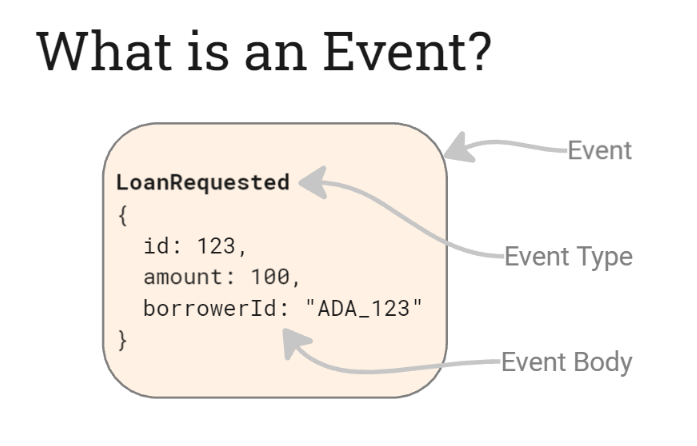

# EventStoreDB Architecture

## Event

Within EventStoreDB, an event is a factual occurrence from the past. It has an *event type* that headlines what happened and an *event body* that outlines the details.

An event usually represents a state change in an application, its entities, or business processes. In this case:

1. Ada requested a $1,000 loan. 
2. Bob approved the loan. 
3. A loan payment of $50 was received.

## Event Log

The event log is an append-only sequence of events stored within the database. It is the ultimate source of truth, capturing every event appended to EventStoreDB. 

It is append-only. New events are added exclusively to the end of the log—never at the start or in the middle.

Internally, the event log consists of a series of data files that store events in the exact order in which they were appended.

## Event Stream

EventStoreDB's event log can store billions of events, many of which might be unrelated.

Events are commonly arranged into smaller and logically related groups known as **event streams** to keep them organized and speed up retrieval.

Event stream is a sequenced group of events from the event log that is identified by a stream ID.

### Example of Event Stream

Imagine the management of a loan system. The system's event log could hold millions of loan applications and customer events. Searching through millions of events to find specific loan or customer information is slow and burdensome. Instead, users can find events more efficiently by organizing them into fine-grained streams based on the unique Loan ID or Customer ID.

For example, a stream named "loan-123" would contain all the events related to Loan ID #123, while "customer-321" might store events specific to Customer ID #321. This configuration enables a quick read of a few related events instead of searching through the entire event log.

### Basics of Event Stream

Conceptually, an event stream serves two essential purposes:

1. Event Streams improve the read and event retrieval performance through [indexing](https://www.notion.so/Concept-EventStoreDB-Architecture-Storyboard-Ready-for-Review-4d7f136d21e742a9924f98c9c163558d?pvs=21).
2. Event Streams help enforce business constraints across related events using [optimistic concurrency control](https://www.notion.so/Concept-EventStoreDB-Architecture-Storyboard-Ready-for-Review-4d7f136d21e742a9924f98c9c163558d?pvs=21).

At their core, streams consist of a **stream ID** (a simple string) and a **sequence of events**. 

When appending an event to EventStoreDB, it must be associated with a specific stream ID. This process simultaneously appends the event to the event log and the designated stream.

### Event Stream Design

In EventStoreDB, a stream typically represents an instance of an object, entity, or business process. For example:

| Stream ID | Description |
| --- | --- |
| loan-123 | Represents loan application ID#123 |
| customer-321 | Represents customer ID#321 |
| payment-222 | Represents payment ID#222 from external payment gateway |

However, there are cases where it makes sense for a stream to encompass a more extensive set of events. In these cases, streams may align to a broader set of events: 

| Stream ID | Description |
| --- | --- |
| loan | Represents all loan applications |
| customer | Represents all customers |
| payment-gateway | Represents all events from an external payment gateway  |

Designing streams and deciding which events belong to which stream involves balancing performance, scalability, and maintainability. Understanding the trade-offs is the starting point for designing streams that best suit organizational goals.

## Event Streams and the EventStoreDB Index

An EventStoreDB index entry is automatically created whenever an event is appended to the event log. The index uses the hash of the stream ID as the key, with the corresponding index entry as the value. Each entry consists of:

- the stream ID
- the event's number within the stream (also known as the version number or sequence number)
- the event's position within the log
    
    
    

Conceptually, this resembles a simple key-value store, where the stream's ID is the key, and the value is a set of pointers that direct you to the events within the event log.

These pointers don't store the events but reference their positions in the event log. It's important to remember that neither the stream nor the index physically holds the actual events.

## Guaranteed Global Ordering in Event Log and Stream

EventStoreDB ensures that all events in both the event log and its streams are consistently ordered by append time. Moreover, the event log maintains a global ordering of events across all streams.

Events within each stream also retain this global ordering, even though they are only a subset of events from the event log. This ordering is crucial for order-sensitive operations where the correct sequence of events is necessary. 

For example, running a complex fraud detection system relies on the precise order of events across multiple accounts and customer interactions.

## Immutability of EventStoreDB

EventStoreDB is designed to be immutable. Once an event is appended, its type, body, or any part of it cannot be modified. The event remains unchanged forever. 

The same principle applies to the event log and stream; once an event is appended, its position is locked. Events are never reordered or shifted within the log or stream. This immutability guarantees data integrity and consistency while enabling performance optimizations.

## Fine-grained Event Streams

EventStoreDB natively supports billions of streams. This enables a design that leverages fine-grained streams, providing precise control to track and isolate individual entities, actions, or processes—even when working at a massive scale with millions or even billions of them.

Organizing events into smaller, more focused streams enhances the speed and efficiency of reads and boosts system performance by processing only the relevant events.

For example, a business can maintain dedicated streams for each of its millions of customers. Each stream would contain the complete history of interactions across various systems, providing an unparalleled, detailed view of the customer journey.

Without fine-grained streams, events are lumped into longer, disorganized streams, leading to a mix of loosely related data. This makes locating and processing events for a specific customer slower and less efficient, as unrelated events have to be sifted through simultaneously.

## Optimistic Concurrency Control in Event Streams

With EventStoreDB, optimistic concurrency control can be applied to prevent accidental overwrites or lost updates due to race conditions.

This is especially important when multiple writers try to append to the same stream concurrently without checking if the stream has already changed. This is crucial to maintain any business constraints that must be enforced across the events in a stream.

For example, a financial institution has a stream representing a digital wallet where overdrawing is prohibited. The stream only contains deposit and withdrawal events regarding the wallet. EventStoreDB prevents someone from making thousands of huge withdrawals simultaneously to draw funds that are not available in reality.

To achieve this, when an event is appended to a stream, the event should include the stream's expected version number (essentially the stream's last known event number). If this version matches the current stream version, the append will be successful. If it doesn't match, the append fails due to a conflict, signaling that another writer has already appended an event and the stream has changed. This mechanism effectively avoids race condition issues, ensuring that no updates are lost or overwritten unintentionally.

Optimistic concurrency control also operates without requiring resource locks, meaning these protections come without the performance hit of managing locks. This helps maintain high performance even when multiple concurrent writes occur.