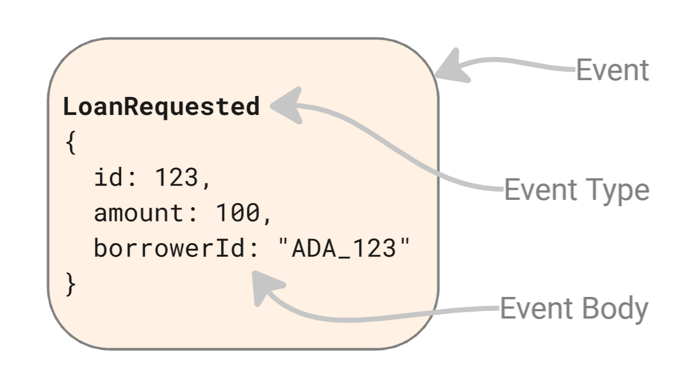
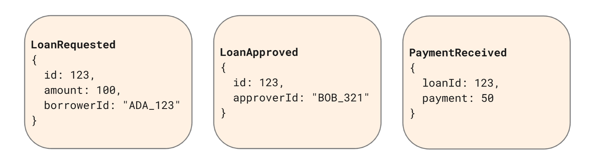
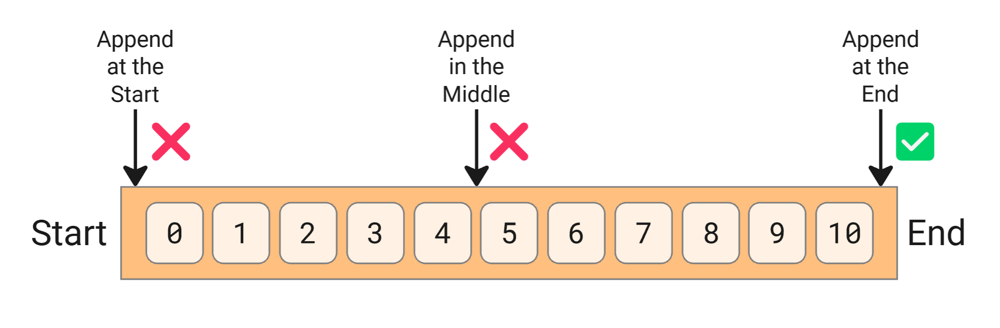
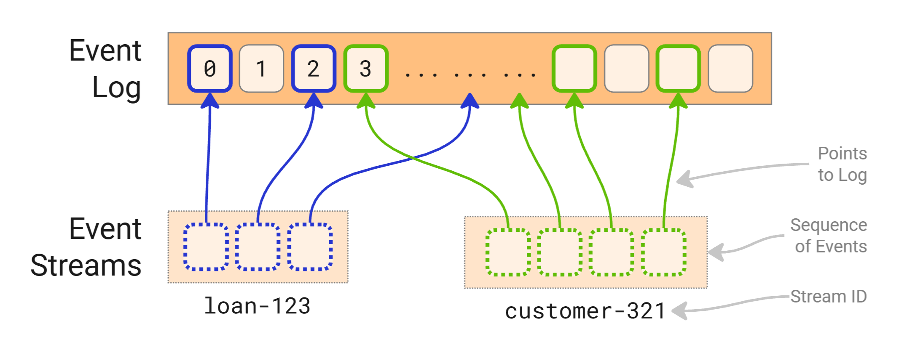
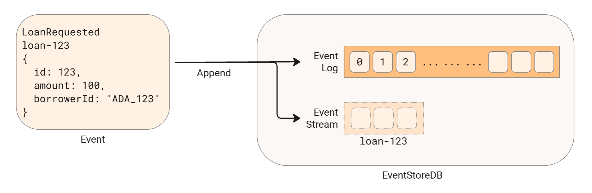

# Concepts

## Event

In EventStoreDB, an event is a factual occurrence from the past. It has an *event type* that headlines what happened and an *event body* that outlines the details.

An event usually represents a state change in an application, its entities, or business processes. In this case:

1. Ada requested a $1,000 loan. 
2. Bob approved the loan.
3. A loan payment of $50 was received.

## Event Log

The event log is an append-only sequence of events stored within the database. It is the ultimate source of truth, capturing every event appended to EventStoreDB. 

It is append-only. New events are added exclusively to the end of the log—never at the start or in the middle.

Internally, the event log consists of a series of data files that store events in the exact order in which they were appended.

## Event Stream

EventStoreDB's event log can store billions of events, many of which might be unrelated.

Events are commonly arranged into smaller and logically related groups known as **event streams** to keep them organized and speed up retrieval.

Event stream is a sequenced group of events from the event log that is identified by a stream ID.

### Example of Event Stream

Imagine the management of a loan system. The system's event log could hold millions of loan applications and customer events. Searching through millions of events to find specific loan or customer information is slow and burdensome. Instead, users can find events more efficiently by organizing them into fine-grained streams based on the unique Loan ID or Customer ID.

For example, a stream named "loan-123" would contain all the events related to Loan ID #123, while "customer-321" might store events specific to Customer ID #321. This configuration enables a quick read of a few related events instead of searching through the entire event log.

### Basics of Event Stream

Conceptually, an event stream serves two essential purposes:

1. Event Streams improve the read and event retrieval performance through [indexing⚠️](https://www.notion.so/Concept-EventStoreDB-Architecture-Storyboard-Ready-for-Review-4d7f136d21e742a9924f98c9c163558d?pvs=21).
2. Event Streams help enforce business constraints across related events using [optimistic concurrency control⚠️](https://www.notion.so/Concept-EventStoreDB-Architecture-Storyboard-Ready-for-Review-4d7f136d21e742a9924f98c9c163558d?pvs=21).

At their core, streams consist of a **stream ID** (a simple string) and a **sequence of events**. 

When appending an event to EventStoreDB, it must be associated with a specific stream ID. This process simultaneously appends the event to the event log and the designated stream.

### Event Stream Design

In EventStoreDB, a stream typically represents an instance of an object, entity, or business process. For example:

| Stream ID | Description |
| --- | --- |
| loan-123 | Represents loan application ID#123 |
| customer-321 | Represents customer ID#321 |
| payment-222 | Represents payment ID#222 from external payment gateway |

However, there are cases where it makes sense for a stream to encompass a more extensive set of events. In these cases, streams may align to a broader set of events: 

| Stream ID | Description |
| --- | --- |
| loan | Represents all loan applications |
| customer | Represents all customers |
| payment-gateway | Represents all events from an external payment gateway  |

Designing streams and deciding which events belong to which stream involves balancing performance, scalability, and maintainability. Understanding the trade-offs is the starting point for designing streams that best suit organizational goals.