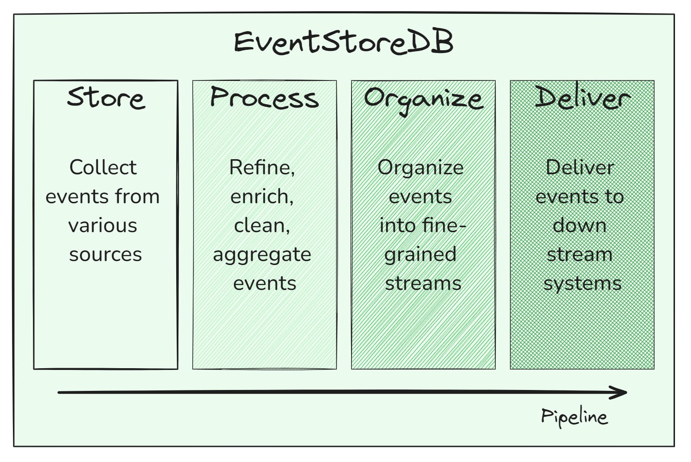
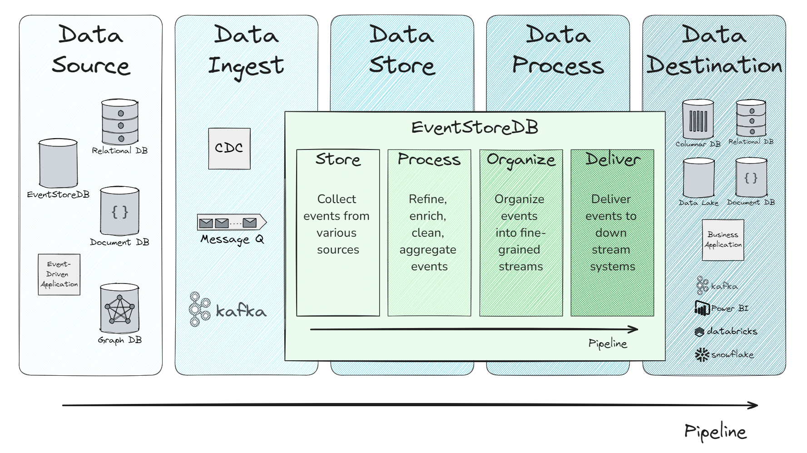
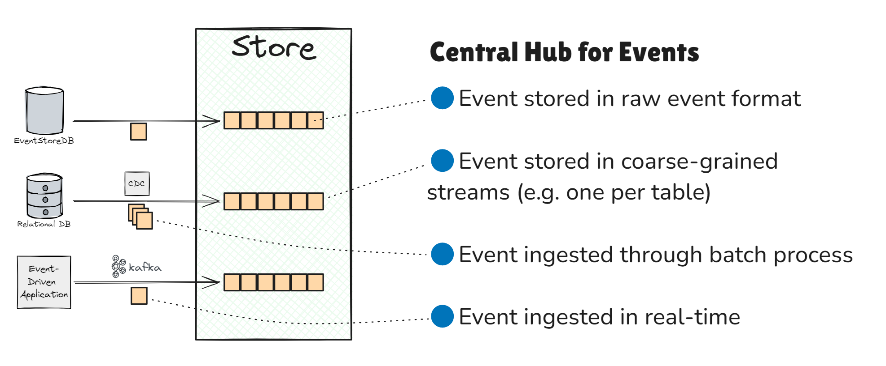
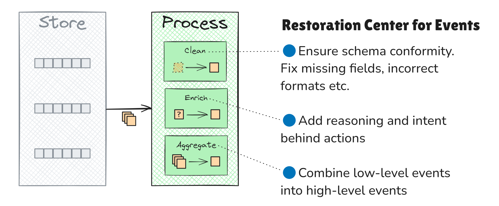
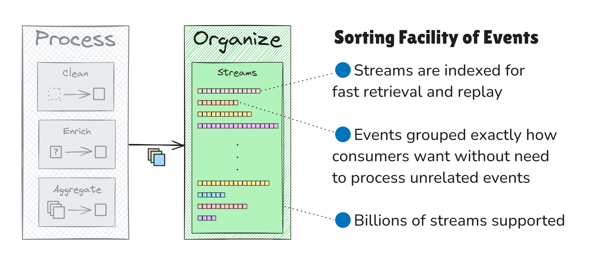
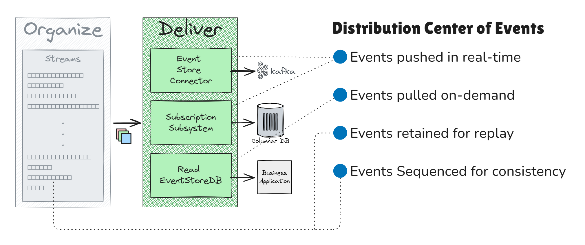

# KurrentDB in Data Engineering Pipelines

## Introduction

Traditional data pipelines processing state-based data models often struggle to meet modern demands like compliance, analytics, AI training, and operational responsiveness. These models, which capture only the current state of an entity, fall short in handling historical data, traceability, and responsiveness. This article explores these limitations and highlights how KurrentDB addresses the shortcomings of handling state-based data models in traditional pipelines.

## Challenges of Data Pipelines with State-Based Data Models

Many traditional data sources use state-based data models, capturing only the current state of an entity at a specific time. While sufficient for transactional needs, this approach presents significant challenges for modern data pipelines, especially when dealing with compliance, analytics, AI training, and operational responsiveness.

### 1. Lack of Historical Data for Auditing and AI Training

One of the most significant limitations of state-based systems is the lack of historical data. These systems typically overwrite values without preserving previous states, making it hard to track changes over time:

- **Audits and Compliance**: Regulatory frameworks often require detailed and complete audit trails, which can be difficult for state-based systems to provide.
- **AI Training and Business Analytics**: AI systems need comprehensive event histories to detect meaningful patterns and trends. 

### 2. Lack of Data Lineage and Traceability

State-based systems don’t readily offer data lineage or traceability. As data moves through various transformations in the pipeline, such as being aggregated in data warehouses or other sinks, it’s often unclear how this data was derived:

- **No Traceability**: Without clear lineage, businesses can't trace how final reports or models were produced, leading to compliance risks and a lack of insight into their data.
- **Unclear Impact of Changes**: A change in a source system can cascade through a pipeline in unpredictable ways, making it difficult to know how downstream analytics or AI models will be affected.

### 3. Lack of Data Consistency

State-based models can lead to data inconsistencies when source data is overwritten without alerting downstream systems:

- **Out-of-Sync Data**: Untracked changes in source data can misalign downstream systems, especially when updates occur through unofficial channels, leading to inaccurate insights.
- **Hard to Detect**: Without versioning or sequencing, downstream systems struggle to identify outdated data, potentially leading to decisions based on stale information.

### 4. Lack of Data Availability and Responsive Operations

State-based systems frequently rely on batch processing, which introduces delays in making data available for analysis:

- **Lag in Data Availability**: Batch processing introduces delays between data generation and analysis, leading to decisions based on outdated information and reduced operational efficiency.
- **Losing Consumed Events**: While streaming platforms can alleviate some latency issues, once events are consumed, they are typically discarded. This makes replaying or reanalyzing past events impossible without incurring significant storage costs.

### 5. Lack of Event Organization

Many streaming platforms only provide a limited number of topics or streams, which leads to unrelated events being grouped into large, shared topics.

- **Slow Event Retrieval**: Extracting relevant events from these mixed topics can be slow and resource-intensive. Consumers are often forced to process vast amounts of irrelevant data.
- **Difficulty in Event Compartmentalization**: Unrelated event consumers lack dedicated topics, forcing them to share a large, mixed topic. This undermines modularity and encapsulation principles, increasing system complexity.

## Role of KurrentDB in a Data Pipeline

KurrentDB serves as a repository, hub, or distribution center for events, centralizing the management of events from multiple sources. This enables KurrentDB to address many challenges inherent in traditional data pipelines. It offers a solution that enhances historical data granularity and quality while improving responsiveness to the dynamic nature of business operations.

### Four Major Functions of KurrentDB in a Data Pipeline

In a data pipeline, KurrentDB performs four major functions:

1. Store and collect events from various data sources
2. Process, refine, enrich, clean, and aggregate events
3. Organize events into fine-grained event streams
4. Deliver events to downstream systems

### KurrentDB in a Pipeline

#### Input from Data Pipeline

KurrentDB typically ingests events from these data sources:

- Change data capture (CDC) from traditional databases (e.g., relational)
- Databases that support event sourcing (such as KurrentDB) where events are natively stored
- Messaging and Event Streaming platforms
- Event-driven applications (such as sensor event recording applications)

#### Processes in Data Pipeline

KurrentDB primarily participates in the following data pipeline processes:

- Data ingestion
- Data storage
- Data processing

#### Output to Data Pipeline

KurrentDB distributes processed and organized events to downstream storage and applications, such as:

- Data warehouses
- Data lakes
- Business intelligence tools
- Operational databases
- Business applications
- Messaging or streaming platforms

## How to use KurrentDB in a Data Pipeline

KurrentDB plays a key role in data pipelines by providing a centralized platform to store, process, organize, and deliver events from various sources. It stores a complete history of events, offering flexibility and reliability throughout the pipeline. Here’s how it works:

### Step 1. Store Events

KurrentDB collects and stores raw events from various data sources, such as databases, applications, or event-driven systems.

To maximize future flexibility, events from these sources are typically stored in their raw format within dedicated coarse-grained streams. These streams are not prematurely separated. For example, one stream might be used per data source or table rather than creating a separate stream for each entity, like a customer.

The events can be ingested in real-time or through batch processing.

::: info
**Key Purposes of KurrentDB**: Central Hub for Events

KurrentDB acts as a hub for events from multiple data sources, storing all events in an immutable log, ensuring:

- **Auditability and Compliance**: Immutable event logs create a complete audit trail, ensuring compliance with regulatory standards.
- **AI Training and Behavioral Insights**: Full event histories provide richer data for AI model training and behavioral analysis.
- **Event Retention**: Unlike many streaming platforms, KurrentDB retains events even after consumption, allowing them to be replayed for future use.
:::
### Step 2. Process Events

Once events are ingested, KurrentDB allows them to be processed using its **projection subsystem**. This process makes them more useful for downstream systems, while granular events can be aggregated into higher-level insights.

- **Clean**: Ensure data conforms to specific schemas, addressing missing fields or incorrect formats.
- **Enrich**: Optionally add additional context, such as the reason behind specific actions, which might not be apparent from raw event data from CDC (see footnote 1).
- **Aggregate**: Combine several detailed events into a more high-level integration events for easier consumption by external systems.

::: info
**Key Purposes of KurrentDB**: Restoration Center for Events
KurrentDB cleans and transforms raw events into enriched, refined formats that improve:

- **Data Quality and Context**: Processed events are enriched with additional context, making it easier to uncover valuable business insights.
- **Data Lineage**: KurrentDB maintains causation metadata, allowing businesses to trace the transformation path of events and perform root cause analysis.
:::

### Step 3. Organize Events

After events are processed, they are organized into fine-grained event streams. KurrentDB supports the organization of billions of streams, each tailored for specific business use cases. These streams can be de-normalized, duplicating events across multiple streams for more efficient retrieval without cross-referencing unrelated streams and events.

This is particularly useful when downstream systems need to replay events for a specific customer in a company with millions of customers. Events can be organized into dedicated streams, one per customer, each containing the customer's journey and interactions across multiple systems. Contrast this with a single stream containing events from millions of customers. In the latter case, downstream systems must manually filter out irrelevant events from all other customers, wasting time and resources while increasing complexity.

::: info
**Key Purposes of KurrentDB**: Sorting Facility of Events

KurrentDB organizes events into streams that allow:

- **Dedicated Event Streams**: Events can be categorized into specialized streams, ensuring consumers consume only the required data without sifting through irrelevant events.
- **Quick Event Access**: Indexed streams provide fast access to specific subsets of events  without replaying long, mixed streams like those found in traditional messaging platforms.
:::

### **Step 4. Deliver Events**

Organized and curated events are delivered to downstream systems through KurrentDB’s connectors and subscription subsystem. 

These allow events to be pushed in real-time, pulled on-demand, or scheduled for batch retrieval from the fine-grained streams.

::: info
**Key Purposes of KurrentDB**: Distribution Center of Events

KurrentDB distributes events efficiently, ensuring:

- **Immediate Data Streaming**: Subscriptions reduce latency and staleness, enabling real-time analytics and responsive operations
- **Event Replayability**: Unlike traditional messaging and streaming platforms, where events are discarded after consumption, KurrentDB retains events, allowing downstream systems to replay for future analysis.
- **Data Consistency and Synchronization**: With the event log’s strict sequence of events, downstream systems can track events to ensure they are processing events in the correct order and are up-to-date, identifying if any are missing or out of sync.
:::

## Conclusion

State-based data models in data pipelines often lead to inefficiencies and risks, especially in compliance, AI training, and operational responsiveness. KurrentDB addresses these challenges through its immutable log, connector, subscription, and projection subsystems. This solution offers several key benefits:

- **Complete historical data retention**: Provides full event histories for better auditing and AI model training.
- **Enhanced data lineage and traceability**: Ensures businesses can trace the origin and transformation of data across pipelines.
- **Improved data consistency**: Ensures downstream systems remain synchronized with real-time data.
- **Efficient event organization and replayability**: Enables quick access to relevant data and replay of events for future analysis.

By leveraging KurrentDB, organizations can overcome the limitations of traditional pipelines and achieve greater data accuracy and operational efficiency.

## Footnotes

1. In some cases, Change Data Capture (CDC) events may lack clarity regarding the intent behind a change. 

For example, if a vehicle is marked as "unavailable," it may be unclear whether it is reserved or undergoing maintenance. This ambiguity can only be resolved if the source application is updated to include additional contextual information, such as a "reason" field accompanying the status change. 

However, this challenge is generally absent in event-sourced applications, where the intent behind each action or change is usually well-defined within the event itself.