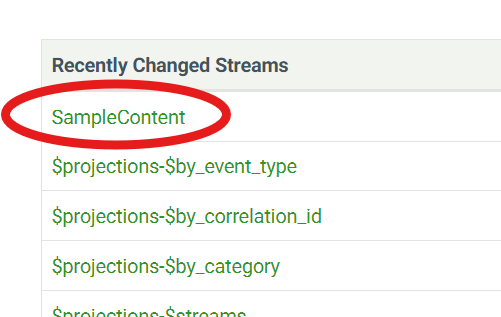

# EventStoreDB Quickstart using GitHub Codespaces

This quickstart will guide you through getting started with [EventStoreDB](https://www.eventstore.com/) using [GitHub Codespaces](https://github.com/features/codespaces). You will learn how to start the EventStoreDB server, append a message to the database, and read the message back using Python.

To get started quickly, use the Codespace environment that already has everything set up for you.

## Prerequisites

Before starting, ensure you have the following:

1. A GitHub account to use GitHub Codespaces.
2. Basic knowledge of Python programming.
3. Familiarity with command-line operations.

## Step 1: Set up Your Codespace

1. Click on the link below and follow the instructions to create a new Codespace from the GitHub repo:

   [](https://codespaces.new/EventStore/EventStoreDB-From-Scratch-Python)

   This will open a pre-configured development environment with all the required dependencies already installed, including Python and EventStoreDB tools.

2. Wait for your Codespace to build. This will take a few moments.

## Step 2: Start the EventStoreDB Server

1. Once inside your Codespace, run the following command in the terminal to start the EventStoreDB server:

   ```sh
   ./start-cluster.sh
   ```

   This command will pull the EventStoreDB server Docker container and start the server.

2. Run the following command to output the URL of the EventStoreDB Admin UI:

   ```sh
   echo -e "\e[32m🚀 Click here to browse the EventStoreDB Admin UI:\e[0m \e[34m$(gh codespace ports --repo EventStore/EventStoreDB-From-Scratch-Python --json browseUrl,sourcePort --jq '.[] | select(.sourcePort == 2113) | .browseUrl')\e[0m"
   ```

3. Press `CTRL` and click the URL displayed in the terminal to open the EventStoreDB Admin UI in your browser. A screenshot like the one below should be displayed showing the Admin UI:

   

   **Note:** Keep the Admin UI open for the next steps.

## Step 3: Append an Event to a Stream

Now that EventStoreDB is running, let’s append a message to a stream.

1. In the terminal, run the provided script to append an event with the content `{"Id":"1", "value":"some data"}` to a stream named `SampleContent`:
   ```sh
   python sample_append.py
   ```

## Step 4: Verify the Appended Event in the Admin UI

1. Return to the Admin UI and click the **Stream Browser** link from the top navigation bar.

2. Under **Recently Changed Streams**, you should see `SampleContent`. Click on it.

   

3. Click on the **JSON** link in the last column of the first table row. You should see the content of the appended event.

## Step 5: Read an Event from the Stream

Finally, let’s read the message we just appended.

1. In the terminal, run the provided script to read events from the stream:
   ```sh
   python sample_read.py
   ```
   You should see the message that you previously appended: `success`.

## Summary

In this quickstart, you:

1. Started the EventStoreDB server.
2. Browsed to the Admin UI.
3. Appended an event to a stream.
4. Verified the event in the Admin UI.
5. Read the event from the stream.

Feel free to experiment further by appending more events, reading them, or even exploring advanced features of EventStoreDB!
