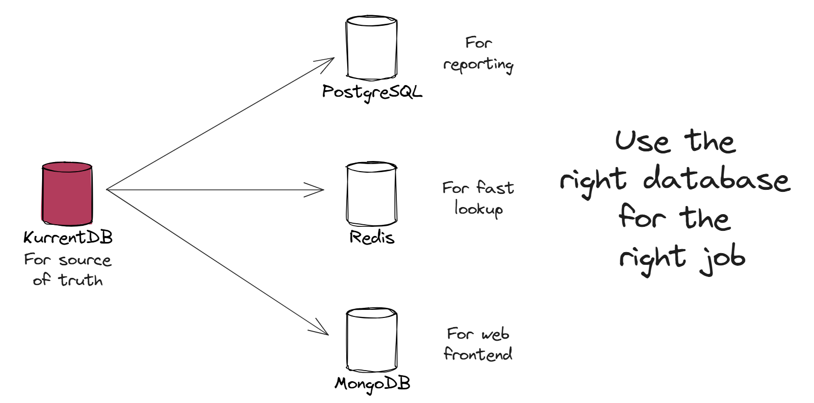

# Explanation

## What does Mix-and-Match Database mean?

**Mix-and-Match Database** means using multiple types of databases or data models for different parts of your application. For example:

- **PostgreSQL** for general queries.
- **Redis** for fast lookups.
- **MongoDB** for web frontends.

This strategy is beneficial because no single database is perfect for every use case. Selecting the most optimal database for each specific task enhances performance, scalability, and developer efficiency.

::: info

This is also popularly known as **Polyglot Persistence**. 

:::

## Traditional Approach

Traditionally, systems use a single relational database for all operations and it is not simple or reliable to push updates to other data stores.

To distribute data across multiple databases, developers typically implement synchronization mechanisms like:

- **Manual synchronization and ETL jobs** to periodically replicate data.
- **Message brokers** (e.g., Kafka, RabbitMQ) that propagate updates to various services.

However, these methods can have drawbacks:

- Risk of synchronization failure.
- Noticeable delays due to batch processing.
- Difficulty in recovery after failures.
- Issues with message loss, duplication, or ordering.

Such complexities increase the developers' workload to maintain synchronization and consistency.

## Mix-and-Match Database Effectively with KurrentDB

KurrentDB captures all changes (events) immutablly within your system, which can be consumed by any number of downstream systems or databases in real time. This means you can reliably synchronize a variety of databases or data models, each optimized for a specific use case, without the complexity, risks, or delays of traditional batch jobs or external messaging systems.

### Benefits include:

- **Reliable and Simple Synchronization**:
  - Events stored immutably in sequential order prevent typical synchronization issues like message loss or duplication.

- **Real-time Updates**:
  - KurrentDB allows real-time event stream subscriptions, enabling instant updates across data stores like Redis and MongoDB.

- **Efficient Error Recovery**:
  - Easily fix synchronization issues by replaying events to rebuild accurate read models.

- **Future-Proof Architecture**:
  - Instantly populate new specialized databases for unforeseen needs without modifying existing components.

## How to Mix-and-Match Databases with KurrentDB

Implementing this strategy with KurrentDB involves a few simple steps:

#### 1. Capture Events in KurrentDB
Persist each event immutably, creating a reliable event log as the authoritative data source.

#### 2. Build Optimized Read Models
Project or transform events into specialized databases:
- **MongoDB** for frontend queries.
- **Redis** for caching and rapid lookups.
- **Relational DBs** for complex analytics and reporting.

#### 3. Real-time Synchronization
Subscribe databases directly to KurrentDB's event streams, ensuring automatic real-time updates without manual syncing.

#### 4. Easy Error Recovery
Quickly recover from synchronization issues by replaying events to rebuild accurate read models.