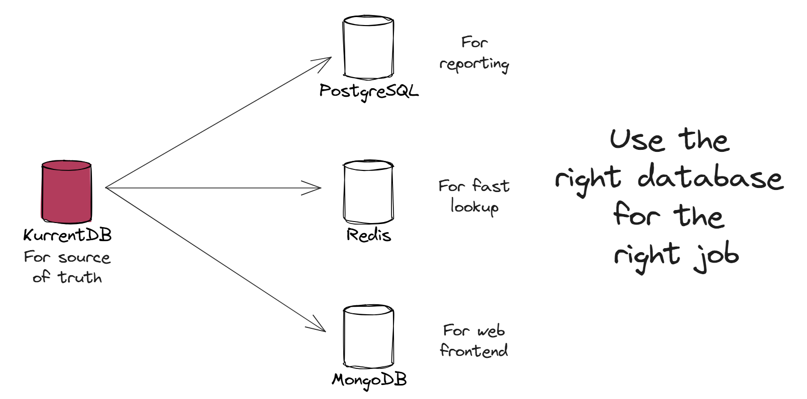
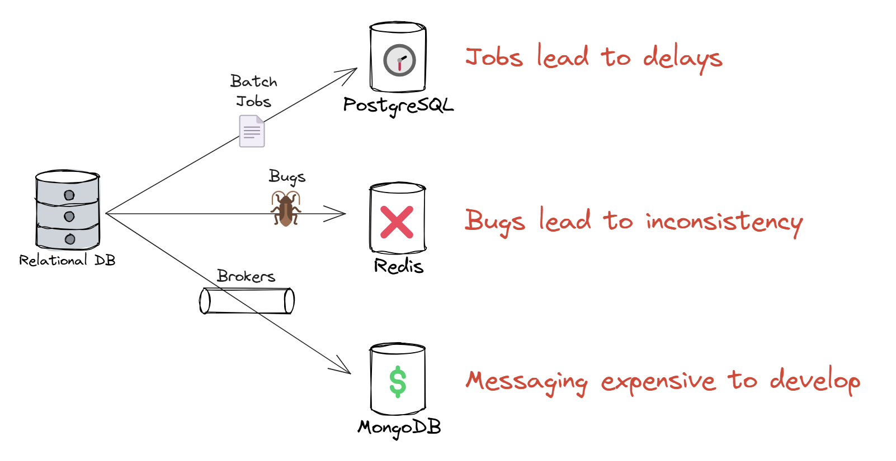

#

# What is Multimodal Data Transformation?

**Multimodal Data Transformation** means using different types of databases or storage technologies for different parts of your application — for example, using PostgreSQL for reports, Redis for fast lookups, and MongoDB for web frontends. It matters because no single database is great at everything. By choosing the right tool for the job, you can optimize performance, scalability, and developer productivity.

---

# The Traditional Way

In most CRUD or state-based systems, all reads and writes go through a single relational database. To enable Multimodal Data Transformation, developers usually bolt on sync mechanisms to replicate data into other databases. This might involve:

- **Manual sync jobs** that run periodically to copy data.
- **Message brokers** (like Kafka or RabbitMQ) that try to capture updates and fan them out to other services.

But these approaches are fragile and complex:

- They can fall out of sync
- Sync jobs process data in batches, often causing noticeable delays
- Recovering from failure is hard
- Message brokers can cause message loss, duplication, or out-of-order delivery

This adds extra work for developers to ensure the synchronization is robust.

---

# Enable Multimodal Data Transformation Easily with KurrentDB

KurrentDB is designed for **event sourcing**. Instead of storing only the latest state, it stores all changes (events) that happened to your system — for example: `OrderPlaced`, `OrderShipped`, or `ItemAddedToCart`.

This unlocks Multimodal Data Transformation in a clean, reliable way:

1. **Write once, project anytime/anywhere**\
   Events are the single source of truth. You can project any number of read models, each tailored for a specific need and stored in the best-fit database. New ones can be added anytime by replaying the event stream.

2. **Consistent and easy to sync**\
   Events are immutably stored in a consistent order, there's no need to worry about message loss, duplication, or reordering — making synchronization much simpler to build and trust.

3. **Real-time subscriptions**\
   KurrentDB supports real-time subscriptions to event streams. That means your app (or background service) can react instantly to changes and update the right data stores — whether that’s Redis, MongoDB, or anything else.

4. **Recover from sync issue with confidence**

   Discovered a bug in the synchronized code? Fix it, and confidently replay the same events in the same order to rebuild the read model.

This makes it much easier for developer to build applications that synchronizes to multiple data stores.

---

# How to Enable Multimodal Data Transformation with KurrentDB

Model your system using events – Define domain events like OrderPlaced or PaymentReceived that capture the intent of each change.

- Store events in KurrentDB – Every event is appended to a stream and stored in order.
- Subscribe to streams – Use real-time or catch-up subscriptions to listen to event streams.
- Build projections – As you process events, build read models tailored to specific queries or systems, and store them in the most suitable database (e.g., PostgreSQL, MongoDB, Redis).
- Replay when needed – Rebuild or add new projections at any time by replaying past events.

This approach lets you scale and evolve your architecture cleanly, with full flexibility in how and where data is used.

