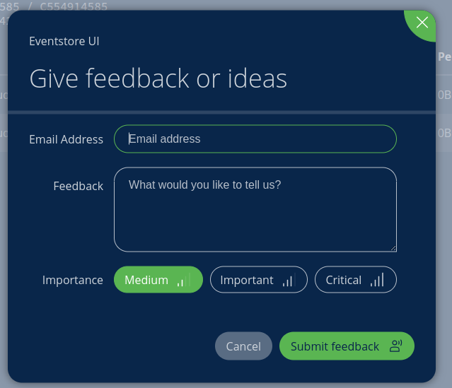
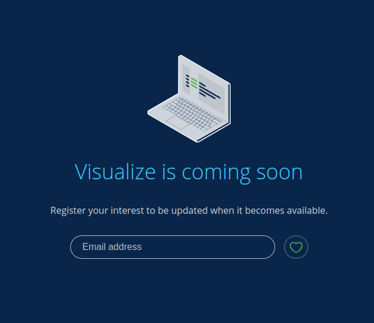

---
title: "Introduction"
---

# Navigator: A New UI For EventStoreDB <Badge text="Preview" type="warning" vertical="middle"/>

We're working on a new user interface for EventStoreDB and we invite you to try the preview.

At this stage we're mainly looking for feedback on the new stream browser, along with your thoughts on upcoming features and general suggestions for the app.

As the app is still in preview, expect some rough edges and for things to change as we progress into the final stages.

The following packages are available for download.  

| OS      | Package   | x64        | arm64
| :-------| :---------| :----------| :---------- |
| MacOS   | dmg       | [Download](https://dl.cloudsmith.io/public/eventstore/navigator/raw/names/Event%20Store%20Navigator%20dmg%20installer%20(amd64)/versions/v0.0.1-preview.1/EventStoreNavigator-0.0.1-preview.1-x64.dmg) | [Download](https://dl.cloudsmith.io/public/eventstore/navigator/raw/names/Event%20Store%20Navigator%20dmg%20installer%20(arm64)/versions/v0.0.1-preview.1/EventStoreNavigator-0.0.1-preview.1-arm64.dmg)  |
| Windows | exe       | [Download](https://dl.cloudsmith.io/public/eventstore/navigator/raw/names/Event%20Store%20Navigator%20exe%20installer%20(amd64)/versions/v0.0.1-preview.1/EventStoreNavigator-0.0.1-preview.1-x64.exe) |           |
| Linux   | deb       | [Download](https://dl.cloudsmith.io/public/eventstore/navigator/deb/ubuntu/pool/xenial/main/E/Ev/event-store-navigator_0.0.1~preview.1/EventStoreNavigator-0.0.1-preview.1-amd64.deb) | [Download](https://dl.cloudsmith.io/public/eventstore/navigator/deb/ubuntu/pool/xenial/main/E/Ev/event-store-navigator_0.0.1~preview.1/EventStoreNavigator-0.0.1-preview.1-arm64.deb)  |
| Linux   | rpm       | [Download](https://dl.cloudsmith.io/public/eventstore/navigator/rpm/any-distro/any-version/x86_64/EventStoreNavigator-0.0.1-preview.1-x86_64.rpm) |           |
| Linux   | flatpak   | [Download](https://dl.cloudsmith.io/public/eventstore/navigator/raw/names/Event%20Store%20Navigator%20flatpak%20bundle%20(amd64)/versions/v0.0.1-preview.1/EventStoreNavigator-0.0.1-preview.1-x86_64.flatpak) |           |
| Linux   | snap      | [Download](https://dl.cloudsmith.io/public/eventstore/navigator/raw/names/Event%20Store%20Navigator%20snap%20package%20(amd64)/versions/v0.0.1-preview.1/EventStoreNavigator-0.0.1-preview.1-amd64.snap) |           |
| Linux   | pacman    | [Download](https://dl.cloudsmith.io/public/eventstore/navigator/raw/names/Event%20Store%20Navigator%20pacman%20package%20(amd64)/versions/v0.0.1-preview.1/EventStoreNavigator-0.0.1-preview.1-x64.pacman) |           |
| Linux   | apk       | [Download](https://dl.cloudsmith.io/public/eventstore/navigator/raw/names/Event%20Store%20Navigator%20apk%20package%20(amd64)/versions/v0.0.1-preview.1/EventStoreNavigator-0.0.1-preview.1-x64.apk) |           |

## Features in the preview

- An easy way to connect to EventStoreDB instances
- A comprehensive dashboard that provides:
    - Cluster details and status which you can capture in snapshots
    - Replications
    - Queue details
- A stream browser that allows you to work and inspect streams and metadata
- An Administration panel that enables you to:
    - Merge indexes
    - Restart persistent subscriptions

## General feedback

To provide feedback on the app with any thoughts on its development, simply select the Feedback button in the top right of the app, and complete the feedback form, including your email address, feedback and level of importance.

::: card

:::

### Vote on new features

To help us shape the roadmap for the app, you can vote on upcoming features.

Simply fill in your email and click the heart next to the email field. 

Upcoming features are: 
* Projections
* Persistent subscriptions
* Visualize
* Plugin management
* Scavenging Management
* Node Operations

::: card

:::

