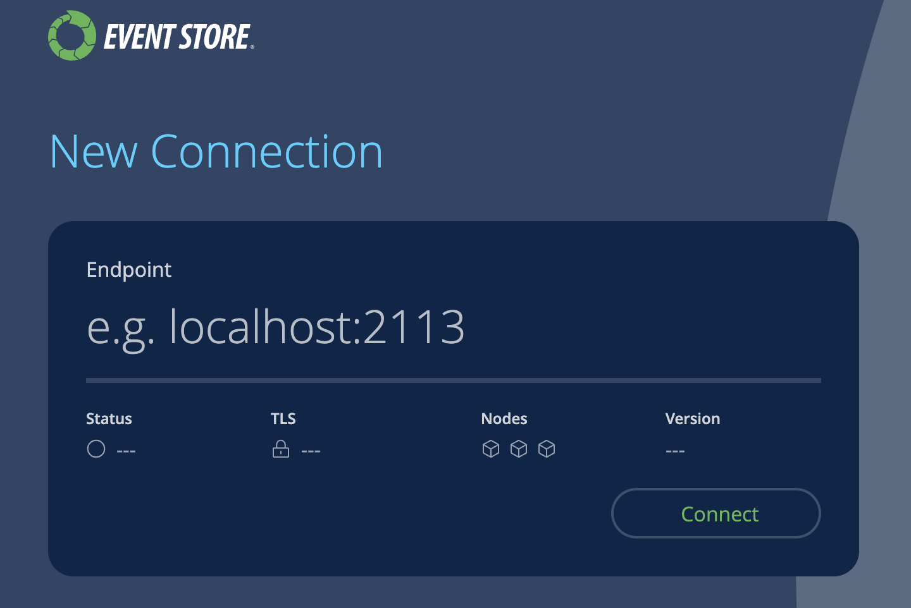
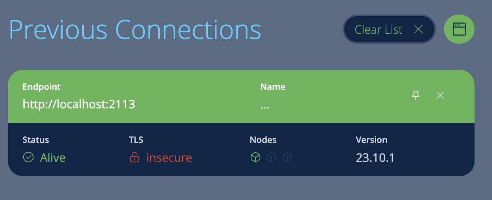
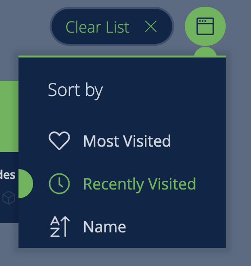
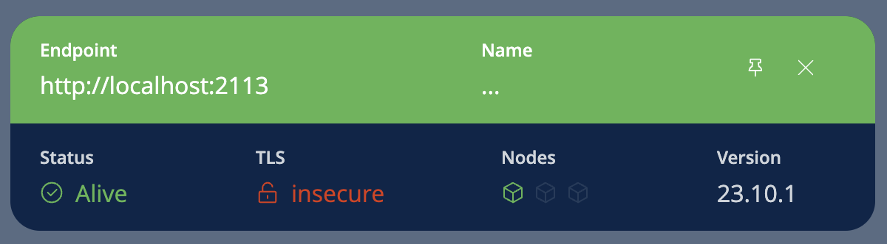

# Connect to an ESDB instance

When you first start Navigator either connect to a new ESDB instance or reconnect to an instance you've already set up.

## New connection

To create a new connection, simply enter the endpoint of the ESDB instance e.g. `localhost:2113` for a local single node insecure instance.

The format for a connection endpoint is: `{host}:{port}`. 

Navigator performs TLS auto discovery.
If using TLS, specify `https` in the endpoint address: `https://{host}:{port}`.
Navigator ignores all options except TLS i.e. `https` when specifying an endpoint.

::: card

:::

## Previous connections

To reconnect to a previously used ESDB instance, select a connection from the list of previous connections.

::: card

:::

Once connected successfully, the status, number of nodes and server version are shown.
If any error occured when trying to connect to an ESDB instance, the error will be displayed, including TLS errors.

You can manage previous connections as follows.

* Clear list
You can clear the list of previous connectiong by selecting `Clear List`. 
After you confirm, you can select `Undo` to restore the list of previous connections.
Selecting the close button `X` on the list of previous connections will clear the list and, here as well, you can select `Undo` to restore the list.

* Sort List
You can change the sort order of the list of previous connections by selecting the drop-down menu for sorting.
You can sort connections by most visited, recenttly visited and by name.

::: card

:::

* Manage previous connections
Select the pin icon to move a connection to the top of the list.
Selecting the close button `X` icon will remove a previous connection from the list.

::: card

:::

