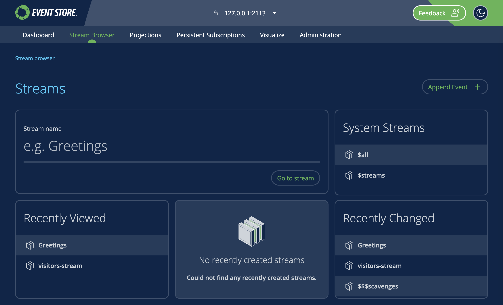
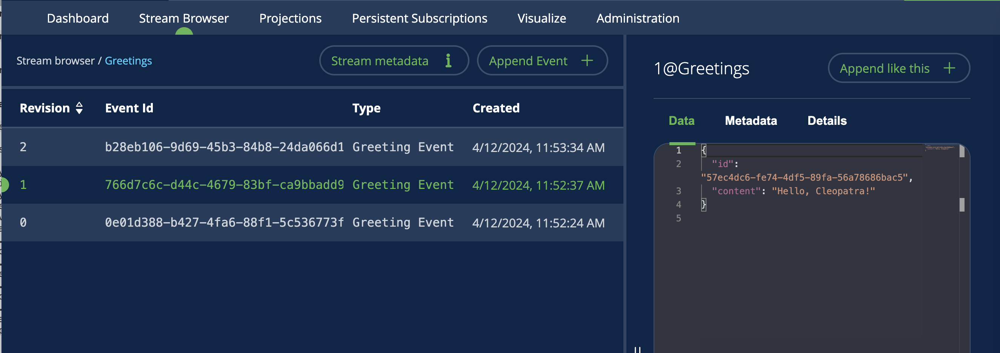

# Stream browser

Select `Stream Browser` to work with streams.

::: card

:::

In the stream browser, you can specify a stream to work by entering its name or select any stream e.g. a system stream or a recently changed stream.

::: card

:::

## Select a stream

Under `Streams` enter a stream name then select `Go to stream`. This will take you to the stream details.

::: card

:::

   - input your stream name to go to stream
2. System stream
3. Recetly viewed streams
4. Recently created streams
   - (Requires $streams projection to be running)
5. Recently changed
6. Append event
   - 6a. Event details
   - 6b. Data
     - 6ba. Upload data
       - You can also drag & drop a file to set as data
     - 6bb. toggle word wrap
   - 6c. Metadata
     - 6ca. Upload metadata
       - You can also drag & drop a file to set as metadata
     - 6cb. toggle word wrap
   - 6d. Cancel
   - 6e. Append event

## Working with a stream
1. Stream name
2. Show / hide stream metadata
  2a. Go to metadata stream
  2b. Stream Metadata
  2c. ACL settings
3. Append Event
  - (see append on streams)
4. Event list
  - Click to view event details
  - 4a. Change direction
5. Stream navigator
  - 5a. Jump to START
  - 5b. Previous event
  - 5c. Jump to event
    - Type in revision number to jump to event
  - 5d. Next event
  - 5e. Jump to END
6. Pause live updates / scroll to top
7. Event details
  - 7a. Event "name"
  - 7b. Append like this
    - Append new event with the data of this event
    - (see append on streams)
  - 7c. Data
    - 7ca. Download
    - 7cb. Toggle pretty print
    - 7bc. Toggle word wrap
  - 7d. Metadata
    - 7da. Download
    - 7db. Toggle pretty print
    - 7dc. Toggle word wrap
  - 7e. Event details

