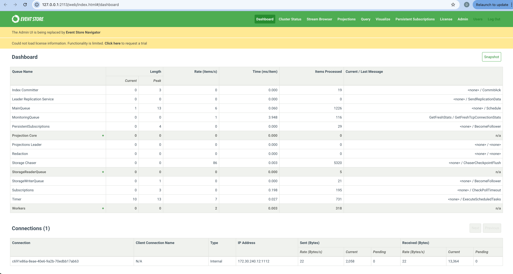

## Guide: Starting KurrentDB in docker

This guide will take you through installing and starting the KurrentDB database in Docker, either as a single node or as a cluster.
<!-- more -->

<!-- @include: ../snippets/start_KurrentDB.snippet.md#requirements -->

### Starting KurrentDB

:::  tabs#starting
@tab:active Single Node
<!-- @include: ../snippets/start_KurrentDB.snippet.md#singlenode -->

@tab Cluster
<!-- @include: ../snippets/start_KurrentDB.snippet.md#cluster -->
:::

Once the database starts, go to [`http://localhost:2113`](http://localhost:2113). You should see the database UI like this:

