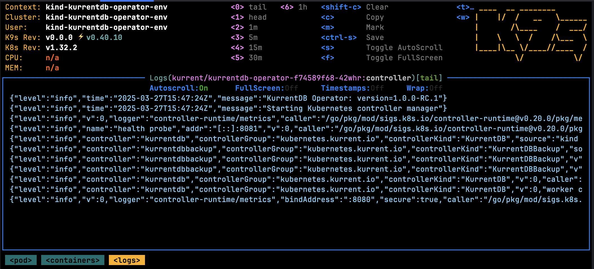

This section covers the various aspects of installing the Operator.

::: important
The Operator is an Enterprise only feature, please [contact us](https://www.kurrent.io/contact) for more information.
:::

## Prerequisites

::: tip
To get the best out of this guide, a basic understanding of [Kubernetes concepts](https://kubernetes.io/docs/concepts/) is essential.
:::

Before installing and executing the Operator, the following requirements should be met:

* Access to a Kubernetes cluster with a minimum version of `v1.23.1+`.
* Sufficient permissions to deploy the Operator and Custom Resource Definitions (CRDs).
* The following CLI tools are installed and configured to interact with your Kubernetes cluster. This means the tool must be accessible from your shell's `$PATH`, and your `$KUBECONFIG` environment variable must point to the correct Kubernetes configuration file:
  * [kubectl](https://kubernetes.io/docs/tasks/tools/install-kubectl)
  * [k9s](https://k9scli.io/topics/install/)
* The [Helm 3 CLI](https://helm.sh/docs/intro/install/) tool is installed and configured to interact with your Kubernetes cluster.
* Credentials for the Operator artifact repository (please [contact us](https://www.kurrent.io/contact) for more information). References to the credentials appear as `$username` and `$password` in the guide.

## Helm Repository

The Operator deployment process is managed via Helm. The following Kurrent repository must be configured using the command:

```bash
helm repo add kurrentdb-operator-repo \
  'https://packages.kurrent.io/basic/kurrentdb-operator/helm/charts/' \
  --username $username \
  --password $password
```

## Custom Resource Definitions (CRDs)

The following resource types are supported by the Operator:
- [KurrentDB](resource-types.md#kurrentdb)
- [KurrentDBBackup](resource-types.md#kurrentdbbackup)

Since CRDs are managed globally by Kubernetes, special care must be taken to install them.

### Automatic Install

The recommended approach to install and manage the CRDs is using Helm. Refer to the [Deployment Modes](#deployment-modes) section for more details.

### Manual Install

If the CRDs must be installed manually, then the following steps can be used:

```bash
# Download the kurrentdb-operator Helm chart
helm pull kurrentdb-operator-repo/kurrentdb-operator --version 1.0.0 --untar
# Install the CRDs
kubectl apply -f kurrentdb-operator/templates/crds
```
*Expected Output*:
```
customresourcedefinition.apiextensions.k8s.io/kurrentdbbackups.kubernetes.kurrent.io created
customresourcedefinition.apiextensions.k8s.io/kurrentdbs.kubernetes.kurrent.io created
```

## Deployment Modes

The Operator can be scoped to track Kurrent resources across *all* or *specific* namespaces.

### Cluster-wide

In this mode, the Operator will track Kurrent resources across **all** namespaces. This mode offers the simplest configuration option but the Operator requires a `ClusterRole` (this  will be created as part of the installation process).

To deploy the Operator in this mode, the following command can be used:

```bash
helm install kurrentdb-operator kurrentdb-operator-repo/kurrentdb-operator \
  --version 1.0.0 \
  --namespace kurrent \
  --create-namespace \
  --set crds.enabled=true \
  --set operator.imageRepository.username=$username \
  --set operator.imageRepository.password=$password
```

Here's what the command does:
- Sets the namespace of where the Operator will be deployed i.e. `kurrent` (feel free to change this)
- Creates the namespace (if it already exists, leave out the `--create-namespace` flag)
- Deploys CRDs (this can be skipped by removing `--set crds.enabled=true`)
- Deploys a new Helm release called `kurrentdb-operator` in the `kurrent` namespace.

*Expected Output*:
```
NAME: kurrentdb-operator
LAST DEPLOYED: Thu Mar 20 14:51:42 2025
NAMESPACE: kurrent
STATUS: deployed
REVISION: 1
TEST SUITE: None
```

Once installed, navigate to the [deployment validation](#deployment-validation) section.

### Specific Namespace(s)

In this mode, the Operator will track Kurrent resources across **specific** namespaces. This mode reduces the level of permissions required. The Operator will create a `Role` in each namespace that it is expected to manage.

To deploy the Operator in this mode, the following command can be used:

```bash
helm install kurrentdb-operator kurrentdb-operator-repo/kurrentdb-operator \
  --version 1.0.0 \
  --namespace kurrent \
  --create-namespace \
  --set crds.enabled=true \
  --set operator.imageRepository.username=$username \
  --set operator.imageRepository.password=$password \
  --set operator.namespaces='{kurrent, foo}'
```

Here's what the command does:
- Sets the namespace of where the Operator will be deployed i.e. `kurrent` (feel free to change this)
- Creates the namespace (if it already exists, leave out the `--create-namespace` flag)
- Deploys CRDs (this can be skipped by removing `--set crds.enabled=true`)
- Sets the underlying Operator configuration to target the namespaces: `kurrent` and `foo`
- Deploys a new Helm release called `kurrentdb-operator` in the `kurrent` namespace

::: important
Make sure the namespaces listed as part of the `operator.namespaces` parameter already exist before running the command (unless you are using the Operator to target the namespace that it will be deployed in to).
:::

*Expected Output*:
```
NAME: kurrentdb-operator
LAST DEPLOYED: Thu Mar 20 14:51:42 2025
NAMESPACE: kurrent
STATUS: deployed
REVISION: 1
TEST SUITE: None
```

Once installed, navigate to the [deployment validation](#deployment-validation) section.

#### Augmenting Namespaces

The Operator deployment can be updated to adjust which namespaces are watched. For example, in addition to the `kurrent` and `foo` namespaces (from the example above), a new namespace `bar` may also be watched using the command below:

```bash
helm upgrade kurrentdb-operator kurrentdb-operator-repo/kurrentdb-operator \
  --version 1.0.0 \
  --namespace kurrent \
  --set operator.namespaces='{kurrent,foo,bar}'
```

This will trigger:
- a new `Role` to be created in the `bar` namespace 
- a rolling restart of the Operator to pick up the new configuration changes

## Deployment Validation

Using the k9s tool, navigate to the namespace listing using the command `:namespaces`. It should show the namespace where the Operator was deployed:


After stepping in to the `kurrent` namespace, type `:deployments` in the k9s console. It should show the following:


Pods may also be viewed using the `:pods` command, for example:


Pressing the `Return` key on the selected Operator pod will allow you to drill through the container hosted in the pod, and then finally to the logs:

