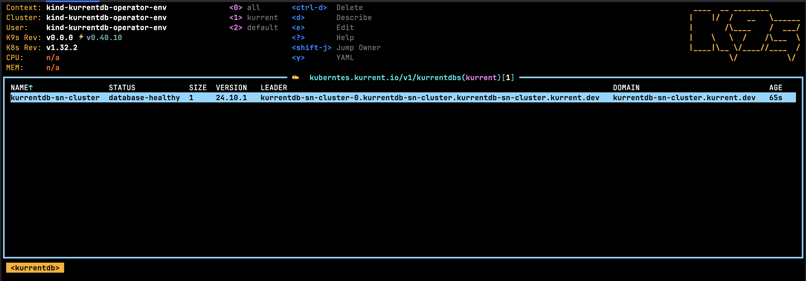
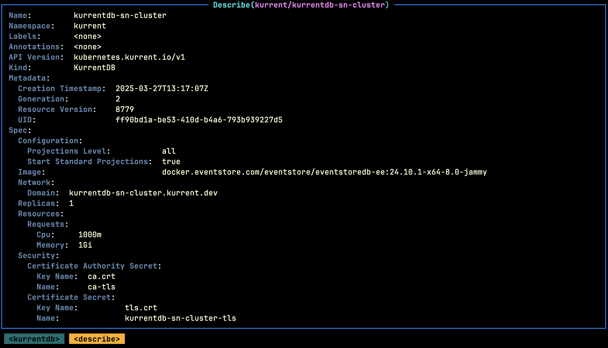

The sections below detail the different deployment options for KurrentDB. For detailed information on the various properties, visit the [KurrentDB API](../getting-started/resource-types.md#kurrentdb) section.

## Prerequisites

::: tip
To get the best out of this guide, a basic understanding of [Kubernetes concepts](https://kubernetes.io/docs/concepts/) is essential.
:::

Before deploying a `KurrentDB` cluster, the following requirements should be met:

* The Operator has been installed as per the [Installation](../getting-started/installation.md) section.
* The following CLI tools are installed and configured to interact with your Kubernetes cluster. This means the tool must be accessible from your shell's `$PATH`, and your `$KUBECONFIG` environment variable must point to the correct Kubernetes configuration file:
    * [kubectl](https://kubernetes.io/docs/tasks/tools/install-kubectl)
    * [k9s](https://k9scli.io/topics/install/)

:::important
With the examples listed in this guide, the Operator is assumed to have been deployed such that it can track the `kurrent` namespace for deployments.
:::

## Single Node Insecure Cluster

The following `KurrentDB` resource type defines a single node cluster with the following properties:
- The database will be deployed in the `kurrent` namespace with the name `kurrentdb-cluster`
- Security is not enabled
- KurrentDB version 25.0.0 will be used
- 1vcpu will be requested as the minimum (upper bound is unlimited)
- 1gb of memory will be used
- 512mb of storage will be allocated for the data disk
- The KurrentDB instance that is provisioned will be exposed as `kurrentdb-0.kurrentdb-cluster.kurrent.test`

```yaml
apiVersion: kubernetes.kurrent.io/v1
kind: KurrentDB
metadata:
  name: kurrentdb-cluster
  namespace: kurrent
spec:
  replicas: 1
  image: docker.kurrent.io/kurrent-latest/kurrentdb:25.0.0
  resources:
    requests:
      cpu: 1000m
      memory: 1Gi
  storage:
    volumeMode: "Filesystem"
    accessModes:
      - ReadWriteOnce
    resources:
      requests:
        storage: 512Mi
  network:
    domain: kurrentdb-cluster.kurrent.test
    loadBalancer:
      enabled: true
```

This can be deployed using the following steps:
- Copy the YAML snippet above to a file called `cluster.yaml`
- Ensure that the `kurrent` namespace has been created
- Run the following command:

```bash
kubectl apply -f cluster.yaml
```

Once deployed, navigate to the [Viewing Deployments](#viewing-deployments) section.

## Three Node Insecure Cluster

The following `KurrentDB` resource type defines a three node cluster with the following properties:
- The database will be deployed in the `kurrent` namespace with the name `kurrentdb-cluster`
- Security is not enabled
- KurrentDB version 25.0.0 will be used
- 1vcpu will be requested as the minimum (upper bound is unlimited) per node
- 1gb of memory will be used per node
- 512mb of storage will be allocated for the data disk per node
- The KurrentDB instances that are provisioned will be exposed as `kurrentdb-{idx}.kurrentdb-cluster.kurrent.test`

```yaml
apiVersion: kubernetes.kurrent.io/v1
kind: KurrentDB
metadata:
  name: kurrentdb-cluster
  namespace: kurrent
spec:
  replicas: 3
  image: docker.kurrent.io/kurrent-latest/kurrentdb:25.0.0
  resources:
    requests:
      cpu: 1000m
      memory: 1Gi
  storage:
    volumeMode: "Filesystem"
    accessModes:
      - ReadWriteOnce
    resources:
      requests:
        storage: 512Mi
  network:
    domain: kurrentdb-cluster.kurrent.test
    loadBalancer:
      enabled: true
```

This can be deployed using the following steps:
- Copy the YAML snippet above to a file called `cluster.yaml`
- Ensure that the `kurrent` namespace has been created
- Run the following command:

```bash
kubectl apply -f cluster.yaml
```

Once deployed, navigate to the [Viewing Deployments](#viewing-deployments) section.

## Single Node Secure Cluster (using self-signed certificates)

The following `KurrentDB` resource type defines a single node cluster with the following properties:
- The database will be deployed in the `kurrent` namespace with the name `kurrentdb-cluster`
- Security is enabled using self-signed certificates
- KurrentDB version 25.0.0 will be used
- 1vcpu will be requested as the minimum (upper bound is unlimited)
- 1gb of memory will be used
- 512mb of storage will be allocated for the data disk
- The KurrentDB instance that is provisioned will be exposed as `kurrentdb-cluster-0.kurrentdb-cluster.kurrent.test`

```yaml
apiVersion: cert-manager.io/v1
kind: Certificate
metadata:
  name: kurrentdb-cluster
  namespace: kurrent
spec:
  secretName: kurrentdb-cluster-tls
  isCA: false
  usages:
    - client auth
    - server auth
    - digital signature
    - key encipherment
  commonName: kurrentdb-node
  subject:
    organizations:
      - Kurrent
    organizationalUnits:
      - Cloud
  dnsNames:
    - '*.kurrentdb-cluster.kurrent.svc.cluster.local'
    - '*.kurrentdb-cluster.kurrent.test'
  privateKey:
    algorithm: RSA
    encoding: PKCS1
    size: 2048
  issuerRef:
    name: ca-issuer
    kind: Issuer
---
apiVersion: kubernetes.kurrent.io/v1
kind: KurrentDB
metadata:
  name: kurrentdb-cluster
  namespace: kurrent
spec:
  replicas: 1
  image: docker.kurrent.io/kurrent-latest/kurrentdb:25.0.0
  resources:
    requests:
      cpu: 1000m
      memory: 1Gi
  storage:
    volumeMode: "Filesystem"
    accessModes:
      - ReadWriteOnce
    resources:
      requests:
        storage: 512Mi
  network:
    domain: kurrentdb-cluster.kurrent.test
    loadBalancer:
      enabled: true
  security:
    certificateAuthoritySecret:
      name: ca-tls
      keyName: ca.crt
    certificateSecret:
      name: kurrentdb-cluster-tls
      keyName: tls.crt
      privateKeyName: tls.key
```

Before deploying this cluster, ensure that the steps described in section [Using Self-Signed certificates](managing-certificates.md#using-self-signed-certificates) have been followed.

Follow these steps to deploy the cluster:
- Copy the YAML snippet above to a file called `cluster.yaml`
- Ensure that the `kurrent` namespace has been created
- Run the following command:

```bash
kubectl apply -f cluster.yaml
```

Once deployed, navigate to the [Viewing Deployments](#viewing-deployments) section.

## Three Node Secure Cluster (using self-signed certificates)

The following `KurrentDB` resource type defines a three node cluster with the following properties:
- The database will be deployed in the `kurrent` namespace with the name `kurrentdb-cluster`
- Security is enabled using self-signed certificates
- KurrentDB version 25.0.0 will be used
- 1vcpu will be requested as the minimum (upper bound is unlimited) per node
- 1gb of memory will be used per node
- 512mb of storage will be allocated for the data disk per node
- The KurrentDB instance that is provisioned will be exposed as `kurrentdb-{idx}.kurrentdb-cluster.kurrent.test`

```yaml
apiVersion: cert-manager.io/v1
kind: Certificate
metadata:
  name: kurrentdb-cluster
  namespace: kurrent
spec:
  secretName: kurrentdb-cluster-tls
  isCA: false
  usages:
    - client auth
    - server auth
    - digital signature
    - key encipherment
  commonName: kurrentdb-node
  subject:
    organizations:
      - Kurrent
    organizationalUnits:
      - Cloud
  dnsNames:
    - '*.kurrentdb-cluster.kurrent.svc.cluster.local'
    - '*.kurrentdb-cluster.kurrent.test'
  privateKey:
    algorithm: RSA
    encoding: PKCS1
    size: 2048
  issuerRef:
    name: ca-issuer
    kind: Issuer
---
apiVersion: kubernetes.kurrent.io/v1
kind: KurrentDB
metadata:
  name: kurrentdb-cluster
  namespace: kurrent
spec:
  replicas: 3
  image: docker.kurrent.io/kurrent-latest/kurrentdb:25.0.0
  resources:
    requests:
      cpu: 1000m
      memory: 1Gi
  storage:
    volumeMode: "Filesystem"
    accessModes:
      - ReadWriteOnce
    resources:
      requests:
        storage: 512Mi
  network:
    domain: kurrentdb-cluster.kurrent.test
    loadBalancer:
      enabled: true
  security:
    certificateAuthoritySecret:
      name: ca-tls
      keyName: ca.crt
    certificateSecret:
      name: kurrentdb-cluster-tls
      keyName: tls.crt
      privateKeyName: tls.key
```

Before deploying this cluster, ensure that the steps described in section [Using Self-Signed certificates](managing-certificates.md#using-self-signed-certificates) have been followed.

Follow these steps to deploy the cluster:
- Copy the YAML snippet above to a file called `cluster.yaml`
- Ensure that the `kurrent` namespace has been created
- Run the following command:

```bash
kubectl apply -f cluster.yaml
```

Once deployed, navigate to the [Viewing Deployments](#viewing-deployments) section.

## Single Node Secure Cluster (using LetsEncrypt)

The following `KurrentDB` resource type defines a single node cluster with the following properties:
- The database will be deployed in the `kurrent` namespace with the name `kurrentdb-cluster`
- Security is enabled using certificates from LetsEncrypt
- KurrentDB version 25.0.0 will be used
- 1vcpu will be requested as the minimum (upper bound is unlimited)
- 1gb of memory will be used
- 512mb of storage will be allocated for the data disk
- The KurrentDB instance that is provisioned will be exposed as `kurrentdb-cluster-0.kurrentdb-cluster.kurrent.test`

```yaml
apiVersion: cert-manager.io/v1
kind: Certificate
metadata:
  name: kurrentdb-cluster
  namespace: kurrent
spec:
  secretName: kurrentdb-cluster-tls
  isCA: false
  usages:
    - client auth
    - server auth
    - digital signature
    - key encipherment
  commonName: kurrentdb-node
  subject:
    organizations:
      - Kurrent
    organizationalUnits:
      - Cloud
  dnsNames:
    - '*.kurrentdb-cluster.kurrent.svc.cluster.local'
    - '*.kurrentdb-cluster.kurrent.test'
  privateKey:
    algorithm: RSA
    encoding: PKCS1
    size: 2048
  issuerRef:
    name: letsencrypt
    kind: Issuer
---
apiVersion: kubernetes.kurrent.io/v1
kind: KurrentDB
metadata:
  name: kurrentdb-cluster
  namespace: kurrent
spec:
  replicas: 1
  image: docker.kurrent.io/kurrent-latest/kurrentdb:25.0.0
  resources:
    requests:
      cpu: 1000m
      memory: 1Gi
  storage:
    volumeMode: "Filesystem"
    accessModes:
      - ReadWriteOnce
    resources:
      requests:
        storage: 512Mi
  network:
    domain: kurrentdb-cluster.kurrent.test
    loadBalancer:
      enabled: true
  security:
    certificateSecret:
      name: kurrentdb-cluster-tls
      keyName: tls.crt
      privateKeyName: tls.key
```

Before deploying this cluster, ensure that the steps described in section [Using LetsEncrypt certificates](managing-certificates.md#using-trusted-certificates-via-letsencrypt) have been followed.

Follow these steps to deploy the cluster:
- Copy the YAML snippet above to a file called `cluster.yaml`
- Ensure that the `kurrent` namespace has been created
- Run the following command:

```bash
kubectl apply -f cluster.yaml
```

## Three Node Secure Cluster (using self-signed certificates)

The following `KurrentDB` resource type defines a three node cluster with the following properties:
- The database will be deployed in the `kurrent` namespace with the name `kurrentdb-cluster`
- Security is enabled using certificates from LetsEncrypt
- KurrentDB version 25.0.0 will be used
- 1vcpu will be requested as the minimum (upper bound is unlimited) per node
- 1gb of memory will be used per node
- 512mb of storage will be allocated for the data disk per node
- The KurrentDB instance that is provisioned will be exposed as `kurrentdb-{idx}.kurrentdb-cluster.kurrent.test`

```yaml
apiVersion: cert-manager.io/v1
kind: Certificate
metadata:
  name: kurrentdb-cluster
  namespace: kurrent
spec:
  secretName: kurrentdb-cluster-tls
  isCA: false
  usages:
    - client auth
    - server auth
    - digital signature
    - key encipherment
  commonName: kurrentdb-node
  subject:
    organizations:
      - Kurrent
    organizationalUnits:
      - Cloud
  dnsNames:
    - '*.kurrentdb-cluster.kurrent.svc.cluster.local'
    - '*.kurrentdb-cluster.kurrent.test'
  privateKey:
    algorithm: RSA
    encoding: PKCS1
    size: 2048
  issuerRef:
    name: letsencrypt
    kind: Issuer
---
apiVersion: kubernetes.kurrent.io/v1
kind: KurrentDB
metadata:
  name: kurrentdb-cluster
  namespace: kurrent
spec:
  replicas: 3
  image: docker.kurrent.io/kurrent-latest/kurrentdb:25.0.0
  resources:
    requests:
      cpu: 1000m
      memory: 1Gi
  storage:
    volumeMode: "Filesystem"
    accessModes:
      - ReadWriteOnce
    resources:
      requests:
        storage: 512Mi
  network:
    domain: kurrentdb-cluster.kurrent.test
    loadBalancer:
      enabled: true
  security:
    certificateSecret:
      name: kurrentdb-cluster-tls
      keyName: tls.crt
      privateKeyName: tls.key
```

Before deploying this cluster, ensure that the steps described in section [Using LetsEncrypt certificates](managing-certificates.md#using-trusted-certificates-via-letsencrypt) have been followed.

Follow these steps to deploy the cluster:
- Copy the YAML snippet above to a file called `cluster.yaml`
- Ensure that the `kurrent` namespace has been created
- Run the following command:

```bash
kubectl apply -f cluster.yaml
```

Once deployed, navigate to the [Viewing Deployments](#viewing-deployments) section.


## Deploying With Scheduling Constraints

The pods created for a KurrentDB resource can be configured with any of the constraints commonly applied to pods:

- [Node Selectors](https://kubernetes.io/docs/concepts/scheduling-eviction/assign-pod-node/#nodeselector)
- [Affinity and Anti-Affinity](https://kubernetes.io/docs/concepts/scheduling-eviction/assign-pod-node/#affinity-and-anti-affinity)
- [Topology Spread Constraints](https://kubernetes.io/docs/concepts/scheduling-eviction/topology-spread-constraints/)
- [Tolerations](https://kubernetes.io/docs/concepts/scheduling-eviction/taint-and-toleration/)
- [Node Name](https://kubernetes.io/docs/concepts/scheduling-eviction/assign-pod-node/#nodename)

For example, the following KurrentDB resource would schedule KurrentDB pods onto nodes labeled with `machine-size:large`, preferring to spread the replicas each in their own availability zone:

```yaml
apiVersion: kubernetes.kurrent.io/v1
kind: KurrentDB
metadata:
  name: my-kurrentdb-cluster
  namespace: kurrent
spec:
  replicas: 3
  image: docker.kurrent.io/kurrent-latest/kurrentdb:25.0.0
  resources:
    requests:
      cpu: 1000m
      memory: 1Gi
  storage:
    volumeMode: "Filesystem"
    accessModes:
      - ReadWriteOnce
    resources:
      requests:
        storage: 512Mi
  network:
    domain: kurrentdb-cluster.kurrent.test
    loadBalancer:
      enabled: true
  nodeSelector:
    machine-size: large
  topologySpreadConstraints:
    maxSkew: 1
    topologyKey: zone
    labelSelector:
      matchLabels:
        app.kubernetes.io/part-of: kurrentdb-operator
        app.kubernetes.io/name: my-kurrentdb-cluster
    whenUnsatisfiable: DoNotSchedule

```

If no scheduling constraints are configured, the operator sets a default soft constraint configuring pod anti-affinity such that multiple replicas will prefer to run on different nodes, for better fault tolerance.


## Viewing Deployments

Using the k9s tool, navigate to the namespaces list using the command `:namespaces`, it should show a screen similar to:


From here, press the `Return` key on the namespace where `KurrentDB` was deployed. In the screen above the namespace is `kurrent`. Now enter the k9s command `:kurrentdbs` and press the `Return` key. The following screen will show a list of deployed databases for the selected namespace, as shown below:



Summary information is shown on this screen. For more information press the `d` key on the selected database. The following screen will provide additional information about the deployment:



Scrolling further will also show the events related to the deployment, such as:

- transitions between states
- gossip endpoint
- leader details
- database version

## Accessing Deployments

### External

The Operator will create services of type `LoadBalancer` to access a KurrentDB cluster (for each node) when the `spec.network.loadBalancer.enabled` flag is set to `true`.

Each service is annotated with `external-dns.alpha.kubernetes.io/hostname: {external cluster endpoint}` to allow the third-party tool [ExternalDNS](https://github.com/kubernetes-sigs/external-dns) to configure external access.

### Internal

The Operator will create headless services to access a KurrentDB cluster internally. This includes:
- One for the underlying statefulset (selects all pods)
- One per pod in the statefulset to support `Ingress` rules that require one target endpoint

## Custom Database Configuration

If custom parameters are required in the underlying database configuration then these can be specified using the `configuration` YAML block within a `KurrentDB`. Note, these values will be passed through as-is.

For example, to enable projections, the deployment configuration looks as follows:

```yaml
apiVersion: kubernetes.kurrent.io/v1
kind: KurrentDB
metadata:
  name: kurrentdb-cluster
  namespace: kurrent
spec:
  replicas: 1
  image: docker.kurrent.io/kurrent-latest/kurrentdb:25.0.0
  configuration:
    RunProjections: all
    StartStandardProjections: true
  resources:
    requests:
      cpu: 1000m
      memory: 1Gi
  storage:
    volumeMode: "Filesystem"
    accessModes:
      - ReadWriteOnce
    resources:
      requests:
        storage: 512Mi
  network:
    domain: kurrentdb-cluster.kurrent.test
    loadBalancer:
      enabled: true
```

## Updating Deployments

`KurrentDB` instances support updates to:

- Container Image
- Memory
- CPU
- Volume Size (increases only)
- Replicas (node count)
- Configuration

To update the specification of a `KurrentDB` instance, simply issue a patch command via the kubectl tool. In the examples below, the cluster name is `kurrentdb-cluster`. Once patched, the Operator will take care of augmenting the underlying resources, which will cause database pods to be recreated.

### Container Image

```bash
kubectl -n kurrent patch kurrentdb kurrentdb-cluster --type=merge -p '{"spec":{"image": "docker.kurrent.io/kurrent-latest/kurrentdb:25.0.0"}}'
```

### Memory

```bash
kubectl -n kurrent patch kurrentdb kurrentdb-cluster --type=merge -p '{"spec":{"resources": {"requests": {"memory": "2048Mi"}}}}'
```

### CPU

```bash
kubectl -n kurrent patch kurrentdb kurrentdb-cluster --type=merge -p '{"spec":{"resources": {"requests": {"cpu": "2000m"}}}}'
```

### Volume Size

```bash
kubectl -n kurrent patch kurrentdb kurrentdb-cluster --type=merge -p '{"spec":{"storage": {"resources": {"requests": {"storage": "2048Mi"}}}}}'
```

### Replicas

```bash
kubectl -n kurrent patch kurrentdb kurrentdb-cluster --type=merge -p '{"spec":{"replicas": 3}}'
```

### Configuration

```bash
kubectl -n kurrent patch kurrentdb kurrentdb-cluster --type=merge -p '{"spec":{"configuration": {"ProjectionsLevel": "all", "StartStandardProjections": "true"}}}'
```
