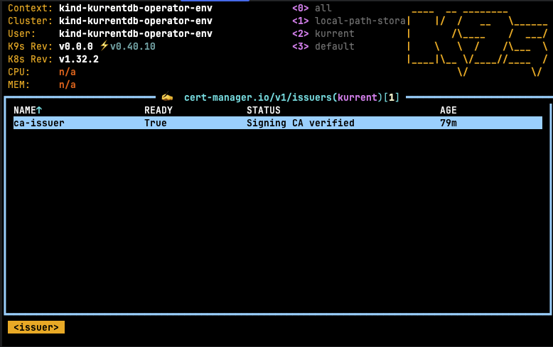
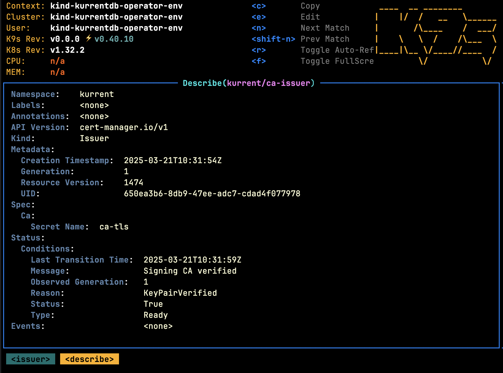

The Operator expects consumers to leverage a thirdparty tool to generate TLS certificates that can be wired in to [KurrentDB](../getting-started/resource-types.md#kurrentdb) deployments using secrets. The sections below describe how certificates can be generated using popular vendors.

## Certificate Manager (cert-manager)

### Prerequisites

Before following the instructions in this section, these requirements should be met:

* [cert-manager](https://cert-manager.io) is installed
* You have the required permissions to create/manage new resources on the Kubernetes cluster
* The following CLI tools are installed and configured to interact with your Kubernetes cluster. This means the tool must be accessible from your shell's `$PATH`, and your `$KUBECONFIG` environment variable must point to the correct Kubernetes configuration file:
    * [kubectl](https://kubernetes.io/docs/tasks/tools/install-kubectl)
    * [k9s](https://k9scli.io/topics/install/)

### Using trusted certificates via LetsEncrypt

To use self-signed certficates with KurrentDB, follow these steps:

1. Create a [LetsEncrypt Issuer](#letsencrypt-issuer)
2. Future certificates should be created using the `letsencrypt` issuer

### LetsEncrypt Issuer

The following example shows how a LetsEncrypt issuer can be deployed that leverages [AWS Route53](https://cert-manager.io/docs/configuration/acme/dns01/route53/):

```yaml
apiVersion: cert-manager.io/v1
kind: ClusterIssuer
metadata:
  name: letsencrypt
spec:
  acme:
    privateKeySecretRef:
      name: letsencrypt-issuer-key
    email: { email }
    preferredChain: ""
    server: https://acme-v02.api.letsencrypt.org/directory
    solvers:
      - dns01:
          route53:
            region: { region }
            hostedZoneID: { hostedZoneId }
            accessKeyID: { accessKeyId }
            secretAccessKeySecretRef:
              name: aws-route53-credentials
              key: secretAccessKey
        selector:
          dnsZones:
            - { domain }
            - "*.{ domain }"
```

This can be deployed using the following steps:
- Replace the variables `{...}` with the appropriate values
- Copy the YAML snippet above to a file called `issuer.yaml`
- Run the following command:

```bash
kubectl -n kurrent apply -f issuer.yaml
```

### Using Self-Signed certificates

To use self-signed certficates with KurrentDB, follow these steps:

1. Create a [Self-Signed Issuer](#self-signed-issuer)
2. Create a [Self-Signed Certificate Authority](#self-signed-certificate-authority)
3. Create a [Self-Signed Certificate Authority Issuer](#self-signed-certificate-authority-issuer)
4. Future certificates should be created using the `ca-issuer` issuer

### Self-Signed Issuer

The following example shows how a self-signed issuer can be deployed:

```yaml
apiVersion: cert-manager.io/v1
kind: ClusterIssuer
metadata:
  name: selfsigned-issuer
spec:
  selfSigned: {}
```

This can be deployed using the following steps:
- Copy the YAML snippet above to a file called `issuer.yaml`
- Run the following command:

```bash
kubectl -n kurrent apply -f issuer.yaml
```

### Self-Signed Certificate Authority

The following example shows how a self-signed certificate authority can be generated once a [self-signed issuer](#self-signed-issuer) has been deployed:

```yaml
apiVersion: cert-manager.io/v1
kind: Certificate
metadata:
  name: selfsigned-ca
spec:
  isCA: true
  commonName: ca
  subject:
    organizations:
      - Kurrent
    organizationalUnits:
      - Cloud
  secretName: ca-tls
  privateKey:
    algorithm: RSA
    encoding: PKCS1
    size: 2048
  issuerRef:
    name: selfsigned-issuer
    kind: ClusterIssuer
    group: cert-manager.io
```

:::note
The values for `subject` should be changed to reflect what you require.
:::

This can be deployed using the following steps:
- Copy the YAML snippet above to a file called `ca.yaml`
- Ensure that the `kurrent` namespace has been created
- Run the following command:

```bash
kubectl -n kurrent apply -f ca.yaml
```

### Self-Signed Certificate Authority Issuer

The following example shows how a self-signed certificate authority issuer can be generated once a [CA certificate](#self-signed-certificate-authority) has been created:

```yaml
apiVersion: cert-manager.io/v1
kind: Issuer
metadata:
  name: ca-issuer
spec:
  ca:
    secretName: ca-tls
```

This can be deployed using the following steps:
- Copy the YAML snippet above to a file called `ca-issuer.yaml`
- Ensure that the `kurrent` namespace has been created
- Run the following command:

```bash
kubectl -n kurrent apply -f ca-issuer.yaml
```

Once this step is complete, future certificates can be generated using the self-signed certificate authority. Using k9s,
the following issuers should be visible in the `kurrent` namespace:



Describing the issuer should yield:

